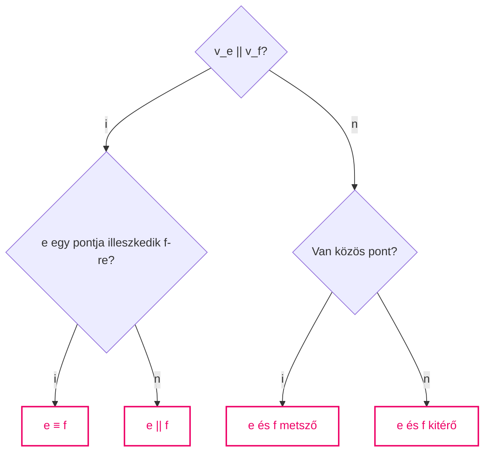
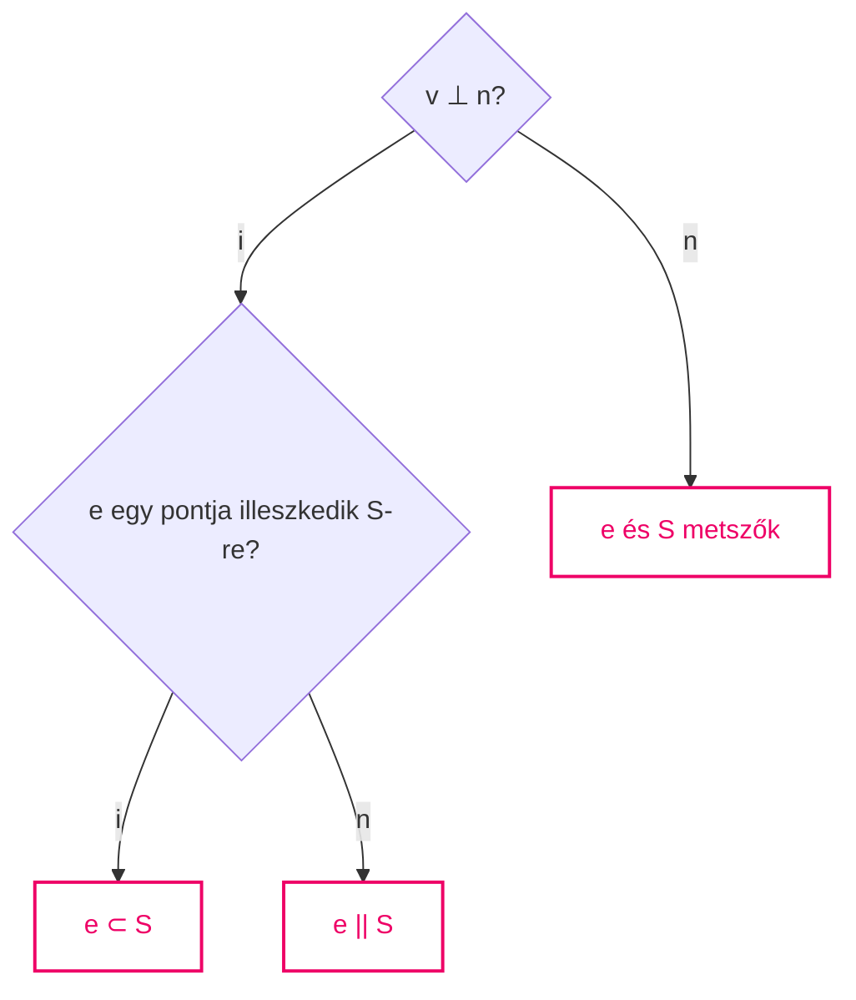

*Lineáris algebra példatár*
*Leitold Adrien*

Pannon Egyetem

# Az $R^3$ tér geometriája

## Vektorműveletek

**1. Minta feladat:**

Legyen $\underline{a} = (4, 2, 5)$ és $\underline{b} = (2, 0, -1)$ két térbeli vektor.
a, Vázoljuk fel a fenti vektorok elhelyezkedését a térbeli koordináta-rendszerben!  
b, Határozzuk meg a $3\underline{a}+5\underline{b}$ vektort!  
c, Határozzuk meg az $\underline{a}$ és a $\underline{b}$ vektorok hosszát!  
d, Mekkora szöget zárnak be az $\underline{a}$ és $\underline{b}$ vektorok?  
e, Adjuk meg az $\underline{a}$ vektor ellentettjét! Adjunk meg $\underline{a}$-val párhuzamos ill. $\underline{a}$-ra merőleges vektorokat! Hol helyezkednek el ezek a koordináta-rendszerben?  
f, Adjuk meg az $\underline{a}$ vektorral megegyező irányú, egységnyi hosszúságú vektort!  
g, Adjuk meg az $\underline{a}$ vektorral megegyező irányú, 3 illetve 1/2 hosszúságú vektorokat!

**Megoldás:**

a, A vektorokat koordináta-rendszerben helyvektorokként helyezzük el, így az $\underline{a}$ és $\underline{b}$ vektorok kezdőpontja az origó, végpontja az $A=(4, 2, 5)$ illetve $B=(2, 0, -1)$ pont lesz (1. ábra). Mivel a $\underline{b}$ vektor második koordinátája 0, így az az $x\text{-}z$ koordináta-síkban helyezkedik el.

*1. ábra: Helyvektorok a térbeli koordináta-rendszerben*

b, $$3\underline{a}+5\underline{b} = 3 \cdot (4, 2, 5) + 5 \cdot (2, 0, -1) = (12, 6, 15) + (10, 0, -5) = (22, 6, 10)$$

c, Az $\underline{a}$ vektor hossza: $$|\underline{a}| = \sqrt{a_1^2 + a_2^2 + a_3^2} = \sqrt{4^2 + 2^2 + 5^2} = \sqrt{45}$$
A $\underline{b}$ vektor hossza: $$|\underline{b}| = \sqrt{b_1^2 + b_2^2 + b_3^2} = \sqrt{2^2 + 0^2 + (-1)^2} = \sqrt{5}$$

d, Jelölje $\varphi$ az $\underline{a}$ és $\underline{b}$ vektorok által bezárt szöget.  
Ekkor: $$\cos \varphi = \frac{\underline{a} \cdot \underline{b}}{|\underline{a}| \cdot |\underline{b}|} = \frac{4 \cdot 2 + 2 \cdot 0 + 5 \cdot (-1)}{\sqrt{45}\sqrt{5}} = \frac{3}{\sqrt{225}} = \frac{1}{5}, \quad \text{innen } \varphi \approx 78.5^\circ$$

e, Az $\underline{a}$ vektor ellentettje: $$-\underline{a} = (-1) \cdot \underline{a} = (-4, -2, -5)$$
Az $\underline{a}$ vektorral párhuzamos vektorok az $\underline{a}$ vektor skalárszorosai, például  
$4 \cdot \underline{a} = (16, 8, 20)$, $1/2 \cdot \underline{a} = (2, 1, 2.5)$, $-3 \cdot \underline{a} = (-12, -6, -15)$. Ezek a vektorok helyvektorként elhelyezve a koordináta-rendszerben, egy origón átmenő egyenesre illeszkednek, melynek irányvektora az $\underline{a}$ vektor.  
Az $\underline{a}$ vektorra merőleges vektorok olyan $\underline{x} = (x_1, x_2, x_3)$ vektorok, melyeknek a skaláris szorzata az $\underline{a}$ vektorral 0. Így teljesülnie kell az alábbi egyenlőségnek:
$$4x_1 + 2x_2 + 5x_3 = 0$$
A fenti feltételnek megfelelő $\underline{x}$ vektort úgy találhatunk, hogy két koordinátát szabadon megválasztunk, a harmadikat pedig a fenti egyenlet alapján számoljuk. Például legyen $x_1 = 5, x_2 = 10$. Ekkor $4 \cdot 5 + 2 \cdot 10 + 5x_3 = 0$, innen $x_3 = -8$. Így az $\underline{x} = (5, 10, -8)$ vektor merőleges az $\underline{a}$ vektorra. Hasonlóan további merőleges vektorokat is kaphatunk, pl. az $\underline{y} = (5, 0, -4)$ vagy a $\underline{z} = (10, 30, -20)$ vektor is merőleges az $\underline{a}$-ra. Az $\underline{a}$-ra merőleges vektorok a koordináta-rendszerben egy olyan origón átmenő síkon helyezkednek el (helyvektorként), amely sík merőleges az $\underline{a}$ vektorra.

f, Az $\underline{a}$ vektorral megegyező irányú, egységnyi hosszúságú vektor:
$$\underline{a}_e = \frac{1}{|\underline{a}|} \cdot \underline{a} = \frac{1}{\sqrt{45}} \cdot (4, 2, 5) = \left( \frac{4}{\sqrt{45}}, \frac{2}{\sqrt{45}}, \frac{5}{\sqrt{45}} \right)$$

g, Az $\underline{a}$ vektorral megegyező irányú, 3 egység hosszúságú vektor:
$$3 \cdot \underline{a}_e = 3 \cdot \frac{1}{|\underline{a}|} \cdot \underline{a} = \frac{3}{\sqrt{45}} \cdot (4, 2, 5) = \left( \frac{12}{\sqrt{45}}, \frac{6}{\sqrt{45}}, \frac{15}{\sqrt{45}} \right)$$
Az $\underline{a}$ vektorral megegyező irányú, 1/2 egység hosszúságú vektor:
$$\frac{1}{2} \cdot \underline{a}_e = \frac{1}{2} \cdot \frac{1}{|\underline{a}|} \cdot \underline{a} = \frac{0.5}{\sqrt{45}} \cdot (4, 2, 5) = \left( \frac{2}{\sqrt{45}}, \frac{1}{\sqrt{45}}, \frac{2.5}{\sqrt{45}} \right)$$

**2. Minta feladat:**

Legyen $\underline{v} = (3, -1, 2)$, $\underline{a} = (1, 1, -2)$.  
a, Határozzuk meg a $\underline{v}$ vektor $\underline{a}$ irányába eső merőleges vetületvektorát!  
b, Bontsuk fel a $\underline{v}$ vektort $\underline{a}$-val párhuzamos és $\underline{a}$-ra merőleges összetevőkre!

**Megoldás:**

a, Legyen $\underline{x}$ a $\underline{v}$ vektor $\underline{a}$ irányába eső merőleges vetületvektora (2. ábra), amely az $\underline{x} = (\underline{v} \cdot \underline{a}_e) \cdot \underline{a}_e$ képlettel számolható, ahol $\underline{a}_e$ az $\underline{a}$ vektorral megegyező irányú, egységnyi hosszúságú vektor.

*2. ábra: Vetületvektor meghatározása*

Az $\underline{a}$ vektor hossza: $|\underline{a}| = \sqrt{a_1^2 + a_2^2 + a_3^2} = \sqrt{1^2 + 1^2 + (-2)^2} = \sqrt{6}$, így  
$$\underline{a}_e = \frac{1}{|\underline{a}|} \cdot \underline{a} = \frac{1}{\sqrt{6}} \cdot (1, 1, -2) = \left( \frac{1}{\sqrt{6}}, \frac{1}{\sqrt{6}}, \frac{-2}{\sqrt{6}} \right).$$

Továbbá $\underline{v} \cdot \underline{a}_e = 3 \cdot \frac{1}{\sqrt{6}} + (-1) \cdot \frac{1}{\sqrt{6}} + 2 \cdot \frac{-2}{\sqrt{6}} = \frac{-2}{\sqrt{6}}$, így a keresett vetületvektor:  
$$\underline{x} = (\underline{v} \cdot \underline{a}_e) \cdot \underline{a}_e = \frac{-2}{\sqrt{6}} \cdot \left( \frac{1}{\sqrt{6}}, \frac{1}{\sqrt{6}}, \frac{-2}{\sqrt{6}} \right) = \left( -\frac{1}{3}, -\frac{1}{3}, \frac{2}{3} \right).$$

b, A $\underline{v}$ vektor $\underline{a}$-val párhuzamos összetevője éppen az $\underline{x}$ vetületvektor:  
$$\underline{x} = (-1/3, -1/3, 2/3),$$
míg az $\underline{a}$-ra merőleges összetevő:  
$$\underline{y} = \underline{v} - \underline{x} = (3, -1, 2) - (-1/3, -1/3, 2/3) = (10/3, -2/3, 4/3).$$

**3. Minta feladat:**

Legyen $\underline{a} = (1, -2, 5)$, $\underline{b} = (4, 2, 3)$, $\underline{c} = (2, -4, 10)$.  
Végezzük el az alábbi műveleteket!  
$$\underline{a} + \underline{b}, \quad 3\underline{a} + 7\underline{b}, \quad 2\underline{a} + (-3)\underline{b} + 5\underline{c}, \quad \underline{a} \cdot \underline{b}, \quad \underline{a} \cdot \underline{c}, \quad \underline{a} \times \underline{b}, \quad \underline{b} \times \underline{a}, \quad \underline{a} \times \underline{c}, \quad \underline{c} \cdot (\underline{a} \times \underline{b})$$

**Megoldás:**

$$\underline{a} + \underline{b} = (1, -2, 5) + (4, 2, 3) = (5, 0, 8)$$
$$3\underline{a} + 7\underline{b} = 3 \cdot (1, -2, 5) + 7 \cdot (4, 2, 3) = (3, -6, 15) + (28, 14, 21) = (31, 8, 36)$$
$$2\underline{a} + (-3)\underline{b} + 5\underline{c} = 2 \cdot (1, -2, 5) + (-3) \cdot (4, 2, 3) + 5 \cdot (2, -4, 10) =$$
$$= (2, -4, 10) + (-12, -6, -9) + (10, -20, 50) = (0, -30, 51)$$
$$\underline{a} \cdot \underline{b} = 1 \cdot 4 + (-2) \cdot 2 + 5 \cdot 3 = 15$$
$$\underline{a} \cdot \underline{c} = 1 \cdot 2 + (-2) \cdot (-4) + 5 \cdot 10 = 60$$
Emlékeztető: a vektoriális szorzat számolása koordinátásan az alábbi képlettel történik:
$$\underline{a} \times \underline{b} = (a_2b_3 - a_3b_2, -a_1b_3 + a_3b_1, a_1b_2 - a_2b_1)$$
Így:
$$\underline{a} \times \underline{b} = (1, -2, 5) \times (4, 2, 3) = (-2 \cdot 3 - 5 \cdot 2, -1 \cdot 3 + 5 \cdot 4, 1 \cdot 2 - (-2) \cdot 4) =$$
$$= (-16, 17, 10)$$
Ellenőrizhető, hogy az $\underline{a} \times \underline{b}$ vektor merőleges az $\underline{a}$ és a $\underline{b}$ vektorokra:  
$$(\underline{a} \times \underline{b}) \cdot \underline{a} = -16 \cdot 1 + 17 \cdot (-2) + 10 \cdot 5 = 0, \quad \text{illetve}$$  
$$(\underline{a} \times \underline{b}) \cdot \underline{b} = -16 \cdot 4 + 17 \cdot 2 + 10 \cdot 3 = 0$$

A vektoriális szorzás tulajdonságait felhasználva:
$$\underline{b} \times \underline{a} = -(\underline{a} \times \underline{b}) = -(-16, 17, 10) = (16, -17, -10)$$
Vegyük észre, hogy az $\underline{a}$ és $\underline{c}$ vektorok párhuzamosak (egymás skalárszorosai), így a vektoriális szorzás tulajdonságait felhasználva: $$\underline{a} \times \underline{c} = \underline{o} = (0, 0, 0)$$
$$\underline{c} \cdot (\underline{a} \times \underline{b}) = 2 \cdot (-16) + (-4) \cdot 17 + 10 \cdot 10 = 0$$
Megjegyezzük, hogy ez az eredmény is „megsejthető” volt előre, hiszen az $\underline{a} \times \underline{b}$ vektor merőleges az $\underline{a}$ vektorra, így az $\underline{a}$-val párhuzamos $\underline{c}$-re is. Ezért a $\underline{c}$ és az $\underline{a} \times \underline{b}$ vektorok skaláris szorzata 0 kell hogy legyen.

**Gyakorló feladatok:**

1. Legyen $\underline{v} = (2, 3, -1)$ és $\underline{u} = (0, -1, 4)$ két térbeli vektor.  
   a, Vázolja fel a fenti vektorok elhelyezkedését a térbeli koordináta-rendszerben!  
   b, Határozza meg a $2\underline{v} - 3\underline{u}$ vektort!  
   c, Határozza meg a $\underline{v}$ és az $\underline{u}$ vektorok hosszát!  
   d, Mekkora szöget zárnak be a $\underline{v}$ és $\underline{u}$ vektorok?  
   e, Adja meg a $\underline{v}$ vektor ellentettjét! Adjon meg $\underline{v}$-vel párhuzamos ill. $\underline{v}$-re merőleges vektorokat!  
   f, Adja meg a $\underline{v}$ vektorral megegyező irányú, egységnyi hosszúságú vektort!  
   g, Adja meg a $\underline{v}$ vektorral megegyező irányú, 4 illetve 1/3 hosszúságú vektorokat!

2. Legyen $\underline{v} = (4, 6, -2)$, $\underline{a} = (2, 3, 0)$.  
   a, Határozza meg a $\underline{v}$ vektor $\underline{a}$ irányába eső merőleges vetületvektorát!  
   b, Bontsa fel a $\underline{v}$ vektort $\underline{a}$-val párhuzamos és $\underline{a}$-ra merőleges összetevőkre!

3. Legyen $\underline{v} = (4, 7, 9)$, $\underline{a} = (2, -1, 3)$.  
   a, Határozza meg a $\underline{v}$ vektor $\underline{a}$ irányába eső merőleges vetületvektorát!  
   b, Bontsa fel a $\underline{v}$ vektort $\underline{a}$-val párhuzamos és $\underline{a}$-ra merőleges összetevőkre!

4. Legyen $\underline{a} = (2, -1, 4)$, $\underline{b} = (0, 5, -2)$, $\underline{c} = (1, 6, -4)$.  
   Számítsa ki az alábbi vektorokat!  
   $$\underline{a} + \underline{b}, \quad \underline{a} - \underline{b}, \quad 3\underline{a}, \quad -2\underline{c}, \quad \underline{a} + 3\underline{b} + (-2)\underline{c}, \quad \underline{a} \cdot \underline{b}, \quad \underline{a} \cdot \underline{c}, \quad \underline{a} \times \underline{b}, \quad \underline{b} \times \underline{a}, \quad \underline{a} \times \underline{c}, \quad \underline{a} \cdot (\underline{b} \times \underline{c})$$

5. Legyen $\underline{a} = (4, -1, 3)$, $\underline{b} = (2, 2, -2)$, $\underline{c} = (8, -2, 6)$.  
   Számítsa ki az alábbi vektorokat!  
   $$\underline{a} + \underline{b}, \quad \underline{a} - \underline{b}, \quad 5\underline{a}, \quad -3\underline{c}, \quad 2\underline{a} + \underline{b} + (-4)\underline{c}, \quad \underline{a} \cdot \underline{b}, \quad \underline{a} \cdot \underline{c}, \quad \underline{a} \times \underline{b}, \quad \underline{b} \times \underline{a}, \quad \underline{a} \times \underline{c}, \quad \underline{a} \cdot (\underline{b} \times \underline{c})$$

## Egyenes és sík: illeszkedési feladatok

**4. Minta feladat:**

Írjuk fel a $P_0$ ponton átmenő, $\underline{v}$ irányvektorú egyenes paraméteres és paramétermentes egyenletrendszerét, ha  
a, $\underline{v} = (2, -1, 4)$ és $P_0 = (5, 0, 3)$;  
b, $\underline{v} = (1, 2, 0)$ és $P_0 = (5, 3, 4)$;  
c, $\underline{v} = (1, 0, 3)$ és $P_0 = (2, 2, 6)$;  
d, $\underline{v} = (2, 0, 0)$ és $P_0 = (-1, 3, 4)$.  

**Megoldás:**

a, A paraméteres egyenletrendszer:  
$$\begin{aligned}
x &= 5 + 2t \\
y &= -t \\
z &= 3 + 4t \quad t \in R
\end{aligned}$$
A paramétermentes egyenletrendszer:  
$$\frac{x - 5}{2} = \frac{y}{-1} = \frac{z - 3}{4}$$

b, A paraméteres egyenletrendszer:  
$$\begin{aligned}
x &= 5 + t \\
y &= 3 + 2t \\
z &= 4 \quad t \in R
\end{aligned}$$
A paramétermentes egyenletrendszer:  
$$x - 5 = \frac{y - 3}{2}, \quad z = 4$$
Az irányvektor harmadik koordinátája nulla, így ez az egyenes párhuzamos az $x\text{-}y$ koordináta-síkkal.

c, A paraméteres egyenletrendszer:  
$$\begin{aligned}
x &= 2 + t \\
y &= 2 \\
z &= 6 + 3t \quad t \in R
\end{aligned}$$
A paramétermentes egyenletrendszer:  
$$x - 2 = \frac{z - 6}{3}, \quad y = 2$$
Az irányvektor második koordinátája nulla, így ez az egyenes párhuzamos az $x\text{-}z$ koordináta-síkkal.

d, A paraméteres egyenletrendszer:  
$$\begin{aligned}
x &= -1 + 2t \\
y &= 3 \\
z &= 4 \quad t \in R
\end{aligned}$$
Mivel az irányvektornak két koordinátája is nulla, így paramétermentes egyenletrendszer nem írható fel.  
Az irányvektor az $x$ tengely irányába mutat, így ez az egyenes párhuzamos az $x$ tengellyel.

**5. Minta feladat:**

Legyen $A=(2, 5, 3)$ és $B=(1, 0, 2)$ két térbeli pont. Írjuk fel az $A$ és $B$ pontokon átmenő egyenes paraméteres egyenletrendszerét!

**Megoldás:**

Először egy irányvektort kell felírnunk:  
$$\underline{v} = \overline{AB} = (-1, -5, -1)$$
A $\underline{v}$ irányvektorú, $A$ ponton átmenő egyenes paraméteres egyenletrendszere:

$$\begin{aligned}
x &= 2 - t \\
y &= 5 - 5t \\
z &= 3 - t \quad t \in R
\end{aligned}$$

**6. Minta feladat:**

Tekintsük az alábbi $e$ egyenest!  
$$\begin{aligned}
x &= 3 + 4t \\
y &= 1 - t \\
z &= 2t \quad t \in R
\end{aligned}$$
Adjuk meg az $e$ egyenes egy irányvektorát és az egyenes néhány pontját! Illeszkedik-e az $e$ egyenesre a $P=(11, -1, 4)$ és a $Q=(-1, 1, 0)$ pont?

**Megoldás:**

Az egyenes egy irányvektorának koordinátáit a paraméteres egyenletrendszerből a $t$ paraméter együtthatói adják: $\underline{v}=(4, -1, 2)$.  
Különböző $t$ értékeket helyettesítve az egyenletrendszerbe, az egyenes pontjainak koordinátáit kapjuk:  
Például $t=0$-ra: $A=(3, 1, 0)$,  
$t=1$-re: $B=(7, 0, 2)$,  
$t=-2$-re: $C=(-5, 3, -4), \dots$  
A $P=(11, -1, 4)$ pont rajta van az $e$ egyenesen, mert $t=2$-re az egyenletrendszerből éppen $P$ koordinátáit kapjuk.  
A $Q=(-1, 1, 0)$ pont nincs rajta az $e$ egyenesen, mert nincs olyan $t$ érték, amely az egyenletrendszerből $Q$ koordinátáit adná. Az $x$ koordinátára ugyanis $t=-1$-re kaphatnánk -1-et, de $t=-1$-re $y \neq 1$ és $z \neq 0$.

**7. Minta feladat:**

Tekintsük az alábbi két egyenest:  
$$e: \ y - 3 = \frac{z - 4}{2}, \ x = 2 \qquad \text{és} \qquad f: \ 3x + 6 = \frac{1}{2}y - 1 = -z$$
Adjuk meg mindkét egyenes egy irányvektorát és egy pontját! Illeszkedik-e az $e$ illetve az $f$ egyenesre a $P=(2, 4, 6)$ pont?

**Megoldás:**

Az $e$ egyenes paramétermentes egyenletrendszerének alakjából látható, hogy irányvektorának van nulla koordinátája. Mivel az egyenes pontjainak első koordinátája állandó ($x = 2$), így $v_1 = 0$. A másik egyenlet $\frac{y-3}{1} = \frac{z-4}{2}$ alakra hozható, itt a nevezőkből olvasható ki az egyenes egy irányvektorának másik két koordinátája: $v_2 = 1$ és $v_3 = 2$. Így az $e$ egyenes egy irányvektora: $\underline{v}_e = (0, 1, 2)$. Az $e$ egyenes egy pontja: $P_e = (2, 3, 4)$.  
A $P=(2, 4, 6)$ pont koordinátái kielégítik az $e$ egyenes egyenletrendszerét, így $P$ illeszkedik az $e$ egyenesre.  
Az $f$ egyenes egyenletrendszerét először a „szabályos” $\frac{x-x_0}{v_1} = \frac{y-y_0}{v_2} = \frac{z-z_0}{v_3}$ alakra kell hozni. Ehhez az alábbi átalakításokat végezzük el:  
$$3x + 6 = 3 \cdot (x + 2) = \frac{x + 2}{1/3}, \quad \frac{1}{2}y - 1 = \frac{1}{2} \cdot (y - 2) = \frac{y - 2}{2}, \quad -z = \frac{z}{-1}$$

***

Így az $f$ egyenes egyenletrendszere az alábbi alakra hozható:
$$\frac{x+2}{1/3} = \frac{y-2}{2} = \frac{z}{-1}$$

Az egyenes egy irányvektorának koordinátái a nevezőkből olvashatók ki:
$\underline{v}_f = (1/3, 2, -1)$, míg egy pontnak a koordinátáit a számlálók alapján írhatjuk fel:
$P_f = (-2, 2, 0)$.

A $P=(2, 4, 6)$ pont koordinátái nem elégítik ki az $f$ egyenes egyenletrendszerét, így $P$
illeszkedik az $f$ egyenesre.

**8. Minta feladat:**

Írjuk fel annak a síknak az egyenletét, amely illeszkedik a $P = (2, -3, 4)$ pontra, és amelynek normálvektora az $\underline{n} = (5, 1, 2)$ vektor! Illeszkednek-e erre a síkra az $A = (2, 5, 0)$ és a $B = (3, 4, 2)$ pontok?

**Megoldás:**

A sík egyenlete: $5 \cdot (x - 2) + 1 \cdot (y + 3) + 2 \cdot (z - 4) = 0$, ami rendezés után az $5x + y + 2z = 15$ alakra hozható. Az $A$ pont koordinátái kielégítik ezt az egyenletet, így $A$ illeszkedik a síkra. A $B$ pont koordinátái nem elégítik ki a sík egyenletét, így $B$ nincs a síkon.

**9. Minta feladat:**

Egy sík egyenlete $2x - 3y + 4z = 14$. Adjuk meg a sík egy normálvektorát és néhány pontot a síkon!

**Megoldás:**

A sík egy normálvektorának koordinátáit adják az egyenletből $x$, $y$ és $z$ együtthatói: $\underline{n} = (2, -3, 4)$.

A sík pontjainak koordinátái kielégítik a sík egyenletét, így olyan $x$, $y$ és $z$ értékeket kell keresnünk, amelyek kielégítik a fenti egyenletet. Ehhez két ismeretlen értékét szabadon megválaszthatjuk, a harmadikat pedig az egyenlet alapján számoljuk ki.

Például: legyen $x = 5$, $z = 1$, ekkor az egyenlet alapján $y = 0$. Így a $P_1 = (5, 0, 1)$ pont illeszkedik a síkra.

Legyen $x = 6$, $y = 2$, ekkor az egyenlet alapján $z = 2$. Így a $P_2 = (6, 2, 2)$ pont illeszkedik a síkra.

Legyen $y = 0$, $z = 0$, ekkor az egyenlet alapján $x = 7$. Így a $P_3 = (7, 0, 0)$ pont illeszkedik a síkra.

**10. Minta feladat:**

Írjuk fel annak a síknak az egyenletét, amely merőleges az $e$: $\frac{x-4}{3} = \frac{y}{-2} = z$ egyenesre, és illeszkedik a $P = (4, 0, -1)$ pontra!

**Megoldás:**

Mivel a keresett sík merőleges az $e$ egyenesre, így a sík normálvektora egyben az $e$ egyenes irányvektora. Így $\underline{n} = \underline{v}_e = (3, -2, 1)$.

A sík egyenlete: $3(x - 4) - 2y + z + 1 = 0$, ami rendezve: $3x - 2y + z = 11$.

***

***

**11. Minta feladat:**

Írjuk fel annak a síknak az egyenletét, amely illeszkedik az $e$: $\frac{x-2}{2} = \frac{y-1}{-1}$, $z = 2$ egyenesre és a $P = (4, 5, 3)$ pontra!

**Megoldás:**

Az adatok alapján ellenőrizhető, hogy a $P$ pont nincsen rajta az $e$ egyenesen, így egyetlen olyan sík van a térben, amelyik a feltételeknek eleget tesz. A sík egyenletének felírásához szükségünk van egy normálvektorára. Keressünk először két olyan vektort, amelyek kifeszítik a síkot. Legyen egyik az $e$ egyenes egy irányvektora: $\underline{v}_e = (2, -1, 0)$, a másik a $\overrightarrow{P_0P}$ vektor, ahol $P_0$ az $e$ egyenes egy pontja: $P_0 = (2, 1, 2)$. Így $\overrightarrow{P_0P} = (2, 4, 1)$. A keresett normálvektor merőleges kell, hogy legyen a $\underline{v}_e$ és a $\overrightarrow{P_0P}$ vektorokra. Ilyen vektor például a $\underline{v}_e$ és a $\overrightarrow{P_0P}$ vektorok vektoriális szorzata:
$$\underline{n} = \underline{v}_e \times \overrightarrow{P_0P} = (2, -1, 0) \times (2, 4, 1) = (-1, -2, 10)$$

Így a keresett sík egyenlete: $-(x - 4) - 2(y - 5) + 10(z - 3) = 0$, ami rendezve:
$$-x - 2y + 10z = 16.$$

**Gyakorló feladatok:**

6. Legyen $P_0 = (2, -1, 5)$, $\underline{v} = (1, 1, -3)$.
   a, Írja fel a $P_0$ ponton átmenő, $\underline{v}$ irányvektorú egyenes paraméteres ill. paramétermentes egyenletrendszerét!
   b, Adja meg a fenti egyenes néhány pontját!
   c, Illeszkedik-e a fenti egyenesre az $A = (3, 0, -2)$ ill. a $B = (5, 5, 5)$ pont?

7. Legyen $P_0 = (3, 1, -4)$, $\underline{v} = (4, 5, 0)$.
   a, Írja fel a $P_0$ ponton átmenő, $\underline{v}$ irányvektorú egyenes paraméteres ill. paramétermentes egyenletrendszerét!
   b, Adja meg a fenti egyenes néhány pontját!

8. Legyen $P_0 = (0, 2, -1)$, $\underline{v} = (0, 0, 5)$.
   a, Írja fel a $P_0$ ponton átmenő, $\underline{v}$ irányvektorú egyenes paraméteres ill. paramétermentes egyenletrendszerét!
   b, Adja meg a fenti egyenes néhány pontját!

9. Legyen $P_1 = (1, 4, 5)$, $P_2 = (3, 6, -1)$.
   a, Írja fel a $P_1$ és $P_2$ pontokon átmenő egyenes paraméteres ill. paramétermentes egyenletrendszerét!
   b, Adja meg a fenti egyenes néhány pontját!

10. Adja meg az alábbi egyenesek egy irányvektorát és egy pontját! Írja fel az egyenesek paramétermentes egyenletrendszerét!
    $$e: \begin{matrix} x = 2 + 3t \\ y = -1 + 2t \\ z = 5 - 4t \end{matrix} \quad , \quad f: \begin{matrix} x = 5t \\ y = -2 + 7t \\ z = 4 \end{matrix} \quad , \quad g: \begin{matrix} x = 6 \\ y = 1 + 3t \\ z = 0 \end{matrix}$$

***

***

11. Adja meg az alábbi egyenesek egy irányvektorát és egy pontját! Írja fel az egyenesek paraméteres egyenletrendszerét!
    a, $\frac{x-3}{4} = \frac{y+5}{6} = \frac{z+3}{-2}$
    b, $\frac{x}{2} = \frac{z-1}{-2}$, $y = 4$
    c, $x = 1$, $\frac{y-3}{6} = \frac{z}{-2}$
    d, $\frac{-x+5}{-2} = \frac{y}{3} = \frac{-z-6}{2}$
    e, $2x+4 = -y = -\frac{1}{2}z + 1$

12. Legyen $S$: $2x - 3y + 5z - 5 = 0$.
    a, Adja meg az $S$ sík egy normálvektorát és néhány pontját!
    b, Illeszkedik-e az $S$ síkra a $P = (-8, 3, 6)$ ill. a $Q = (1, 4, -3)$ pont?

13. Hol helyezkednek el a térbeli koordinátarendszerben az alábbi síkok?
    a, $S_1$: $x - y = 0$
    b, $S_2$: $2x - y = 1$
    c, $S_3$: $y = 4$

14. Írja fel annak a síknak az egyenletét, melynek
    a, egy pontja $P_0 = (2, -1, 4)$ és egy normálvektora $\underline{n} = (2, 3, -1)$;
    b, egy pontja $P_0 = (0, 1, 5)$ és egy normálvektora $\underline{n} = (4, 0, 1)$;
    c, egy pontja $P_0 = (3, 2, -1)$ és egy normálvektora $\underline{n} = (0, 5, 0)$!

15. Írja fel annak a síknak az egyenletét, amely merőleges az $e$: $\frac{x-4}{2} = y = \frac{z+2}{3}$ egyenesre és átmegy a $P_0 = (5, -1, 0)$ ponton!

16. Írja fel annak a síknak az egyenletét, amely merőleges az
    $e$: $\frac{x+1}{-2} = \frac{z-4}{5}$, $y = -3$ egyenesre és átmegy a $P_0 = (2, 6, -1)$ ponton!

17. Írja fel annak a síknak az egyenletét, amely merőleges az
    $$e: \begin{matrix} x = 2t + 1 \\ y = -3t \\ z = t - 2 \end{matrix} \quad \text{egyenesre és átmegy a } P_0 = (2, 4, 0) \text{ ponton!}$$

***

***

18. Írja fel annak a síknak az egyenletét, amely illeszkedik az $e$: $x-1 = \frac{y+2}{2} = \frac{z+2}{-1}$ egyenesre és a $P_0 = (1, -2, 3)$ pontra!

19. Írja fel annak a síknak az egyenletét, amely illeszkedik a $P_1 = (2, 4, -3)$, $P_2 = (-1, 0, 2)$, és $P_3 = (3, -2, 1)$ pontokra!

20. Írja fel annak az egyenesnek a paraméteres egyenletrendszerét, amely
    a, merőleges az $S$: $x - 4y + z = 10$ síkra és áthalad a $P_0 = (2, 0, -3)$ ponton;
    b, merőleges az $S$: $2x - y = 6$ síkra és áthalad a $P_0 = (-4, 5, 1)$ ponton!

21. Írja fel annak az egyenesnek a paramétermentes egyenletrendszerét, amely
    a, merőleges az $S$: $3x - y + 5z = 0$ síkra és áthalad a $P_0 = (1, 2, 0)$ ponton;
    b, merőleges az $S$: $2x + 3z = 10$ síkra és áthalad a $P_0 = (0, 0, 4)$ ponton!

## Térelemek kölcsönös helyzete, metszéspontja

**12. Minta feladat:**

Legyenek adottak a következő egyenesek:
$$e: \begin{matrix} x = 1 + 2t \\ y = 3 - t \\ z = 2 + t \end{matrix} \qquad f: \frac{x-3}{4} = \frac{y-2}{-2} = \frac{z-3}{2} \qquad g: \begin{matrix} x = -6t \\ y = 5 + 3t \\ z = 1 - 3t \end{matrix}$$

$$h: \begin{matrix} x = 4 + t \\ y = 2 - t \\ z = 1 + 3t \end{matrix}$$

Határozzuk meg az $e$ egyenesnek a többi egyeneshez viszonyított kölcsönös helyzetét, továbbá vizsgáljuk meg a $g$ és $h$ egyenesek kölcsönös helyzetét! Ahol van metszéspont, határozzuk meg!

**Megoldás:**

Két egyenes kölcsönös helyzetét a 3. ábrán látható módon vizsgálhatjuk.

***

***

**3. ábra: Két egyenes kölcsönös helyzetének vizsgálata**

*Az e és f egyenesek kölcsönös helyzetének vizsgálata:*

Először az egyenesek egyenletrendszereiből kiolvassuk azok egy irányvektorát: $\underline{v}_e = (2, -1, 1)$ és $\underline{v}_f = (4, -2, 2)$. Látható, hogy a két irányvektor skalárszorosa egymásnak, így párhuzamosak. Eszerint az $e$ és $f$ egyenesek vagy párhuzamosak, vagy azonosak. Ezután keresünk egy pontot az $e$ egyenesen: $P_e = (1, 3, 2)$ ($t=0$ paraméterértékhez tartozik), majd megvizsgáljuk, hogy ez a pont illeszkedik-e az $f$ egyenesre. Mivel a $P_e = (1, 3, 2)$ pont koordinátái kielégítik az $f$ egyenes egyenletrendszerét, így a pont rajta van az $f$ egyenesen is. Következésképpen az $e$ és $f$ egyenesek azonosak, minden pontjuk közös pont.

*Az e és g egyenesek kölcsönös helyzetének vizsgálata:*

Az $e$ egyenes irányvektora $\underline{v}_e = (2, -1, 1)$, ami párhuzamos a $g$ egyenes irányvektorával: $\underline{v}_g = (-6, 3, -3)$. Így az $e$ és $g$ egyenesek vagy párhuzamosak, vagy azonosak. Megvizsgáljuk, hogy az $e$ egyenes egy pontja illeszkedik-e a $g$ egyenesre. A $P_e = (1, 3, 2)$ pont nincs rajta a $g$ egyenesen, ugyanis nincs olyan $t$ paraméter, amely a $g$ egyenes paraméteres egyenletrendszeréből a $P_e$ pont koordinátáit adná. Következésképpen az $e$ és $g$ egyenesek párhuzamosak, nincsen közös pontjuk.

*Az e és h egyenesek kölcsönös helyzetének vizsgálata:*

Az $e$ egyenes egy irányvektora $\underline{v}_e = (2, -1, 1)$, a $h$ egyenes egy irányvektora $\underline{v}_h = (1, -1, 3)$. Ez a két vektor nem párhuzamos, így az $e$ és a $h$ egyenesek vagy metszők, vagy kitérők. Nézzük meg, hogy van-e a két egyenesnek közös pontja. Ehhez az egyenesek paraméteres egyenletrendszereit kell használnunk. Megkülönböztetjük a két egyenletrendszerben a paramétereket ($t_1$ és $t_2$), és megnézzük, hogy vannak-e olyan $t_1$ és $t_2$ paraméterértékek, amelyek ugyanazon $x, y, z$ értékeket szolgáltatják a két egyenletrendszerből. Így a következő egyenletrendszerhez jutunk:

***

***

$$\begin{matrix} 1 + 2t_1 &=& 4 + t_2 \\ 3 - t_1 &=& 2 - t_2 \\ 2 + t_1 &=& 1 + 3t_2 \end{matrix}$$

A második és harmadik egyenletet összeadva és rendezve $t_2 = 1$ értéket kapunk, amit visszahelyettesíthetünk a második egyenletbe, így $t_1 = 2$ adódik. A $t_2 = 1$ és $t_1 = 2$ értékek az első egyenletet is kielégítik, így a teljes egyenletrendszer megoldásai. Mivel a fenti egyenletrendszer megoldható, így az $e$ és a $h$ egyeneseknek van közös pontja, tehát metszők. A metszéspont koordinátáit megkapjuk, ha a $t_1 = 2$ értéket az $e$ egyenes egyenletrendszerébe, illetve a $t_2 = 1$ értéket a $h$ egyenes egyenletrendszerébe visszahelyettesítjük. Így az $M = (5, 1, 4)$ metszéspont adódik.

*A g és h egyenesek kölcsönös helyzetének vizsgálata:*

A $g$ egyenes egy irányvektora $\underline{v}_g = (-6, 3, -3)$, a $h$ egyenes egy irányvektora $\underline{v}_h = (1, -1, 3)$. Ez a két vektor nem párhuzamos, így a $g$ és $h$ egyenesek vagy metszőek, vagy kitérőek. Megvizsgáljuk, hogy van-e a két egyenesnek közös pontja. Az egyenletrendszerekben a paraméterértékeket megkülönböztetve és közös $x, y, z$ értékeket keresve az alábbi egyenletrendszert kapjuk:
$$\begin{matrix} & -6t_1 &=& 4 + t_2 \\ 5 + 3t_1 &=& 2 - t_2 \\ 1 - 3t_1 &=& 1 + 3t_2 \end{matrix}$$

Itt az első és harmadik egyenlet felhasználásával a $t_1 = -4/5$, $t_2 = 4/5$ értékek adódnak, amik viszont nem elégítik ki a második egyenletet. Így az egyenletrendszer nem oldható meg, azaz nincs a két egyenesnek közös pontja. Következésképpen a $g$ és $h$ egyenesek kitérőek.

**13. Minta feladat:**

Legyenek
$$S: 2x - y + 3z = 16 \qquad e: \begin{matrix} x = 2 + t \\ y = 2t \\ z = 4 \end{matrix} \qquad f: \frac{x-3}{-1} = y + 5 = z - 4 \quad .$$

Milyen az $e$ egyenes és az $S$ sík, illetve az $f$ egyenes és az $S$ sík kölcsönös helyzete? Ha van közös pontjuk, akkor határozzuk meg a metszéspontot!

**Megoldás:**

Egyenes és sík kölcsönös helyzetét a 4. ábrán látható módon vizsgálhatjuk.

***

***

**4. ábra: Egyenes és sík kölcsönös helyzetének vizsgálata**

*Az e egyenes és az S sík kölcsönös helyzete:*

Az $e$ egyenes egy irányvektora: $\underline{v}_e = (1, 2, 0)$, az $S$ sík egy normálvektora: $\underline{n} = (2, -1, 3)$. Először megnézzük, hogy ez a két vektor merőleges-e. Skaláris szorzatuk:
$\underline{v}_e \cdot \underline{n} = 1 \cdot 2 + 2 \cdot (-1) + 0 \cdot 3 = 0$, azaz a két vektor merőleges. Így az $e$ egyenes vagy párhuzamos az $S$ síkkal, vagy benne van az $S$ síkban. Megnézzük, hogy az $e$ egyenes egy pontja, a $P_e = (2, 0, 4)$ pont illeszkedik-e az $S$ síkra. Mivel a $P_e$ pont koordinátái kielégítik az $S$ sík egyenletét, így a $P_e$ pont és a teljes $e$ egyenes is rajta van a síkon. Az $e$ egyenes tehát része az $S$ síknak és így az $e$ egyenes minden pontja közös pontja a két alakzatnak.

*Az f egyenes és az S sík kölcsönös helyzete:*

Az $f$ egyenes egy irányvektora: $\underline{v}_f = (-1, 1, 1)$, az $S$ sík egy normálvektora: $\underline{n} = (2, -1, 3)$. Skaláris szorzatuk: $\underline{v}_f \cdot \underline{n} = -1 \cdot 2 + 1 \cdot (-1) + 1 \cdot 3 = 0$, azaz a két vektor merőleges. Így az $f$ egyenes vagy párhuzamos az $S$ síkkal, vagy benne van az $S$ síkban. Megvizsgáljuk, hogy az $f$ egyenes egy pontja, a $P_f = (3, -5, 4)$ pont illeszkedik-e az $S$ síkra. Mivel a $P_f$ pont koordinátái nem elégítik ki az $S$ sík egyenletét, így a $P_f$ pont nincs rajta az $S$ síkon. Következésképpen az $f$ egyenes és az $S$ sík párhuzamos.

**14. Minta feladat:**

Legyenek
$$S: 3x + y - 5z = 12 \qquad e: \begin{matrix} x = 1 - 2t \\ y = 4 + t \\ z = 2 \end{matrix}$$

Milyen az $e$ egyenes és az $S$ sík kölcsönös helyzete? Ha van közös pontjuk, akkor határozzuk meg a metszéspontot!

**Megoldás:**

Az $e$ egyenes egy irányvektora: $\underline{v}_e = (-2, 1, 0)$, az $S$ sík egy normálvektora: $\underline{n} = (3, 1, -5)$. Ez a két vektor nem merőleges, mert skaláris szorzatuk nullától különböző. Így az $e$ egyenes és az $S$ sík metszők.

A metszéspont meghatározásához az egyenes paraméteres egyenletrendszeréből $x$, $y$ és $z$ $t$-től függő kifejezését behelyettesítjük a sík egyenletébe:

***

***

$$3 \cdot (1 - 2t) + 4 + t - 5 \cdot 2 = 12$$

Innen $t = -3$ adódik, amit visszahelyettesítve az egyenes paraméteres egyenletrendszerébe, megkapjuk a metszéspont koordinátáit: $M = (7, 1, 2)$.

**15. Minta feladat:**

Tekintsük az alábbi síkokat:
$$S_1: x - 2y + 5z = 8 \qquad S_2: 3x + y - z = 8 \qquad S_3: 2x - 4y + 10z = 10 \qquad S_4: 3x - 6y + 15z = 24$$
Határozzuk meg az $S_1$ sík helyzetét a többi síkhoz képest!

**Megoldás:**

*S_1 és S_2 kölcsönös helyzete:*

Mivel az $S_1$ és $S_2$ síkok egyenleteiből kiolvasható normálvektorok $\underline{n}_1 = (1, -2, 5)$ és $\underline{n}_2 = (3, 1, -1)$ egymással nem párhuzamosak, így az $S_1$ és $S_2$ síkok metszők.

*S_1 és S_3 kölcsönös helyzete:*

Mivel az $S_1$ és $S_3$ síkok egyenleteiből kiolvasható normálvektorok $\underline{n}_1 = (1, -2, 5)$ és $\underline{n}_3 = (2, -4, 10)$ párhuzamosak egymással, így az $S_1$ és $S_3$ síkok vagy azonosak, vagy párhuzamosak. Az $S_3$ sík egyenletének baloldala kétszerese az $S_1$ sík egyenletében baloldalon álló kifejezésnek, ugyanakkor a jobboldalon álló konstansok aránya nem kettő, így a két sík párhuzamos.

*S_1 és S_4 kölcsönös helyzete:*

Mivel az $S_1$ és $S_4$ síkok egyenleteiből kiolvasható normálvektorok $\underline{n}_1 = (1, -2, 5)$ és $\underline{n}_4 = (3, -6, 15)$ párhuzamosak egymással, így az $S_1$ és $S_4$ síkok vagy azonosak, vagy párhuzamosak. Az $S_4$ sík egyenlete (bal- és jobboldal is) háromszorosa az $S_1$ sík egyenletének, így a két sík azonos.

**16. Minta feladat:**

Legyenek $S_1: 2x - y + 4z = 9 \qquad S_2: x + 3y - z = 2$

Határozzuk meg a két sík metszésvonalának paraméteres egyenletrendszerét!

**Megoldás:**

Ellenőrizhető, hogy a két sík normálvektora nem párhuzamos, tehát $S_1$ és $S_2$ metszők, metszésvonaluk egy egyenes. Ezen egyenes paraméteres egyenletrendszerének felírásához szükségünk van egy pontra és egy irányvektorra. A metszésvonal egy pontja rajta van az $S_1$ és $S_2$ síkok mindegyikén, így koordinátái mindkét sík egyenletét ki kell, hogy elégítsék.

Keressük tehát a következő egyenletrendszer egy megoldását:
$$\begin{matrix} 2x & - & y & + & 4z & = & 9 \\ x & + & 3y & - & z & = & 2 \end{matrix}$$

***

***

Mivel a két egyenletből álló egyenletrendszer három ismeretlenes, így egy megoldásának megkereséséhez az egyik ismeretlent szabadon megválaszthatjuk, legyen például $x = 1$.

Ezt behelyettesítve az egyenletrendszerbe a másik két ismeretlenre $y = 1$ és $z = 2$ értékek adódnak. Tehát a $P_0 = (1, 1, 2)$ pont rajta van a metszésvonalon.

Keressünk ezután egy irányvektort! A metszésvonal irányvektora merőleges az $S_1$ sík normálvektorára is és az $S_2$ sík normálvektorára is. Ilyen vektor például a két normálvektor vektoriális szorzata:
$$\underline{v} = \underline{n}_1 \times \underline{n}_2 = (2, -1, 4) \times (1, 3, -1) = (-11, 6, 7)$$

Így a metszésvonal paraméteres egyenletrendszere:
$$e: \begin{matrix} x = 1 - 11t \\ y = 1 + 6t \\ z = 2 + 7t \end{matrix} \quad .$$

**Gyakorló feladatok:**

22. Legyen
    $$e: \begin{matrix} x = -1 + t \\ y = 2t \\ z = 1 - 3t \end{matrix} \quad , \quad f: \begin{matrix} x = 3t \\ y = 2 + t \\ z = -2 + 5t \end{matrix} \quad , \quad g: \begin{matrix} x = -2t \\ y = 5 - 4t \\ z = 1 + 6t \end{matrix} \quad .$$
    Vizsgálja meg az $e$ és $f$, az $e$ és $g$, valamint az $f$ és $g$ egyenesek kölcsönös helyzetét! A metsző egyeneseknél határozza meg a metszéspontot!

23. Legyen $S$: $2x - 4y + 6z = 6$ és $e$: $\frac{x-3}{2} = y = 2z-3$ . Milyen az $S$ sík és az $e$ egyenes kölcsönös helyzete? Ha van, adja meg a metszéspontjukat!

24. Legyen
    $S_1$: $2x - y + 3z = 5$
    $S_2$: $x + y - 4z = 1$
    $S_3$: $4x - 2y + 6z = 10$
    $S_4$: $6x - 3y + 9z = 2$ .
    Milyen az $S_1$ síknak a többi síkhoz viszonyított helyzete?

25. Legyen
    $S_1$: $2x - 5y + z = 10$
    $S_2$: $-3x + y - 2z = 8$ .
    Határozza meg a két sík metszésvonalának az egyenletrendszerét!

***

***

# Térelemek távolsága és szöge

**17. Minta feladat:**

Határozzuk meg a $P = (4, 1, 6)$ pont és az $e$ egyenes távolságát!

**Megoldás:**

Ellenőrizhető, hogy a $P$ pont nincs rajta az $e$ egyenesen.

**5. ábra: Pont és egyenes távolsága**

Pont és egyenes távolságát a
$$d = \frac{\left| \underline{v} \times \overrightarrow{P_0P} \right|}{|\underline{v}|}$$
összefüggéssel számolhatjuk (5. ábra), ahol $\underline{v}$ az egyenes egy irányvektora, $P_0$ pedig az egyenes egy pontja. Az egyenes egyenletrendszeréből a $\underline{v} = (3, 1, 0)$ irányvektort és a $P_0 = (2, 0, 5)$ pontot olvashatjuk ki. Így $\overrightarrow{P_0P} = (2, 1, 1)$, továbbá
$$\underline{v} \times \overrightarrow{P_0P} = (3, 1, 0) \times (2, 1, 1) = (1, -3, 1) .$$
Innen
$$d = \frac{\left| \underline{v} \times \overrightarrow{P_0P} \right|}{|\underline{v}|} = \frac{\sqrt{1+9+1}}{\sqrt{9+1+0}} = \frac{\sqrt{11}}{\sqrt{10}} \approx 1,05$$
A $P$ pont és az $e$ egyenes távolsága $\approx 1,05$ .

**18. Minta feladat:**

Határozzuk meg az
$$e: \frac{x-5}{4} = y-2 = \frac{z}{3} \qquad \text{és} \qquad f: \begin{matrix} x = 6 + 8t \\ y = 2 + 2t \\ z = 1 + 6t \end{matrix}$$
egyenesek távolságát!

***

**Megoldás:**

Ellenőrizhető, hogy a két egyenes párhuzamos. Két párhuzamos egyenes távolságának számolása visszavezethető pont és egyenes távolságának meghatározására: felveszünk egy pontot az egyik egyenesen, és meghatározzuk annak távolságát a másik egyenestől.
Az $f$ egyenes egy pontja a $P = (6, 2, 1)$ pont. Az $e$ egyenes egy pontja a $P_0 = (5, 2, 0)$ pont, egy irányvektora a $\underline{v} = (4, 1, 3)$ vektor. Így $\overrightarrow{P_0 P} = (1, 0, 1)$, továbbá
$$\underline{v} \times \overrightarrow{P_0 P} = (4, 1, 3) \times (1, 0, 1) = (1, -1, -1).$$
Innen
$$d = \frac{|\underline{v} \times \overrightarrow{P_0 P}|}{|\underline{v}|} = \frac{\sqrt{1+1+1}}{\sqrt{16+1+9}} = \frac{\sqrt{3}}{\sqrt{26}} \approx 0,34$$
Tehát a két egyenes távolsága $\approx 0,34$.

**19. Minta feladat:**

Határozzuk meg az
$$e: \begin{aligned} x &= 2 - 4t \\ y &= 1 + t \\ z &= 3 \end{aligned} \quad \text{és} \quad f: \frac{x-4}{2} = y+2 = z-1$$
egyenesek távolságát!

**Megoldás:**

Ellenőrizhető, hogy az $e$ és $f$ egyenesek kitérőek.
Vegyünk fel mindegyik egyenesen egy-egy pontot: az $e$ egyenes egy pontja $P_1 = (2, 1, 3)$, az $f$ egyenes egy pontja $P_2 = (4, -2, 1)$.
A két kitérő egyenes távolsága a $\overrightarrow{P_1 P_2} = (2, -3, -2)$ vektornak a normáltranzverzális irányába eső merőleges vetületének hosszával egyenlő (6. ábra).
Keressünk egy a normáltranzverzális irányába mutató vektort! A normáltranzverzális az $e$ és az $f$ egyenesre is merőleges, így az $\underline{n} = \underline{v}_e \times \underline{v}_f$ vektor a normáltranzverzális irányába mutat:
$$\underline{n} = \underline{v}_e \times \underline{v}_f = (-4, 1, 0) \times (2, 1, 1) = (1, 4, -6)$$
Határozzuk meg ezután az $\underline{n}$ vektorral megegyező irányú, egységnyi hosszúságú vektort! Ehhez az $\underline{n}$ vektor hossza: $|\underline{n}| = \sqrt{1+16+36} = \sqrt{53}$, így
$$\underline{n}_e = \frac{1}{|\underline{n}|} \cdot \underline{n} = \frac{1}{\sqrt{53}} \cdot (1, 4, -6) = \left( \frac{1}{\sqrt{53}}, \frac{4}{\sqrt{53}}, -\frac{6}{\sqrt{53}} \right).$$
A $\overrightarrow{P_1 P_2} = (2, -3, -2)$ vektor normáltranzverzális irányába eső merőleges vetületének hossza:
$$d = \left| \overrightarrow{P_1 P_2} \cdot \underline{n}_e \right| = \left| 2 \cdot \frac{1}{\sqrt{53}} + (-3) \cdot \frac{4}{\sqrt{53}} + (-2) \cdot \left(-\frac{6}{\sqrt{53}}\right) \right| = \left| \frac{2}{\sqrt{53}} \right| \approx 0,275$$
Tehát az $e$ és $f$ egyenesek távolsága $\approx 0,275$.

*6. ábra: Két kitérő egyenes távolsága*

**20. Minta feladat:**

Határozzuk meg a $P = (1, -1, 2)$ pont és az $S: 2x+y+3z = 21$ sík távolságát!

**Megoldás:**

Ellenőrizhető, hogy a $P$ pont nincs rajta az $S$ síkon. Írjuk fel először annak az $e$ egyenesnek a paraméteres egyenletrendszerét, amely átmegy a $P$ ponton és merőleges az $S$ síkra (7. ábra).

*7. ábra: Pont és sík távolsága*

Az $e$ egyenes irányvektora egyben az $S$ sík normálvektora: $\underline{v}_e = \underline{n} = (2, 1, 3)$, így az $e$ egyenes paraméteres egyenletrendszere:
$$e: \begin{aligned} x &= 1 + 2t \\ y &= -1 + t \\ z &= 2 + 3t \end{aligned}$$

Ezután meghatározzuk az $e$ egyenes és az $S$ sík metszéspontját. Az egyenes egyenletrendszeréből a sík egyenletébe helyettesítve az alábbi egyenletet kapjuk:
$$2 \cdot (1+2t) + (-1+t) + 3 \cdot (2+3t) = 21,$$
innen $t = 1$. Ezt a paraméterértéket visszahelyettesítve az $e$ egyenes egyenletrendszerébe, megkapjuk a metszéspont koordinátáit: $M = (3, 0, 5)$.

Ezután a keresett távolság a $\overrightarrow{PM}$ vektor hosszával egyenlő:
$$d = \left| \overrightarrow{PM} \right| = |(2, 1, 3)| = \sqrt{4 + 1 + 9} = \sqrt{14}$$

Tehát a $P$ pont és az $S$ sík távolsága $\sqrt{14}$.

**21. Minta feladat:**

Legyenek:
$$f: \begin{aligned} x &= 2t \\ y &= 1 - 2t \\ z &= 3 - t \end{aligned} \quad \text{és} \quad S: x - y + 4z = -7.$$

Határozzuk meg az $f$ egyenes és az $S$ sík távolságát!

**Megoldás:**

Ellenőrizhető, hogy az $f$ egyenes és az $S$ sík párhuzamos. Sík és vele párhuzamos egyenes távolságának meghatározása visszavezethető pont és sík távolságának számolására. Először felveszünk egy pontot az $f$ egyenesen: $P = (0, 1, 3)$. Ezután meghatározzuk $P$ és az $S$ sík távolságát.
Írjuk fel a $P$-n átmenő, $S$ síkra merőleges $e$ egyenes paraméteres egyenletrendszerét! Az $e$ egyenes irányvektora: $\underline{v}_e = \underline{n} = (1, -1, 4)$, így:
$$e: \begin{aligned} x &= t \\ y &= 1 - t \\ z &= 3 + 4t \end{aligned}$$

Ezután meghatározzuk az $e$ egyenes és az $S$ sík metszéspontját. Az egyenes egyenletrendszeréből a sík egyenletébe helyettesítve az alábbi egyenletet kapjuk:
$$t - (1-t) + 4 \cdot (3+4t) = -7,$$
innen $t = -1$. Ezt a paraméterértéket visszahelyettesítve az $e$ egyenes egyenletrendszerébe, megkapjuk a metszéspont koordinátáit: $M = (-1, 2, -1)$.
Így a keresett távolság a $\overrightarrow{PM}$ vektor hosszával egyenlő:
$$d = \left| \overrightarrow{PM} \right| = |(-1, 1, -4)| = \sqrt{1+1+16} = \sqrt{18}$$
Tehát az $f$ egyenes és az $S$ sík távolsága $\sqrt{18}$.

**22. Minta feladat:**

Határozzuk meg az $S_1: 2x - y + 4z = 25$ és $S_2: 4x - 2y + 8z = 8$ síkok távolságát!

**Megoldás:**

Ellenőrizhető, hogy a két sík párhuzamos. Párhuzamos síkok távolságának meghatározása visszavezethető pont és sík távolságának számolására. Vegyünk fel egy pontot az $S_2$ síkon: $P = (2, 0, 0)$, majd keressük a $P$ pont és az $S_1$ sík távolságát.
Felírjuk a $P$-n átmenő, $S_1$-re merőleges $e$ egyenes paraméteres egyenletrendszerét. Ehhez $\underline{v}_e = \underline{n}_{S1} = (2, -1, 4)$, így:
$$e: \begin{aligned} x &= 2 + 2t \\ y &= -t \\ z &= 4t \end{aligned}$$

Az $e$ egyenes és az $S_1$ sík metszéspontjának meghatározásához a sík egyenletébe helyettesítünk: $2 \cdot (2+2t) - (-t) + 4 \cdot 4t = 25$
Innen $t = 1$, amit az $e$ egyenletrendszerébe visszahelyettesítve megkapjuk a metszéspontot:
$M = (4, -1, 4)$. Így a keresett távolság a $\overrightarrow{PM}$ vektor hosszával egyenlő:
$$d = \left| \overrightarrow{PM} \right| = |(2, -1, 4)| = \sqrt{4 + 1 + 16} = \sqrt{21}$$
Tehát a két sík távolsága $\sqrt{21}$.

**23. Minta feladat:**

Határozzuk meg az $e$ és $f$ egyenesek szögét, ha

a, $e: \frac{x-3}{2} = \frac{z-5}{3},\ y=2$, \quad $f: \begin{aligned} x &= 5 - t \\ y &= 1 + 2t \\ z &= 4 + 3t \end{aligned}$

b, $e: \begin{aligned} x &= 3 - 2t \\ y &= 4t \\ z &= 1 + t \end{aligned}$, \quad $f: \frac{x-2}{2} = -y = \frac{z-1}{3}$

**Megoldás:**

Két egyenes szögét irányvektoraik szögéből határozzuk meg (8. ábra).

*8. ábra: Két egyenes szögének meghatározása*

a, Jelölje $\alpha$ a két egyenes szögét.
A két egyenes irányvektora: $\underline{v}_e = (2, 0, 3)$ és $\underline{v}_f = (-1, 2, 3)$. Számoljuk ki először az irányvektorok szögét ($\varphi$)! Ehhez:
$$\cos\varphi = \frac{\underline{v}_e \cdot \underline{v}_f}{|\underline{v}_e| \cdot |\underline{v}_f|} = \frac{2 \cdot (-1) + 0 \cdot 2 + 3 \cdot 3}{\sqrt{4+0+9} \cdot \sqrt{1+4+9}} = \frac{7}{\sqrt{13} \cdot \sqrt{14}} \approx 0,5189\text{, innen }\varphi \approx 58,7^\circ.$$
Mivel az irányvektorok szöge hegyesszög (8.a, ábra), így $\alpha = \varphi \approx 58,7^\circ$.

b, Jelölje $\alpha$ a két egyenes szögét.
A két egyenes irányvektora: $\underline{v}_e = (-2, 4, 1)$ és $\underline{v}_f = (2, -1, 3)$. Számoljuk ki először az irányvektorok szögét ($\varphi$)! Ehhez:
$$\cos\varphi = \frac{\underline{v}_e \cdot \underline{v}_f}{|\underline{v}_e| \cdot |\underline{v}_f|} = \frac{-2 \cdot 2 + 4 \cdot (-1) + 1 \cdot 3}{\sqrt{4+16+1} \cdot \sqrt{4+1+9}} = \frac{-5}{\sqrt{21} \cdot \sqrt{14}} \approx -0,2916\text{, innen }\varphi \approx 107^\circ.$$
Mivel az irányvektorok szöge tompaszög (8.b, ábra), így $\alpha = 180^\circ - \varphi \approx 73^\circ$.

**24. Minta feladat:**

Határozzuk meg az $e$ egyenes és az $S$ sík szögét, ha

a, $e: \begin{aligned} x &= 1 - t \\ y &= 3t \\ z &= 0 \end{aligned}$, \quad $S: -2x + 3y - z = 10$

b, $e: \begin{aligned} x &= 1 - t \\ y &= 2 + 2t \\ z &= t \end{aligned}$, \quad $S: 4x - 5z = 0$

**Megoldás:**

Egyenes és sík szögét az egyenes irányvektorának és a sík normálvektorának szögéből kiindulva kaphatjuk meg (9. ábra).

*9. ábra: Egyenes és sík szögének meghatározása*

a, Jelölje $\alpha$ az egyenes és a sík szögét.
Az egyenes irányvektora: $\underline{v} = (-1, 3, 0)$, a sík normálvektora: $\underline{n} = (-2, 3, -1)$.
Számoljuk ki a két vektor szögét ($\varphi$)! Ehhez:
$$\cos\varphi = \frac{\underline{v} \cdot \underline{n}}{|\underline{v}| \cdot |\underline{n}|} = \frac{-1 \cdot (-2) + 3 \cdot 3 + 0 \cdot (-1)}{\sqrt{1+9+0} \cdot \sqrt{4+9+1}} = \frac{11}{\sqrt{10} \cdot \sqrt{14}} \approx 0,9297\text{, innen }\varphi \approx 21,6^\circ.$$
Mivel az irányvektor és a normálvektor szöge hegyesszög (9.a, ábra), így $\alpha = 90^\circ - \varphi \approx 68,4^\circ$.

b, Jelölje $\alpha$ az egyenes és a sík szögét.
Az egyenes irányvektora: $\underline{v} = (-1, 2, 1)$, a sík normálvektora: $\underline{n} = (4, 0, -5)$.
Számoljuk ki a két vektor szögét ($\varphi$)! Ehhez:
$$\cos\varphi = \frac{\underline{v} \cdot \underline{n}}{|\underline{v}| \cdot |\underline{n}|} = \frac{-1 \cdot 4 + 2 \cdot 0 + 1 \cdot (-5)}{\sqrt{1+4+1} \cdot \sqrt{16+0+25}} = \frac{-9}{\sqrt{6} \cdot \sqrt{41}} \approx -0,5738\text{, innen }\varphi \approx 125^\circ.$$
Mivel az irányvektor és a normálvektor szöge tompaszög (9.b, ábra), így $\alpha = \varphi - 90^\circ \approx 35^\circ$.

**25. Minta feladat:**

Határozzuk meg az $S_1$ és $S_2$ síkok szögét, ha

a, $S_1: x - 2y + 3z = 5$ \quad és \quad $S_2: 2x - y + z = 10$;

b, $S_1: -3x + y - 4z = 2$ \quad és \quad $S_2: x + y + z = 5$.

**Megoldás:**

Síkok szögére normálvektoraik szögéből következtethetünk.

a, Jelölje $\alpha$ a két sík szögét.
Az $S_1$ sík normálvektora: $\underline{n}_1 = (1, -2, 3)$, az $S_2$ sík normálvektora: $\underline{n}_2 = (2, -1, 1)$.
Határozzuk meg először a két normálvektor szögét ($\varphi$):
$$\cos\varphi = \frac{\underline{n}_1 \cdot \underline{n}_2}{|\underline{n}_1| \cdot |\underline{n}_2|} = \frac{1 \cdot 2 + (-2) \cdot (-1) + 3 \cdot 1}{\sqrt{1+4+9} \cdot \sqrt{4+1+1}} = \frac{7}{\sqrt{14} \cdot \sqrt{6}} \approx 0,7638\text{, innen }\varphi \approx 40,2^\circ.$$
Mivel a normálvektorok szöge hegyesszög, így $\alpha = \varphi \approx 40,2^\circ$.

b, Jelölje $\alpha$ a két sík szögét.
Az $S_1$ sík normálvektora: $\underline{n}_1 = (-3, 1, -4)$, az $S_2$ sík normálvektora: $\underline{n}_2 = (1, 1, 1)$.
Határozzuk meg először a két normálvektor szögét ($\varphi$):
$$\cos\varphi = \frac{\underline{n}_1 \cdot \underline{n}_2}{|\underline{n}_1| \cdot |\underline{n}_2|} = \frac{-3 \cdot 1 + 1 \cdot 1 + (-4) \cdot 1}{\sqrt{9+1+16} \cdot \sqrt{1+1+1}} = \frac{-6}{\sqrt{26} \cdot \sqrt{3}} \approx -0,6794\text{, innen }\varphi \approx 132,8^\circ.$$
Mivel a normálvektorok szöge tompaszög, így $\alpha = 180^\circ - \varphi \approx 47,2^\circ$.

**Gyakorló feladatok:**

**26.** Legyen $P = (1, 1, 1)$ és $e: \begin{aligned} x &= 2t + 1 \\ y &= t \\ z &= -t + 3 \end{aligned}$.

a, Határozza meg a $P$ pont és az $e$ egyenes távolságát!
b, Írja fel annak a síknak az egyenletét, amely tartalmazza a $P$ pontot és az $e$ egyenest!

**27.** Legyen
$$e: \begin{aligned} x &= -t + 2 \\ y &= 2t + 3 \\ z &= 3t - 5 \end{aligned} \quad \text{és} \quad f: \begin{aligned} x &= -t + 4 \\ y &= 2t - 1 \\ z &= 3t + 2 \end{aligned}.$$

a, Ellenőrizze, hogy az $e$ és $f$ egyenesek párhuzamosak!
b, Határozza meg a két egyenes távolságát!

**28.** Legyen
$$e: \begin{aligned} x &= -2t + 1 \\ y &= t + 3 \\ z &= -t - 4 \end{aligned} \quad \text{és} \quad f: \frac{x-3}{4} = \frac{y+2}{3} = \frac{z+1}{2}.$$

a, Ellenőrizze, hogy az $e$ és $f$ egyenesek kitérők!
b, Határozza meg a két egyenes távolságát!

**29.** Legyen $S: x + y - 3z = 1$ és $Q = (4, 4, -5)$.
Határozza meg a $Q$ pont és az $S$ sík távolságát!

**30.** Legyen $S: x - 2y + 2z = 1$ és $f: \begin{aligned} x &= 0 \\ y &= t - 3 \\ z &= t + 1 \end{aligned}$.

a, Milyen helyzetű az $f$ egyenes és az $S$ sík?
b, Határozza meg az $f$ egyenes és az $S$ sík távolságát!

**31.** Legyen $S_1: 2x - 3y + z = 5$,
$$S_2: -4x + 6y - 2z = 2.$$

a, Milyen a két sík kölcsönös helyzete?
b, Határozza meg a két sík távolságát!

**32.** Legyen
$$e: \begin{aligned} x &= 4 \\ y &= 2t - 1 \\ z &= t + 1 \end{aligned} \quad \text{és} \quad f: x-2 = \frac{y-3}{-1} = z.$$

a, Határozza meg az $e$ és $f$ egyenesek metszéspontját (ha van)!
b, Határozza meg az $e$ és $f$ egyenesek szögét!

**33.** Legyen $S: 2x - y - 4z + 3 = 0$ és $e: \begin{aligned} x &= -t + 3 \\ y &= 2t - 4 \\ z &= 5 \end{aligned}$.
Határozza meg az $S$ sík és az $e$ egyenes szögét!

**34.** Legyen $S: 2x - y - 4z + 3 = 0$ és $e: \begin{aligned} x &= -t + 3 \\ y &= 2t - 4 \\ z &= 5 \end{aligned}$.
Határozza meg az $S$ sík és az $e$ egyenes szögét!

**35.** Legyen $S_1: 2x - 5y + z = 10$,
$$S_2: -3x + y - 2z = 8.$$
Határozza meg a két sík szögét!

### Vegyes feladatok

**Gyakorló feladatok:**

**36.** Legyen
$$e: \begin{aligned} x &= 1 - 2t \\ y &= t \\ z &= 2 + t \end{aligned}, \quad f: \begin{aligned} x &= 3t \\ y &= 1 - t \\ z &= 6 + 2t \end{aligned}, \quad S: x + 3y - z = 10.$$

a, Milyen az $e$ és $f$ egyenesek kölcsönös helyzete? Ha metszők, akkor határozza meg a metszéspontot!
b, Határozza meg az $e$ és $f$ egyenesek szögét!
c, Milyen az $e$ egyenes és az $S$ sík kölcsönös helyzete? Ha metszők, akkor határozza meg a metszéspontot, ha párhuzamosak, akkor a távolságukat!
d, Határozza meg az $e$ egyenes és az $S$ sík szögét!

**37.** Legyen
$$e: \frac{x-2}{-3} = \frac{y+2}{4} = -z, \quad S_1: 2x - y + 5z = 6, \quad S_2: x + y - 2z = 3.$$

a, Írja fel annak a síknak az egyenletét, amely merőleges az $e$ egyenesre és tartalmazza a $P = (1, 0, -5)$ pontot!
b, Határozza meg az $e$ egyenes és az $S_1$ sík szögét!
c, Milyen az $S_1$ és $S_2$ sík kölcsönös helyzete? Ha párhuzamosak, akkor határozza meg a távolságukat, ha metszők, akkor adja meg a metszésvonal paraméteres egyenletrendszerét!
d, Határozza meg az $S_1$ és $S_2$ sík szögét!

**38.** Legyen
$$S: 2x - 3y + z = 6, \quad e: \frac{x+1}{2} = \frac{y}{4} = \frac{z-1}{-6}, \quad f: \begin{aligned} x &= 3t \\ y &= 2 + t \\ z &= -2 + 5t \end{aligned}.$$

a, Határozza meg a $Q = (5, -6, 6)$ pont és az $S$ sík távolságát!
b, Írja fel annak a síknak az egyenletét, amely illeszkedik az $e$ és $f$ egyenesekre!
c, Határozza meg az $e$ egyenes és az $S$ sík szögét!
d, Határozza meg az $e$ és $f$ egyenesek szögét!

**39.** Legyen
$$e: \begin{aligned} x &= -1 + t \\ y &= 2t \\ z &= 1 - 3t \end{aligned}, \quad f: \frac{x}{3} = y-2 = \frac{z+2}{5}.$$

a, Milyen az $e$ és $f$ egyenesek kölcsönös helyzete? Ha van közös pontjuk, akkor határozza meg a metszéspontot!
b, Határozza meg az $e$ és $f$ egyenesek szögét!

**40.** Írja fel annak a síknak az egyenletét, amely illeszkedik a $P_1 = (1, 1, 4)$, $P_2 = (6, 0, 1)$ és $P_3 = (4, -2, 1)$ pontokra!

**41.** Legyen
$$e: \begin{aligned} x &= 1 + 3t \\ y &= 4t \\ z &= -1 - t \end{aligned}, \quad f: \begin{aligned} x &= 10 - 3t \\ y &= -2 + 3t \\ z &= -t \end{aligned}, \quad S: 2x - y + 2z = 18.$$

a, Milyen az $e$ és $f$ egyenesek kölcsönös helyzete? Ha van közös pontjuk, akkor határozza meg a metszéspontot!
b, Határozza meg az $e$ és $f$ egyenesek szögét!
c, Milyen az $e$ egyenes és az $S$ sík kölcsönös helyzete? Ha metszők, akkor határozza meg a metszéspontot, ha párhuzamosak, akkor a távolságukat!
d, Határozza meg az $e$ egyenes és az $S$ sík szögét!

**42.** Legyen
$$e: \begin{aligned} x &= 1 + 4t \\ y &= 2t \\ z &= 3 \end{aligned}, \quad S_1: 2x - y + 3z = 5, \quad S_2: 4x - 2y + 6z = 38.$$

a, Milyen az $e$ egyenes és az $S_1$ sík kölcsönös helyzete? Ha metszők, akkor határozza meg a metszéspontot!
b, Határozza meg az $e$ egyenes és az $S_1$ sík szögét!
c, Milyen az $S_1$ és $S_2$ sík kölcsönös helyzete?
d, Határozza meg a $Q = (1, 2, -3)$ pont és az $S_2$ sík távolságát!
e, Határozza meg az $S_1$ és $S_2$ síkok szögét!

**43.** Legyen
$$e: \begin{aligned} x &= 1 + 2t \\ y &= 3 - t \\ z &= 2 + 3t \end{aligned}, \quad f: \begin{aligned} x &= 2 + t \\ y &= 4 - 2t \\ z &= 3 \end{aligned}, \quad S: x - y - z + 4 = 0.$$

a, Milyen az $e$ és $f$ egyenesek kölcsönös helyzete? Ha van közös pontjuk, akkor határozza meg a metszéspontot!
b, Határozza meg az $e$ és $f$ egyenesek szögét!
c, Milyen az $e$ egyenes és az $S$ sík kölcsönös helyzete?
d, Határozza meg az $e$ egyenes és az $S$ sík szögét!
e, Határozza meg a $P = (4, 4, 5)$ pont $f$ egyenestől való távolságát!

**44.** Legyen
$$e: \begin{aligned} x &= 3 + 2t \\ y &= 1 + t \\ z &= 2 \end{aligned}, \quad f: \begin{aligned} x &= 1 + 2t \\ y &= t \\ z &= 4 - t \end{aligned}, \quad S: -x + 2y + 3z = 5.$$

a, Milyen az $e$ és $f$ egyenesek kölcsönös helyzete? Ha van közös pontjuk, akkor határozza meg a metszéspontot!
b, Határozza meg az $e$ és $f$ egyenesek szögét!
c, Milyen az $e$ egyenes és az $S$ sík kölcsönös helyzete?
d, Határozza meg az $e$ egyenes és az $S$ sík szögét!
e, Határozza meg a $P = (4, 4, 3)$ pont $e$ egyenestől való távolságát!

**45.** Legyen
$$e: \begin{aligned} x &= 1 + 2t \\ y &= t \\ z &= 4 - 3t \end{aligned}, \quad f: \begin{aligned} x &= 4t \\ y &= 3 + 2t \\ z &= 4 - 6t \end{aligned}, \quad S: 2x - 3y + z = 4.$$

a, Milyen az $e$ és $f$ egyenesek kölcsönös helyzete? Határozza meg az $e$ és $f$ egyenesek távolságát!
b, Határozza meg az $e$ és $f$ egyenesek szögét!
c, Milyen az $e$ egyenes és az $S$ sík kölcsönös helyzete? Ha metszők, akkor határozza meg a metszéspontot, ha párhuzamosak, akkor a távolságukat!
d, Határozza meg az $e$ egyenes és az $S$ sík szögét!

**46.** Legyen
$$e: \begin{aligned} x &= 2 + 3t \\ y &= 5 - 2t \\ z &= 1 + t \end{aligned}, \quad f: \begin{aligned} x &= 5t \\ y &= 1 + 2t \\ z &= 6 + t \end{aligned}, \quad S: x - 2y - z = 10.$$

a, Milyen az $e$ és $f$ egyenesek kölcsönös helyzete? Ha metszők, akkor határozza meg a metszéspontot!
b, Határozza meg az $e$ és $f$ egyenesek szögét!
c, Milyen az $f$ egyenes és az $S$ sík kölcsönös helyzete? Ha metszők, akkor határozza meg a metszéspontot, ha párhuzamosak, akkor a távolságukat!
d, Határozza meg az $f$ egyenes és az $S$ sík szögét!

### Elméleti kérdések

Döntse el az alábbi állításokról, hogy igazak, vagy hamisak!

**1.** Ha két térbeli egyenesnek nincs közös pontja, akkor párhuzamosak.

**2.** Egy térbeli egyenest egyértelműen meghatározza egy irányvektora.

**3.** Egy térbeli egyenest egyértelműen meghatározza egy pontja és egy rá merőleges nem nulla vektor.

**4.** Ha az $e_1$ és $e_2$ térbeli kitérő egyenesek, akkor léteznek olyan $S_1$ és $S_2$ síkok, hogy $e_1 \subset S_1$, \ $e_2 \subset S_2$ és $S_1 \parallel S_2$.

**5.** Ha a térben egy sík normálvektorának és egy egyenes irányvektorának a vektoriális szorzata nullvektor, akkor az egyenes merőleges a síkra.

**6.** Ha két sík párhuzamos, akkor a normálvektoraiknak a skaláris szorzata negatív.

**7.** Ha egy sík és egy vele párhuzamos térbeli egyenes távolsága $d$, akkor bármely $P \in S$ és $Q \in e$ esetén a $P$ és $Q$ pontok távolsága $\le d$.

**8.** Egy térbeli síkot meghatározza egy pontja és egy vele párhuzamos nem nulla vektor.

# Az $R^n$ vektortér

**1. Minta feladat:**

Legyen $\underline{a} = (4, -1, 3, 6)$, $\underline{b} = (5, 7, 8, -2)$, $\underline{c} = (2, 3, -2, 4)$.
a, Határozzuk meg az alábbi vektorokat!
   $\underline{a} + \underline{b}$, \ $\underline{a} - \underline{c}$, \ $4\underline{a}$, \ $-\underline{b}$, \ $2\underline{a} + 3\underline{b} - \underline{c}$
b, Adjuk meg az $\underline{a}$, $\underline{b}$ és $\underline{c}$ vektorok $3$, $-1$ és $4$ skalárokkal vett lineáris kombinációját!

**Megoldás:**

a, Az $R^4$ vektortérben az összeadást, kivonást és skalárral való szorzást komponensenként végezzük el, így:
   $\underline{a} + \underline{b} = (4, -1, 3, 6) + (5, 7, 8, -2) = (9, 6, 11, 4)$
   $\underline{a} - \underline{c} = (4, -1, 3, 6) - (2, 3, -2, 4) = (2, -4, 5, 2)$
   $4\underline{a} = 4 \cdot (4, -1, 3, 6) = (16, -4, 12, 24)$
   $-\underline{b} = -1 \cdot (5, 7, 8, -2) = (-5, -7, -8, 2)$
   $2\underline{a} + 3\underline{b} - \underline{c} = 2 \cdot (4, -1, 3, 6) + 3 \cdot (5, 7, 8, -2) - (2, 3, -2, 4) = (8, -2, 6, 12) + {}$
   ${} + (15, 21, 24, -6) - (2, 3, -2, 4) = (21, 16, 32, 2)$
b, Az $\underline{a}$, $\underline{b}$ és $\underline{c}$ vektorok $3$, $-1$ és $4$ skalárokkal vett lineáris kombinációja:
   $3\underline{a} + (-1)\underline{b} + 4\underline{c} = 3 \cdot (4, -1, 3, 6) - (5, 7, 8, -2) + 4 \cdot (2, 3, -2, 4) = (12, -3, 9, 18) - {}$
   ${} - (5, 7, 8, -2) + (8, 12, -8, 16) = (15, 2, -7, 36)$

**2. Minta feladat:**

Legyen $\underline{a} = (2, -1, 4)$, $\underline{b} = (5, 0, 3)$.
Előállítható-e az $\underline{a}$ és $\underline{b}$ vektorok lineáris kombinációjaként az $\underline{x} = (9, -2, 11)$, illetve az $\underline{y} = (17, -1, 1)$ vektor? Geometriailag is értékeljük az eredményt!

**Megoldás:**

Olyan $\lambda_1$ és $\lambda_2$ skalárokat keresünk, amelyekre $\lambda_1 \underline{a} + \lambda_2 \underline{b} = \underline{x}$ teljesül, azaz
$$\lambda_1 (2, -1, 4) + \lambda_2 (5, 0, 3) = (9, -2, 11).$$
Ez a vektoregyenlet ekvivalens a megfelelő komponensekre felírt egyenlőségekkel, így:
$$\begin{aligned} 2\lambda_1 + 5\lambda_2 &= 9 \\ -\lambda_1 \phantom{{}+5\lambda_2} &= -2 \\ 4\lambda_1 + 3\lambda_2 &= 11 \end{aligned}$$

A második egyenletből $\lambda_1 = 2$, ezt az első egyenletbe helyettesítve $\lambda_2 = 1$ adódik. Ezek az értékek kielégítik a harmadik egyenletet is, azaz a teljes egyenletrendszer megoldásai.
Így az $\underline{x}$ vektor előáll az $\underline{a}$ és $\underline{b}$ vektorok lineáris kombinációjaként: $\underline{x} = 2\underline{a} + \underline{b}$. Ez geometriailag azt jelenti, hogy az $\underline{x}$ vektor benne van az $\underline{a}$ és $\underline{b}$ vektorok által kifeszített síkban.

Ezután olyan $\lambda_1$ és $\lambda_2$ skalárokat keresünk, amelyekre $\lambda_1 \underline{a} + \lambda_2 \underline{b} = \underline{y}$ teljesül, azaz
$$\lambda_1 (2, -1, 4) + \lambda_2 (5, 0, 3) = (17, -1, 1).$$
Ez a vektoregyenlet ekvivalens a megfelelő komponensekre felírt egyenlőségekkel, így:
$$\begin{aligned} 2\lambda_1 + 5\lambda_2 &= 17 \\ -\lambda_1 \phantom{{}+5\lambda_2} &= -1 \\ 4\lambda_1 + 3\lambda_2 &= 1 \end{aligned}$$

A második egyenletből $\lambda_1 = 1$, ezt az első egyenletbe helyettesítve $\lambda_2 = 3$ adódik. Ezek az értékek azonban nem elégítik ki a harmadik egyenletet, azaz a teljes egyenletrendszernek nincs megoldása. Így az $\underline{y}$ vektor nem állítható elő az $\underline{a}$ és $\underline{b}$ vektorok lineáris kombinációjaként. Geometriailag ez azt jelenti, hogy az $\underline{y}$ nincs benne az $\underline{a}$ és $\underline{b}$ vektorok által kifeszített síkban.

**3. Minta feladat:**

Legyen $\underline{a} = (2, -1, 4, 3)$, $\underline{b} = (-2, 1, 5, 0)$, $\underline{c} = (0, 1, 1, 1)$, $\underline{d} = (2, -1, 13, 6)$.
$H_1 := \{ \underline{a}, \underline{b}, \underline{c} \}$ és $H_2 := \{ \underline{a}, \underline{b}, \underline{d} \}$. Állapítsuk meg, hogy lineárisan független, vagy lineárisan összefüggő a $H_1$ illetve a $H_2$ vektorhalmaz?

**Megoldás:**

Megvizsgáljuk, hogy milyen lineáris kombinációval lehet a $H_1$ vektorhalmaz elemeiből az $R^4$ vektortér nullvektorát előállítani: $\lambda_1 \underline{a} + \lambda_2 \underline{b} + \lambda_3 \underline{c} = \underline{0}$, azaz
$$\lambda_1 (2, -1, 4, 3) + \lambda_2 (-2, 1, 5, 0) + \lambda_3 (0, 1, 1, 1) = (0, 0, 0, 0).$$
A vektoregyenletet átírjuk a komponensekre vonatkozó egyenlőségekre:
$$\begin{aligned} 2\lambda_1 - 2\lambda_2 \phantom{{}+\lambda_3} &= 0 \\ -\lambda_1 + \phantom{2}\lambda_2 + \lambda_3 &= 0 \\ 4\lambda_1 + 5\lambda_2 + \lambda_3 &= 0 \\ 3\lambda_1 + \phantom{5\lambda_2 +{}}\lambda_3 &= 0 \end{aligned}$$

Az első egyenletből $\lambda_1 = \lambda_2$. Ezt a második egyenletbe behelyettesítve $\lambda_3 = 0$ adódik. Ezt a negyedik egyenletbe írva $\lambda_1 = 0$-t kapunk, s így a korábbiak szerint $\lambda_2 = 0$. Ezek az értékek a még fel nem használt harmadik egyenletet is kielégítik. Így a teljes egyenletrendszer megoldása: $\lambda_1 = \lambda_2 = \lambda_3 = 0$. Vagyis a $H_1$ vektorhalmaz elemeiből csak a triviális lineáris kombinációval lehet a nullvektort előállítani, azaz a $H_1$ vektorhalmaz lineárisan független.
A $H_2$ vektorhalmazt vizsgálva: $\lambda_1 \underline{a} + \lambda_2 \underline{b} + \lambda_3 \underline{d} = \underline{0}$, azaz
$$\lambda_1 (2, -1, 4, 3) + \lambda_2 (-2, 1, 5, 0) + \lambda_3 (2, -1, 13, 6) = (0, 0, 0, 0).$$
A vektoregyenletet átírjuk a komponensekre vonatkozó egyenlőségekre:
$$\begin{aligned} 2\lambda_1 - 2\lambda_2 + 2\lambda_3 &= 0 \\ -\lambda_1 + \phantom{2}\lambda_2 - \phantom{2}\lambda_3 &= 0 \\ 4\lambda_1 + 5\lambda_2 + 13\lambda_3 &= 0 \\ 3\lambda_1 + \phantom{5\lambda_2 +{}} 6\lambda_3 &= 0 \end{aligned}$$

A negyedik egyenletből $\lambda_1 = -2\lambda_3$ adódik. Ezt beírva az első egyenletbe a $\lambda_2 = -\lambda_3$ összefüggést kapjuk. Ezeket behelyettesítve a második és harmadik egyenletbe, mindkét esetben azonosságot kapunk. Ez azt jelzi, hogy az egyenletrendszernek végtelen sok megoldása van: $\lambda_1 = -2t$, $\lambda_2 = -t$, $\lambda_3 = t$, ahol $t \in R$.
Így a $H_2$ vektorhalmaz vektoraiból triviálisan és nem triviálisan is előáll a nullvektor. Például egy nem triviális előállítás: $-2\underline{a} - \underline{b} + \underline{d} = \underline{0}$. Tehát a $H_2$ vektorhalmaz lineárisan összefüggő.
Megjegyezzük, hogy vektorhalmazok lineáris függetlensége, illetve összefüggősége a bázistranszformáció algoritmusával is vizsgálható (lásd 5. minta feladat).

**Gyakorló feladatok:**

**1.** Legyen $\underline{a} = (2, -3)$, $\underline{b} = (0, 5)$. Előállítható-e az $\underline{a}$ és $\underline{b}$ vektorok lineáris kombinációjával a $\underline{c} = (-2, 23)$ vektor?

**2.** Legyen $\underline{a} = (1, -2)$, $\underline{b} = (-2, 4)$. Előállítható-e az $\underline{a}$ és $\underline{b}$ vektorok lineáris kombinációjával a $\underline{c} = (1, 0)$ vektor?

**3.** Legyen $\underline{a} = (5, 4, -2, 3)$, $\underline{b} = (2, 0, -1, 5)$, $\underline{c} = (3, 0, 4, -6)$.
a, Végezze el az alábbi műveleteket!
   $\underline{a} + \underline{b}$, \ $-2\underline{c}$, \ $-\underline{a} + 3\underline{b} + \underline{c}$
b, Adja meg azt a vektort, amely az $\underline{a}$, $\underline{b}$ és $\underline{c}$ vektorok $3$, $-1$, $4$ skalárokkal vett lineáris kombinációja!
c, Előállítható-e az $\underline{a}$, $\underline{b}$ és $\underline{c}$ vektorok lineáris kombinációjával az $\underline{x} = (6, 4, 0, 19)$ vektor?

**4.** Legyen $\underline{a} = (-1, 2, 0)$, $\underline{b} = (3, 5, 2)$, $\underline{c} = (-2, 1, 4)$.
a, Állítsa elő a $2\underline{a} - 3\underline{b} - \underline{c}$ lineáris kombinációt!
b, Legyen $H = \{ \underline{a}, \underline{b}, \underline{c} \}$. Hogyan állítható elő a $H$ vektorhalmaz elemeiből az $R^3$ vektortér nullvektora? Lineárisan független, vagy lineárisan összefüggő a $H$ vektorhalmaz?
c, Legyen $\underline{x} = (1, 9, 2)$, $\underline{y} = (0, -3, 4)$.
   Előállítható-e az $\underline{a}$ és $\underline{b}$ vektorok lineáris kombinációjával az $\underline{x}$ illetve az $\underline{y}$ vektor? Geometriailag is értékelje az eredményt!

**4. Minta feladat:**

Legyen $\underline{a}_1 = (1, 0, 2, -1)$, $\underline{a}_2 = (0, 1, 0, 0)$, $\underline{a}_3 = (1, 1, 1, 1)$, $\underline{a}_4 = (2, 0, -1, 4)$.
Bázist alkotnak-e az $R^4$ vektortérben az $\underline{a}_1$, $\underline{a}_2$, $\underline{a}_3$ és $\underline{a}_4$ vektorok? Ha igen, akkor határozzuk meg a $\underline{v} = (3, 3, 5, -1)$ vektor ezen bázisra vonatkozó koordinátáit!

**Megoldás:**

Tekintsük az $R^4$ vektortér kanonikus bázisát. Elemi bázistranszformációk sorozatával próbáljuk meg kicserélni a kanonikus bázis vektorait az $\underline{a}_1, \underline{a}_2, \underline{a}_3$ és $\underline{a}_4$ vektorokra. Az induló táblázat:

| bázis | $\underline{a}_1$ | $\underline{a}_2$ | $\underline{a}_3$ | $\underline{a}_4$ | $\underline{v}$ |
| :---: | :---: | :---: | :---: | :---: | :---: |
| $\underline{e}_1$ | **1** | 0 | 1 | 2 | 3 |
| $\underline{a}_2 = \underline{e}_2$ | 0 | 1 | 1 | 0 | 3 |
| $\underline{e}_3$ | 2 | 0 | 1 | -1 | 5 |
| $\underline{e}_4$ | -1 | 0 | 1 | 4 | -1 |

Észrevehetjük, hogy az $\underline{a}_2$ vektor azonos az $\underline{e}_2$ vektorral, így lényegében már induláskor a bázisban van. Válasszuk generáló elemnek az $\underline{a}_1$ vektor első koordinátáját, azaz vonjuk be a bázisba $\underline{a}_1$-et az $\underline{e}_1$ vektor helyére (jelölés: $\underline{a}_1 \to \underline{e}_1$), és a bázistranszformációs képleteknek megfelelően számoljuk a vektorok új koordinátáit. Így az alábbi táblázathoz jutunk:

| bázis | $\underline{a}_1$ | $\underline{a}_2$ | $\underline{a}_3$ | $\underline{a}_4$ | $\underline{v}$ |
| :---: | :---: | :---: | :---: | :---: | :---: |
| $\underline{a}_1$ | 1 | 0 | 1 | 2 | 3 |
| $\underline{a}_2$ | 0 | 1 | 1 | 0 | 3 |
| $\underline{e}_3$ | 0 | 0 | **-1** | -5 | -1 |
| $\underline{e}_4$ | 0 | 0 | 2 | 6 | 2 |

Ezután hajtsuk végre az $\underline{a}_3 \to \underline{e}_3$ vektorcserét a bázisban, így a következő táblázatot kapjuk:

| bázis | $\underline{a}_1$ | $\underline{a}_2$ | $\underline{a}_3$ | $\underline{a}_4$ | $\underline{v}$ |
| :---: | :---: | :---: | :---: | :---: | :---: |
| $\underline{a}_1$ | 1 | 0 | 0 | -3 | 2 |
| $\underline{a}_2$ | 0 | 1 | 0 | -5 | 2 |
| $\underline{a}_3$ | 0 | 0 | 1 | 5 | 1 |
| $\underline{e}_4$ | 0 | 0 | 0 | **-4** | 0 |

Végül bevonhatjuk a bázisba az $\underline{a}_4$ vektort az $\underline{e}_4$ helyére:

| bázis | $\underline{a}_1$ | $\underline{a}_2$ | $\underline{a}_3$ | $\underline{a}_4$ | $\underline{v}$ |
| :---: | :---: | :---: | :---: | :---: | :---: |
| $\underline{a}_1$ | 1 | 0 | 0 | 0 | 2 |
| $\underline{a}_2$ | 0 | 1 | 0 | 0 | 2 |
| $\underline{a}_3$ | 0 | 0 | 1 | 0 | 1 |
| $\underline{a}_4$ | 0 | 0 | 0 | 1 | 0 |

Mivel a kanonikus bázis vektorai kicserélhetők voltak az $\underline{a}_1, \underline{a}_2, \underline{a}_3$ és $\underline{a}_4$ vektorokkal, így azok bázist alkotnak az $R^4$ vektortérben. A végső táblázatból kiolvashatók a $\underline{v}$ vektor ezen bázisra vonatkozó koordinátái: 2, 2, 1 és 0.

5. Minta feladat:

Legyen $\underline{a}_1 = (1, 1, 2)$, $\underline{a}_2 = (2, 1, 0)$, $\underline{a}_3 = (0, 1, 1)$, $\underline{a}_4 = (8, 5, 4)$, $\underline{a}_5 = (3, 5, 5)$.
a, Bázist alkotnak-e az $R^3$ vektortérben az $\underline{a}_1, \underline{a}_2$ és $\underline{a}_3$ vektorok? Ha igen, akkor határozzuk meg az $\underline{a}_4$ és $\underline{a}_5$ vektorok ezen bázisra vonatkozó koordinátáit!
b, $H_1 := \{\underline{a}_1, \underline{a}_2, \underline{a}_3\}$ és $H_2 := \{\underline{a}_1, \underline{a}_2, \underline{a}_4\}$.
   Lineárisan független, vagy lineárisan összefüggő a $H_1$, illetve a $H_2$ vektorhalmaz?

Megoldás:
a, Tekintsük az $R^3$ vektortér kanonikus bázisát. Elemi bázistranszformációk sorozatával próbáljuk meg kicserélni a kanonikus bázis vektorait az $\underline{a}_1, \underline{a}_2$ és $\underline{a}_3$ vektorokra. Az induló táblázat:

| bázis | $\underline{a}_1$ | $\underline{a}_2$ | $\underline{a}_3$ | $\underline{a}_4$ | $\underline{a}_5$ |
| :---: | :---: | :---: | :---: | :---: | :---: |
| $\underline{e}_1$ | **1** | 2 | 0 | 8 | 3 |
| $\underline{e}_2$ | 1 | 1 | 1 | 5 | 5 |
| $\underline{e}_3$ | 2 | 0 | 1 | 4 | 5 |

Válasszuk generáló elemnek az $\underline{a}_1$ vektor első koordinátáját, azaz vonjuk be a bázisba $\underline{a}_1$-et az $\underline{e}_1$ vektor helyére (jelölés: $\underline{a}_1 \to \underline{e}_1$), és a bázistranszformációs képleteknek megfelelően számoljuk a vektorok új koordinátáit. Így az alábbi táblázathoz jutunk:

| bázis | $\underline{a}_1$ | $\underline{a}_2$ | $\underline{a}_3$ | $\underline{a}_4$ | $\underline{a}_5$ |
| :---: | :---: | :---: | :---: | :---: | :---: |
| $\underline{a}_1$ | 1 | 2 | 0 | 8 | 3 |
| $\underline{e}_2$ | 0 | -1 | **1** | -3 | 2 |
| $\underline{e}_3$ | 0 | -4 | 1 | -12 | -1 |

Ezután az $\underline{a}_3 \to \underline{e}_2$ vektorcserét végrehajtva a következő táblázatot kapjuk:

| bázis | $\underline{a}_1$ | $\underline{a}_2$ | $\underline{a}_3$ | $\underline{a}_4$ | $\underline{a}_5$ |
| :---: | :---: | :---: | :---: | :---: | :---: |
| $\underline{a}_1$ | 1 | 2 | 0 | 8 | 3 |
| $\underline{a}_3$ | 0 | -1 | 1 | -3 | 2 |
| $\underline{e}_3$ | 0 | **-3** | 0 | -9 | -3 |

Végül vonjuk be a bázisba az $\underline{a}_2$ vektort az $\underline{e}_3$ vektor helyére ($\underline{a}_2 \to \underline{e}_3$):

| bázis | $\underline{a}_1$ | $\underline{a}_2$ | $\underline{a}_3$ | $\underline{a}_4$ | $\underline{a}_5$ |
| :---: | :---: | :---: | :---: | :---: | :---: |
| $\underline{a}_1$ | 1 | 0 | 0 | 2 | 1 |
| $\underline{a}_3$ | 0 | 0 | 1 | 0 | 3 |
| $\underline{a}_2$ | 0 | 1 | 0 | 3 | 1 |

Mivel a kanonikus bázis vektorai kicserélhetőek voltak az $\underline{a}_1, \underline{a}_2$ és $\underline{a}_3$ vektorokkal, így azok bázist alkotnak az $R^3$ vektortérben. A végső táblázatból kiolvashatóak az $\underline{a}_4$ és $\underline{a}_5$ vektorok ezen bázisra vonatkozó koordinátái:
- az $\underline{a}_4$ vektor koordinátái az $\underline{a}_1, \underline{a}_2$ és $\underline{a}_3$ vektorokra vonatkozóan: 2, 3, 0;
- az $\underline{a}_5$ vektor koordinátái az $\underline{a}_1, \underline{a}_2$ és $\underline{a}_3$ vektorokra vonatkozóan: 1, 1, 3.

b, Mivel a $H_1$ vektorhalmaz vektorai bázist alkotnak az $R^3$ vektortérben, így $H_1$ lineárisan független.
A végső táblázatból kiolvasható, hogy $\underline{a}_4 = 2\underline{a}_1 + 3\underline{a}_2$, azaz az $\underline{a}_4$ vektor előáll az $\underline{a}_1$ és $\underline{a}_2$ vektorok lineáris kombinációjaként. Vagyis a $H_2$ vektorhalmazban található olyan vektor, amely előáll a többi vektor lineáris kombinációjaként, így $H_2$ lineárisan összefüggő.

6. Minta feladat:

Legyen $\underline{a}_1 = (2, 1, 0)$, $\underline{a}_2 = (3, 4, 2)$, $\underline{a}_3 = (1, 1, 1)$, $\underline{a}_4 = (4, 3, 2)$, $\underline{a}_5 = (9, 10, 5)$.
$H := \{\underline{a}_1, \underline{a}_2, \underline{a}_3, \underline{a}_4, \underline{a}_5\}$.
a, Határozzuk meg a $H$ vektorhalmaz rangját!
b, Adjuk meg a $H$ vektorhalmaz egy maximális, lineárisan független részhalmazát!
c, Van-e olyan $\underline{x}$ vektor az $R^3$ vektortérben, amely nem fejezhető ki $H$-beli vektorok lineáris kombinációjával?
d, Van-e 1, 2, 3 illetve 4 vektorból álló lineárisan független részhalmaza $H$-nak?
e, Van-e 1, 2, 3 illetve 4 vektorból álló lineárisan összefüggő részhalmaza $H$-nak?

Megoldás:
a, A rang a vektorhalmazból kiválasztható lineárisan független vektorok maximális számát jelenti. Bázistranszformációval a bázisba bekerülő vektorok – mivel bázis részhalmazát képezik – lineárisan függetlenek. Igazolható, hogy a bázisba bevonható vektorok maximális száma független a bevonandó vektorok konkrét kiválasztásától. Így igaz, hogy bármely vektorhalmaz esetén a rang egyenlő a bázisba bevonható vektorok maximális számával, függetlenül attól, hogy éppen melyik vektorokat vontuk be a bázisba.
Igyekezzünk tehát $H$ vektorai közül minél többet bevonni a kanonikus bázis vektorainak helyébe. Az induló táblázat:

| bázis | $\underline{a}_1$ | $\underline{a}_2$ | $\underline{a}_3$ | $\underline{a}_4$ | $\underline{a}_5$ |
| :---: | :---: | :---: | :---: | :---: | :---: |
| $\underline{e}_1$ | 2 | 3 | 1 | 4 | 9 |
| $\underline{e}_2$ | **1** | 4 | 1 | 3 | 10 |
| $\underline{e}_3$ | 0 | 2 | 1 | 2 | 5 |

Az $\underline{a}_1 \to \underline{e}_2$ vektorcsere végrehajtása után a következő táblázatot kapjuk:

| bázis | $\underline{a}_1$ | $\underline{a}_2$ | $\underline{a}_3$ | $\underline{a}_4$ | $\underline{a}_5$ |
| :---: | :---: | :---: | :---: | :---: | :---: |
| $\underline{e}_1$ | 0 | -5 | -1 | -2 | -11 |
| $\underline{a}_1$ | 1 | 4 | 1 | 3 | 10 |
| $\underline{e}_3$ | 0 | 2 | **1** | 2 | 5 |

Hajtsuk végre ezután az $\underline{a}_3 \to \underline{e}_3$ vektorcserét:

| bázis | $\underline{a}_1$ | $\underline{a}_2$ | $\underline{a}_3$ | $\underline{a}_4$ | $\underline{a}_5$ |
| :---: | :---: | :---: | :---: | :---: | :---: |
| $\underline{e}_1$ | 0 | **-3** | 0 | 0 | -6 |
| $\underline{a}_1$ | 1 | 2 | 0 | 1 | 5 |
| $\underline{a}_3$ | 0 | 2 | 1 | 2 | 5 |

Végül $\underline{a}_2$-t bevonva az $\underline{e}_1$ helyére:

| bázis | $\underline{a}_1$ | $\underline{a}_2$ | $\underline{a}_3$ | $\underline{a}_4$ | $\underline{a}_5$ |
| :---: | :---: | :---: | :---: | :---: | :---: |
| $\underline{a}_2$ | 0 | 1 | 0 | 0 | 2 |
| $\underline{a}_1$ | 1 | 0 | 0 | 1 | 1 |
| $\underline{a}_3$ | 0 | 0 | 1 | 2 | 1 |

Mivel a kanonikus bázis mindhárom vektorát ki tudtuk cserélni $H$-beli vektorokkal, így $r(H) = 3$.

b, A $H$ vektorhalmaz egy maximális lineárisan független részhalmaza: $H' = \{\underline{a}_1, \underline{a}_2, \underline{a}_3\}$.
c, Mivel a fenti $H'$ részhalmaz bázis $R^3$-ban, így minden $R^3$-beli vektor kifejezhető $H$-beli vektorok lineáris kombinációjával. Így nincs olyan $\underline{x}$ vektor az $R^3$ vektortérben, amely nem fejezhető ki $H$-beli vektorok lineáris kombinációjával.
d, 1 vektorból álló lineáris független részhalmaz: van, pl. $\{\underline{a}_1\}$;
   2 vektorból álló lineáris független részhalmaz: van, pl. $\{\underline{a}_1, \underline{a}_2\}$;
   3 vektorból álló lineáris független részhalmaz: van, pl. $\{\underline{a}_1, \underline{a}_2, \underline{a}_3\}$;
   4 vektorból álló lineáris független részhalmaz: nincs, mert $R^3$-ban négy vektor mindig lineárisan összefüggő.
e, 1 vektorból álló lineáris összefüggő részhalmaz: nincs, mert egyik vektor sem nullvektor;
   2 vektorból álló lineáris összefüggő részhalmaz: nincs, mert $H$-ban nincs két párhuzamos vektor;
   3 vektorból álló lineáris összefüggő részhalmaz: van, $\{\underline{a}_1, \underline{a}_3, \underline{a}_4\}$, mert a táblázatból látszik, hogy $\underline{a}_4$ előáll a másik két vektor lineáris kombinációjaként;
   4 vektorból álló lineáris összefüggő részhalmaz: pl. $\{\underline{a}_1, \underline{a}_2, \underline{a}_3, \underline{a}_4\}$, hiszen $R^3$-ban négy vektor mindig lineárisan összefüggő.

7. Minta feladat:

Legyen $\underline{a}_1 = (1, 0, 2)$, $\underline{a}_2 = (2, 1, 5)$, $\underline{a}_3 = (-1, -1, -3)$, $\underline{a}_4 = (5, 2, 12)$, $\underline{a}_5 = (4, 2, 10)$.
a, $H := \{\underline{a}_1, \underline{a}_2, \underline{a}_3, \underline{a}_4, \underline{a}_5\}$.
   Határozzuk meg a $H$ vektorhalmaz rangját!
b, Van-e a $H$ vektorhalmaznak két vektorból álló lineárisan független, és két vektorból álló lineárisan összefüggő részhalmaza?
c, Megadható-e olyan $R^3$-beli vektor, amelyet $H$-hoz csatolva megnöveli a rangot?

Megoldás:
a, A bázistranszformáció során a bázisba bevonható vektorok maximális száma adja a rangot (lásd 6. minta feladat), így igyekezzünk minél több vektort a bázisba bevonni!
Az induló táblázat:

| bázis | $\underline{a}_1$ | $\underline{a}_2$ | $\underline{a}_3$ | $\underline{a}_4$ | $\underline{a}_5$ |
| :---: | :---: | :---: | :---: | :---: | :---: |
| $\underline{e}_1$ | **1** | 2 | -1 | 5 | 4 |
| $\underline{e}_2$ | 0 | 1 | -1 | 2 | 2 |
| $\underline{e}_3$ | 2 | 5 | -3 | 12 | 10 |

Hajtsuk végre az $\underline{a}_1 \to \underline{e}_1$ vektorcserét a bázisban:

| bázis | $\underline{a}_1$ | $\underline{a}_2$ | $\underline{a}_3$ | $\underline{a}_4$ | $\underline{a}_5$ |
| :---: | :---: | :---: | :---: | :---: | :---: |
| $\underline{a}_1$ | 1 | 2 | -1 | 5 | 4 |
| $\underline{e}_2$ | 0 | **1** | -1 | 2 | 2 |
| $\underline{e}_3$ | 0 | 1 | -1 | 2 | 2 |

Vonjuk be ezután $\underline{a}_2$-t az $\underline{e}_2$ helyére:

| bázis | $\underline{a}_1$ | $\underline{a}_2$ | $\underline{a}_3$ | $\underline{a}_4$ | $\underline{a}_5$ |
| :---: | :---: | :---: | :---: | :---: | :---: |
| $\underline{a}_1$ | 1 | 0 | 1 | 1 | 0 |
| $\underline{a}_2$ | 0 | 1 | -1 | 2 | 2 |
| $\underline{e}_3$ | 0 | 0 | 0 | 0 | 0 |

Több vektort nem lehet bevonni a bázisba, így $r(H) = 2$.

b, Két vektorból álló lineáris független részhalmaz: $\{\underline{a}_1, \underline{a}_2\}$, mivel bázis részhalmaza lineárisan független.
   Két vektorból álló lineáris összefüggő részhalmaz: $\{\underline{a}_2, \underline{a}_5\}$, mivel az $\underline{a}_2$ és $\underline{a}_5$ vektorok párhuzamosak.

c, Igen, minden olyan vektor növeli a rangot, amely nem áll elő az $\underline{a}_1$ és $\underline{a}_2$ vektorok lineáris kombinációjával. Ilyen vektor például az $\underline{e}_3$, hiszen $\underline{e}_3$ az $\underline{a}_1$ és $\underline{a}_2$ vektorokkal bázist alkot.

**Gyakorló feladatok:**

5. Legyen $\underline{a}_1 = (1, 3, 2)$, $\underline{a}_2 = (2, 1, 5)$, $\underline{a}_3 = (3, 4, 2)$.
   Bázist alkotnak-e az $R^3$ térben az $\underline{a}_1, \underline{a}_2$ és $\underline{a}_3$ vektorok? Ha igen, akkor határozza meg a $\underline{v} = (14, 17, 18)$ vektor rájuk vonatkozó koordinátáit!

6. Legyen $\underline{a} = (5, 2, 4)$, $\underline{b} = (-1, 0, 3)$, $\underline{c} = (6, -4, 5)$, $\underline{d} = (3, 2, 10)$.
   a, Hogyan állítható elő az $\underline{a}, \underline{b}$ és $\underline{c}$ vektorokból az $R^3$ vektortér nullvektora?
   b, Hogyan állítható elő az $\underline{a}, \underline{b}$ és $\underline{d}$ vektorokból az $R^3$ vektortér nullvektora?
   c, Megadható-e olyan $\underline{x} \in R^3$ vektor, amely nem állítható elő az $\underline{a}, \underline{b}$ és $\underline{c}$ (illetve az $\underline{a}, \underline{b}$ és $\underline{d}$) vektorok lineáris kombinációjaként?
   d, Bázist alkotnak-e az $R^3$ térben az $\underline{a}, \underline{b}$ és $\underline{c}$ (illetve az $\underline{a}, \underline{b}$ és $\underline{d}$) vektorok? Ha igen, akkor határozza meg a $\underline{v} = (16, 0, 13)$ vektor rájuk vonatkozó koordinátáit!

7. Legyen $\underline{a}_1 = (1, 2, 0)$, $\underline{a}_2 = (0, 1, 1)$, $\underline{a}_3 = (2, 2, -2)$.
   Megadható-e olyan $\underline{x} \in R^3$ vektor, amely az $\underline{a}_1, \underline{a}_2$ és $\underline{a}_3$ vektorok lineáris kombinációjával nem fejezhető ki? Ha igen, akkor adjon példát ilyen vektorra!

8. Legyen $H_1 = \{ (1, 1, 1), (1, 1, 0) \}$,
   $H_2 = \{ (1, 1, 1), (1, 1, 0), (1, 0, 0) \}$,
   $H_3 = \{ (1, 1, 1), (1, 1, 0), (1, 0, 0), (0, 1, 1) \}$.
   A fenti vektorhalmazokra mi illik az alábbi felsorolásokból?
   - lineárisan független,
   - lineárisan összefüggő,
   - bázis,
   - a vektorhalmaz vektoraiból lineáris kombinációval előállítható az $R^3$ vektortér összes vektora.

9. Adjon példát az $R^4$ vektortérben olyan vektorhalmazra, amely
   - lineárisan összefüggő és nem generátorrendszer,
   - lineárisan összefüggő és generátorrendszer,
   - lineárisan független és nem bázis,
   - lineárisan független és bázis.

10. Legyen $\underline{a}_1 = (1, 2, 4)$, $\underline{a}_2 = (-3, 1, 2)$, $\underline{a}_3 = (-2, 3, 6)$, $\underline{a}_4 = (-1, 5, 10)$, $\underline{a}_5 = (4, 1, 2)$, $H = \{\underline{a}_1, \underline{a}_2, \underline{a}_3, \underline{a}_4, \underline{a}_5\}$. Mennyi a $H$ vektorhalmaz rangja?

11. Legyen $\underline{a} = (1, 0, 2)$, $\underline{b} = (3, 2, 1)$, $\underline{c} = (-1, 4, 0)$, $\underline{d} = (6, 2, 7)$.
    a, Bázist alkotnak-e a térben az $\underline{a}, \underline{b}$, és $\underline{c}$ vektorok? Ha igen, akkor határozza meg az $\underline{x} = (-8, -2, 1)$ vektor ezen bázisra vonatkozó koordinátáit!
    b, Hogyan állítható elő az $\underline{a}, \underline{b}$, és $\underline{d}$ vektorok lineáris kombinációjával az $R^3$ tér nullvektora?
    c, Mennyi a $H = \{\underline{a}, \underline{b}, \underline{d}\}$ vektorhalmaz rangja?

12. Legyen $\underline{a}_1 = (1, 2, -1, 0)$, $\underline{a}_2 = (-1, -3, -1, 3)$, $\underline{a}_3 = (3, 7, -1, -3)$, $\underline{a}_4 = (2, 5, 0, -3)$, $\underline{a}_5 = (0, 1, 2, -3)$, $H = \{\underline{a}_1, \underline{a}_2, \underline{a}_3, \underline{a}_4, \underline{a}_5\}$.
    a, Mennyi a $H$ vektorhalmaz rangja?
    b, Adjon meg olyan $\underline{a} \neq \underline{o}$ vektort, amelyet a $H$ vektorhalmazhoz csatolva nem növeli a vektorhalmaz rangját!

13. Legyen $\underline{a}_1 = (1, 2, 2, -1)$, $\underline{a}_2 = (0, -1, 1, -1)$, $\underline{a}_3 = (2, 5, 3, -1)$, $\underline{a}_4 = (1, 3, 1, 0)$, $\underline{a}_5 = (1, 4, 0, 1)$. $H = \{\underline{a}_1, \underline{a}_2, \underline{a}_3, \underline{a}_4, \underline{a}_5\}$.
    a, Mennyi a $H$ vektorhalmaz rangja?
    b, Adjon meg olyan $\underline{a} \in R^4$ vektort, amely nem állítható elő a $H$ vektorhalmaz vektorainak lineáris kombinációjaként!

14. Legyen $\underline{a}_1 = (-3, 4, 2)$, $\underline{a}_2 = (1, 0, 0)$, $\underline{a}_3 = (1, 2, -1)$, $\underline{a}_4 = (-5, 0, 7)$, $H = \{\underline{a}_1, \underline{a}_2, \underline{a}_3, \underline{a}_4\}$.
    a, Mennyi a $H$ vektorhalmaz rangja?
    b, Előállítható-e az $\underline{a}_1$ vektor az $\underline{a}_3$ és $\underline{a}_4$ vektorok lineáris kombinációjaként?
    c, Előállítható-e az $\underline{a}_2$ vektor az $\underline{a}_3$ és $\underline{a}_4$ vektorok lineáris kombinációjaként?

15. Legyen $\underline{a}_1 = (1, -2, 3)$, $\underline{a}_2 = (-3, 1, -1)$, $\underline{a}_3 = (-4, -2, 4)$, $\underline{a}_4 = (-6, 0, -4)$, $\underline{a}_5 = (2, -1, -4)$, $H = \{\underline{a}_1, \underline{a}_2, \underline{a}_3, \underline{a}_4, \underline{a}_5\}$.
    a, Mennyi a $H$ vektorhalmaz rangja?
    b, Van-e a $H$ vektorhalmaznak olyan legalább 3 elemű részhalmaza, amelynek rangja kisebb a $H$ rangjánál?
    c, Van-e a $H$ vektorhalmaznak 1, 2, 3 ill. 4 elemű lineárisan független részhalmaza? (Ha van, akkor adjon példát, ha nincs, akkor indoklást!)
    d, Van-e a $H$ vektorhalmaznak 1, 2, 3 ill. 4 elemű lineárisan összefüggő részhalmaza? (Ha van, akkor adjon példát, ha nincs, akkor indoklást!)

16. Legyen $\underline{a}_1 = (1, 2, 1)$, $\underline{a}_2 = (-1, 0, 3)$, $\underline{a}_3 = (2, 1, 3)$, $\underline{a}_4 = (4, 1, -3)$, $\underline{a}_5 = (2, -1, -1)$, $H = \{\underline{a}_1, \underline{a}_2, \underline{a}_3, \underline{a}_4, \underline{a}_5\}$.
    a, Mennyi a $H$ vektorhalmaz rangja?
    b, Válasszon ki $H$-ból egy maximális lineárisan független részhalmazt, és annak elemeivel állítsa elő $H$ elemeit!
    c, Előállítható-e az $R^3$ vektortér minden vektora $H$ elemeinek lineáris kombinációjaként? Ha igen: adjon meg olyan részhalmazt $H$-ban, amely bázis az $R^3$ térben! Ha nem: egészítse ki $H$-t úgy további vektorokkal, hogy az $R^3$ tér minden vektora előállítható legyen!

17. Legyen $\underline{a}_1 = (1, 1, 2)$, $\underline{a}_2 = (1, 2, -1)$, $\underline{a}_3 = (2, 3, 1)$, $\underline{a}_4 = (0, -1, 3)$, $\underline{a}_5 = (3, 4, 3)$, $H = \{\underline{a}_1, \underline{a}_2, \underline{a}_3, \underline{a}_4, \underline{a}_5\}$.
    a, Mennyi a $H$ vektorhalmaz rangja?
    b, Válasszon ki $H$-ból egy maximális lineárisan független részhalmazt, és annak elemeivel állítsa elő $H$ elemeit!
    c, Előállítható-e az $R^3$ vektortér minden vektora $H$ elemeinek lineáris kombinációjaként? Ha igen: adjon meg olyan részhalmazt $H$-ban, amely bázis az $R^3$ térben! Ha nem: egészítse ki $H$-t úgy további vektorokkal, hogy az $R^3$ tér minden vektora előállítható legyen!

18. Legyen $\underline{a}_1 = (1, 2, 0, -1)$, $\underline{a}_2 = (0, -1, 1, 3)$, $\underline{a}_3 = (1, 1, 1, 2)$, $\underline{a}_4 = (0, 3, -3, -9)$, $\underline{a}_5 = (1, -1, 3, 8)$, $H_1 = \{\underline{a}_1, \underline{a}_2, \underline{a}_3, \underline{a}_4, \underline{a}_5\}$, $H_2 = \{\underline{a}_2, \underline{a}_4\}$, $H_3 = \{\underline{a}_1, \underline{a}_2, \underline{a}_3\}$.
    a, Mennyi a $H_1, H_2$ és $H_3$ vektorhalmazok rangja?
    b, Adjon meg egy maximális lineárisan független részhalmazt a $H_1, H_2$ és $H_3$ vektorhalmazokban!
    c, Adjon meg egy olyan $\underline{x} \in R^4$ vektort, amely nem fejezhető ki a $H_1$ elemeivel!
    d, Adjon meg egy olyan $\underline{x} \in R^4$ vektort, amelyet $H_1$-hez csatolva nem növeli meg a vektorhalmaz rangját!

19. Legyen $\underline{a}_1 = (2, 1, 1)$, $\underline{a}_2 = (-1, 3, 0)$, $\underline{a}_3 = (0, 7, 1)$, $\underline{a}_4 = (-3, 2, -1)$, $\underline{a}_5 = (4, 2, 2)$, $H = \{\underline{a}_1, \underline{a}_2, \underline{a}_3, \underline{a}_4, \underline{a}_5\}$.
    a, Mennyi a $H$ vektorhalmaz rangja?
    b, El lehet-e hagyni egy vektort a $H$ vektorhalmazból úgy, hogy a maradék halmaz rangja kisebb legyen $H$ rangjánál?

20. Legyen $\underline{a}_1 = (-2, 3, -1)$, $\underline{a}_2 = (-1, 3, 2)$, $\underline{a}_3 = (4, -6, 2)$, $\underline{a}_4 = (2, -3, 1)$, $\underline{a}_5 = (6, -9, 3)$, $H = \{\underline{a}_1, \underline{a}_2, \underline{a}_3, \underline{a}_4, \underline{a}_5\}$.
    a, Mennyi a $H$ vektorhalmaz rangja?
    b, El lehet-e hagyni egy vektort a $H$ vektorhalmazból úgy, hogy a maradék halmaz rangja kisebb legyen $H$ rangjánál?

21. Legyen $\underline{a}_1 = (5, 3, -3)$, $\underline{a}_2 = (3, 1, -1)$, $\underline{a}_3 = (-2, -2, 2)$, $\underline{a}_4 = (6, 2, -2)$, $\underline{a}_5 = (0, -4, 4)$, $H = \{\underline{a}_1, \underline{a}_2, \underline{a}_3, \underline{a}_4, \underline{a}_5\}$.
    a, Mennyi a $H$ vektorhalmaz rangja?
    b, Megadható-e $H$-nak 1, 2 ill. 3 vektorból álló lineárisan összefüggő részhalmaza? Ha igen, adjon meg ilyen(eke)t!

8. Minta feladat:

Egy bázistranszformációs eljárás során a következő táblázathoz jutottunk:

| bázis | $\underline{a}_1$ | $\underline{a}_2$ | $\underline{a}_3$ | $\underline{a}_4$ | $\underline{a}_5$ |
| :---: | :---: | :---: | :---: | :---: | :---: |
| $\underline{a}_2$ | | | 1 | 4 | 2 |
| $\underline{e}_2$ | | | 0 | 0 | 0 |
| $\underline{e}_3$ | | | 0 | 0 | 0 |
| $\underline{a}_1$ | | | 3 | 5 | 0 |

Számolás nélkül válaszoljunk az alábbi kérdésekre!
a, Mely vektortér elemei az $\underline{a}_1, \underline{a}_2, \underline{a}_3, \underline{a}_4, \underline{a}_5$ vektorok?
b, Töltsük ki a táblázat hiányzó adatait!
c, Mennyi a $H = \{\underline{a}_1, \underline{a}_2, \underline{a}_3, \underline{a}_4, \underline{a}_5\}$ vektorhalmaz rangja?
d, Adjuk meg a $H$ vektorhalmaz egy maximális lineárisan független részhalmazát!
e, A $H$ vektorhalmaz mely elemei állíthatók elő $\underline{a}_1$ és $\underline{a}_2$ lineáris kombinációjaként?
f, Előállítható-e az $\underline{a}_4$ vektor az $\underline{a}_1$ és $\underline{a}_5$ lineáris kombinációjaként?
g, Előállítható-e az $\underline{a}_4$ vektor az $\underline{a}_2$ és $\underline{a}_5$ lineáris kombinációjaként?

Megoldás:
a, Mivel négy vektor alkotja a bázist, ezért az $\underline{a}_1, \underline{a}_2, \underline{a}_3, \underline{a}_4, \underline{a}_5$ vektorok az $R^4$ vektortér elemei.
b, A hiányzó koordináták bázisban lévő vektorok koordinátái, így:

| bázis | $\underline{a}_1$ | $\underline{a}_2$ | $\underline{a}_3$ | $\underline{a}_4$ | $\underline{a}_5$ |
| :---: | :---: | :---: | :---: | :---: | :---: |
| $\underline{a}_2$ | 0 | 1 | 1 | 4 | 2 |
| $\underline{e}_2$ | 0 | 0 | 0 | 0 | 0 |
| $\underline{e}_3$ | 0 | 0 | 0 | 0 | 0 |
| $\underline{a}_1$ | 1 | 0 | 3 | 5 | 0 |

c, Maximálisan két vektort lehet $H$ elemei közül bevonni a bázisba, így $r(H) = 2$.
d, A $H$ vektorhalmaz egy maximális lineárisan független részhalmaza: $\{\underline{a}_1, \underline{a}_2\}$.
e, $\underline{a}_1 = 1\underline{a}_1 + 0\underline{a}_2$; $\underline{a}_2 = 0\underline{a}_1 + 1\underline{a}_2$; $\underline{a}_3 = 3\underline{a}_1 + 1\underline{a}_2$; $\underline{a}_4 = 5\underline{a}_1 + 4\underline{a}_2$; $\underline{a}_5 = 0\underline{a}_1 + 2\underline{a}_2$.
f, A táblázatból látható, hogy az $\underline{a}_4$ vektor előáll az $\underline{a}_1$ és $\underline{a}_2$ vektorok lineáris kombinációjaként. Mivel az $\underline{a}_2$ és $\underline{a}_5$ vektorok párhuzamosak, így az $\underline{a}_1$ és $\underline{a}_5$ vektorokból pontosan azok a vektorok állíthatók elő lineáris kombinációval, mint az $\underline{a}_1$ és $\underline{a}_2$ vektorokból. Tehát az $\underline{a}_4$ vektor előáll az $\underline{a}_1$ és $\underline{a}_5$ vektorok lineáris kombinációjaként is.
g, Mivel az $\underline{a}_2$ és $\underline{a}_5$ vektorok párhuzamosak, így az $\underline{a}_2$ és $\underline{a}_5$ vektorokból pontosan azok a vektorok állíthatók elő lineáris kombinációval, mint amelyek csak az $\underline{a}_2$ vektorból előállíthatóak. Mivel az $\underline{a}_4$ vektor nem állítható elő csak az $\underline{a}_2$ vektor lineáris kombinációjaként, ezért nem áll elő az $\underline{a}_2$ és $\underline{a}_5$ vektorokból sem.

**Gyakorló feladatok:**

22. Egy bázistranszformációs eljárás során a következő táblázathoz jutottunk:

| bázis | $\underline{a}_1$ | $\underline{a}_2$ | $\underline{a}_3$ | $\underline{a}_4$ | $\underline{a}_5$ |
| :---: | :---: | :---: | :---: | :---: | :---: |
| $\underline{a}_2$ | | | 1 | | -3 |
| $\underline{e}_2$ | | | 0 | | 0 |
| $\underline{a}_4$ | | | 2 | | 4 |
| $\underline{a}_1$ | | | 3 | | 0 |

Számolás nélkül válaszoljon az alábbi kérdésekre!
a, Mely vektortér elemei az $\underline{a}_1, \underline{a}_2, \underline{a}_3, \underline{a}_4, \underline{a}_5$ vektorok?
b, Töltse ki a táblázat hiányzó adatait!
c, Mennyi a $H = \{\underline{a}_1, \underline{a}_2, \underline{a}_3, \underline{a}_4, \underline{a}_5\}$ vektorhalmaz rangja?
d, Adja meg a $H$ vektorhalmaz egy maximális lineárisan független részhalmazát!
e, A $H$ vektorhalmaz mely elemei állíthatók elő $\underline{a}_2$ és $\underline{a}_4$ lineáris kombinációjaként?

23. Egy bázistranszformációs eljárás során a következő táblázathoz jutottunk:

| bázis | $\underline{a}_1$ | $\underline{a}_2$ | $\underline{a}_3$ | $\underline{a}_4$ | $\underline{a}_5$ |
| :---: | :---: | :---: | :---: | :---: | :---: |
| $\underline{e}_1$ | 3 | | | 2 | 0 |
| $\underline{a}_2$ | 2 | | | -2 | 0 |
| $\underline{a}_3$ | 3 | | | 0 | -2 |
| $\underline{e}_4$ | 0 | | | 0 | 0 |

Számolás nélkül válaszoljon az alábbi kérdésekre!
a, Mely vektortér elemei az $\underline{a}_1, \underline{a}_2, \underline{a}_3, \underline{a}_4, \underline{a}_5$ vektorok?
b, Töltse ki a táblázat hiányzó adatait!
c, Mennyi a $H = \{\underline{a}_1, \underline{a}_2, \underline{a}_3, \underline{a}_4, \underline{a}_5\}$ vektorhalmaz rangja?
d, Adja meg a $H$ vektorhalmaz egy maximális lineárisan független részhalmazát!
e, A $H$ vektorhalmaz mely elemei állíthatók elő $\underline{a}_2$ és $\underline{a}_3$ lineáris kombinációjaként?

24. Egy bázistranszformációs eljárás során a következő táblázathoz jutottunk:

| bázis | $\underline{a}_1$ | $\underline{a}_2$ | $\underline{a}_3$ | $\underline{a}_4$ | $\underline{a}_5$ |
| :---: | :---: | :---: | :---: | :---: | :---: |
| $\underline{e}_1$ | 0 | | 0 | | 0 |
| $\underline{a}_2$ | 1 | | 3 | | -2 |
| $\underline{a}_4$ | -2 | | 0 | | 0 |
| $\underline{e}_4$ | 0 | | 0 | | 0 |

Számolás nélkül válaszoljon az alábbi kérdésekre!
a, Mely vektortér elemei az $\underline{a}_1, \underline{a}_2, \underline{a}_3, \underline{a}_4, \underline{a}_5$ vektorok?
b, Töltse ki a táblázat hiányzó adatait!
c, Mennyi a $H_1 = \{\underline{a}_1, \underline{a}_2, \underline{a}_3, \underline{a}_4, \underline{a}_5\}$ vektorhalmaz rangja?
d, Mennyi a $H_2 = \{\underline{a}_2, \underline{a}_3, \underline{a}_5\}$ vektorhalmaz rangja?
e, Előállítható-e az $\underline{a}_1$ vektor az $\underline{a}_2$ és $\underline{a}_4$ vektorok lineáris kombinációjaként?
f, Előállítható-e az $\underline{a}_1$ vektor az $\underline{a}_3$ és $\underline{a}_4$ vektorok lineáris kombinációjaként?
g, Előállítható-e az $\underline{a}_1$ vektor az $\underline{a}_2$ és $\underline{a}_3$ vektorok lineáris kombinációjaként?

9. Minta feladat:

a, Az alábbi vektorhalmazok közül melyek alterek az $R^3$ térben? Az altereknél adjuk meg az altér dimenzióját és egy bázisát!
   - $H_1 = \{ (x, 0, z) \in R^3 \mid x, z \in R \}$,
   - $H_2 = \{ \lambda \cdot (2, 4, -3) \mid \lambda \ge 0 \}$,
   - $H_3 = \{ \lambda \cdot (2, 4, -3) \mid \lambda \in R \}$,
   - $H_4 = \{ (x_1, x_2, x_3) \in R^3 \mid x_1 = x_2 = 0 \}$,
   - $H_5 = \{ \lambda \cdot (1, 1, 0) \mid \lambda \in R \}$,
   - $H_6 = \{ \lambda \cdot (1, 1, 0) + (0, 1, 1) \mid \lambda \in R \}$,
   - $H_7 = \{ \lambda_1 \cdot (1, 1, 0) + \lambda_2 \cdot (0, 1, 1) \mid \lambda_1, \lambda_2 \in R \}$,
   - $H_8 = \{ (x_1, x_2, x_3) \in R^3 \mid x_1, x_2, x_3 \ge 0 \}$.
b, Melyek azok az alterek a fentiek közül, amelyeknek direkt összege az $R^3$ vektortér?

Megoldás:
a, Az alterek olyan vektorhalmazok, amelyek zártak a vektorösszeadásra és a skalárral való szorzásra. Az $R^3$ vektortérben az 1 dimenziós alterek olyan vektorhalmazok, melyek vektorai egy origón átmenő egyenesre esnek, míg a 2 dimenziós alterek vektorai egy origón átmenő síkra esnek. Ezek alapján:
   - $H_1$ az x-z koordinátasík vektorait tartalmazza, **altér**, $\dim(H_1) = 2$, egy bázis $H_1$-ben: $B_1 = \{ (1, 0, 0), (0, 0, 1) \}$;
   - $H_2$ vektorai a $(2, 4, -3)$ irányvektorú, origóból induló félegyenesre esnek, $H_2$ zárt az összeadásra, de nem zárt a skalárral való szorzásra, így **nem altér**;
   - $H_3$ vektorai a $(2, 4, -3)$ irányvektorú, origón átmenő egyenesre esnek, **altér**, $\dim(H_3) = 1$, egy bázis $H_3$-ban: $B_3 = \{ (2, 4, -3) \}$;
   - $H_4$ vektorai a z tengelyre esnek, **altér**, $\dim(H_4) = 1$, egy bázis $H_4$-ban: $B_4 = \{ (0, 0, 1) \}$;
   - $H_5$ vektorai az $(1, 1, 0)$ irányvektorú, origón átmenő egyenesre esnek, **altér**, $\dim(H_5) = 1$, egy bázis $H_5$-ban: $B_5 = \{ (1, 1, 0) \}$;
   - $H_6$ vektorai nem zártak sem az összeadásra, sem a skalárral való szorzásra, **nem altér**;
   - $H_7$ vektorai az $(1, 1, 0)$ és a $(0, 1, 1)$ vektorok által kifeszített síkra esnek, **altér**, $\dim(H_7) = 2$, egy bázis $H_7$-ben: $B_7 = \{ (1, 1, 0), (0, 1, 1) \}$;
   - $H_8$ vektorai az első térnyolcadban helyezkednek el, az összeadásra zártak, de a skalárral való szorzásra nem, **nem altér**.

b, A fenti alterek közül egy 1 dimenziós és egy 2 dimenziós, vagy három 1 dimenziós altérnek lehet direkt összege az $R^3$ vektortér, feltéve, hogy a megfelelő alterek bázisainak uniója bázis $R^3$-ban. Ez bázistranszformációval ellenőrizhető.
   Például a $H_1$ és $H_3$ alterek esetén a $B = B_1 \cup B_2 = \{ (1, 0, 0), (0, 0, 1), (2, 4, -3) \}$ bázis $R^3$-ban, hiszen az induló táblázatból látható, hogy az első két vektor eleve bázisban van, a harmadik pedig bevonható $\underline{e}_2$ helyére:

| bázis | $\underline{b}_1$ | $\underline{b}_2$ | $\underline{b}_3$ |
| :---: | :---: | :---: | :---: |
| $\underline{b}_1 = \underline{e}_1$ | 1 | 0 | 2 |
| $\underline{e}_2$ | 0 | 0 | **4** |
| $\underline{b}_2 = \underline{e}_3$ | 0 | 1 | -3 |

Így $R^3 = H_1 \oplus H_3$.
Ugyanakkor a $H_1$ és $H_4$ alterek esetén a $B = B_1 \cup B_4 = \{ (1, 0, 0), (0, 0, 1) \}$, ami nem bázis $R^3$-ban, így $R^3 \neq H_1 \oplus H_4$.
Hasonló vizsgálatokat elvégezve a többi esetben is, a következő altereknek lesz még direkt összege az $R^3$ vektortér: $R^3 = H_1 \oplus H_5$, $R^3 = H_7 \oplus H_3$, $R^3 = H_7 \oplus H_4$, $R^3 = H_3 \oplus H_4 \oplus H_5$.

10. Minta feladat:

Adjuk meg az alábbi alterek dimenzióját és egy bázisát! Igaz-e, hogy $R^3$ direkt összege a $V_1$ és $V_2$ altereknek? Ha igen, akkor bontsa fel az $\underline{x} = (4, -2, 5)$ vektort a megfelelő alterekbe eső összetevőkre!

a, $V_1 = \{ \lambda_1 \cdot (1, -2, 3) + \lambda_2 \cdot (1, 0, 1) \mid \lambda_1, \lambda_2 \in R \}$, $V_2 = \{ \lambda \cdot (1, 0, 0) \mid \lambda \in R \}$;
b, $V_1 = \{ \lambda_1 \cdot (2, 3, 5) + \lambda_2 \cdot (0, 1, 0) \mid \lambda_1, \lambda_2 \in R \}$, $V_2 = \{ \lambda_1 \cdot (1, 2, 3) + \lambda_2 \cdot (1, 4, 1) \mid \lambda_1, \lambda_2 \in R \}$;
c, $V_1 = \{ \lambda_1 \cdot (1, 2, 1) + \lambda_2 \cdot (0, 1, 0) \mid \lambda_1, \lambda_2 \in R \}$, $V_2 = \{ \lambda_1 \cdot (1, 1, 1) + \lambda_2 \cdot (3, 3, 3) \mid \lambda_1, \lambda_2 \in R \}$;

Megoldás:
a, $\dim(V_1) = 2$, $B_1 = \{ (1, -2, 3), (1, 0, 1) \}$ és $\dim(V_2) = 1$, $B_2 = \{ (1, 0, 0) \}$.
   A szükséges (de nem elégséges) feltétel teljesül:
   $\dim(V_1) + \dim(V_2) = 2 + 1 = \dim(R^3)$.
   Ellenőrizzük ezután, hogy az alterek bázisainak uniója, $B = B_1 \cup B_2$ bázis-e $R^3$-ban, és közben számoljuk az $\underline{x}$ vektor koordinátáit is. Az induló táblázat:

| bázis | $\underline{b}_1$ | $\underline{b}_2$ | $\underline{b}_3$ | $\underline{x}$ |
| :---: | :---: | :---: | :---: | :---: |
| $\underline{b}_3 = \underline{e}_1$ | 1 | 1 | 1 | 4 |
| $\underline{e}_2$ | -2 | 0 | 0 | -2 |
| $\underline{e}_3$ | 3 | **1** | 0 | 5 |

A $\underline{b}_3$ vektor bent van a kanonikus bázisban ($\underline{b}_3 = \underline{e}_1$), vonjuk be $\underline{b}_2$-t az $\underline{e}_3$ vektor helyére:

| bázis | $\underline{b}_1$ | $\underline{b}_2$ | $\underline{b}_3$ | $\underline{x}$ |
| :---: | :---: | :---: | :---: | :---: |
| $\underline{b}_3$ | -2 | 0 | 1 | -1 |
| $\underline{e}_2$ | **-2** | 0 | 0 | -2 |
| $\underline{b}_2$ | 3 | 1 | 0 | 5 |

Végül vonjuk be a $\underline{b}_1$ vektort az $\underline{e}_2$ helyére:

| bázis | $\underline{b}_1$ | $\underline{b}_2$ | $\underline{b}_3$ | $\underline{x}$ |
| :---: | :---: | :---: | :---: | :---: |
| $\underline{b}_3$ | 0 | 0 | 1 | 1 |
| $\underline{b}_1$ | 1 | 0 | 0 | 1 |
| $\underline{b}_2$ | 0 | 1 | 0 | 2 |

Mivel a $B = B_1 \cup B_2$ vektorhalmaz bázis $R^3$-ban, így $R^3 = V_1 \oplus V_2$. Az $\underline{x}$ vektor előállítása a $B$ bázison: $\underline{x} = 1\underline{b}_1 + 2\underline{b}_2 + 1\underline{b}_3$. Mivel $\underline{b}_1$ és $\underline{b}_2$ a $V_1$ altér bázisvektorai, így az $\underline{x}$ vektor $V_1$-be eső összetevője: $\underline{v}_1 = 1\underline{b}_1 + 2\underline{b}_2 = (3, -2, 5)$. A $\underline{b}_3$ vektor a $V_2$ altér bázisvektora, így az $\underline{x}$ vektor $V_2$-be eső összetevője: $\underline{v}_2 = 1\underline{b}_3 = (1, 0, 0)$.

b, $\dim(V_1) = 2$, $B_1 = \{ (2, 3, 5), (0, 1, 0) \}$ és $\dim(V_2) = 2$, $B_2 = \{ (1, 2, 3), (1, 4, 1) \}$.
   A szükséges feltétel nem teljesül: $\dim(V_1) + \dim(V_2) = 2 + 2 \neq \dim(R^3)$, így $R^3 \neq V_1 \oplus V_2$.

c, $\dim(V_1) = 2$, $B_1 = \{ (1, 2, 1), (0, 1, 0) \}$ és $\dim(V_2) = 1$, $B_2 = \{ (1, 1, 1) \}$. Utóbbi esetben vegyük észre, hogy az $(1, 1, 1)$ és $(3, 3, 3)$ vektorok párhuzamosak, így lineáris kombinációik 1 dimenziós alteret határoznak meg.
   Ellenőrizzük ezután, hogy az alterek bázisainak uniója, $B = B_1 \cup B_2$ bázis-e $R^3$-ban, és közben számoljuk az $\underline{x}$ vektor koordinátáit is. Az induló táblázat:

| bázis | $\underline{b}_1$ | $\underline{b}_2$ | $\underline{b}_3$ | $\underline{x}$ |
| :---: | :---: | :---: | :---: | :---: |
| $\underline{e}_1$ | **1** | 0 | 1 | 4 |
| $\underline{b}_2 = \underline{e}_2$ | 2 | 1 | 1 | -2 |
| $\underline{e}_3$ | 1 | 0 | 1 | 5 |

A $\underline{b}_2$ vektor bent van a kanonikus bázisban ($\underline{b}_2 = \underline{e}_2$), vonjuk be $\underline{b}_1$-t az $\underline{e}_1$ vektor helyére:

| bázis | $\underline{b}_1$ | $\underline{b}_2$ | $\underline{b}_3$ | $\underline{x}$ |
| :---: | :---: | :---: | :---: | :---: |
| $\underline{b}_1$ | 1 | 0 | 1 | 4 |
| $\underline{b}_2$ | 0 | 1 | -1 | -10 |
| $\underline{e}_3$ | 0 | 0 | 0 | 1 |

Látható, hogy $\underline{b}_3$ nem vonható be a bázisba az $\underline{e}_3$ vektor helyére, azaz a $B = B_1 \cup B_2$ vektorhalmaz nem bázis $R^3$-ban, így $R^3 \neq V_1 \oplus V_2$.

**Gyakorló feladatok:**

25. a, Az alábbi vektorhalmazok közül melyek alterek az $R^3$ térben? Az altereknél adja meg az altér dimenzióját és egy bázisát!
       - $H_1 = \{ \lambda_1 \cdot (1, 0, 0) + \lambda_2 \cdot (0, 1, 0) \mid \lambda_1, \lambda_2 \in R \}$,
       - $H_2 = \{ \lambda \cdot (1, 2, -5) \mid \lambda \in R^+ \}$,
       - $H_3 = \{ \lambda \cdot (1, 2, -5) \mid \lambda \in R \}$,
       - $H_4 = \{ (x_1, x_2, x_3) \in R^3 \mid x_1, x_2, x_3 < 0 \}$,
       - $H_5 = \{ \lambda \cdot (3, -4, 2) \mid \lambda \in R \}$,
       - $H_6 = \{ \lambda \cdot (3, -4, 2) + (1, 1, 1) \mid \lambda \in R \}$,
       - $H_7 = \{ \lambda_1 \cdot (3, -4, 2) + \lambda_2 \cdot (1, 1, 1) \mid \lambda_1, \lambda_2 \in R \}$,
       - $H_8 = \{ (\lambda, 0, 0) \mid \lambda \in R \}$.
    b, Melyek azok az alterek a fentiek közül, amelyeknek direkt összege az $R^3$ vektortér?

26. Legyen $V_1 = \{ (x, y, z) \in R^3 \mid y = 0 \}$ és $V_2 = \{ \lambda \cdot (1, -5, 0) \mid \lambda \in R \}$.
    a, Igazolja, hogy $V_1 \oplus V_2 = R^3$ !
    b, Bontsa fel az $\underline{x} = (3, 10, -4)$ vektort a $V_1$ és $V_2$ alterekbe eső összetevőkre!

27. Legyen $V_1 = \{ (t, t, t) \in R^3 \mid t \in R \}$ és $V_2 = \{ \lambda_1 \cdot (1, 0, 2) + \lambda_2 \cdot (-1, 3, 0) \mid \lambda_1, \lambda_2 \in R \}$.
    a, Igazolja, hogy $V_1 \oplus V_2 = R^3$ !
    b, Bontsa fel az $\underline{x} = (1, 10, 2)$ vektort a $V_1$ és $V_2$ alterekbe eső összetevőkre!

28. Legyen $V_1 = \{ \lambda \cdot (1, 1, -2) \mid \lambda \in R \}$ és $V_2 = \{ \lambda \cdot (1, 0, 0) + \mu \cdot (1, 1, 0) \mid \lambda, \mu \in R \}$.
    a, Igazolja, hogy $V_1 \oplus V_2 = R^3$ !
    b, Bontsa fel az $\underline{x} = (10, 5, -6)$ vektort a $V_1$ és $V_2$ alterekbe eső összetevőkre!

29. Legyen $V_1 = \{ \lambda \cdot (1, 0, 2) \mid \lambda \in R \}$,
    $V_2 = \{ \lambda \cdot (2, 1, -3) + \mu \cdot (1, 1, 1) \mid \lambda, \mu \in R \}$,
    $V_3 = \{ \lambda \cdot (4, 5, -2) + \mu \cdot (2, 0, 5) \mid \lambda, \mu \in R \}$.
    a, Adjon meg egy-egy bázist a $V_1$, $V_2$ és $V_3$ alterekben!
    b, Igaz-e, hogy $V_1 \oplus V_2 = R^3$ illetve $V_2 \oplus V_3 = R^3$? (Indoklás!) Ha igen, akkor bontsa fel az $\underline{x} = (8, 3, 1)$ vektort a megfelelő alterekbe eső összetevőkre!

30. Legyen $V_1 = \{ \lambda \cdot (2, -1, 1, 0) \mid \lambda \in R \}$,
    $V_2 = \{ \lambda \cdot (1, 1, 1, 1) + \mu \cdot (0, 1, 0, 0) \mid \lambda, \mu \in R \}$,
    $V_3 = \{ \lambda \cdot (1, 3, -1, 4) \mid \lambda \in R \}$.
    a, Adja meg a fenti alterek dimenzióját és egy-egy bázisát!
    b, Igaz-e, hogy $V_1 \oplus V_2 = R^4$ illetve $V_1 \oplus V_2 \oplus V_3 = R^4$? (Indoklás!) Ha igen, akkor bontsa fel az $\underline{x} = (7, 10, 2, 11)$ vektort a megfelelő alterekbe eső összetevőkre!

31. Adjon meg az $R^4$ vektortérben 2, 3 illetve 4 db olyan alteret, amely altereknek direkt összege az $R^4$ vektortér!

# Elméleti kérdések

Döntse el az alábbi állításokról, hogy igazak vagy hamisak!

1. $R^n$-ben bármely vektorhalmaz rangja $\le n$.
2. Ha egy $H$ vektorhalmaz rangja $k$, akkor $H$ nem tartalmazhat $k-1$ darab lineárisan összefüggő vektort.
3. Ha egy vektorhalmaz rangja megegyezik az elemszámával, akkor a vektorhalmaz lineárisan független.
4. Ha a $H \subseteq R^n$ vektorhalmazra $r(H) = r$, akkor $H$-nak nem lehet $r$-nél kevesebb vektorból álló lineárisan összefüggő részhalmaza.
5. Ha egy vektorhalmaz rangja $r$, akkor a vektorhalmazt egy vektorral bővítve a rang $r+1$-re nő.
6. Ha egy vektorhalmaz generátorrendszer, akkor az bázis is.
7. Ha $L \subseteq R^n$ lineárisan független, $G \subseteq R^n$ generátorrendszer, akkor $G$-ben legalább annyi vektor van, mint $L$-ben.
8. Egy lineárisan független vektorhalmazt további vektorokkal bővítve a függetlenség megőrződik.
9. $R^n$-ben minden bázis generátorrendszer.
10. Ha a $H \subseteq R^n$ vektorhalmaz generátorrendszer, akkor $H$ nem lehet lineárisan összefüggő.
11. $R^n$-ben $n$ darab lineárisan független vektor bázist alkot.
12. $R^n$-ben létezik $n$-nél kevesebb vektorból álló lineárisan független vektorhalmaz.
13. $R^n$-ben létezik $n$-nél kevesebb vektorból álló generátorrendszer.
14. $R^n$-ben létezik $n$-nél több vektorból álló generátorrendszer.
15. Ha a $H \subseteq R^n$ vektorhalmaz generátorrendszer és $|H| > n$, akkor $H$ lineárisan összefüggő.
16. Ha a $H \subseteq R^n$ vektorhalmaz generátorrendszer és $|H| = n$, akkor $H$ bázis.
17. Ha a $H \subseteq R^n$ vektorhalmaz lineárisan független és $|H| = n$, akkor $H$ generátorrendszer.
18. Lineárisan összefüggő vektorhalmaz részhalmaza is lineárisan összefüggő.
19. Ha egy $R^n$-beli generátorrendszer $n$ vektorból áll, akkor az bázis.
20. Minden lineárisan összefüggő vektorhalmaz tartalmazza a nullvektort.
21. $R^n$-ben minden bázis $n$ vektorból áll.
22. Ha egy vektorhalmaz minimális generátorrendszer, akkor az lineárisan független.
23. Ha egy vektorhalmaz minimális generátorrendszer, akkor az lineárisan összefüggő.
24. $R^n$-ben minden bázis tartalmazza a nullvektort.
25. $R^n$-ben minden generátorrendszer legalább $n$ vektorból áll.
26. $R^n$-ben létezik olyan $B$ bázis, hogy valamely $\underline{a} \in R^n$ vektorra $\underline{a} \in B$ és $-\underline{a} \in B$.
27. Ha $H \subseteq R^n$ lineárisan összefüggő, és $\underline{a} \in R^n \setminus H$, akkor $H \cup \{\underline{a}\}$ is lineárisan összefüggő.
28. Legyen $A = \{\underline{a}_1, \dots, \underline{a}_k\} \subseteq R^n$ lineárisan összefüggő. Ekkor $r(A) < k$.
29. Ha $A = \{\underline{a}_1, \dots, \underline{a}_k\} \subseteq R^n$ lineárisan független, akkor $k \le n$.
30. Ha a $H \subseteq R^n$ vektorhalmaz lineárisan összefüggő, akkor van $H$-nak olyan részhalmaza, amely bázis $R^n$-ben.
31. Ha a $H \subseteq R^n$ vektorhalmaz lineárisan összefüggő, akkor van olyan $R^n$-beli vektor, amely többféleképpen áll elő $H$-beli vektorok lineáris kombinációjaként.
32. Van olyan $R^n$-beli generátorrendszer, amely nem tartalmaz bázist.
33. $R^n$-ben nincs 0-dimenziós altér.
34. Ha $\dim(V) = k$, akkor a $V$ altér vektorai közül maximálisan $k$ darab lineárisan független vektor választható ki.
35. $R^n$ minden altere tartalmazza a nullvektort.
36. Ha $R^n = V_1 \oplus V_2$, akkor $\dim(V_1) + \dim(V_2) = n$.
37. Ha $\dim(V_1) + \dim(V_2) = n$, akkor $R^n = V_1 \oplus V_2$.
38. $R$ és $R^2$ altere $R^3$-nak.
39. Ha a $V$ vektorhalmaz altér $R^n$-ben, akkor $V$ lineárisan független.
40. Ha a $V$ vektorhalmaz altér $R^n$-ben, akkor $V$ lineárisan összefüggő.
41. Két $R^3$-beli vektor lineáris kombinációi mindig egy origón átmenő síkot határoznak meg.
42. Alterek metszete is altér.
43. Alterek uniója is altér.

# Mátrixok

**1. Minta feladat:**

Adjuk meg azt a $3 \times 4$-es mátrixot, amelynek $(i,j)$-edik eleme: $a_{ij} = 3i - j$!
Írjuk fel a fenti mátrix transzponáltját!

**Megoldás:**

Számoljuk ki a megadott összefüggést felhasználva a mátrix elemeit!
$a_{11} = 3 \cdot 1 - 1 = 2$, $a_{12} = 3 \cdot 1 - 2 = 1$, $a_{13} = 3 \cdot 1 - 3 = 0$, $a_{14} = 3 \cdot 1 - 4 = -1$,
$a_{21} = 3 \cdot 2 - 1 = 5$, $a_{22} = 3 \cdot 2 - 2 = 4$, $a_{23} = 3 \cdot 2 - 3 = 3$, $a_{24} = 3 \cdot 2 - 4 = 2$,
$a_{31} = 3 \cdot 3 - 1 = 8$, $a_{32} = 3 \cdot 3 - 2 = 7$, $a_{33} = 3 \cdot 3 - 3 = 6$, $a_{34} = 3 \cdot 3 - 4 = 5$,
Így az $A$ mátrix:
$$A = \begin{bmatrix} 2 & 1 & 0 & -1 \\ 5 & 4 & 3 & 2 \\ 8 & 7 & 6 & 5 \end{bmatrix}$$

A fenti mátrix transzponáltját a sorok és oszlopok felcserélésével kapjuk:
$$A^T = \begin{bmatrix} 2 & 5 & 8 \\ 1 & 4 & 7 \\ 0 & 3 & 6 \\ -1 & 2 & 5 \end{bmatrix}$$

**2. Minta feladat:**

Legyen $A = \begin{bmatrix} 2 & 1 & -1 \\ 3 & 4 & 0 \end{bmatrix}$, $B = \begin{bmatrix} 3 & -2 & 1 \\ 0 & 2 & 0 \end{bmatrix}$.
a, Írjuk fel a fenti mátrixok transzponáltjait!
b, Határozzuk meg az $A+B$, $A-B$, $4A^T$, $-B^T$, $2A+3B$, $A^T-2B^T$ mátrixokat!

**Megoldás:**

a, A transzponált mátrixok:
$$A^T = \begin{bmatrix} 2 & 3 \\ 1 & 4 \\ -1 & 0 \end{bmatrix}, \quad B^T = \begin{bmatrix} 3 & 0 \\ -2 & 2 \\ 1 & 0 \end{bmatrix}$$

b, A mátrixösszeadás definíciója szerint az azonos méretű mátrixokat elemenként adjuk össze, míg egy mátrix skalárszorosát úgy kapjuk meg, hogy minden mátrixelemet az adott skalárral megszorzunk. Így:
$$A + B = \begin{bmatrix} 2 & 1 & -1 \\ 3 & 4 & 0 \end{bmatrix} + \begin{bmatrix} 3 & -2 & 1 \\ 0 & 2 & 0 \end{bmatrix} = \begin{bmatrix} 5 & -1 & 0 \\ 3 & 6 & 0 \end{bmatrix}$$
$$A - B = \begin{bmatrix} 2 & 1 & -1 \\ 3 & 4 & 0 \end{bmatrix} - \begin{bmatrix} 3 & -2 & 1 \\ 0 & 2 & 0 \end{bmatrix} = \begin{bmatrix} -1 & 3 & -2 \\ 3 & 2 & 0 \end{bmatrix}$$
$$4A^T = 4 \cdot \begin{bmatrix} 2 & 3 \\ 1 & 4 \\ -1 & 0 \end{bmatrix} = \begin{bmatrix} 8 & 12 \\ 4 & 16 \\ -4 & 0 \end{bmatrix}, \quad -B^T = -\begin{bmatrix} 3 & 0 \\ -2 & 2 \\ 1 & 0 \end{bmatrix} = \begin{bmatrix} -3 & 0 \\ 2 & -2 \\ -1 & 0 \end{bmatrix}$$
$$2A + 3B = \begin{bmatrix} 4 & 2 & -2 \\ 6 & 8 & 0 \end{bmatrix} + \begin{bmatrix} 9 & -6 & 3 \\ 0 & 6 & 0 \end{bmatrix} = \begin{bmatrix} 13 & -4 & 1 \\ 6 & 14 & 0 \end{bmatrix}$$
$$A^T - 2B^T = \begin{bmatrix} 2 & 3 \\ 1 & 4 \\ -1 & 0 \end{bmatrix} - \begin{bmatrix} 6 & 0 \\ -4 & 4 \\ 2 & 0 \end{bmatrix} = \begin{bmatrix} -4 & 3 \\ 5 & 0 \\ -3 & 0 \end{bmatrix}$$

**3. Minta feladat:**

Legyen $A = \begin{bmatrix} 3 & 1 \\ 2 & 1 \end{bmatrix}$, $B = \begin{bmatrix} 4 & 2 & 1 \\ 1 & 0 & 3 \end{bmatrix}$, $C = \begin{bmatrix} 1 \\ 4 \\ 2 \end{bmatrix}$, $D = \begin{bmatrix} 1 & 1 & 2 & 0 \\ 3 & 1 & 2 & 1 \\ 0 & 2 & 1 & 2 \end{bmatrix}$.

a, Adjuk meg a fenti mátrixok méretét (típusát)!
b, Írjuk fel a fenti mátrixok transzponáltját!
c, Melyik létezik az alábbi mátrixszorzatok közül? Amelyik létezik, azt számítsuk ki!
$$A \cdot B, \quad B \cdot A, \quad B \cdot C, \quad C \cdot D, \quad C^T \cdot D, \quad C \cdot C, \quad C \cdot C^T, \quad C^T \cdot C, \quad A^2, \quad A^3$$

**Megoldás:**

a, Az $A$ mátrix $2 \times 2$-es, a $B$ mátrix $2 \times 3$-as, a $C$ mátrix $3 \times 1$-es, a $D$ mátrix $3 \times 4$-es.

b, A transzponált mátrixok:
$$A^T = \begin{bmatrix} 3 & 2 \\ 1 & 1 \end{bmatrix}, \quad B^T = \begin{bmatrix} 4 & 1 \\ 2 & 0 \\ 1 & 3 \end{bmatrix}, \quad C^T = \begin{bmatrix} 1 & 4 & 2 \end{bmatrix}, \quad D^T = \begin{bmatrix} 1 & 3 & 0 \\ 1 & 1 & 2 \\ 2 & 2 & 1 \\ 0 & 1 & 2 \end{bmatrix}$$

c, Két mátrix összeszorozhatóságának feltétele, hogy az első mátrix oszlopainak a száma egyezzen meg a második mátrix sorainak a számával. Ez a fenti mátrixszorzatok közül a $B \cdot A$, $C \cdot D$ és $C \cdot C$ szorzatok esetén nem teljesül, így ezek a mátrixszorzatok nem léteznek.
Ha az összeszorozhatóság feltétele teljesül, a szorzatmátrix $(i,j)$-edik elemét ún. sor-oszlop szorzással számoljuk, azaz az első mátrix $i$-edik sorát és a második mátrix $j$-edik oszlopát felhasználva a megfelelő elemeket rendre összeszorozzuk és a szorzatokat összeadjuk. (Számoláskor hasznos az ún. Falk-féle elrendezést használni.)

Ennek megfelelően:
$$A \cdot B = \begin{bmatrix} 3 & 1 \\ 2 & 1 \end{bmatrix} \cdot \begin{bmatrix} 4 & 2 & 1 \\ 1 & 0 & 3 \end{bmatrix} = \begin{bmatrix} 13 & 6 & 6 \\ 9 & 4 & 5 \end{bmatrix}$$
$$B \cdot C = \begin{bmatrix} 4 & 2 & 1 \\ 1 & 0 & 3 \end{bmatrix} \cdot \begin{bmatrix} 1 \\ 4 \\ 2 \end{bmatrix} = \begin{bmatrix} 14 \\ 7 \end{bmatrix}$$
$$C^T \cdot D = \begin{bmatrix} 1 & 4 & 2 \end{bmatrix} \cdot \begin{bmatrix} 1 & 1 & 2 & 0 \\ 3 & 1 & 2 & 1 \\ 0 & 2 & 1 & 2 \end{bmatrix} = \begin{bmatrix} 13 & 9 & 12 & 8 \end{bmatrix}$$
$$C \cdot C^T = \begin{bmatrix} 1 \\ 4 \\ 2 \end{bmatrix} \cdot \begin{bmatrix} 1 & 4 & 2 \end{bmatrix} = \begin{bmatrix} 1 & 4 & 2 \\ 4 & 16 & 8 \\ 2 & 8 & 4 \end{bmatrix}$$
$$C^T \cdot C = \begin{bmatrix} 1 & 4 & 2 \end{bmatrix} \cdot \begin{bmatrix} 1 \\ 4 \\ 2 \end{bmatrix} = \begin{bmatrix} 21 \end{bmatrix}$$
$$A^2 = A \cdot A = \begin{bmatrix} 3 & 1 \\ 2 & 1 \end{bmatrix} \cdot \begin{bmatrix} 3 & 1 \\ 2 & 1 \end{bmatrix} = \begin{bmatrix} 11 & 4 \\ 8 & 3 \end{bmatrix}$$
$$A^3 = A \cdot A \cdot A = \begin{bmatrix} 3 & 1 \\ 2 & 1 \end{bmatrix} \cdot \begin{bmatrix} 3 & 1 \\ 2 & 1 \end{bmatrix} \cdot \begin{bmatrix} 3 & 1 \\ 2 & 1 \end{bmatrix} = \begin{bmatrix} 11 & 4 \\ 8 & 3 \end{bmatrix} \cdot \begin{bmatrix} 3 & 1 \\ 2 & 1 \end{bmatrix} = \begin{bmatrix} 41 & 15 \\ 30 & 11 \end{bmatrix}.$$

**4. Minta feladat:**

Legyenek $A = \begin{bmatrix} 3 & -2 & 1 \\ 1 & 4 & 0 \end{bmatrix}$, $B = \begin{bmatrix} -2 \\ 4 \\ 1 \end{bmatrix}$, $C = \begin{bmatrix} 3 \\ 2 \end{bmatrix}$.

Melyik létezik az alábbi szorzatok közül? Amelyik létezik, azt számítsuk ki!
$$B \cdot A^T \cdot C^T, \quad C^T \cdot A \cdot B^T, \quad C^T \cdot A \cdot B$$

**Megoldás:**

Először is megjegyezzük, hogy a mátrixszorzás asszociatív művelet, azaz a többtényezős szorzatok tetszés szerint zárójelezhetőek, illetve a zárójelek el is hagyhatóak.
A $B \cdot A^T \cdot C^T$ szorzatban a $B$ mátrix $3 \times 1$-es, az $A^T$ mátrix $3 \times 2$-es, ezért a $B \cdot A^T$ szorzás nem végezhető el (első mátrix oszlopainak száma nem egyenlő a második mátrix sorainak számával). Így a $B \cdot A^T \cdot C^T$ szorzat sem létezik.
A $C^T \cdot A \cdot B^T$ szorzatban a $C^T$ mátrix $1 \times 2$-es, az $A$ mátrix $2 \times 3$-as, ezért a $C^T \cdot A$ szorzás elvégezhető és a szorzatmátrix $1 \times 3$-as mátrix lesz. Ez a mátrix viszont nem szorozható meg jobbról a $B^T$ $1 \times 3$-as mátrixszal, így a $C^T \cdot A \cdot B^T$ szorzat sem létezik.
A $C^T \cdot A \cdot B$ szorzatot vizsgálva láttuk, hogy a $C^T \cdot A$ szorzás elvégezhető, és $1 \times 3$-as mátrixot eredményez. Ez megszorozható jobbról a $B$ $3 \times 1$-es mátrixszal, és eredményül $1 \times 1$-es mátrixot kapunk. A számolást elvégezve:
$$C^T \cdot A = \begin{bmatrix} 3 & 2 \end{bmatrix} \cdot \begin{bmatrix} 3 & -2 & 1 \\ 1 & 4 & 0 \end{bmatrix} = \begin{bmatrix} 11 & 2 & 3 \end{bmatrix}$$
$$C^T \cdot A \cdot B = \begin{bmatrix} 11 & 2 & 3 \end{bmatrix} \cdot \begin{bmatrix} -2 \\ 4 \\ 1 \end{bmatrix} = \begin{bmatrix} -11 \end{bmatrix}$$

**5. Minta feladat:**

Tekintsük az $A = \begin{bmatrix} 1 & 1 & 2 & 0 \\ 3 & 1 & 2 & 1 \\ 0 & 2 & 1 & 2 \end{bmatrix}$ mátrixot! Határozzuk meg az $A$ mátrix rangját!

**Megoldás:**

Bármely mátrixra az oszloprang, azaz az oszlopvektorok alkotta vektorhalmaz rangja megegyezik a sorranggal, azaz a sorvektorok halmazának rangjával. Ezt a közös értéket hívjuk röviden a mátrix rangjának. Jelölje $\underline{a}_1$, $\underline{a}_2$, $\underline{a}_3$, $\underline{a}_4$ az $A$ mátrix oszlopvektorait.
Bázistranszformációval határozzuk meg az $A$ mátrix oszloprangját. Az induló táblázat:

| bázis | $\underline{a}_1$ | $\underline{a}_2$ | $\underline{a}_3$ | $\underline{a}_4$ |
| :---: | :---: | :---: | :---: | :---: |
| $\underline{e}_1$ | **1** | 1 | 2 | 0 |
| $\underline{e}_2$ | 3 | 1 | 2 | 1 |
| $\underline{e}_3$ | 0 | 2 | 1 | 2 |

Az $\underline{a}_1$ vektort bevonva a bázisba az $\underline{e}_1$ helyére, a következő táblázatot kapjuk:

| bázis | $\underline{a}_1$ | $\underline{a}_2$ | $\underline{a}_3$ | $\underline{a}_4$ |
| :---: | :---: | :---: | :---: | :---: |
| $\underline{a}_1$ | 1 | 1 | 2 | 0 |
| $\underline{e}_2$ | 0 | -2 | -4 | **1** |
| $\underline{e}_3$ | 0 | 2 | 1 | 2 |

Hajtsuk végre ezután az $\underline{a}_4 \rightarrow \underline{e}_2$ vektorcserét:

| bázis | $\underline{a}_1$ | $\underline{a}_2$ | $\underline{a}_3$ | $\underline{a}_4$ |
| :---: | :---: | :---: | :---: | :---: |
| $\underline{a}_1$ | 1 | 1 | 2 | 0 |
| $\underline{a}_4$ | 0 | -2 | -4 | 1 |
| $\underline{e}_3$ | 0 | **6** | 9 | 0 |

Végül az $\underline{a}_2 \rightarrow \underline{e}_3$ vektorcsere után a következő táblázatot kapjuk:

| bázis | $\underline{a}_1$ | $\underline{a}_2$ | $\underline{a}_3$ | $\underline{a}_4$ |
| :---: | :---: | :---: | :---: | :---: |
| $\underline{a}_1$ | 1 | 0 | 0.5 | 0 |
| $\underline{a}_4$ | 0 | 0 | -1 | 1 |
| $\underline{a}_2$ | 0 | 1 | 1.5 | 0 |

Mivel az $A$ mátrix oszlopvektorai közül hármat lehetett a bázisba bevonni, így az $A$ mátrix rangja: $r(A) = 3$.

**Gyakorló feladatok:**

1. Adja meg azt a $2 \times 3$-as mátrixot, amelynek $(i,j)$-edik eleme: $a_{ij} = i + 2j$!
2. Adja meg azt a $2 \times 3$-as mátrixot, amelynek $(i,j)$-edik eleme:
$$a_{ij} = i + j, \quad \text{ha} \quad i \le j,$$
$$a_{ij} = 0, \quad \text{ha} \quad i > j.$$
3. Legyen $A = \begin{bmatrix} 1 & 2 & -1 & 0 \\ 4 & 0 & 2 & 1 \\ 2 & -5 & 1 & 2 \end{bmatrix}$, $B = \begin{bmatrix} 3 & -4 & 1 & 2 \\ 1 & 5 & 0 & 3 \\ 2 & -2 & 3 & -1 \end{bmatrix}$.
Határozza meg az $A+B$, $A-B$, $3A$, $-B$, $4A+5B$ mátrixokat!
4. Legyen $A = \begin{bmatrix} 1 & 3 \\ 2 & 0 \\ -1 & 1 \\ 0 & 2 \end{bmatrix}$, $B = \begin{bmatrix} 4 & 0 & -1 \\ 0 & -1 & 0 \end{bmatrix}$.
Melyik létezik az $A \cdot B$ és a $B \cdot A$ szorzatok közül? Amelyik létezik, azt számítsa ki!
5. Legyen $A = \begin{bmatrix} 2 & -5 & 4 \end{bmatrix}$, $B = \begin{bmatrix} 3 & 1 & 0 \\ -2 & 2 & 5 \\ 4 & 1 & -3 \end{bmatrix}$, $C = \begin{bmatrix} 2 \\ -4 \\ 7 \end{bmatrix}$.
Mutassa meg, hogy $(A \cdot B) \cdot C = A \cdot (B \cdot C)$!
6. Legyen $A = \begin{bmatrix} 2 & -3 & -5 \\ -1 & 4 & 5 \\ 1 & -3 & -4 \end{bmatrix}$, $B = \begin{bmatrix} -1 & 3 & 5 \\ 1 & -3 & -5 \\ -1 & 3 & 5 \end{bmatrix}$, $C = \begin{bmatrix} 2 & -2 & -4 \\ -1 & 3 & 4 \\ 1 & -2 & -3 \end{bmatrix}$.
Mutassa meg, hogy a fenti mátrixokra:
- $A \cdot B = B \cdot A = 0$
- $A \cdot C = A$
- $C \cdot A = C$.
7. Legyen $A = \begin{bmatrix} 2 & -1 \\ 0 & 3 \end{bmatrix}$, $B = \begin{bmatrix} 1 & 0 & 2 \\ -3 & 4 & 1 \end{bmatrix}$, $C = \begin{bmatrix} 2 & 3 & -4 \\ 5 & 0 & 1 \end{bmatrix}$.
Ellenőrizze az $A \cdot (B+C) = A \cdot B + A \cdot C$ disztributív tulajdonságot!
8. Legyenek $A$ és $B$ $n \times n$-es mátrixok. Igazolja, hogy általában
- $(A+B) \cdot (A-B) \neq A \cdot A - B \cdot B$
- $(A+B) \cdot (A+B) \neq A \cdot A + 2A \cdot B + B \cdot B$
Adja meg mindkét esetben az egyenlőség teljesüléséhez szükséges feltételt!
9. Legyen $A = \begin{bmatrix} -1 & 0 & 4 \\ 3 & 2 & 0 \end{bmatrix}$, $B = \begin{bmatrix} -1 & 5 \\ 2 & 3 \end{bmatrix}$, $C = \begin{bmatrix} 3 & 0 & 1 \\ -1 & 5 & 2 \end{bmatrix}$, $D = \begin{bmatrix} 3 & 4 \\ 2 & 5 \\ 0 & 6 \end{bmatrix}$, $E = \begin{bmatrix} 2 & 1 \\ 0 & 1 \end{bmatrix}$, $F = \begin{bmatrix} 3 & 0 & 2 & 1 \\ 4 & 5 & 0 & -1 \\ 6 & 0 & 1 & 1 \end{bmatrix}$.
Melyik létezik az alábbi mátrixok közül? Amelyik létezik, azt számítsa ki!
$2A-C$, $3C+D$, $C+D^T$, $4B+2E$, $A \cdot B$, $A \cdot C$, $A \cdot D$, $E \cdot B$, $B \cdot E$, $B^2$, $E^3$, $A \cdot E$, $E \cdot A$, $C \cdot F$, $D \cdot C$, $C \cdot D$, $D \cdot E$.
10. Legyen $A = \begin{bmatrix} 1 & 2 & -1 & -3 \\ 0 & 1 & 3 & 2 \\ 4 & 5 & 0 & 6 \end{bmatrix}$, $B = \begin{bmatrix} 1 & 8 \\ -3 & 2 \\ 0 & 5 \\ -1 & -2 \end{bmatrix}$, $C = \begin{bmatrix} 0 & 4 \\ 1 & 5 \\ 2 & 6 \\ 3 & 7 \end{bmatrix}$, $D = \begin{bmatrix} 5 \\ -2 \\ 4 \\ 3 \end{bmatrix}$, $E = \begin{bmatrix} -3 \\ 2 \end{bmatrix}$, $F = \begin{bmatrix} 5 & 2 \end{bmatrix}$.
Melyik létezik az alábbi mátrixok közül? Amelyik létezik, azt számítsa ki!
$A+B$, $C+B$, $C+D$, $E+F$, $E+F^T$, $5A$, $3F$, $B \cdot C$, $B \cdot C^T$, $B^T \cdot C$, $B \cdot A$, $A \cdot B$, $B \cdot D$, $B \cdot E$, $A \cdot D$, $D \cdot E$, $E \cdot E$, $E \cdot F$, $F \cdot E$.
11. Megválaszthatóak-e az $a$ és $b$ valós paraméterek úgy, hogy $A \cdot A = A$ teljesüljön, ha
- $A = \begin{bmatrix} a & -2 \\ 3 & b \end{bmatrix}$,
- $A = \begin{bmatrix} a & 2 \\ 5 & b \end{bmatrix}$.
12. Legyen $A = \begin{bmatrix} 3 & 4 & -2 \\ 1 & 0 & 8 \end{bmatrix}$, $B = \begin{bmatrix} 1 & 0 & 5 \\ 2 & 3 & 0 \\ 0 & 4 & 5 \end{bmatrix}$, $C = \begin{bmatrix} 2 & 6 & 10 & -4 \\ 0 & 2 & 2 & 0 \\ -1 & 4 & 2 & 2 \end{bmatrix}$, $D = \begin{bmatrix} 1 & -2 \\ 2 & 5 \\ 4 & 1 \end{bmatrix}$, $E = \begin{bmatrix} 1 & -4 & -2 & 5 \\ 2 & 3 & 7 & -1 \\ 3 & 1 & 7 & 2 \end{bmatrix}$, $F = \begin{bmatrix} 1 & -1 & 2 \\ 3 & 4 & 0 \\ 1 & 0 & 4 \\ 3 & 2 & 1 \end{bmatrix}$.
Határozza meg a fenti mátrixok rangját!
13. Mutassa meg, hogy általában $r(A \cdot B) \neq r(B \cdot A)$!
Útmutatás: $2 \times 2$-es mátrixokkal próbálkozzon!

**5. Minta feladat:**

Legyen $A = \begin{bmatrix} 2 & 1 \\ 4 & 5 \end{bmatrix}$ és $B = \begin{bmatrix} 5/6 & -1/6 \\ -4/6 & 2/6 \end{bmatrix}$. Mutassuk meg, hogy az $A$ és $B$ mátrixok egymás inverzei!

**Megoldás:**

Elég megmutatni, hogy az $A \cdot B$ illetve $B \cdot A$ szorzat egységmátrixot ad eredményül:
$$A \cdot B = \begin{bmatrix} 2 & 1 \\ 4 & 5 \end{bmatrix} \cdot \begin{bmatrix} 5/6 & -1/6 \\ -4/6 & 2/6 \end{bmatrix} = \begin{bmatrix} 1 & 0 \\ 0 & 1 \end{bmatrix}, \quad \text{továbbá} \quad B \cdot A = \begin{bmatrix} 5/6 & -1/6 \\ -4/6 & 2/6 \end{bmatrix} \cdot \begin{bmatrix} 2 & 1 \\ 4 & 5 \end{bmatrix} = \begin{bmatrix} 1 & 0 \\ 0 & 1 \end{bmatrix}$$

**6. Minta feladat:**

Invertálható-e az $A = \begin{bmatrix} 3 & 2 & 1 \\ 4 & 3 & 1 \\ 3 & 4 & 1 \end{bmatrix}$ mátrix? Ha igen, akkor bázistranszformációval határozzuk meg az inverzét!

**Megoldás:**

Egy $n \times n$-es mátrix pontosan akkor invertálható, ha teljes rangú, azaz oszlopvektorai bázist alkotnak az $R^n$ vektortérben. Továbbá, az inverz mátrix a kanonikus bázis vektorainak az $A$ mátrix oszlopvektoraira - mint bázisra - vonatkozó koordinátáiból épül fel. Ennek megfelelően az inverz mátrix bázistranszformációval történő számolása a 10. ábrán látható séma szerint történhet.

| | $\underline{a}_1 \dots \underline{a}_n$ | $\underline{e}_1 \dots \underline{e}_n$ | | | $\underline{e}_1 \dots \underline{e}_n$ |
| :---: | :---: | :---: | :---: | :---: | :---: |
| $\underline{e}_1$ | | | | $\underline{a}_1$ | |
| $\vdots$ | $A$ | $E$ | $\Longrightarrow$ | $\vdots$ | $A^{-1}$ |
| $\underline{e}_n$ | | | | $\underline{a}_n$ | |

*10. ábra: Mátrix inverzének meghatározása bázistranszformációval*

Ennek megfelelően az induló táblázat:

| bázis | $\underline{a}_1$ | $\underline{a}_2$ | $\underline{a}_3$ | $\underline{e}_1$ | $\underline{e}_2$ | $\underline{e}_3$ |
| :---: | :---: | :---: | :---: | :---: | :---: | :---: |
| $\underline{e}_1$ | 3 | 2 | **1** | 1 | 0 | 0 |
| $\underline{e}_2$ | 4 | 3 | 1 | 0 | 1 | 0 |
| $\underline{e}_3$ | 3 | 4 | 1 | 0 | 0 | 1 |

A bázistranszformáció során az $A$ mátrix oszlopvektorait igyekezünk a bázisba bevonni. Mátrixinvertálásnál a bázisba bekerülő $\underline{a}$ vektorok oszlopát a következő táblázatból elhagyhatjuk. Vonjuk be az $\underline{a}_3$ vektort a bázisba az $\underline{e}_1$ helyére:

| bázis | $\underline{a}_1$ | $\underline{a}_2$ | $\underline{e}_1$ | $\underline{e}_2$ | $\underline{e}_3$ |
| :---: | :---: | :---: | :---: | :---: | :---: |
| $\underline{a}_3$ | 3 | 2 | 1 | 0 | 0 |
| $\underline{e}_2$ | **1** | 1 | -1 | 1 | 0 |
| $\underline{e}_3$ | 0 | 2 | -1 | 0 | 1 |

Hajtsuk végre ezután az $\underline{a}_1 \rightarrow \underline{e}_2$ vektorcserét:

| bázis | $\underline{a}_2$ | $\underline{e}_1$ | $\underline{e}_2$ | $\underline{e}_3$ |
| :---: | :---: | :---: | :---: | :---: |
| $\underline{a}_3$ | -1 | 4 | -3 | 0 |
| $\underline{a}_1$ | 1 | -1 | 1 | 0 |
| $\underline{e}_3$ | **2** | -1 | 0 | 1 |

Végül vonjuk be az $\underline{a}_2$ vektort az $\underline{e}_3$ helyére. Megjegyezzük, hogy itt már látszik, hogy az $A$ mátrix rangja 3, azaz teljes rangú, így invertálható.

| bázis | $\underline{e}_1$ | $\underline{e}_2$ | $\underline{e}_3$ |
| :---: | :---: | :---: | :---: |
| $\underline{a}_3$ | 3.5 | -3 | 0.5 |
| $\underline{a}_1$ | -0.5 | 1 | -0.5 |
| $\underline{a}_2$ | -0.5 | 0 | 0.5 |

A kapott táblázat alapján felírható az $A$ mátrix inverze. Az inverzmátrix felírásánál arra kell figyelnünk, hogy a kanonikus bázis vektorainak az $\underline{a}_1$, $\underline{a}_2$ és $\underline{a}_3$ vektorokra vonatkozó koordinátáit a megfelelő sorrendben kell az inverzmátrix oszlopaiba beírni, azaz a bázistranszformációs táblázat sorait kell a megfelelő módon rendezni:
$$A^{-1} = \begin{bmatrix} -0.5 & 1 & -0.5 \\ -0.5 & 0 & 0.5 \\ 3.5 & -3 & 0.5 \end{bmatrix}$$

Megjegyezzük, hogy a számolás helyességéről meggyőződhetünk az $A \cdot A^{-1} = E$ egyenlőség ellenőrzésével.

**7. Minta feladat:**

Invertálható-e az $A = \begin{bmatrix} 1 & 0 & 2 \\ 2 & 3 & 7 \\ 3 & 4 & 10 \end{bmatrix}$ mátrix? Ha igen, akkor bázistranszformációval határozzuk meg az inverzét!

**Megoldás:**

Az előző minta példához hasonlóan az induló táblázat:

| bázis | $\underline{a}_1$ | $\underline{a}_2$ | $\underline{a}_3$ | $\underline{e}_1$ | $\underline{e}_2$ | $\underline{e}_3$ |
| :---: | :---: | :---: | :---: | :---: | :---: | :---: |
| $\underline{e}_1$ | **1** | 0 | 2 | 1 | 0 | 0 |
| $\underline{e}_2$ | 2 | 3 | 7 | 0 | 1 | 0 |
| $\underline{e}_3$ | 3 | 4 | 10 | 0 | 0 | 1 |

Vonjuk be először az $\underline{a}_1$ vektort a bázisba az $\underline{e}_1$ helyére:

| bázis | $\underline{a}_2$ | $\underline{a}_3$ | $\underline{e}_1$ | $\underline{e}_2$ | $\underline{e}_3$ |
| :---: | :---: | :---: | :---: | :---: | :---: |
| $\underline{a}_1$ | 0 | 2 | 1 | 0 | 0 |
| $\underline{e}_2$ | **3** | 3 | -2 | 1 | 0 |
| $\underline{e}_3$ | 4 | 4 | -3 | 0 | 1 |

Az $\underline{a}_2$ vektort az $\underline{e}_2$ helyére vonva a következő táblázatot kapjuk:

| bázis | $\underline{a}_3$ | $\underline{e}_1$ | $\underline{e}_2$ | $\underline{e}_3$ |
| :---: | :---: | :---: | :---: | :---: |
| $\underline{a}_1$ | 2 | 1 | 0 | 0 |
| $\underline{a}_2$ | 1 | -2/3 | 1/3 | 0 |
| $\underline{e}_3$ | 0 | -1/3 | -4/3 | 1 |

Látható, hogy az $\underline{a}_3$ vektort már nem tudjuk a bázisba bevonni az $\underline{e}_3$ vektor helyére. Tehát az $A$ mátrix rangja 2, azaz nem teljes rangú, így nem invertálható.

**Gyakorló feladatok:**

14. Legyen $A = \begin{bmatrix} 3 & 0 \\ 2 & -1 \end{bmatrix}$ és $B = \begin{bmatrix} 1/3 & 0 \\ 2/3 & -1 \end{bmatrix}$. Mutassa meg, hogy az $A$ és $B$ mátrixok egymás inverzei!
15. Legyen $A = \begin{bmatrix} 1 & 2 & 4 \\ 0 & 1 & 6 \\ 1 & 3 & 2 \end{bmatrix}$ és $B = \begin{bmatrix} 2 & -1 & -1 \\ a & 1/4 & b \\ 1/8 & 1/8 & -1/8 \end{bmatrix}$. Megválaszthatóak-e az $a$ és $b$ valós paraméterek úgy, hogy $A$ és $B$ egymás inverzei legyenek?
16. Legyen $A = \begin{bmatrix} 1 & 3 \\ 2 & 4 \end{bmatrix}$, $B = \begin{bmatrix} 1 & -2 \\ -2 & 4 \end{bmatrix}$, $C = \begin{bmatrix} -1 & -1 & -1 \\ 0 & 1 & 0 \\ 0 & 0 & 1 \end{bmatrix}$, $D = \begin{bmatrix} 2 & -3 & -4 \\ -1 & 7 & 2 \\ 3 & 1 & -6 \end{bmatrix}$, $F = \begin{bmatrix} 1 & 3 & 4 \\ 0 & 2 & 2 \\ -1 & 5 & 4 \end{bmatrix}$, $G = \begin{bmatrix} 1 & 0 & 5 \\ 0 & 1 & 1 \\ 3 & 2 & 4 \end{bmatrix}$, $H = \begin{bmatrix} 3 & 1 & 2 & 4 \\ 7 & 1 & 0 & 1 \\ 2 & 1 & 2 & 3 \\ 4 & 1 & 2 & 2 \end{bmatrix}$.
Invertálhatóak-e a fenti mátrixok? Ha igen, akkor bázistranszformáció alkalmazásával határozza meg az inverzüket!
17. Legyen $A = \begin{bmatrix} -1/2 & -\sqrt{3}/2 \\ \sqrt{3}/2 & -1/2 \end{bmatrix}$. Mutassa meg, hogy $A^3 = E$! Ezt felhasználva keresse meg az $A^{-1}$ inverzmátrixot!
18. Legyen $A = \begin{bmatrix} 1 & 2 & 3 \\ 2 & 1 & 3 \\ 3 & 2 & 1 \end{bmatrix}$ és $B = \frac{1}{12} \begin{bmatrix} a & b & 3 \\ 7 & -8 & 3 \\ 1 & b & -3 \end{bmatrix}$, ahol $a$ és $b$ valós számok.
a, Mutassa meg, hogy $a$ és $b$ megválaszthatóak úgy, hogy az $A$ és $B$ mátrixok egymás inverzei legyenek!
b, Határozzuk meg azt az $X$ mátrixot, amelyre teljesül a $DX = 2X + C$ egyenlet, ahol
$$D = \begin{bmatrix} 3 & 2 & 3 \\ 2 & 3 & 3 \\ 3 & 2 & 3 \end{bmatrix} \quad \text{és} \quad C = \begin{bmatrix} 2 & 3 & 0 & 1 \\ 1 & 0 & 3 & 1 \\ 0 & 5 & -4 & 1 \end{bmatrix}.$$
Útmutatás: használja fel az a, pont eredményét!

**8. Minta feladat:**

Tekintsük a következő mátrixokat!
$$A = \begin{bmatrix} 5 \end{bmatrix}, \quad B = \begin{bmatrix} -7 \end{bmatrix}, \quad C = \begin{bmatrix} 6 & 3 \\ 2 & 5 \end{bmatrix}, \quad D = \begin{bmatrix} 4 & -2 \\ 2 & -1 \end{bmatrix}, \quad E = \begin{bmatrix} 2 & 1 & 4 \\ -2 & 3 & 1 \\ 4 & 2 & 1 \end{bmatrix}, \quad F = \begin{bmatrix} 3 & -1 & 5 \\ 1 & 1 & 3 \\ 5 & 2 & 12 \end{bmatrix}$$

Határozzuk meg a fenti mátrixok determinánsát! Milyen egyéb mátrixtulajdonságokra következtethetünk a determináns értékéből?

**Megoldás:**

Az $1 \times 1$-es mátrixok determinánsa egyenlő egyetlen elemükkel, így $\det(A) = 5$ és $\det(B) = -7$.
A $2 \times 2$-es mátrixok determinánsát a főátlóbeli elemek szorzatának és a mellékátlóbeli elemek szorzatának különbségeként kapjuk:
$\det(C) = 6 \cdot 5 - 3 \cdot 2 = 24$, $\det(D) = 4 \cdot (-1) - (-2) \cdot 2 = 0$.
Az $E$ és $F$ mátrix determinánsa az első sor szerint kifejtve:
$$\det(E) = +2 \cdot \det\begin{bmatrix} 3 & 1 \\ 2 & 1 \end{bmatrix} - 1 \cdot \dots = 2 \cdot (3 \cdot 1 - 1 \cdot 2) - 1 \cdot (-2 \cdot 1 - 1 \cdot 4) + 4 \cdot (-2 \cdot 2 - 3 \cdot 4) = 2 + 6 - 64 = -56$$
Wait, let's write the full expansion of $\det(E)$ and $\det(F)$ as on page 61:
$$\det(E) = +2 \cdot \det\begin{bmatrix} 3 & 1 \\ 2 & 1 \end{bmatrix} - 1 \cdot \det\begin{bmatrix} -2 & 1 \\ 4 & 1 \end{bmatrix} + 4 \cdot \det\begin{bmatrix} -2 & 3 \\ 4 & 2 \end{bmatrix} = 2 \cdot (3 \cdot 1 - 1 \cdot 2) - 1 \cdot (-2 \cdot 1 - 1 \cdot 4) + 4 \cdot (-2 \cdot 2 - 3 \cdot 4) = 2 + 6 - 64 = -56$$
$$\det(F) = +3 \cdot \det\begin{bmatrix} 1 & 3 \\ 2 & 12 \end{bmatrix} - (-1) \cdot \det\begin{bmatrix} 1 & 3 \\ 5 & 12 \end{bmatrix} + 5 \cdot \det\begin{bmatrix} 1 & 1 \\ 5 & 2 \end{bmatrix} = 3 \cdot (1 \cdot 12 - 3 \cdot 2) + 1 \cdot (1 \cdot 12 - 3 \cdot 5) + 5 \cdot (1 \cdot 2 - 1 \cdot 5) = 18 - 3 - 15 = 0$$

$\det(A) \neq 0$, tehát az $A$ mátrix nemszinguláris, így $r(A) = 1$ (teljes rangú), invertálható, oszlop- ill. sorvektora lineárisan független.
$\det(B) \neq 0$, tehát a $B$ mátrix nemszinguláris, így $r(B) = 1$ (teljes rangú), invertálható, oszlop- ill. sorvektora lineárisan független.
$\det(C) \neq 0$, tehát a $C$ mátrix nemszinguláris, így $r(C) = 2$ (teljes rangú), invertálható, oszlop- ill. sorvektorai lineárisan függetlenek.
$\det(D) = 0$, tehát a $D$ mátrix szinguláris, így $r(D) < 2$ (nem teljes rangú), nem invertálható, oszlop- ill. sorvektorai lineárisan összefüggőek.
$\det(E) \neq 0$, tehát az $E$ mátrix nemszinguláris, így $r(E) = 3$ (teljes rangú), invertálható, oszlop- ill. sorvektorai lineárisan függetlenek.
$\det(F) = 0$, tehát az $F$ mátrix szinguláris, így $r(F) < 3$ (nem teljes rangú), nem invertálható, oszlop- ill. sorvektorai lineárisan összefüggőek.

**9. Minta feladat:**

Tekintsük a következő mátrixot: $A = \begin{bmatrix} 2 & -3 & 4 \\ 1 & 0 & 4 \\ 0 & 0 & 5 \end{bmatrix}$.

Határozzuk meg az $A$ mátrix determinánsát
a, az első sor szerint kifejtve,
b, a második sor szerint kifejtve,
c, a második oszlop szerint kifejtve.

**Megoldás:**

a, Az első sor szerint kifejtve a determinánst:
$$\det(A) = +2 \cdot \det\begin{bmatrix} 0 & 4 \\ 0 & 5 \end{bmatrix} - (-3) \cdot \det\begin{bmatrix} 1 & 4 \\ 0 & 5 \end{bmatrix} + 4 \cdot \det\begin{bmatrix} 1 & 0 \\ 0 & 0 \end{bmatrix} = 2 \cdot (0 \cdot 5 - 4 \cdot 0) + 3 \cdot (1 \cdot 5 - 4 \cdot 0) + 4 \cdot (1 \cdot 0 - 0 \cdot 0) = 0 + 15 + 0 = 15$$

b, A második sor szerinti kifejtés:
$$\det(A) = -1 \cdot \det\begin{bmatrix} -3 & 4 \\ 0 & 5 \end{bmatrix} + 0 \cdot \det\begin{bmatrix} 2 & 4 \\ 0 & 5 \end{bmatrix} - 4 \cdot \det\begin{bmatrix} 2 & -3 \\ 0 & 0 \end{bmatrix} = -1 \cdot (-3 \cdot 5 - 4 \cdot 0) + 0 - 4 \cdot (2 \cdot 0 - (-3) \cdot 0) = 15 + 0 + 0 = 15$$

c, A második oszlop szerint kifejtve:
$$\det(A) = -(-3) \cdot \det\begin{bmatrix} 1 & 4 \\ 0 & 5 \end{bmatrix} + 0 \cdot \det\begin{bmatrix} 2 & 4 \\ 0 & 5 \end{bmatrix} - 0 \cdot \det\begin{bmatrix} 2 & 4 \\ 1 & 4 \end{bmatrix} = 3 \cdot (1 \cdot 5 - 4 \cdot 0) + 0 - 0 = 15$$

A fenti példából látható, hogy ha a mátrix elemei között vannak nullák, akkor a determináns számolásakor érdemes olyan sort vagy oszlopot választani a kifejtésre, amiben minél több nulla található.

**10. Minta feladat:**

Tekintsük a következő mátrixokat:
$$A = \begin{bmatrix} 2 & 0 & 3 \\ 0 & 4 & 5 \\ 0 & 0 & 8 \end{bmatrix}, \quad B = \begin{bmatrix} 3 & 0 & 0 & 0 \\ 0 & 0 & -4 & 0 \\ 0 & 2 & 0 & 0 \\ 0 & 0 & 0 & -6 \end{bmatrix}, \quad C = \begin{bmatrix} 2 & 0 & 5 & 2 \\ 1 & 1 & 7 & 3 \\ 4 & 1 & 6 & 6 \\ 2 & 0 & 5 & 2 \end{bmatrix},$$
$$D = \begin{bmatrix} 4 & 3 & 5 & 2 \\ 2 & 7 & 0 & 1 \\ 2 & 1 & 7 & 1 \\ 6 & 4 & -3 & 3 \end{bmatrix}, \quad E = \begin{bmatrix} 1 & 1 & 3 & 2 \\ 2 & 0 & 1 & 4 \\ 7 & 2 & 9 & 10 \\ 1 & -1 & -2 & 2 \end{bmatrix}, \quad F = \begin{bmatrix} 1 & 0 & 2 & 1 \\ 1 & 1 & 3 & 4 \\ 2 & 2 & 1 & 0 \\ 1 & 6 & 2 & 1 \end{bmatrix}.$$

Határozzuk meg minél egyszerűbben, a determináns tulajdonságaira vonatkozó állítások felhasználásával a fenti mátrixok determinánsát!

**Megoldás:**

Az $A$ mátrix felsőháromszög-mátrix, így determinánsa a főátlóbeli elemek szorzata:
$\det(A) = 2 \cdot 4 \cdot 8 = 64$.

A $B$ mátrixnál cseréljük fel a második és a harmadik oszlopot, ennek során a determináns előjelet vált. Az oszlopcsere után diagonális mátrixot kapunk, amelynek determinánsa a főátlóbeli elemek szorzata:
$$\det(B) = (-1) \cdot \det\begin{bmatrix} 3 & 0 & 0 & 0 \\ 0 & -4 & 0 & 0 \\ 0 & 0 & 2 & 0 \\ 0 & 0 & 0 & -6 \end{bmatrix} = (-1) \cdot 3 \cdot (-4) \cdot 2 \cdot (-6) = -144$$

A $C$ mátrixnak van két azonos sora, így $\det(C) = 0$.

A $D$ mátrixnál használjuk ki, hogy a determináns számolásánál egy adott sorból vagy oszlopból konstanst ki lehet emelni. Emeljünk ki az első oszlop elemeiből 2-t! Az így kapott mátrixnak két azonos oszlopa van, tehát a determinánsa nulla:
$$\det(D) = 2 \cdot \det\begin{bmatrix} 2 & 3 & 5 & 2 \\ 1 & 7 & 0 & 1 \\ 1 & 1 & 7 & 1 \\ 3 & 4 & -3 & 3 \end{bmatrix} = 2 \cdot 0 = 0$$

Az $E$ mátrixot a determináns kifejtése előtt alakítsuk át úgy, hogy a determinánsa ne változzon meg, de valamelyik sorában vagy oszlopában minél több nulla jöjjön létre. Ezt elemi sor- vagy oszlop átalakításokkal tudjuk elérni. Egy lehetséges átalakítás:
Elemi sorátalakításokkal hozzunk létre olyan mátrixot, amelynek második oszlopában az alábbi elemek találhatóak: 1, 0, 0, 0. Ehhez a harmadik és negyedik soron kell elemi sorátalakítást végrehajtani. (Egy adott sorhoz hozzáadhatjuk egy másik sor konstansszorosát, ez az átalakítás nem változtatja meg a determináns értékét.)
Először a harmadik sor elemeiből vonjuk ki az első sor elemeinek kétszeresét, majd második lépésként az átalakított mátrix negyedik sorához adjuk hozzá az első sort:
$$\det(E) = \det\begin{bmatrix} 1 & 1 & 3 & 2 \\ 2 & 0 & 1 & 4 \\ 7 & 2 & 9 & 10 \\ 1 & -1 & -2 & 2 \end{bmatrix} = \det\begin{bmatrix} 1 & 1 & 3 & 2 \\ 2 & 0 & 1 & 4 \\ 5 & 0 & 3 & 6 \\ 1 & -1 & -2 & 2 \end{bmatrix} = \det\begin{bmatrix} 1 & 1 & 3 & 2 \\ 2 & 0 & 1 & 4 \\ 5 & 0 & 3 & 6 \\ 2 & 0 & 1 & 4 \end{bmatrix}$$

Mivel az átalakítások után kapott mátrixnak van két azonos sora, így annak determinánsa – és így az $E$ mátrix determinánsa is – nulla: $\det(E) = 0$.

Az $F$ mátrix esetén is alkalmazzunk először elemi átalakításokat. Egy lehetséges átalakítás:
Elemi oszlop átalakításokkal érjük el, hogy az első sorba kerülő elemek 1, 0, 0, 0 legyenek. Ehhez első lépésként a harmadik oszlop elemeiből vonjuk ki az első oszlop elemeinek kétszeresét. Második lépésként az átalakított mátrix negyedik oszlopából vonjuk ki az első oszlopot:
$$\det(F) = \det\begin{bmatrix} 1 & 0 & 2 & 1 \\ 1 & 1 & 3 & 4 \\ 2 & 2 & 1 & 0 \\ 1 & 6 & 2 & 1 \end{bmatrix} = \det\begin{bmatrix} 1 & 0 & 0 & 1 \\ 1 & 1 & 1 & 4 \\ 2 & 2 & -3 & 0 \\ 1 & 6 & 0 & 1 \end{bmatrix} = \det\begin{bmatrix} 1 & 0 & 0 & 0 \\ 1 & 1 & 1 & 3 \\ 2 & 2 & -3 & -2 \\ 1 & 6 & 0 & 0 \end{bmatrix}$$

Az átalakított mátrix determinánsát az első sor szerint fejtsük ki, majd az adódó részmátrix determinánsát a harmadik sora szerint kifejtve számoljuk:
$$\det(F) = \det\begin{bmatrix} 1 & 0 & 0 & 0 \\ 1 & 1 & 1 & 3 \\ 2 & 2 & -3 & -2 \\ 1 & 6 & 0 & 0 \end{bmatrix} = 1 \cdot \det\begin{bmatrix} 1 & 1 & 3 \\ 2 & -3 & -2 \\ 6 & 0 & 0 \end{bmatrix} = 1 \cdot 6 \cdot \det\begin{bmatrix} 1 & 3 \\ -3 & -2 \end{bmatrix} = 1 \cdot 6 \cdot (1 \cdot (-2) - 3 \cdot (-3)) = 42$$

**11. Minta feladat:**

Tekintsük a következő mátrixot: $A = \begin{bmatrix} 2 & 1 & c \\ 1 & 2 & 0 \\ 3 & 7 & 1 \end{bmatrix}$.

Állapítsuk meg, hogy milyen $c \in R$ paraméter esetén lesz az $A$ mátrix
a, nem invertálható;
b, invertálható!

**Megoldás:**

Tudjuk, hogy egy négyzetes mátrix pontosan akkor nem invertálható, ha determinánsa nulla, és pontosan akkor invertálható, ha determinánsa nem nulla. Így először határozzuk meg az $A$ mátrix determinánsát a $c$ paraméter függvényében! A determinánst a harmadik oszlop szerint kifejtve:
$$\det(A) = \det\begin{bmatrix} 2 & 1 & c \\ 1 & 2 & 0 \\ 3 & 7 & 1 \end{bmatrix} = c \cdot \det\begin{bmatrix} 1 & 2 \\ 3 & 7 \end{bmatrix} + 1 \cdot \det\begin{bmatrix} 2 & 1 \\ 1 & 2 \end{bmatrix} = c \cdot (1 \cdot 7 - 2 \cdot 3) + 1 \cdot (2 \cdot 2 - 1 \cdot 1) = c + 3$$

Így az $A$ mátrix pontosan akkor nem invertálható, ha $\det(A) = c + 3 = 0$, azaz $c = -3$.
Továbbá az $A$ mátrix pontosan akkor invertálható, ha $\det(A) = c + 3 \neq 0$, azaz $c \neq -3$.

**12. Minta feladat:**

Tekintsük a következő mátrixokat: $A = \begin{bmatrix} 4 & -1 \\ 2 & 3 \end{bmatrix}$, $B = \begin{bmatrix} 1 & 0 & 2 \\ 2 & 1 & 0 \\ 3 & 2 & 1 \end{bmatrix}$.

a, Határozzuk meg a fenti mátrixok adjungált mátrixát!
b, Invertálhatóak-e a fenti mátrixok? Ha igen, akkor az adjungált mátrix felhasználásával adjuk meg az inverzmátrixot!

**Megoldás:**

a, A $2 \times 2$-es $A$ mátrix adjungált mátrixát megkapjuk, ha a főátlóbeli elemeket megcseréljük és a mellékátlóban lévő elemeket szorozzuk -1-gyel:
$$\text{adj}(A) = \begin{bmatrix} 3 & 1 \\ -2 & 4 \end{bmatrix}$$

A $B$ mátrix esetén használjuk az adjungált mátrix definícióját:
annak $(j, i)$-edik eleme $(-1)^{i+j} \cdot \det(B_{ij})$, ahol $B_{ij}$ a $B$ mátrix $(i, j)$-edik eleméhez tartozó részmátrix determinánsa. Az adjungált mátrixot célszerű több lépésben előállítani.
Határozzuk meg először azt a $B'$ mátrixot, amelynek $(i, j)$-edik eleme $\det(B_{ij})$, majd transzponáljuk ezt a mátrixot. Végül a sakktáblaszabálynak megfelelően minden mátrixelemet szorozzunk meg $(-1)^{i+j}$-vel :
$$B' = \begin{bmatrix} \det\begin{bmatrix} 1 & 0 \\ 2 & 1 \end{bmatrix} & \det\begin{bmatrix} 2 & 0 \\ 3 & 1 \end{bmatrix} & \det\begin{bmatrix} 2 & 1 \\ 3 & 2 \end{bmatrix} \\ \det\begin{bmatrix} 0 & 2 \\ 2 & 1 \end{bmatrix} & \det\begin{bmatrix} 1 & 2 \\ 3 & 1 \end{bmatrix} & \det\begin{bmatrix} 1 & 0 \\ 3 & 2 \end{bmatrix} \\ \det\begin{bmatrix} 0 & 2 \\ 1 & 0 \end{bmatrix} & \det\begin{bmatrix} 1 & 2 \\ 2 & 0 \end{bmatrix} & \det\begin{bmatrix} 1 & 0 \\ 2 & 1 \end{bmatrix} \end{bmatrix} = \begin{bmatrix} 1 & 2 & 1 \\ -4 & -5 & 2 \\ -2 & -4 & 1 \end{bmatrix} \Longrightarrow \begin{bmatrix} 1 & -4 & -2 \\ 2 & -5 & -4 \\ 1 & 2 & 1 \end{bmatrix} \Longrightarrow \begin{bmatrix} 1 & 4 & -2 \\ -2 & -5 & 4 \\ 1 & -2 & 1 \end{bmatrix} = \text{adj}(B)$$

b, A mátrixok invertálhatóságát a determináns értéke alapján vizsgáljuk:
$$\det(A) = \det\begin{bmatrix} 4 & -1 \\ 2 & 3 \end{bmatrix} = 4 \cdot 3 - (-1) \cdot 2 = 14$$

Mivel a determináns értéke nem nulla, így az $A$ mátrix invertálható. Inverze az adjungált mátrix segítségével számolható:
$$A^{-1} = \frac{1}{\det(A)} \cdot \text{adj}(A) = \frac{1}{14} \cdot \begin{bmatrix} 3 & 1 \\ -2 & 4 \end{bmatrix} = \begin{bmatrix} 3/14 & 1/14 \\ -2/14 & 4/14 \end{bmatrix}$$

A $B$ mátrix determinánsát fejtsük ki az első sor szerint:
$$\det(B) = \det\begin{bmatrix} 1 & 0 & 2 \\ 2 & 1 & 0 \\ 3 & 2 & 1 \end{bmatrix} = 1 \cdot (1 \cdot 1 - 0 \cdot 2) + 2 \cdot (2 \cdot 2 - 1 \cdot 3) = 3$$

Mivel a determináns értéke nem nulla, így a $B$ mátrix invertálható. Inverze az adjungált mátrix segítségével számolható:
$$B^{-1} = \frac{1}{\det(B)} \cdot \text{adj}(B) = \frac{1}{3} \cdot \begin{bmatrix} 1 & 4 & -2 \\ -2 & -5 & 4 \\ 1 & -2 & 1 \end{bmatrix} = \begin{bmatrix} 1/3 & 4/3 & -2/3 \\ -2/3 & -5/3 & 4/3 \\ 1/3 & -2/3 & 1/3 \end{bmatrix}$$

**13. Minta feladat:**

Legyenek $\underline{a} = (-2, 1, 3)$ és $\underline{b} = (1, -2, 4)$ $\mathbb{R}^3$-beli vektorok. Határozzuk meg az $\underline{a} \times \underline{b}$ vektoriális szorzatot!

**Megoldás:**

Az $\underline{a} \times \underline{b}$ vektoriális szorzat az alábbi determináns formális (első sor szerinti) kifejtésével kapható meg:

$$
\underline{a} \times \underline{b} = \det \begin{bmatrix} \underline{i} & \underline{j} & \underline{k} \\ a_1 & a_2 & a_3 \\ b_1 & b_2 & b_3 \end{bmatrix} = \det \begin{bmatrix} \underline{i} & \underline{j} & \underline{k} \\ -2 & 1 & 3 \\ 1 & -2 & 4 \end{bmatrix} = \underline{i} \cdot \det \begin{bmatrix} 1 & 3 \\ -2 & 4 \end{bmatrix} - \underline{j} \cdot \det \begin{bmatrix} -2 & 3 \\ 1 & 4 \end{bmatrix} + \underline{k} \cdot \det \begin{bmatrix} -2 & 1 \\ 1 & -2 \end{bmatrix} =
$$
$$
= \underline{i} \cdot (4 + 6) - \underline{j} \cdot (-8 - 3) + \underline{k} \cdot (4 - 1) = 10\underline{i} + 11\underline{j} + 3\underline{k}
$$

Így $\underline{a} \times \underline{b} = (10, 11, 3)$.

**Gyakorló feladatok:**

19. Számítsa ki az alábbi mátrixok determinánsát! Milyen egyéb mátrixtulajdonságokra következtethetünk a determináns értékéből?

$$
A = \begin{bmatrix} -2 & 5 \\ 4 & 6 \end{bmatrix}, \quad B = \begin{bmatrix} 4 & 2 \\ 10 & 5 \end{bmatrix}, \quad C = \begin{bmatrix} 3 & -2 \\ 4 & -1 \end{bmatrix}, \quad D = \begin{bmatrix} 1 & 2 & 3 \\ 4 & 5 & 6 \\ 7 & 8 & 9 \end{bmatrix}, \quad E = \begin{bmatrix} -1 & -1 & -1 \\ 0 & 1 & 0 \\ 0 & 0 & 1 \end{bmatrix},
$$

$$
F = \begin{bmatrix} 1 & 4 & 8 \\ -2 & 1 & 5 \\ -3 & 2 & 4 \end{bmatrix}, \quad G = \begin{bmatrix} 2 & 4 & -4 \\ 5 & -6 & 3 \\ 4 & 2 & -3 \end{bmatrix}, \quad H = \begin{bmatrix} 1 & 0 & 0 & 0 \\ 0 & 0 & 0 & 5 \\ 0 & 0 & -1 & 0 \\ 0 & 2 & 0 & 0 \end{bmatrix}, \quad I = \begin{bmatrix} 1 & 0 & 3 & 2 \\ 2 & 1 & 5 & -1 \\ -4 & 1 & 0 & 1 \\ 0 & 1 & 2 & 3 \end{bmatrix},
$$

$$
J = \begin{bmatrix} 2 & -1 & 0 & 2 \\ -4 & 2 & -9 & 3 \\ 2 & -6 & 4 & -2 \\ 1 & 3 & 2 & 2 \end{bmatrix}, \quad K = \begin{bmatrix} 3 & 0 & -4 & 2 & 5 \\ 0 & 1 & 7 & 5 & -2 \\ 0 & 0 & -3 & 4 & 2 \\ 0 & 0 & 0 & 4 & 5 \\ 0 & 0 & 0 & 0 & -2 \end{bmatrix}, \quad L = \begin{bmatrix} 2 & 0 & 0 & 0 & 0 \\ 4 & -1 & 0 & 0 & 0 \\ 6 & 3 & 5 & 0 & 0 \\ 1 & 1 & 3 & 0 & 0 \\ 2 & 7 & 4 & 3 & 5 \end{bmatrix}.
$$

20. Legyen $A = \begin{bmatrix} -4 & 1 & 1 & 1 & 1 \\ 1 & -4 & 1 & 1 & 1 \\ 1 & 1 & -4 & 1 & 1 \\ 1 & 1 & 1 & -4 & 1 \\ 1 & 1 & 1 & 1 & -4 \end{bmatrix}$.

A determináns kifejtése nélkül igazolja, hogy $\det(A) = 0$!

21. Legyen $A = \begin{bmatrix} c & 0 & 2 \\ 1 & 3 & 1 \\ -1 & 2 & 5 \end{bmatrix}, \quad B = \begin{bmatrix} 1 & -1 & 1 \\ 1 & c & 3 \\ 1 & -3 & -c \end{bmatrix}, \quad C = \begin{bmatrix} 5 & 2 & -3 \\ 3 & -2 & 0 \\ 4 & 3 & c \end{bmatrix}$.

Milyen legyen a $c$ valós paraméter értéke, hogy a fenti mátrixok invertálhatóak legyenek?

22. Legyen $A = \begin{bmatrix} 1 & 3 & -1 \\ 0 & 5 & 7 \\ 0 & 0 & c \end{bmatrix}, \quad B = \begin{bmatrix} 2 & 4 & 3 \\ -3 & 13 & c \\ 3 & -1 & 2 \end{bmatrix}, \quad C = \begin{bmatrix} c & 1 & 3 \\ -1 & 1 & 1 \\ -3 & 1 & -c \end{bmatrix}$.

Milyen legyen a $c$ valós paraméter értéke, hogy a fenti mátrixok ne legyenek invertálhatóak?

23. $A = \begin{bmatrix} 2 & 3 \\ 1 & 4 \end{bmatrix}, \quad B = \begin{bmatrix} 1 & -3 \\ -3 & 9 \end{bmatrix}, \quad C = \begin{bmatrix} 0 & 5 \\ -1 & 2 \end{bmatrix}, \quad D = \begin{bmatrix} 2 & -1 \\ 6 & -3 \end{bmatrix}, \quad F = \begin{bmatrix} 1 & 2 \\ 3 & 4 \end{bmatrix}$,

$$
G = \begin{bmatrix} 1 & 2 & 3 \\ 2 & 3 & 2 \\ 3 & 3 & 4 \end{bmatrix}, \quad H = \begin{bmatrix} 1 & 0 & 5 \\ 0 & 1 & 1 \\ 3 & 2 & 4 \end{bmatrix}, \quad I = \begin{bmatrix} 3 & 1 & 4 \\ 2 & 1 & 0 \\ 8 & 5 & 8 \end{bmatrix}, \quad J = \begin{bmatrix} 3 & -2 & 1 \\ 4 & 1 & -3 \\ -6 & 4 & -2 \end{bmatrix}.
$$

a, Határozza meg a fenti mátrixok adjungált mátrixát!
b, Invertálhatóak-e a fenti mátrixok? Ha igen, akkor az adjungált mátrix felhasználásával adja meg az inverzmátrixot!

24. Legyenek $\underline{a} = (2, -3, 4)$, $\underline{b} = (0, 1, 5)$, $\underline{c} = (1, 1, -2)$, $\underline{d} = (-2, -2, 4)$. A determináns alkalmazásával határozza meg az $\underline{a} \times \underline{b}$, $\underline{b} \times \underline{a}$, $\underline{a} \times \underline{c}$, $\underline{a} \times \underline{d}$, $\underline{c} \times \underline{d}$ vektoriális szorzatokat!

### Elméleti kérdések

Döntse el az alábbi állításokról, hogy igazak vagy hamisak!

1. Ha egy mátrix és a transzponáltja összeadható, akkor a mátrix négyzetes.
2. Ha az $A$ és $B$ mátrixok összeszorozhatóak, akkor a $B$ és az $A$ is összeszorozhatóak.
3. Ha az $A$ és $B$ mátrixok összeadhatóak, akkor az $A$ és $B^T$ mátrixok összeszorozhatóak.
4. Az $n \times n$-es mátrixok körében a szorzás nem kommutatív.
5. Ha az $A$ és $B$ mátrixokra létezik az $A \cdot B$ és a $B \cdot A$ mátrix, akkor $A$ és $B$ négyzetes mátrix.
6. Ha az $A$ mátrix speciálisan egy sorvektor, akkor az $A \cdot B$ szorzat eredménye (ha létezik), szintén sorvektor.
7. Ha a $B$ mátrix speciálisan egy oszlopvektor, akkor az $A \cdot B$ szorzat eredménye (ha létezik), szintén oszlopvektor.
8. Ha az $A \cdot B$ szorzat létezik, akkor $A^T B^T$ is létezik és a két szorzat egyenlő.
9. Ha az $A \cdot B$ szorzat létezik, akkor az $A^T \cdot B^T$ szorzat is létezik.
10. Ha az $A \cdot B$ szorzat létezik, akkor a $B^T \cdot A^T$ szorzat is létezik.
11. Ha $A$ egy $1 \times n$-es mátrix, akkor $A A^T$ és $A^T A$ is létezik.
12. Ha $A$ $n \times 1$-es mátrix, akkor $A A^T$ és $A^T A$ is létezik.
13. Vannak olyan $A$ és $B$ $2 \times 2$-es nem nulla mátrixok, hogy $A \cdot B = 0$.
14. Ha az $A$ mátrix rangja 0, akkor minden eleme 0.
15. Ha $A$ invertálható mátrix, akkor $A$ négyzetes.
16. Minden négyzetes mátrix invertálható.
17. Ha egy mátrix invertálható, akkor a rangja megegyezik a sorainak a számával.
18. Ha $A = A^T$, akkor az $A$ mátrix invertálható.
19. Ha az $A$ mátrix invertálható, akkor az $A^{-1}$ mátrix is invertálható.
20. $(A^{-1})^{-1} = A$.
21. Ha az $A$ és $B$ négyzetes mátrixok invertálhatóak, akkor $A + B$ is invertálható.
22. Ha az $A$ és $B$ azonos méretű négyzetes mátrixok invertálhatóak, akkor $A \cdot B$ is invertálható.
23. $\det(A+B) = \det(A) + \det(B)$
24. $\det(\lambda \cdot A) = \lambda \cdot \det(A)$
25. $\det(A) = \det(A^T)$.
26. $\det(A) = \det(A^{-1})$.
27. A determináns értéke -1-szeresére változik, ha a mátrixban felcserélünk két sort.
28. Ha $A$ invertálható, akkor $\det(A) \cdot \det(A^{-1}) = 1$.
29. Ha $A$ invertálható, akkor $\det(A) + \det(A^{-1}) = 1$.
30. A determináns értéke nem változik, ha a mátrixban valamelyik oszlopot megszorozzuk egy skalárral, majd ehhez hozzáadjuk egy másik oszlopot.
31. A determináns értéke nem változik, ha valamelyik oszlophoz hozzáadjuk egy másik oszlop skalárszorosát.
32. A determináns értéke nem változik, ha a mátrixban felcserélünk két oszlopot.
33. Ha egy mátrix determinánsa egyenlő a főátlóbeli elemek szorzatával, akkor a mátrix diagonális.
34. Ha egy mátrix felsőháromszög mátrix, akkor determinánsa egyenlő a főátlóbeli elemek szorzatával.
35. Ha egy négyzetes mátrix nem teljes rangú, akkor a determinánsa negatív.
36. Ha egy négyzetes mátrix teljes rangú, akkor a determinánsa pozitív.
37. Vannak olyan $A$ és $B$ $n \times n$-es mátrixok, hogy $\det(A) = 0$ és $\det(A \cdot B) \neq 0$.

# Lineáris egyenletrendszerek

**1. Minta feladat:**

Oldjuk meg bázistranszformáció alkalmazásával az alábbi lineáris egyenletrendszereket! Adja meg az egyenletrendszerek homogén párjának a megoldáshalmazát is!

a,
$$
\begin{alignedat}{9}
x_1 &&\;+\;\;& 3x_2 &&\;-\;\;& 2x_3 &&\;+\;\;& 11x_4 &&\;=\;\;& 4 \\
2x_1 &&\;+\;\;& x_2 &&\;+\;\;& x_3 &&\;+\;\;& 7x_4 &&\;=\;\;& 3 \\
&& & x_2 &&\;-\;\;& x_3 &&\;+\;\;& 3x_4 &&\;=\;\;& 1
\end{alignedat}
$$

b,
$$
\begin{alignedat}{9}
x_1 &&\;-\;\;& x_2 && && &&\;=\;\;& 2 \\
2x_1 &&\;+\;\;& x_2 &&\;+\;\;& 6x_3 &&\;=\;\;& 1 \\
&& & 2x_2 &&\;+\;\;& 4x_3 &&\;=\;\;& -2 \\
3x_1 &&\;+\;\;& x_2 &&\;+\;\;& 8x_3 &&\;=\;\;& 2
\end{alignedat}
$$

c,
$$
\begin{alignedat}{9}
x_1 &&\;+\;\;& 2x_2 &&\;-\;\;& x_3 &&\;=\;\;& 3 \\
x_1 &&\;+\;\;& x_2 && && &&\;=\;\;& 4 \\
3x_1 &&\;-\;\;& x_2 &&\;+\;\;& x_3 &&\;=\;\;& 13
\end{alignedat}
$$

d,
$$
\begin{alignedat}{9}
x_1 &&\;+\;\;& 3x_2 &&\;-\;\;& 2x_3 &&\;+\;\;& 11x_4 &&\;=\;\;& 4 \\
2x_1 &&\;+\;\;& x_2 &&\;+\;\;& x_3 &&\;+\;\;& 7x_4 &&\;=\;\;& 3 \\
&& & x_2 &&\;-\;\;& x_3 &&\;+\;\;& 3x_4 &&\;=\;\;& 3
\end{alignedat}
$$

**Megoldás:**

a, Írjuk fel az egyenletrendszerhez tartozó induló bázistranszformációs táblázatot, amelyben feltüntetjük az egyenletrendszer együtthatómátrixának oszlopvektorait és a jobboldalon álló konstansokból felépülő $\underline{b}$ vektort:

| bázis | $\underline{a}_1$ | $\underline{a}_2$ | $\underline{a}_3$ | $\underline{a}_4$ | $\underline{b}$ |
| :---: | :---: | :---: | :---: | :---: | :---: |
| $\underline{e}_1$ | **1** | 3 | -2 | 11 | 4 |
| $\underline{e}_2$ | 2 | 1 | 1 | 7 | 3 |
| $\underline{e}_3$ | 0 | 1 | -1 | 3 | 1 |

A bázistranszformáció során vonjunk be a bázisba az $\underline{a}$ vektorok közül annyit, amennyit csak lehet, azaz határozzuk meg az együtthatómátrix rangját. Az $\underline{a}_1 \to \underline{e}_1$ vektorcsere után a következő táblázatot kapjuk:

| bázis | $\underline{a}_1$ | $\underline{a}_2$ | $\underline{a}_3$ | $\underline{a}_4$ | $\underline{b}$ |
| :---: | :---: | :---: | :---: | :---: | :---: |
| $\underline{a}_1$ | 1 | 3 | -2 | 11 | 4 |
| $\underline{e}_2$ | 0 | -5 | 5 | -15 | -5 |
| $\underline{e}_3$ | 0 | **1** | -1 | 3 | 1 |

Vonjuk be ezután az $\underline{a}_2$ vektort az $\underline{e}_3$ helyére:

| bázis | $\underline{a}_1$ | $\underline{a}_2$ | $\underline{a}_3$ | $\underline{a}_4$ | $\underline{b}$ |
| :---: | :---: | :---: | :---: | :---: | :---: |
| $\underline{a}_1$ | 1 | 0 | 1 | 2 | 1 |
| $\underline{e}_2$ | 0 | 0 | 0 | 0 | 0 |
| $\underline{a}_2$ | 0 | 1 | -1 | 3 | 1 |

További $\underline{a}$ vektort nem lehet a bázisba bevonni, így az együtthatómátrix rangja: $r(A) = 2$.
A táblázatból az is látható, hogy nemcsak további $\underline{a}$ vektort nem lehet a bázisba bevonni, hanem a $\underline{b}$ vektort sem lehet az $\underline{e}_2$ helyére bevonni, így a kibővített mátrix rangja: $r([A, \underline{b}]) = 2$.
Mivel az együtthatómátrix és a kibővített mátrix rangja megegyezik, így teljesül a megoldhatóság szükséges és elégséges feltétele, azaz az egyenletrendszer megoldható.
Alkalmazzuk a „megoldó képletet”!

$$
\underline{x}_B = \underline{d} - D \cdot \underline{x}_R
$$

Itt $\underline{x}_B$ a kötött ismeretlenek vektora, $\underline{x}_R$ pedig a szabad ismeretlenek vektora. A kötött ismeretlenek a végső bázistranszformációs táblázat alapján a bázisba bevont $\underline{a}$ vektorokhoz tartozó ismeretlenek, míg a szabad ismeretlenek a bázisba nem bevont $\underline{a}$ vektorokhoz tartozó ismeretlenek:

$$
\underline{x}_B = \begin{bmatrix} x_1 \\ x_2 \end{bmatrix}, \quad \underline{x}_R = \begin{bmatrix} x_3 \\ x_4 \end{bmatrix}
$$

A $\underline{d}$ vektor a $\underline{b}$ vektornak a bázisba bevont $\underline{a}_1$ és $\underline{a}_2$ vektorokra vonatkozó koordinátáit tartalmazza, míg a $D$ mátrix a bázisba nem bevont $\underline{a}_3$ és $\underline{a}_4$ vektoroknak a bázisba bevont $\underline{a}_1$ és $\underline{a}_2$ vektorokra vonatkozó koordinátáiból épül fel:

$$
\underline{d} = \begin{bmatrix} 1 \\ 1 \end{bmatrix}, \quad D = \begin{bmatrix} 1 & 2 \\ -1 & 3 \end{bmatrix}
$$

Így:

$$
\begin{bmatrix} x_1 \\ x_2 \end{bmatrix} = \begin{bmatrix} 1 \\ 1 \end{bmatrix} - \begin{bmatrix} 1 & 2 \\ -1 & 3 \end{bmatrix} \cdot \begin{bmatrix} x_3 \\ x_4 \end{bmatrix},
$$

azaz:

$$
\begin{aligned}
x_1 &= 1 - (1 \cdot x_3 + 2 \cdot x_4) = 1 - x_3 - 2x_4, \\
x_2 &= 1 - (-1 \cdot x_3 + 3 \cdot x_4) = 1 + x_3 - 3x_4.
\end{aligned}
$$

Tehát az egyenletrendszer megoldáshalmaza:

$$
M = \left\{ \underline{x} \in \mathbb{R}^4 \middle| x_3, x_4 \in \mathbb{R}, x_1 = 1 - x_3 - 2x_4, x_2 = 1 + x_3 - 3x_4 \right\}
$$

Az egyenletrendszer homogén párja:

$$
\begin{alignedat}{9}
x_1 &&\;+\;\;& 3x_2 &&\;-\;\;& 2x_3 &&\;+\;\;& 11x_4 &&\;=\;\;& 0 \\
2x_1 &&\;+\;\;& x_2 &&\;+\;\;& x_3 &&\;+\;\;& 7x_4 &&\;=\;\;& 0 \\
&& & x_2 &&\;-\;\;& x_3 &&\;+\;\;& 3x_4 &&\;=\;\;& 0
\end{alignedat}
$$

A bázistranszformációs megoldás során az eredeti egyenletrendszerhez képest annyi a változás, hogy a $\underline{b}$ vektort nullvektorral cseréljük ki, amelynek a koordinátái minden bázison nullák. Így ebben az esetben a végső táblázat:

| bázis | $\underline{a}_1$ | $\underline{a}_2$ | $\underline{a}_3$ | $\underline{a}_4$ | $\underline{o}$ |
| :---: | :---: | :---: | :---: | :---: | :---: |
| $\underline{a}_1$ | 1 | 0 | 1 | 2 | 0 |
| $\underline{e}_2$ | 0 | 0 | 0 | 0 | 0 |
| $\underline{a}_2$ | 0 | 1 | -1 | 3 | 0 |

A „megoldó képletbe” való helyettesítésnél csak a $\underline{d}$ vektor változik, ami most a $\underline{o}$ vektornak a bázisba bevont $\underline{a}_1$ és $\underline{a}_2$ vektorokra vonatkozó koordinátáit tartalmazza: $\underline{d} = \begin{bmatrix} 0 \\ 0 \end{bmatrix}$.

Így:

$$
\begin{bmatrix} x_1 \\ x_2 \end{bmatrix} = \begin{bmatrix} 0 \\ 0 \end{bmatrix} - \begin{bmatrix} 1 & 2 \\ -1 & 3 \end{bmatrix} \cdot \begin{bmatrix} x_3 \\ x_4 \end{bmatrix},
$$

azaz:

$$
\begin{aligned}
x_1 &= 0 - (1 \cdot x_3 + 2 \cdot x_4) = -x_3 - 2x_4, \\
x_2 &= 0 - (-1 \cdot x_3 + 3 \cdot x_4) = x_3 - 3x_4.
\end{aligned}
$$

Tehát a homogén egyenletrendszer megoldáshalmaza:

$$
M_0 = \left\{ \underline{x} \in \mathbb{R}^4 \middle| x_3, x_4 \in \mathbb{R}, x_1 = -x_3 - 2x_4, x_2 = x_3 - 3x_4 \right\}
$$

b, Írjuk fel az egyenletrendszerhez tartozó induló bázistranszformációs táblázatot, amelyben feltüntetjük az egyenletrendszer együtthatómátrixának oszlopvektorait és a jobboldalon álló konstansokból felépülő $\underline{b}$ vektort:

| bázis | $\underline{a}_1$ | $\underline{a}_2$ | $\underline{a}_3$ | $\underline{b}$ |
| :---: | :---: | :---: | :---: | :---: |
| $\underline{e}_1$ | **1** | -1 | 0 | 2 |
| $\underline{e}_2$ | 2 | 1 | 6 | 1 |
| $\underline{e}_3$ | 0 | 2 | 4 | -2 |
| $\underline{e}_4$ | 3 | 1 | 8 | 2 |

Vonjuk be a bázisba az $\underline{a}_1$ vektort az $\underline{e}_1$ helyére:

| bázis | $\underline{a}_1$ | $\underline{a}_2$ | $\underline{a}_3$ | $\underline{b}$ |
| :---: | :---: | :---: | :---: | :---: |
| $\underline{a}_1$ | 1 | -1 | 0 | 2 |
| $\underline{e}_2$ | 0 | **3** | 6 | -3 |
| $\underline{e}_3$ | 0 | 2 | 4 | -2 |
| $\underline{e}_4$ | 0 | 4 | 8 | -4 |

Hajtsuk végre az $\underline{a}_2 \to \underline{e}_2$ vektorcserét:

| bázis | $\underline{a}_1$ | $\underline{a}_2$ | $\underline{a}_3$ | $\underline{b}$ |
| :---: | :---: | :---: | :---: | :---: |
| $\underline{a}_1$ | 1 | 0 | 2 | 1 |
| $\underline{a}_2$ | 0 | 1 | 2 | -1 |
| $\underline{e}_3$ | 0 | 0 | 0 | 0 |
| $\underline{e}_4$ | 0 | 0 | 0 | 0 |

További $\underline{a}$ vektort nem lehet bevonni a bázisba. A táblázatból látható, hogy az egyenletrendszer együtthatómátrixának és a kibővített mátrixnak a rangja megegyezik: $r(A) = r([A, \underline{b}]) = 2$, így az egyenletrendszer megoldható.
Alkalmazzuk a „megoldó képletet”!

$$
\underline{x}_B = \underline{d} - D \cdot \underline{x}_R
$$

Itt $\underline{x}_B$ a kötött ismeretlenek vektora, $\underline{x}_R$ pedig a szabad ismeretlenek vektora. A kötött ismeretlenek a végső bázistranszformációs táblázat alapján a bázisba bevont $\underline{a}$ vektorokhoz tartozó ismeretlenek, míg a szabad ismeretlenek a bázisba nem bevont $\underline{a}$ vektorokhoz tartozó ismeretlenek:

$$
\underline{x}_B = \begin{bmatrix} x_1 \\ x_2 \end{bmatrix}, \quad \underline{x}_R = [x_3]
$$

A $\underline{d}$ vektor a $\underline{b}$ vektornak a bázisba bevont $\underline{a}_1$ és $\underline{a}_2$ vektorokra vonatkozó koordinátáit tartalmazza, míg a $D$ mátrix a bázisba nem bevont $\underline{a}_3$ vektornak a bázisba bevont $\underline{a}_1$ és $\underline{a}_2$ vektorokra vonatkozó koordinátáiból épül fel:

$$
\underline{d} = \begin{bmatrix} 1 \\ -1 \end{bmatrix}, \quad D = \begin{bmatrix} 2 \\ 2 \end{bmatrix}
$$

Így:

$$
\begin{bmatrix} x_1 \\ x_2 \end{bmatrix} = \begin{bmatrix} 1 \\ -1 \end{bmatrix} - \begin{bmatrix} 2 \\ 2 \end{bmatrix} \cdot [x_3],
$$

azaz:

$$
\begin{aligned}
x_1 &= 1 - 2x_3, \\
x_2 &= -1 - 2x_3.
\end{aligned}
$$

Tehát az egyenletrendszer megoldáshalmaza:

$$
M = \left\{ \underline{x} \in \mathbb{R}^3 \middle| x_3 \in \mathbb{R}, x_1 = 1 - 2x_3, x_2 = -1 - 2x_3 \right\}
$$

Az egyenletrendszer homogén párja:

$$
\begin{alignedat}{9}
x_1 &&\;-\;\;& x_2 && &&\;=\;\;& 0 \\
2x_1 &&\;+\;\;& x_2 &&\;+\;\;& 6x_3 &&\;=\;\;& 0 \\
&& & 2x_2 &&\;+\;\;& 4x_3 &&\;=\;\;& 0 \\
3x_1 &&\;+\;\;& x_2 &&\;+\;\;& 8x_3 &&\;=\;\;& 0
\end{alignedat}
$$

A bázistranszformációs megoldás során az eredeti egyenletrendszerhez képest annyi a változás, hogy a $\underline{b}$ vektort nullvektorral cseréljük ki, amelynek a koordinátái minden bázison nullák. Így ebben az esetben a végső táblázat:

| bázis | $\underline{a}_1$ | $\underline{a}_2$ | $\underline{a}_3$ | $\underline{b}$ |
| :---: | :---: | :---: | :---: | :---: |
| $\underline{a}_1$ | 1 | 0 | 2 | 0 |
| $\underline{a}_2$ | 0 | 1 | 2 | 0 |
| $\underline{e}_3$ | 0 | 0 | 0 | 0 |
| $\underline{e}_4$ | 0 | 0 | 0 | 0 |

A „megoldó képletbe” való helyettesítésnél csak a $\underline{d}$ vektor változik, ami most a $\underline{o}$ vektornak a bázisba bevont $\underline{a}_1$ és $\underline{a}_2$ vektorokra vonatkozó koordinátáit tartalmazza: $\underline{d} = \begin{bmatrix} 0 \\ 0 \end{bmatrix}$.

Így:

$$
\begin{bmatrix} x_1 \\ x_2 \end{bmatrix} = \begin{bmatrix} 0 \\ 0 \end{bmatrix} - \begin{bmatrix} 2 \\ 2 \end{bmatrix} \cdot [x_3],
$$

azaz:

$$
\begin{aligned}
x_1 &= 0 - 2x_3, \\
x_2 &= 0 - 2x_3.
\end{aligned}
$$

Tehát a homogén egyenletrendszer megoldáshalmaza:

$$
M_0 = \left\{ \underline{x} \in \mathbb{R}^3 \middle| x_3 \in \mathbb{R}, x_1 = -2x_3, x_2 = -2x_3 \right\}
$$

c, Írjuk fel az egyenletrendszerhez tartozó induló bázistranszformációs táblázatot:

| bázis | $\underline{a}_1$ | $\underline{a}_2$ | $\underline{a}_3$ | $\underline{b}$ |
| :---: | :---: | :---: | :---: | :---: |
| $\underline{e}_1$ | 1 | 2 | -1 | 3 |
| $\underline{e}_2$ | **1** | 1 | 0 | 4 |
| $\underline{e}_3$ | 3 | -1 | 1 | 13 |

Vonjuk be az $\underline{a}_1$ vektort a bázisba az $\underline{e}_2$ helyére:

| bázis | $\underline{a}_1$ | $\underline{a}_2$ | $\underline{a}_3$ | $\underline{b}$ |
| :---: | :---: | :---: | :---: | :---: |
| $\underline{e}_1$ | 0 | **1** | -1 | -1 |
| $\underline{a}_1$ | 1 | 1 | 0 | 4 |
| $\underline{e}_3$ | 0 | -4 | 1 | 1 |

Hajtsuk végre ezután az $\underline{a}_2 \to \underline{e}_1$ vektorcserét:

| bázis | $\underline{a}_1$ | $\underline{a}_2$ | $\underline{a}_3$ | $\underline{b}$ |
| :---: | :---: | :---: | :---: | :---: |
| $\underline{a}_2$ | 0 | 1 | -1 | -1 |
| $\underline{a}_1$ | 1 | 0 | 1 | 5 |
| $\underline{e}_3$ | 0 | 0 | **-3** | -3 |

Végül vonjuk be az $\underline{a}_3$ vektort az $\underline{e}_3$ helyére:

| bázis | $\underline{a}_1$ | $\underline{a}_2$ | $\underline{a}_3$ | $\underline{b}$ |
| :---: | :---: | :---: | :---: | :---: |
| $\underline{a}_2$ | 0 | 1 | 0 | 0 |
| $\underline{a}_1$ | 1 | 0 | 0 | 4 |
| $\underline{a}_3$ | 0 | 0 | 1 | 1 |

A táblázatból látható, hogy az egyenletrendszer mátrixának és a kibővített mátrixnak a rangja megegyezik: $r(A) = r([A, \underline{b}]) = 3$, így az egyenletrendszer megoldható. Mivel az összes $\underline{a}$ vektor bekerült a bázisba, így az összes ismeretlen kötött. Nincs szabad ismeretlen, így a „megoldó képlet” az alábbi formára zsugorodik: $\underline{x}_B = \underline{d}$

A végső táblázat alapján, figyelembe véve a bázisban lévő vektorok sorrendjét:

$$
\underline{x}_B = \begin{bmatrix} x_2 \\ x_1 \\ x_3 \end{bmatrix},
$$

míg a $\underline{d}$ vektor a $\underline{b}$ vektor $\underline{a}$ vektorokra vonatkozó koordinátáit tartalmazza:

$$
\underline{d} = \begin{bmatrix} 0 \\ 4 \\ 1 \end{bmatrix},
$$

így:

$$
\begin{bmatrix} x_2 \\ x_1 \\ x_3 \end{bmatrix} = \begin{bmatrix} 0 \\ 4 \\ 1 \end{bmatrix} \quad \Rightarrow \quad \begin{aligned} x_1 &= 4 \\ x_2 &= 0 \\ x_3 &= 1 \end{aligned}
$$

Az egyenletrendszernek egyértelmű megoldása (egy megoldásvektora) van:

$$
M = \left\{ (4, 0, 1) \right\}
$$

Az egyenletrendszer homogén párja:

$$
\begin{alignedat}{9}
x_1 &&\;+\;\;& 2x_2 &&\;-\;\;& x_3 &&\;=\;\;& 0 \\
x_1 &&\;+\;\;& x_2 && &&\;=\;\;& 0 \\
3x_1 &&\;-\;\;& x_2 &&\;+\;\;& x_3 &&\;=\;\;& 0
\end{alignedat}
$$

Ha az inhomogén egyenletrendszer egyértelműen megoldható, akkor a homogén párjának csak triviális megoldása van: $M_0 = \left\{ (0, 0, 0) \right\}$.

d, Az egyenletrendszerhez tartozó induló táblázat:

| bázis | $\underline{a}_1$ | $\underline{a}_2$ | $\underline{a}_3$ | $\underline{a}_4$ | $\underline{b}$ |
| :---: | :---: | :---: | :---: | :---: | :---: |
| $\underline{e}_1$ | **1** | 3 | -2 | 11 | 4 |
| $\underline{e}_2$ | 2 | 1 | 1 | 7 | 3 |
| $\underline{e}_3$ | 0 | 1 | -1 | 3 | 3 |

Az $\underline{a}_1 \to \underline{e}_1$ vektorcsere után a következő táblázatot kapjuk:

| bázis | $\underline{a}_1$ | $\underline{a}_2$ | $\underline{a}_3$ | $\underline{a}_4$ | $\underline{b}$ |
| :---: | :---: | :---: | :---: | :---: | :---: |
| $\underline{a}_1$ | 1 | 3 | -2 | 11 | 4 |
| $\underline{e}_2$ | 0 | -5 | 5 | -15 | -5 |
| $\underline{e}_3$ | 0 | **1** | -1 | 3 | 3 |

Vonjuk be ezután az $\underline{a}_2$ vektort az $\underline{e}_3$ helyére:

| bázis | $\underline{a}_1$ | $\underline{a}_2$ | $\underline{a}_3$ | $\underline{a}_4$ | $\underline{b}$ |
| :---: | :---: | :---: | :---: | :---: | :---: |
| $\underline{a}_1$ | 1 | 0 | 1 | 2 | -5 |
| $\underline{e}_2$ | 0 | 0 | 0 | 0 | **10** |
| $\underline{a}_2$ | 0 | 1 | -1 | 3 | 3 |

További $\underline{a}$ vektort nem lehet a bázisba bevonni, ugyanakkor látható, hogy a $\underline{b}$ vektort még be lehetne vonni a bázisba az $\underline{e}_2$ helyére. Így $r(A) = 2$ és $r([A, \underline{b}]) = 3$. Mivel $r(A) \neq r([A, \underline{b}])$, így az egyenletrendszer nem oldható meg.

Az egyenletrendszer homogén párja megegyezik az a, részben felírt homogén egyenletrendszerrel, amit már megoldottunk.

**Gyakorló feladatok:**

1. Oldja meg bázistranszformáció alkalmazásával az alábbi lineáris egyenletrendszereket!

a,
$$
\begin{alignedat}{9}
2x_1 &&\;+\;\;& 3x_2 &&\;-\;\;& x_3 &&\;+\;\;& 5x_4 &&\;=\;\;& 15 \\
x_1 &&\;+\;\;& x_2 &&\;-\;\;& x_3 &&\;-\;\;& x_4 &&\;=\;\;& -3 \\
&& & x_2 &&\;+\;\;& x_3 &&\;+\;\;& 7x_4 &&\;=\;\;& 21
\end{alignedat}
$$

b,
$$
\begin{alignedat}{9}
x_1 &&\;+\;\;& 2x_2 &&\;-\;\;& x_3 &&\;=\;\;& -6 \\
-x_1 &&\;-\;\;& 3x_2 &&\;+\;\;& 4x_3 &&\;=\;\;& 5 \\
&& - & x_2 &&\;+\;\;& 3x_3 &&\;=\;\;& -1 \\
x_1 &&\;+\;\;& x_2 &&\;+\;\;& 2x_3 &&\;=\;\;& -7
\end{alignedat}
$$

c,
$$
\begin{alignedat}{9}
x_1 &&\;-\;\;& x_2 &&\;+\;\;& 3x_3 &&\;=\;\;& 0 \\
2x_1 && &&\;+\;\;& x_3 &&\;=\;\;& 1 \\
6x_1 &&\;+\;\;& 2x_2 &&\;-\;\;& x_3 &&\;=\;\;& 5
\end{alignedat}
$$

d,
$$
\begin{alignedat}{9}
3x_1 &&\;+\;\;& 2x_2 &&\;=\;\;& 6 \\
x_1 &&\;-\;\;& 3x_2 &&\;=\;\;& -20 \\
x_1 &&\;+\;\;& 8x_2 &&\;=\;\;& 46 \\
8x_1 &&\;+\;\;& 9x_2 &&\;=\;\;& 38
\end{alignedat}
$$

e,
$$
\begin{alignedat}{9}
5x_1 &&\;+\;\;& 3x_2 &&\;+\;\;& x_3 &&\;-\;\;& 4x_4 &&\;=\;\;& 1 \\
x_1 &&\;+\;\;& x_2 &&\;-\;\;& x_3 &&\;-\;\;& x_4 &&\;=\;\;& 4 \\
3x_1 &&\;+\;\;& x_2 &&\;+\;\;& 3x_3 &&\;-\;\;& 2x_4 &&\;=\;\;& 2
\end{alignedat}
$$

f,
$$
\begin{alignedat}{9}
5x_1 &&\;+\;\;& 3x_2 &&\;+\;\;& x_3 &&\;-\;\;& 4x_4 &&\;=\;\;& 0 \\
x_1 &&\;+\;\;& x_2 &&\;-\;\;& x_3 &&\;-\;\;& x_4 &&\;=\;\;& 0 \\
3x_1 &&\;+\;\;& x_2 &&\;+\;\;& 3x_3 &&\;-\;\;& 2x_4 &&\;=\;\;& 0
\end{alignedat}
$$

g,
$$
\begin{alignedat}{9}
x_1 &&\;-\;\;& x_2 &&\;+\;\;& x_3 &&\;=\;\;& 0 \\
-x_1 &&\;+\;\;& 3x_2 &&\;+\;\;& 2x_3 &&\;=\;\;& 0 \\
4x_1 &&\;-\;\;& 2x_2 &&\;+\;\;& 5x_3 &&\;=\;\;& 0
\end{alignedat}
$$

2. Legyen $A = [\underline{a}_1 \ \underline{a}_2 \dots \underline{a}_5]_{4 \times 5}$ egy mátrix, $\underline{b} \in \mathbb{R}^4$. Tekintsük az $A\underline{x} = \underline{b}$ lineáris egyenletrendszert. Az egyenletrendszer megoldása során bázistranszformációval az alábbi táblázatot nyertük.
- Megoldható-e az $A\underline{x} = \underline{b}$ egyenletrendszer? Ha igen, akkor írja fel a megoldáshalmazt!
- Adja meg az $A\underline{x} = \underline{o}$ homogén egyenletrendszer megoldáshalmazát!

a,
| bázis | $\underline{a}_1$ | $\underline{a}_2$ | $\underline{a}_3$ | $\underline{a}_4$ | $\underline{a}_5$ | $\underline{b}$ |
| :---: | :---: | :---: | :---: | :---: | :---: | :---: |
| $\underline{e}_1$ | 0 | 0 | 0 | 0 | 0 | 0 |
| $\underline{a}_4$ | 0 | -2 | 2 | 1 | 0 | 2 |
| $\underline{e}_3$ | 0 | 0 | 0 | 0 | 0 | 0 |
| $\underline{a}_1$ | 1 | 3 | 1 | 0 | 5 | 3 |

b,
| bázis | $\underline{a}_1$ | $\underline{a}_2$ | $\underline{a}_3$ | $\underline{a}_4$ | $\underline{a}_5$ | $\underline{b}$ |
| :---: | :---: | :---: | :---: | :---: | :---: | :---: |
| $\underline{a}_3$ | 1 | 0 | 1 | 4 | -1 | 2 |
| $\underline{e}_2$ | 0 | 0 | 0 | 0 | 0 | 3 |
| $\underline{e}_3$ | 0 | 0 | 0 | 0 | 0 | 0 |
| $\underline{a}_2$ | -2 | 1 | 0 | 5 | 6 | 4 |

c,
| bázis | $\underline{a}_1$ | $\underline{a}_2$ | $\underline{a}_3$ | $\underline{a}_4$ | $\underline{a}_5$ | $\underline{b}$ |
| :---: | :---: | :---: | :---: | :---: | :---: | :---: |
| $\underline{e}_1$ | 0 | 0 | 0 | 0 | 0 | 0 |
| $\underline{a}_3$ | -2 | 4 | 1 | 2 | 3 | 5 |
| $\underline{e}_3$ | 0 | 0 | 0 | 0 | 0 | 0 |
| $\underline{e}_4$ | 0 | 0 | 0 | 0 | 0 | 0 |

d,
| bázis | $\underline{a}_1$ | $\underline{a}_2$ | $\underline{a}_3$ | $\underline{a}_4$ | $\underline{a}_5$ | $\underline{b}$ |
| :---: | :---: | :---: | :---: | :---: | :---: | :---: |
| $\underline{a}_2$ | 0 | 1 | 0 | -2 | 0 | 1 |
| $\underline{a}_5$ | 0 | 0 | 0 | 0 | 1 | 2 |
| $\underline{a}_1$ | 1 | 0 | 0 | 3 | 0 | 0 |
| $\underline{a}_3$ | 0 | 0 | 1 | 4 | 0 | 4 |

3. Legyen $A = [\underline{a}_1 \ \underline{a}_2 \ \underline{a}_3 \ \underline{a}_4]_{4 \times 4}$ egy mátrix, $\underline{b}_1, \underline{b}_2 \in \mathbb{R}^4$. Tekintsük az $A\underline{x} = \underline{b}_1$ és az $A\underline{x} = \underline{b}_2$ lineáris egyenletrendszereket.
Az egyenletrendszerek megoldása során bázistranszformációval az alábbi táblázatot nyertük.
- Megoldható-e az $A\underline{x} = \underline{b}_1$ és az $A\underline{x} = \underline{b}_2$ egyenletrendszer? Ha igen, akkor írja fel a megoldáshalmazokat!
- Adja meg az $A\underline{x} = \underline{o}$ homogén egyenletrendszer megoldáshalmazát!

a,
| bázis | $\underline{a}_1$ | $\underline{a}_3$ | $\underline{b}_1$ | $\underline{b}_2$ |
| :---: | :---: | :---: | :---: | :---: |
| $\underline{a}_2$ | 3 | 2 | -1 | 1 |
| $\underline{e}_2$ | 0 | 0 | 0 | 1 |
| $\underline{a}_4$ | -2 | 1 | 4 | 0 |
| $\underline{e}_4$ | 0 | 0 | 0 | 0 |

b,
| bázis | $\underline{a}_1$ | $\underline{a}_2$ | $\underline{a}_4$ | $\underline{b}_1$ | $\underline{b}_2$ |
| :---: | :---: | :---: | :---: | :---: | :---: |
| $\underline{e}_1$ | 0 | 0 | 0 | 1 | 0 |
| $\underline{a}_3$ | -1 | 3 | 5 | 2 | 1 |
| $\underline{e}_3$ | 0 | 0 | 0 | 0 | 0 |
| $\underline{e}_4$ | 0 | 0 | 0 | 0 | 0 |

c,
| bázis | $\underline{a}_3$ | $\underline{b}_1$ | $\underline{b}_2$ |
| :---: | :---: | :---: |
| $\underline{a}_2$ | -1 | 1 | -2 |
| $\underline{e}_2$ | 0 | 1 | 0 |
| $\underline{a}_1$ | 5 | 1 | 3 |
| $\underline{a}_4$ | 2 | 1 | 4 |

d,
| bázis | $\underline{b}_1$ | $\underline{b}_2$ |
| :---: | :---: | :---: |
| $\underline{a}_3$ | -2 | 0 |
| $\underline{a}_2$ | 5 | 2 |
| $\underline{a}_1$ | 4 | -1 |
| $\underline{a}_4$ | 3 | 6 |

4. Legyen $A = [\underline{a}_1 \ \underline{a}_2 \ \underline{a}_3 \ \underline{a}_4]_{4 \times 4}$ egy mátrix, $\underline{b} \in \mathbb{R}^4$.
Az alábbi táblázatot ismerjük:

| bázis | $\underline{a}_1$ | $\underline{a}_2$ | $\underline{a}_3$ | $\underline{a}_4$ | $\underline{b}$ |
| :---: | :---: | :---: | :---: | :---: | :---: |
| $\underline{a}_1$ | 1 | 0 | 0 | 6 | 0 |
| $\underline{e}_2$ | 0 | 0 | 0 | | |
| $\underline{a}_2$ | 0 | 1 | 0 | 3 | 2 |
| $\underline{a}_3$ | 0 | 0 | 1 | 0 | -1 |

A táblázat hiányzó helyeire válasszon számértékeket úgy, hogy
- az $A\underline{x} = \underline{b}$ lineáris egyenletrendszernek ne legyen megoldása;
- az $A\underline{x} = \underline{b}$ lineáris egyenletrendszernek pontosan egy megoldásvektora legyen;
- az $A\underline{x} = \underline{b}$ lineáris egyenletrendszernek végtelen sok megoldásvektora legyen!

Az utóbbi két esetben adja meg az egyenletrendszer megoldáshalmazát!

**2. Minta feladat:**

Oldjuk meg az alábbi lineáris egyenletrendszereket a Cramer szabály segítségével!

a,
$$
\begin{alignedat}{9}
x_1 &&\;+\;\;& &&\;+\;\;& x_3 &&\;=\;\;& 1 \\
2x_1 &&\;+\;\;& x_2 &&\;-\;\;& x_3 &&\;=\;\;& 6 \\
x_1 &&\;+\;\;& x_2 &&\;+\;\;& 3x_3 &&\;=\;\;& 5
\end{alignedat}
$$

b,
$$
\begin{alignedat}{9}
2x_1 &&\;+\;\;& x_2 && &&\;=\;\;& 3 \\
x_1 &&\;+\;\;& x_2 &&\;+\;\;& x_3 &&\;=\;\;& 5 \\
4x_1 &&\;+\;\;& 3x_2 &&\;+\;\;& 2x_3 &&\;=\;\;& 13
\end{alignedat}
$$

c,
$$
\begin{alignedat}{9}
x_1 &&\;+\;\;& x_2 &&\;+\;\;& 3x_3 &&\;=\;\;& 1 \\
2x_1 &&\;+\;\;& 2x_2 &&\;+\;\;& x_3 &&\;=\;\;& 1 \\
x_1 &&\;+\;\;& x_2 &&\;-\;\;& 2x_3 &&\;=\;\;& 1
\end{alignedat}
$$

**Megoldás:**

a, Határozzuk meg először az egyenletrendszer együtthatómátrixának determinánsát!

$$
D = \det(A) = \det \begin{bmatrix} 1 & 0 & 1 \\ 2 & 1 & -1 \\ 1 & 1 & 3 \end{bmatrix} = 1 \cdot (1 \cdot 3 - (-1) \cdot 1) + 1 \cdot (2 \cdot 1 - 1 \cdot 1) = 5
$$

Mivel az együtthatómátrix determinánsa nem nulla, így az egyenletrendszer egyértelműen megoldható és a megoldásvektor a Cramer szabállyal megkapható. Cseréljük ki az egyenletrendszer jobboldalán álló konstansok $\underline{b}$ vektorával az együtthatómátrix egyes oszlopvektorait és határozzuk meg az így előálló mátrixok determinánsát!

$$
D_1 = \det \begin{bmatrix} 1 & 0 & 1 \\ 6 & 1 & -1 \\ 5 & 1 & 3 \end{bmatrix} = 1 \cdot (1 \cdot 3 - (-1) \cdot 1) + 1 \cdot (6 \cdot 1 - 1 \cdot 5) = 5
$$

$$
D_2 = \det \begin{bmatrix} 1 & 1 & 1 \\ 2 & 6 & -1 \\ 1 & 5 & 3 \end{bmatrix} = 1 \cdot (6 \cdot 3 - (-1) \cdot 5) - 1 \cdot (2 \cdot 3 - (-1) \cdot 1) + 1 \cdot (2 \cdot 5 - 6 \cdot 1) = 20
$$

$$
D_3 = \det \begin{bmatrix} 1 & 0 & 1 \\ 2 & 1 & 6 \\ 1 & 1 & 5 \end{bmatrix} = 1 \cdot (1 \cdot 5 - 6 \cdot 1) + 1 \cdot (2 \cdot 1 - 1 \cdot 1) = 0
$$

Ezután az ismeretlenek értéke:

$$
x_1 = \frac{D_1}{D} = \frac{5}{5} = 1, \quad x_2 = \frac{D_2}{D} = \frac{20}{5} = 4, \quad x_3 = \frac{D_3}{D} = \frac{0}{5} = 0
$$

Így az egyenletrendszer megoldáshalmaza: $M = \left\{ (1, 4, 0) \right\}$.

b, Határozzuk meg először az egyenletrendszer együtthatómátrixának determinánsát!

$$
D = \det(A) = \det \begin{bmatrix} 2 & 1 & 0 \\ 1 & 1 & 1 \\ 4 & 3 & 2 \end{bmatrix} = 2 \cdot (1 \cdot 2 - 1 \cdot 3) - 1 \cdot (1 \cdot 2 - 1 \cdot 4) = 0
$$

Mivel az együtthatómátrix determinánsa nulla, így az egyenletrendszernek vagy végtelen sok megoldása van, vagy nincsen megoldása.
Cseréljük ki az egyenletrendszer jobboldalán álló konstansok $\underline{b}$ vektorával az együtthatómátrix egyes oszlopvektorait és határozzuk meg az így előálló mátrixok determinánsát!

$$
D_1 = \det \begin{bmatrix} 3 & 1 & 0 \\ 5 & 1 & 1 \\ 13 & 3 & 2 \end{bmatrix} = 3 \cdot (1 \cdot 2 - 1 \cdot 3) - 1 \cdot (5 \cdot 2 - 1 \cdot 13) = 0
$$

$$D_2 = \det \begin{bmatrix} 2 & 3 & 0 \\ 1 & 5 & 1 \\ 4 & 13 & 2 \end{bmatrix} = 2 \cdot (5 \cdot 2 - 1 \cdot 13) - 3 \cdot (1 \cdot 2 - 1 \cdot 4) = 0$$

$$D_3 = \det \begin{bmatrix} 2 & 1 & 3 \\ 1 & 1 & 5 \\ 4 & 3 & 13 \end{bmatrix} = 2 \cdot (1 \cdot 13 - 5 \cdot 3) - 1 \cdot (1 \cdot 13 - 5 \cdot 4) + 3 \cdot (1 \cdot 3 - 1 \cdot 4) = 0$$

Mivel $D = D_1 = D_2 = D_3 = 0$, így a Cramer szabállyal nem lehet eldönteni, hogy megoldható-e az egyenletrendszer, illetve ha megoldható, nem lehet a megoldásvektorokat előállítani.
Megjegyezzük, hogy a bázistranszformációs megoldási módszerrel megmutatható, hogy ennek az egyenletrendszernek végtelen sok megoldása van és megadhatók a megoldásvektorok jellemzése.

c, Határozzuk meg először az egyenletrendszer együtthatómátrixának determinánsát!
$$D = \det(A) = \det \begin{bmatrix} 1 & 1 & 3 \\ 2 & 2 & 1 \\ 1 & 1 & -2 \end{bmatrix} = 1 \cdot (2 \cdot (-2) - 1 \cdot 1) - 1 \cdot (2 \cdot (-2) - 1 \cdot 1) + 3 \cdot (2 \cdot 1 - 2 \cdot 1) = 0$$

Mivel az együtthatómátrix determinánsa nulla, így az egyenletrendszernek vagy végtelen sok megoldása van, vagy nincsen megoldása.
Cseréljük ki az egyenletrendszer jobboldalán álló konstansok $\underline{b}$ vektorával az együtthatómátrix egyes oszlopvektorait és határozzuk meg az így előálló mátrixok determinánsát!
$$D_1 = \det \begin{bmatrix} 1 & 1 & 3 \\ 1 & 2 & 1 \\ 1 & 1 & -2 \end{bmatrix} = 1 \cdot (2 \cdot (-2) - 1 \cdot 1) - 1 \cdot (1 \cdot (-2) - 1 \cdot 1) + 3 \cdot (1 \cdot 1 - 2 \cdot 1) = -5$$

Mivel $D = 0$ és $D_1 \neq 0$, így a többi determinánst már nem kell kiszámolnunk, a Cramer szabály következményeként megállapítható, hogy az egyenletrendszer nem oldható meg.

**3. Minta feladat:**

Tekintsük az alábbi homogén lineáris egyenletrendszert!
$$\begin{array}{rcrcccl}
c \cdot x_1 & + & & & x_3 & = & 0 \\
2x_1 & + & 3x_2 & + & x_3 & = & 0 \\
x_1 & + & x_2 & + & 2x_3 & = & 0
\end{array}$$

Hogyan kell megválasztani a $c \in \mathbb{R}$ paraméter értékét, hogy a fenti egyenletrendszernek
a, csak triviális megoldása legyen;
b, legyen triviálistól különböző megoldása is?

**Megoldás:**
Mivel az egyenletrendszer együtthatómátrixa négyzetes, annak determinánsa alapján következtethetünk a megoldásvektorok számára. Határozzuk meg tehát először az együtthatómátrix determinánsát a $c$ paraméter függvényében!
$$D = \det(A) = \det \begin{bmatrix} c & 0 & 1 \\ 2 & 3 & 1 \\ 1 & 1 & 2 \end{bmatrix} = c \cdot (3 \cdot 2 - 1 \cdot 1) + 1 \cdot (2 \cdot 1 - 3 \cdot 1) = 5c - 1$$

a, A fenti egyenletrendszernek pontosan akkor van csak triviális megoldása, ha $D \neq 0$, azaz $c \neq 1/5$.
b, A fenti egyenletrendszernek pontosan akkor létezik triviálistól különböző megoldása is, ha $D = 0$, azaz $c = 1/5$. Megjegyezzük, hogy ebben az esetben az egyenletrendszernek végtelen sok megoldásvektora van, a megoldáshalmazt a bázistranszformációs megoldási módszer segítségével lehet felírni.

**Gyakorló feladatok:**

5. Oldja meg Cramer szabállyal az alábbi lineáris egyenletrendszereket!
a,
$$\begin{array}{rcrcccl}
x & + & 4y & + & 2z & = & 5 \\
-3x & + & 2y & + & z & = & -1 \\
4x & - & y & - & z & = & 2
\end{array}$$

b,
$$\begin{array}{rcrcccl}
x & - & 2y & + & z & = & 2 \\
3x & + & 8y & - & 6z & = & -5 \\
6x & + & 10y & + & 3z & = & 4
\end{array}$$

c,
$$\begin{array}{rcrcccl}
x & + & y & - & z & = & 6 \\
3x & - & 2y & + & 5z & = & 3 \\
6x & + & y & + & 2z & = & 21
\end{array}$$

d,
$$\begin{array}{rcrcccl}
x & + & y & - & z & = & 4 \\
2x & - & 3y & + & z & = & -5 \\
4x & - & y & - & z & = & -3
\end{array}$$

6. Hogyan kell megválasztani a $c$ paraméter értékét, hogy az alábbi egyenletrendszernek csak triviális megoldása legyen?
a,
$$\begin{array}{rcrcccl}
x & - & y & + & z & = & 0 \\
x & + & c \cdot y & + & 3z & = & 0 \\
x & - & 3y & - & c \cdot z & = & 0
\end{array}$$

b,
$$\begin{array}{rcrcccl}
5x & + & 2y & - & 3z & = & 0 \\
3x & - & 2y & & & = & 0 \\
4x & + & 3y & + & c \cdot z & = & 0
\end{array}$$

7. Hogyan kell megválasztani a $c$ paraméter értékét, hogy az alábbi egyenletrendszernek legyen a triviálistól különböző megoldása? A $c$ paraméter ilyen értéke mellett oldja meg az egyenletrendszert!
a,
$$\begin{array}{rcrcccl}
c \cdot x & + & y & + & 3z & = & 0 \\
-x & + & y & + & z & = & 0 \\
-3x & + & y & - & c \cdot z & = & 0
\end{array}$$

b,
$$\begin{array}{rcrcccl}
2x & + & 4y & + & 3z & = & 0 \\
-3x & + & 13y & + & c \cdot z & = & 0 \\
3x & - & y & + & 2z & = & 0
\end{array}$$

8. Melyik tanult módszert lehet alkalmazni az alábbi lineáris egyenletrendszer megoldására? Amelyik módszer használható, azzal oldja meg az egyenletrendszert!
a,
$$\begin{array}{rcrccrcccl}
x_1 & + & x_2 & - & 2x_3 & + & x_4 & = & 4 \\
x_1 & + & 2x_2 & + & x_3 & + & x_4 & = & 5 \\
& & x_2 & + & 4x_3 & + & x_4 & = & 1
\end{array}$$

b,
$$\begin{array}{rcrccrcccl}
x_1 & + & & & x_3 & + & x_4 & = & 2 \\
x_1 & + & x_2 & + & 2x_3 & + & 3x_4 & = & 3 \\
x_1 & + & 2x_2 & + & 3x_3 & + & 5x_4 & = & 4
\end{array}$$

c,
$$\begin{array}{rcrccrcccl}
x_1 & + & 2x_2 & - & x_3 & + & x_4 & = & 2 \\
2x_1 & + & x_2 & & & - & 3x_4 & = & 3 \\
3x_1 & + & 3x_2 & - & x_3 & - & 2x_4 & = & 1
\end{array}$$

d,
$$\begin{array}{rcrcccl}
x_1 & + & 2x_2 & + & 3x_3 & = & 5 \\
2x_1 & + & 4x_2 & + & 5x_3 & = & 10 \\
3x_1 & + & 5x_2 & + & 6x_3 & = & 13
\end{array}$$

e,
$$\begin{array}{rcrcccl}
x_1 & + & & & 2x_3 & = & 3 \\
2x_1 & + & x_2 & + & x_3 & = & 4 \\
4x_1 & + & x_2 & + & 5x_3 & = & 10
\end{array}$$

f,
$$\begin{array}{rcrcccl}
x_1 & + & & & 2x_3 & = & 3 \\
2x_1 & + & x_2 & + & x_3 & = & 4 \\
4x_1 & + & x_2 & + & 5x_3 & = & 6
\end{array}$$

g,
$$\begin{array}{rcrcccl}
x_1 & + & 2x_2 & + & x_3 & = & 5 \\
x_1 & - & x_2 & & & = & 1 \\
-x_1 & + & x_2 & + & 2x_3 & = & 1 \\
& & x_2 & + & x_3 & = & 2 \\
x_1 & + & x_2 & + & x_3 & = & 4
\end{array}$$

**Elméleti kérdések**

Döntse el az alábbi állításokról, hogy igazak vagy hamisak!

1. Ha az $A\underline{x}=\underline{o}$ lineáris egyenletrendszer megoldható, akkor az inhomogén párja is megoldható.
2. Egy homogén lineáris egyenletrendszer mindig megoldható.
3. Egy homogén lineáris egyenletrendszernek csak triviális megoldása van.
4. Egy homogén lineáris egyenletrendszernek végtelen sok megoldása van.
5. Ha egy homogén lineáris egyenletrendszer mátrixának a rangja megegyezik az ismeretlenek számával, akkor létezik a triviálistól különböző megoldása.
6. Ha egy homogén lineáris egyenletrendszer mátrixának a rangja kisebb az ismeretlenek számánál, akkor létezik a triviálistól különböző megoldása.
7. Ha a homogén lineáris egyenletrendszer együtthatómátrixának rangja kisebb, mint az ismeretlenek száma, akkor az egyenletrendszer nem oldható meg.
8. Egy homogén lineáris egyenletrendszer bármely véges számú megoldásának a lineáris kombinációi is megoldások.
9. Minden lineáris egyenletrendszernek van triviális megoldása.
10. Ha az együtthatómátrix rangja kisebb, mint az ismeretlenek száma, akkor az egyenletrendszer nem oldható meg.
11. Van olyan 2 egyenletből álló, 3 ismeretlenes lineáris egyenletrendszer, amelynek pontosan egy megoldásvektora van.
12. Ha az együtthatómátrix rangja kisebb, mint az ismeretlenek száma, akkor az $A\underline{x}=\underline{o}$ egyenletrendszernek végtelen sok megoldásvektora van.
13. Ha egy inhomogén egyenletrendszer egyértelműen megoldható, akkor a homogén párjának csak triviális megoldása van.
14. Ha egy lineáris egyenletrendszernek pontosan egy megoldásvektora van, akkor a mátrixának a rangja megegyezik az ismeretlenek számával.
15. Ha egy homogén lineáris egyenletrendszer egyértelműen megoldható, akkor az inhomogén párjának is mindig egy megoldásvektora van.
16. Ha egy inhomogén egyenletrendszernek végtelen sok megoldásvektora van, akkor a homogén párjának is végtelen sok megoldásvektora van.
17. Ha az $A$ mátrix $n \times n$-es, akkor az $A\underline{x}=\underline{b}$ egyenletrendszernek $n$ különböző megoldásvektora van.
18. Ha $A$ $n \times n$-es mátrix, akkor az $A\underline{x}=\underline{o}$ egyenletrendszernek $n$ db különböző megoldása van.
19. Homogén-inhomogén egyenletrendszerpár esetén a homogén egyenletrendszer egy megoldásvektorához hozzáadva az inhomogén egyenletrendszer egy megoldásvektorát egy inhomogén megoldásvektort kapunk.
20. A Cramer szabállyal bármely $n$ egyenletből álló $n$ ismeretlenes homogén lineáris egyenletrendszer megoldható.
21. Ha $\det(A) = 0$, akkor az $A\underline{x}=\underline{o}$ lineáris egyenletrendszer nem oldható meg.
22. Ha az $A\underline{x}=\underline{o}$ lineáris egyenletrendszer megoldható, akkor $\det(A) = 0$.
23. Ha $\det(A) = 0$, akkor az $A\underline{x}=\underline{o}$ lineáris egyenletrendszernek végtelen sok megoldásvektora van.
24. Ha egy homogén lineáris egyenletrendszer együtthatómátrixának a determinánsa 0, akkor az egyenletrendszernek van triviálistól különböző megoldása.
25. Ha $\det(A) = 0$, akkor az $A\underline{x}=\underline{b}$ lineáris egyenletrendszernek végtelen sok megoldásvektora van.
26. Ha $\det(A) \neq 0$, akkor az $A\underline{x}=\underline{o}$ lineáris egyenletrendszernek csak triviális megoldása van.

## Lineáris leképezések

**1. Minta feladat:**

Adjuk meg azt a leképezést, amely egy $\mathbb{R}^3$-beli vektorhoz hozzárendeli annak $x$-$y$ koordináta-síkra vonatkozó merőleges vetületét! Igazoljuk, hogy a fenti leképezés lineáris! Adjuk meg a leképezés magterét, képterét és mátrixát!

**Megoldás:**

Ha egy térbeli koordináta-rendszerben egy helyvektort az $x$-$y$ koordinátasíkra merőlegesen vetítünk, a vetítés során a vektor első két koordinátája nem változik, míg a harmadik koordináta nulla lesz. Így a vetítést megvalósító leképezés:
$$A \colon \mathbb{R}^3 \to \mathbb{R}^3, \quad (x_1, x_2, x_3) \mapsto (x_1, x_2, 0)$$

Annak igazolására, hogy a fenti leképezés lineáris, be kell látni, hogy additív és homogén.
Legyenek $\underline{x} = (x_1, x_2, x_3)$ és $\underline{y} = (y_1, y_2, y_3)$ tetszőleges térbeli vektorok, $\lambda$ pedig tetszőleges valós szám. Ekkor:
$$A(\underline{x} + \underline{y}) = A((x_1 + y_1, \ x_2 + y_2, \ x_3 + y_3)) = (x_1 + y_1, \ x_2 + y_2, \ 0),$$
továbbá,
$$A(\underline{x}) + A(\underline{y}) = (x_1, x_2, 0) + (y_1, y_2, 0) = (x_1 + y_1, \ x_2 + y_2, \ 0).$$
Így
$$A(\underline{x} + \underline{y}) = A(\underline{x}) + A(\underline{y}),$$
azaz a leképezés additív.
Hasonlóan:
$$A(\lambda \cdot \underline{x}) = A((\lambda \cdot x_1, \ \lambda \cdot x_2, \ \lambda \cdot x_3)) = (\lambda \cdot x_1, \ \lambda \cdot x_2, \ 0),$$
továbbá,
$$\lambda \cdot A(\underline{x}) = \lambda \cdot (x_1, x_2, 0) = (\lambda \cdot x_1, \ \lambda \cdot x_2, \ 0).$$
Így
$$A(\lambda \cdot \underline{x}) = \lambda \cdot A(\underline{x}),$$
azaz a leképezés homogén. Tehát $A$ lineáris leképezés.

Az $A$ leképezés magterének felírásához azokat a térbeli vektorokat kell megkeresnünk, amelyekhez az $A$ leképezés nullvektort rendel. Az $x$-$y$ koordinátasíkra történő merőleges vetítés során a $z$ tengelyre eső helyvektorok merőleges vetülete lesz nullvektor, így az $A$ leképezés magtere:
$$\ker(A) = \{\underline{x} \in \mathbb{R}^3 \mid x_1 = x_2 = 0\}$$

Az $A$ leképezés képterébe az $x$-$y$ koordinátasíkra eső vetületvektorok tartoznak. Minden, az $x$-$y$ koordinátasíkra eső helyvektor előállhat valamely térbeli vektor vetületeként, így a képtér:
$$\text{im}(A) = \{\underline{x} \in \mathbb{R}^3 \mid x_3 = 0\}$$

Az $A$ leképezés mátrixa az a $3 \times 3$-as mátrix lesz, amelynek oszlopvektorai az $A(\underline{e}_1) = (1, 0, 0)$, $A(\underline{e}_2) = (0, 1, 0)$ és $A(\underline{e}_3) = (0, 0, 0)$ vektorok, így:
$$M(A) = \begin{bmatrix} 1 & 0 & 0 \\ 0 & 1 & 0 \\ 0 & 0 & 0 \end{bmatrix}$$

**2. Minta feladat:**

Tekintsük az alábbi lineáris leképezést:
$$A \colon \mathbb{R}^3 \to \mathbb{R}^2, \quad (x_1, x_2, x_3) \mapsto (3x_1 + 2x_2 + 4x_3, \ x_1 + 2x_3)$$

a, Adjuk meg az $A$ lineáris leképezés mátrixát!
b, Határozzuk meg az $\underline{x} = (2, -1, 4)$ vektorhoz rendelt képvektort
- a hozzárendelési szabály segítségével;
- a leképezés mátrixának segítségével!
c, Határozzuk meg az $A$ lineáris leképezés rangját!
d, Adjuk meg az $A$ lineáris leképezés magterét! Injektív-e az $A$ lineáris leképezés?

**Megoldás:**

a, Az $A$ lineáris leképezés mátrixának oszlopvektorai az $\mathbb{R}^3$ vektortér kanonikus bázisának vektoraihoz rendelt képvektorok:
$A(\underline{e}_1) = A((1, 0, 0)) = (3, 1)$, $A(\underline{e}_2) = A((0, 1, 0)) = (2, 0)$, $A(\underline{e}_3) = A((0, 0, 1)) = (4, 2)$.
Így:
$$M(A) = \begin{bmatrix} 3 & 2 & 4 \\ 1 & 0 & 2 \end{bmatrix}$$

b, Az $\underline{x} = (2, -1, 4)$ vektorhoz rendelt képvektor a hozzárendelési szabály szerint
$(3 \cdot 2 + 2 \cdot (-1) + 4 \cdot 4, \ 2 + 2 \cdot 4) = (20, 10)$, azaz $A(\underline{x}) = (20, 10)$.

Az $\underline{x} = (2, -1, 4)$ vektorhoz rendelt képvektort úgy is megkaphatjuk, ha a leképezés mátrixát megszorozzuk az $\underline{x}$ komponenseit tartalmazó oszlopvektorral. Ekkor a képvektort is oszlopvektorként felírva kapjuk meg:
$$M(A) \cdot \underline{x} = \begin{bmatrix} 3 & 2 & 4 \\ 1 & 0 & 2 \end{bmatrix} \cdot \begin{bmatrix} 2 \\ -1 \\ 4 \end{bmatrix} = \begin{bmatrix} 20 \\ 10 \end{bmatrix}$$

c, Az $A$ lineáris leképezés rangja megegyezik mátrixának rangjával. Bázistranszformációval kiszámolható (lásd d, pont), hogy az $M(A)$ mátrix rangja 2, így $\text{r}(A) = \text{r}(M(A)) = 2$.

d, A magtér megadásához keressük azokat az $\mathbb{R}^3$-beli vektorokat, amelyekhez a leképezés nullvektort rendel. Így az alábbi homogén lineáris egyenletrendszer írható fel:
$$\begin{array}{rcrcccl}
3x_1 & + & 2x_2 & + & 4x_3 & = & 0 \\
x_1 & + & & & 2x_3 & = & 0
\end{array}$$

Oldjuk meg bázistranszformációval az egyenletrendszert! Az induló táblázat:

| bázis | $\underline{a}_1$ | $\underline{a}_2$ | $\underline{a}_3$ | $\underline{o}$ |
| :---: | :---: | :---: | :---: | :---: |
| $\underline{e}_1$ | 3 | 2 | 4 | 0 |
| $\underline{e}_2$ | 1 | 0 | 2 | 0 |

Az $\underline{a}_1 \to \underline{e}_2$ vektorcsere után az alábbi táblázatot kapjuk:

| bázis | $\underline{a}_1$ | $\underline{a}_2$ | $\underline{a}_3$ | $\underline{o}$ |
| :---: | :---: | :---: | :---: | :---: |
| $\underline{e}_1$ | 0 | 2 | -2 | 0 |
| $\underline{a}_1$ | 1 | 0 | 2 | 0 |

Vonjuk be ezután az $\underline{a}_2$ vektort az $\underline{e}_1$ helyére:

| bázis | $\underline{a}_1$ | $\underline{a}_2$ | $\underline{a}_3$ | $\underline{o}$ |
| :---: | :---: | :---: | :---: | :---: |
| $\underline{a}_2$ | 0 | 1 | -1 | 0 |
| $\underline{a}_1$ | 1 | 0 | 2 | 0 |

A „megoldó képletbe” helyettesítve:
$$\begin{bmatrix} x_2 \\ x_1 \end{bmatrix} = \begin{bmatrix} 0 \\ 0 \end{bmatrix} - \begin{bmatrix} -1 \\ 2 \end{bmatrix} \cdot [x_3],$$
azaz:
$$\begin{aligned}
x_2 &= 0 - (-1) \cdot x_3 = x_3, \\
x_1 &= 0 - 2x_3 = -2x_3.
\end{aligned}$$

Tehát az $A$ lineáris leképezés magtere:
$$\ker(A) = M = \{\underline{x} \in \mathbb{R}^3 \mid x_3 \in \mathbb{R}, \ x_1 = -2x_3, \ x_2 = x_3\}$$

Egy lineáris leképezés pontosan akkor injektív, ha magterében csak a nullvektor található. Ez a fenti $A$ leképezés esetén nem teljesül, így $A$ nem injektív.

**3. Minta feladat:**

Tekintsük az alábbi lineáris leképezéseket:
$$A \colon \mathbb{R}^2 \to \mathbb{R}^3, \quad (x_1, x_2) \mapsto (x_1 + 2x_2, \ x_1 + x_2, \ x_2),$$
$$B \colon \mathbb{R}^2 \to \mathbb{R}^2, \quad (x_1, x_2) \mapsto (3x_1 + x_2, \ x_1 - x_2).$$

a, Határozzuk meg az $A$ lineáris leképezés magterét! Injektív-e az $A$ leképezés?
b, Legyen $\underline{b}_1 = (0, 1, -1)$ és $\underline{b}_2 = (3, 2, 2)$. Igaz-e, hogy $\underline{b}_1 \in \text{im}(A)$, illetve $\underline{b}_2 \in \text{im}(A)$? Ha igen, akkor adjuk meg azon vektorokat, amelyekhez az $A$ lineáris leképezés a $\underline{b}_1$, illetve a $\underline{b}_2$ vektort rendeli!
c, Melyik létezik az $A \circ B$, illetve $B \circ A$ leképezések közül? Amelyik létezik, annak adjuk meg a mátrixát!

**Megoldás:**

A feladat a, és b, részét egyszerre, egy bázistranszformáció sorozatot végrehajtva érdemes megoldani.
A magtér meghatározásához olyan $\mathbb{R}^2$-beli vektorokat keresünk, amelyekhez az $A$ leképezés nullvektort rendel. Így a keresett vektorok komponenseinek az alábbi homogén lineáris egyenletrendszert kell kielégíteniük:
$$\begin{array}{rcccl}
x_1 & + & 2x_2 & = & 0 \\
x_1 & + & x_2 & = & 0 \\
& & x_2 & = & 0
\end{array}$$

A $\underline{b}_1$ illetve $\underline{b}_2$ vektorok akkor elemei a képtérnek, ha található olyan $\mathbb{R}^2$-beli vektor, amelynek képe $\underline{b}_1$ illetve $\underline{b}_2$, azaz ha megoldhatóak az alábbi inhomogén lineáris egyenletrendszerek:
$$\begin{array}{rcccl}
x_1 & + & 2x_2 & = & 0 \\
x_1 & + & x_2 & = & 1 \\
& & x_2 & = & -1
\end{array} \quad (1) \qquad \qquad \begin{array}{rcccl}
x_1 & + & 2x_2 & = & 3 \\
x_1 & + & x_2 & = & 2 \\
& & x_2 & = & 2
\end{array} \quad (2)$$

Mivel a fenti három lineáris egyenletrendszer együtthatómátrixa azonos, a három egyenletrendszer egyszerre, egy bázistranszformáció sorozattal megoldható. Az induló táblázat:

| bázis | $\underline{a}_1$ | $\underline{a}_2$ | $\underline{o}$ | $\underline{b}_1$ | $\underline{b}_2$ |
| :---: | :---: | :---: | :---: | :---: | :---: |
| $\underline{e}_1$ | 1 | 2 | 0 | 0 | 3 |
| $\underline{e}_2$ | 1 | 1 | 0 | 1 | 2 |
| $\underline{e}_3$ | 0 | 1 | 0 | -1 | 2 |

Az $\underline{a}_1 \to \underline{e}_1$ vektorcsere után a következő táblázatot kapjuk:

| bázis | $\underline{a}_1$ | $\underline{a}_2$ | $\underline{o}$ | $\underline{b}_1$ | $\underline{b}_2$ |
| :---: | :---: | :---: | :---: | :---: | :---: |
| $\underline{a}_1$ | 1 | 2 | 0 | 0 | 3 |
| $\underline{e}_2$ | 0 | -1 | 0 | 1 | -1 |
| $\underline{e}_3$ | 0 | 1 | 0 | -1 | 2 |

Vonjuk be ezután $\underline{a}_2$-t az $\underline{e}_2$ helyére:

| bázis | $\underline{a}_1$ | $\underline{a}_2$ | $\underline{o}$ | $\underline{b}_1$ | $\underline{b}_2$ |
| :---: | :---: | :---: | :---: | :---: | :---: |
| $\underline{a}_1$ | 1 | 0 | 0 | 2 | 1 |
| $\underline{a}_2$ | 0 | 1 | 0 | -1 | 1 |
| $\underline{e}_3$ | 0 | 0 | 0 | 0 | 1 |

A táblázatból az alábbiak olvashatóak ki:
Mivel az egyenletrendszer együtthatómátrixának rangja 2, ami megegyezik az ismeretlenek számával, így a homogén egyenletrendszernek csak triviális megoldása van.
Tehát az $A$ lineáris leképezés magtere:
$$\ker(A) = M_0 = \{(0, 0)\}.$$

Mivel $A$ magtere csak a nullvektort tartalmazza, így az $A$ leképezés injektív.
Az (1) inhomogén egyenletrendszer megoldható, hiszen az együtthatómátrix és a kibővített mátrix rangja egyaránt 2. Így $\underline{b}_1 \in \text{im}(A)$. Az egyenletrendszernek egyértelmű megoldása van: $M_1 = \{(2, -1)\}$. Tehát egyetlen olyan $\mathbb{R}^2$-beli vektor van, mégpedig az $\underline{x} = (2, -1)$, amelynek a képe $\underline{b}_1$.

A (2) inhomogén egyenletrendszer nem oldható meg, ugyanis a táblázatból látható, hogy a kibővített mátrix rangja nagyobb az együtthatómátrix rangjánál. Így $\underline{b}_2 \notin \text{im}(A)$.

c, Összetett függvény létezésének feltétele, hogy a belső függvény képterének és a külső függvény értelmezési tartományának a metszete ne legyen üres halmaz. A fenti lineáris leképezések esetén ez az $A \circ B$ összetétel esetén teljesül. Tudjuk, hogy lineáris leképezések összetétele is lineáris és $M(A \circ B) = M(A) \cdot M(B)$.

Írjuk fel először az $A$ és $B$ leképezések mátrixát:
$$M(A) = \begin{bmatrix} 1 & 2 \\ 1 & 1 \\ 0 & 1 \end{bmatrix}, \qquad M(B) = \begin{bmatrix} 3 & 1 \\ 1 & -1 \end{bmatrix}.$$

Így az $A \circ B$ összetett leképezés mátrixa:
$$M(A \circ B) = M(A) \cdot M(B) = \begin{bmatrix} 1 & 2 \\ 1 & 1 \\ 0 & 1 \end{bmatrix} \cdot \begin{bmatrix} 3 & 1 \\ 1 & -1 \end{bmatrix} = \begin{bmatrix} 5 & -1 \\ 4 & 0 \\ 1 & -1 \end{bmatrix}.$$

**4. Minta feladat:**

Tekintsük a következő mátrixokat!
$$A = \begin{bmatrix} 2 & -1 & 3 & 0 \\ 0 & 0 & 1 & 4 \end{bmatrix}, \qquad B = \begin{bmatrix} 2 \\ 5 \\ 3 \end{bmatrix}, \qquad C = \begin{bmatrix} 4 & -1 \end{bmatrix}.$$

Adjuk meg azokat a lineáris leképezéseket (a leképezés típusát és hozzárendelési szabályát), amelyeknek a mátrixa $A$, $B$ illetve $C$!

**Megoldás:**

Tudjuk, hogy egy $\mathbb{R}^m \to \mathbb{R}^n$ típusú lineáris leképezésnek a mátrixa $n \times m$-es, így a leképezés típusa a mátrix mérete alapján azonosítható. A hozzárendelési szabály felírásához felhasználjuk, hogy az $A(\underline{x})$ képvektor az $M(A) \cdot \underline{x}$ mátrixszorzással is meghatározható.

Az $A$ mátrix mérete $2 \times 4$, így a hozzá tartozó lineáris leképezés típusa $\mathbb{R}^4 \to \mathbb{R}^2$. Továbbá
$$M(A) \cdot \underline{x} = \begin{bmatrix} 2 & -1 & 3 & 0 \\ 0 & 0 & 1 & 4 \end{bmatrix} \cdot \begin{bmatrix} x_1 \\ x_2 \\ x_3 \\ x_4 \end{bmatrix} = \begin{bmatrix} 2x_1 - x_2 + 3x_3 \\ x_3 + 4x_4 \end{bmatrix}.$$
Így a keresett lineáris leképezés:
$$A \colon \mathbb{R}^4 \to \mathbb{R}^2, \quad (x_1, x_2, x_3, x_4) \mapsto (2x_1 - x_2 + 3x_3, \ x_3 + 4x_4).$$

A $B$ mátrix mérete $3 \times 1$, így a hozzá tartozó lineáris leképezés típusa $\mathbb{R} \to \mathbb{R}^3$. Továbbá
$$M(B) \cdot \underline{x} = \begin{bmatrix} 2 \\ 5 \\ 3 \end{bmatrix} \cdot [x] = \begin{bmatrix} 2x \\ 5x \\ 3x \end{bmatrix}.$$
Így a keresett lineáris leképezés:
$$B \colon \mathbb{R} \to \mathbb{R}^3, \quad x \mapsto (2x, \ 5x, \ 3x).$$

A $C$ mátrix mérete $1 \times 2$, így a hozzá tartozó lineáris leképezés típusa $\mathbb{R}^2 \to \mathbb{R}$. Továbbá
$$M(C) \cdot \underline{x} = \begin{bmatrix} 4 & -1 \end{bmatrix} \cdot \begin{bmatrix} x_1 \\ x_2 \end{bmatrix} = [4x_1 - x_2].$$
Így a keresett lineáris leképezés:
$$C \colon \mathbb{R}^2 \to \mathbb{R}, \quad (x_1, x_2) \mapsto 4x_1 - x_2.$$

**5. Minta feladat:**

Tekintsük a következő lineáris transzformációkat!
$$A \colon \mathbb{R}^2 \to \mathbb{R}^2, \quad (x_1, x_2) \mapsto (2x_1 - x_2, \ -4x_1 + 2x_2),$$
$$B \colon \mathbb{R}^2 \to \mathbb{R}^2, \quad (x_1, x_2) \mapsto (x_1 - 2x_2, \ 3x_1 + 4x_2).$$

a, Adjuk meg a fenti lineáris transzformációk mátrixait!
b, Adjuk meg az $A+B$, $3A$, $A \circ B$ lineáris transzformációkat és mátrixaikat!
c, Injektívek-e a fenti lineáris transzformációk? Amelyik injektív, annak adjuk meg az inverzét (az inverz transzformáció típusát és hozzárendelési szabályát)!

**Megoldás:**

a, A transzformációk mátrixai:
$$M(A) = \begin{bmatrix} 2 & -1 \\ -4 & 2 \end{bmatrix}, \qquad M(B) = \begin{bmatrix} 1 & -2 \\ 3 & 4 \end{bmatrix}.$$

b, Lineáris transzformációk összege is lineáris, továbbá
$$M(A+B) = M(A) + M(B) = \begin{bmatrix} 2 & -1 \\ -4 & 2 \end{bmatrix} + \begin{bmatrix} 1 & -2 \\ 3 & 4 \end{bmatrix} = \begin{bmatrix} 3 & -3 \\ -1 & 6 \end{bmatrix}.$$
Így az $A+B$ leképezés:
$$A+B \colon \mathbb{R}^2 \to \mathbb{R}^2, \quad (x_1, x_2) \mapsto (3x_1 - 3x_2, \ -x_1 + 6x_2).$$

Lineáris transzformációk konstansszorosa is lineáris, továbbá
$$M(3A) = 3 \cdot M(A) = 3 \cdot \begin{bmatrix} 2 & -1 \\ -4 & 2 \end{bmatrix} = \begin{bmatrix} 6 & -3 \\ -12 & 6 \end{bmatrix}.$$
Így a $3A$ leképezés:
$$A+B \colon \mathbb{R}^2 \to \mathbb{R}^2, \quad (x_1, x_2) \mapsto (3x_1 - 3x_2, \ -x_1 + 6x_2).$$

Lineáris transzformációk kompozíciója is lineáris, továbbá
$$M(A \circ B) = M(A) \cdot M(B) = \begin{bmatrix} 2 & -1 \\ -4 & 2 \end{bmatrix} \cdot \begin{bmatrix} 1 & -2 \\ 3 & 4 \end{bmatrix} = \begin{bmatrix} -1 & -8 \\ 2 & 16 \end{bmatrix}.$$
Így az $A \circ B$ leképezés:
$$3A \colon \mathbb{R}^2 \to \mathbb{R}^2, \quad (x_1, x_2) \mapsto (6x_1 - 3x_2, \ -12x_1 + 6x_2).$$

c, Lineáris transzformációk injektivitását determinánsuk segítségével is vizsgálhatjuk:
$$\text{det}(A) = \text{det}(M(A)) = 2 \cdot 2 - (-1) \cdot (-4) = 0,$$
így az $A$ lineáris transzformáció nem injektív.

Továbbá
$$\text{det}(B) = \text{det}(M(B)) = 1 \cdot 4 - 2 \cdot (-3) = 10 \neq 0,$$
így a $B$ lineáris transzformáció injektív.

Lineáris transzformáció inverze is lineáris és
$$M(B^{-1}) = (M(B))^{-1} = \frac{1}{\text{det}(M(B))} \cdot \text{adj}(M(B)) = \frac{1}{10} \cdot \begin{bmatrix} 4 & 2 \\ -3 & 1 \end{bmatrix} = \begin{bmatrix} 4/10 & 2/10 \\ -3/10 & 1/10 \end{bmatrix}.$$

Ennek alapján a $B$ lineáris transzformáció inverze:
$$B^{-1} \colon \mathbb{R}^2 \to \mathbb{R}^2, \quad (x_1, x_2) \mapsto (4/10 \cdot x_1 + 2/10 \cdot x_2, \ -3/10 \cdot x_1 + 1/10 \cdot x_2).$$

**Gyakorló feladatok:**

1. Adja meg azt a leképezést, amely
   a, egy $\mathbb{R}^2$-beli vektorhoz hozzárendeli annak $x$ tengelyre vonatkozó tükörképét;
   b, egy $\mathbb{R}^2$-beli vektorhoz hozzárendeli annak origóra vonatkozó tükörképét;
   c, egy $\mathbb{R}^2$-beli vektorhoz hozzárendeli annak $\lambda$-szorosát ($\lambda \in \mathbb{R}$ rögzített);
   d, egy $\mathbb{R}^2$-beli vektorhoz hozzárendeli annak $\underline{v}$-vel való eltoltját ($\underline{v} \in \mathbb{R}^2$, $\underline{v} \neq \underline{o}$ rögzített),
   e, egy $\mathbb{R}^2$-beli vektorhoz hozzárendeli annak $y$ tengelyre eső merőleges vetületét!

   Melyek lineárisak a fenti leképezések közül?
   A lineáris leképezéseknél adja meg azok magterét, képterét, mátrixát!

2. Adja meg azt a leképezést, amely
   a, egy $\mathbb{R}^3$-beli vektorhoz hozzárendeli annak $x$-$z$ síkra vonatkozó tükörképét;
   b, egy $\mathbb{R}^3$-beli vektorhoz hozzárendeli annak $y$ tengelyre vonatkozó tükörképét;
   c, egy $\mathbb{R}^3$-beli vektorhoz hozzárendeli annak $y$-$z$ síkra eső merőleges vetületét;
   d, egy $\mathbb{R}^3$-beli vektorhoz hozzárendeli annak $z$ tengelyre eső merőleges vetületét!

   Igazolja, hogy a fenti leképezések lineárisak!
   Adja meg a fenti lineáris leképezések magterét, képterét, mátrixát!

3. Tekintsük az alábbi leképezéseket!
   $$A \colon \mathbb{R}^3 \to \mathbb{R}^2, \quad (x_1, x_2, x_3) \mapsto (2x_1 + 3x_2, \ x_1 + x_2 - 3x_3)$$
   $$A \colon \mathbb{R}^2 \to \mathbb{R}^2, \quad (x_1, x_2) \mapsto (x_1^3 + 2x_2, \ 4x_2)$$
   $$A \colon \mathbb{R}^2 \to \mathbb{R}^2, \quad (x_1, x_2) \mapsto (x_1 \cdot x_2, \ 4x_1 + x_2^4)$$
   $$A \colon \mathbb{R} \to \mathbb{R}^4, \quad x \mapsto (2x + 1, \ 3x^2, \ x + 5, \ 4x)$$
   $$A \colon \mathbb{R}^2 \to \mathbb{R}^3, \quad (x_1, x_2) \mapsto (3x_1 + 5x_2, \ 0, \ x_1 + x_2)$$
   $$A \colon \mathbb{R}^2 \to \mathbb{R}^2, \quad (x_1, x_2) \mapsto (5x_1 + 2x_2, \ x_1 + 4x_2)$$

   Melyik lineáris a fenti leképezések közül? Amelyik lineáris, ott adja meg a leképezés mátrixát!

4. Adja meg azon lineáris leképezések típusát és hozzárendelési szabályát, amelyeknek a mátrixa:
   $$A = \begin{bmatrix} 2 & 0 & -1 & 4 \\ 3 & 5 & 0 & 1 \end{bmatrix}, \qquad B = \begin{bmatrix} 2 & 3 \\ -1 & 6 \end{bmatrix}, \qquad C = \begin{bmatrix} 1 & 1 & 0 \\ 2 & -3 & 4 \end{bmatrix}, \qquad D = \begin{bmatrix} -2 \\ 5 \end{bmatrix},$$
   $$E = \begin{bmatrix} -1 & 3 \\ 0 & 2 \\ 4 & 5 \end{bmatrix}, \qquad F = \begin{bmatrix} 3 & 4 & 0 \\ -1 & 1 & 2 \\ 5 & 0 & 1 \end{bmatrix}, \qquad G = \begin{bmatrix} 2 & 5 & 0 & 3 \end{bmatrix}, \qquad H = \begin{bmatrix} 4 \end{bmatrix}.$$

5. Tekintsük az alábbi lineáris leképezéseket!
   $$A \colon \mathbb{R}^3 \to \mathbb{R}^2, \quad (x_1, x_2, x_3) \mapsto (2x_1 - x_2 + 4x_3, \ x_1 + 3x_2 + 2x_3)$$
   $$B \colon \mathbb{R}^3 \to \mathbb{R}^3, \quad (x_1, x_2, x_3) \mapsto (x_1 + 3x_3, \ 4x_2, \ 5x_2 + x_3)$$

   a, Adja meg a fenti lineáris leképezések mátrixát!
   b, Legyen $\underline{x} = (2, -1, 3)$. Adja meg az $A(\underline{x})$ és a $B(\underline{x})$ képvektort!
   c, Melyik létezik az $A \circ B$ és a $B \circ A$ leképezések közül? Amelyik létezik, annak adja meg a mátrixát!

6. Határozza meg az alábbi lineáris leképezések rangját!
   $$A \colon \mathbb{R}^2 \to \mathbb{R}^4, \quad (x, y) \mapsto (3x, \ 0, \ x+y, \ -3y),$$
   $$B \colon \mathbb{R}^3 \to \mathbb{R}^3, \quad (x, y, z) \mapsto (3x - y + 2z, \ 2y, \ 3x + 3y + 2z),$$
   $$C \colon \mathbb{R}^3 \to \mathbb{R}^2, \quad (x, y, z) \mapsto (x + y - 2z, \ 2x + z).$$

7. Tekintsük az alábbi lineáris transzformációkat:
   $$A \colon \mathbb{R}^2 \to \mathbb{R}^2, \quad (x_1, x_2) \mapsto (2x_1 + 3x_2, \ -x_1 + 4x_2),$$
   $$B \colon \mathbb{R}^2 \to \mathbb{R}^2, \quad (x_1, x_2) \mapsto (4x_1 + 6x_2, \ -2x_1 - 3x_2).$$

   a, Írja fel a fenti lineáris transzformációk mátrixát!
   b, Adja meg az $A+B$, $5A$, $A \circ B$, $B \circ A$ lineáris leképezéseket és azok mátrixát!
   c, Invertálható-e az $A$, illetve a $B$ lineáris transzformáció? Amelyik invertálható, annak adja meg az inverzét (az inverz transzformáció típusát és hozzárendelési szabályát)!

8. Tekintsük az alábbi lineáris transzformációkat:
   $$A \colon \mathbb{R}^2 \to \mathbb{R}^2, \quad (x_1, x_2) \mapsto (x_1 + 3x_2, \ 2x_1 + x_2),$$
   $$B \colon \mathbb{R}^2 \to \mathbb{R}^2, \quad (x_1, x_2) \mapsto (4x_1 + 6x_2, \ 2x_1 + 3x_2).$$

   a, Írja fel a fenti lineáris transzformációk mátrixát!
   b, Adja meg a fenti lineáris transzformációk magterét! Melyik invertálható? Az invertálható leképezések esetén adja meg az inverz leképezést!
   c, Legyen $\underline{b} = (7, 4)$. Igaz-e, hogy $\underline{b} \in \text{im}(A)$, illetve $\underline{b} \in \text{im}(B)$? Ha igen, akkor adja meg azon $\underline{x}$ vektorokat, amelyekre $A(\underline{x}) = \underline{b}$, illetve $B(\underline{x}) = \underline{b}$ teljesül!

9. Tekintsük az alábbi lineáris leképezéseket!
   1. $$A \colon \mathbb{R}^3 \to \mathbb{R}^2, \quad (x_1, x_2, x_3) \mapsto (x_1 + 2x_2 + 3x_3, \ 4x_1 + 2x_2 - x_3), \quad \underline{b} = (2, 2)$$
   2. $$A \colon \mathbb{R}^3 \to \mathbb{R}^2, \quad (x_1, x_2, x_3) \mapsto (x_1 - 2x_2 + x_3, \ x_1 + x_2 + 2x_3), \quad \underline{b} = (4, 5)$$
   3. $$A \colon \mathbb{R}^3 \to \mathbb{R}^3, \quad (x_1, x_2, x_3) \mapsto (x_1 + 4x_2 + 2x_3, \ -3x_1 + 2x_2 + x_3, \ 4x_1 - x_2 - x_3), \quad \underline{b} = (5, -1, 2)$$
   4. $$A \colon \mathbb{R}^3 \to \mathbb{R}^3, \quad (x_1, x_2, x_3) \mapsto (x_1 + 2x_3, \ 2x_1 + x_2 + x_3, \ 4x_1 + x_2 + 5x_3), \quad \underline{b} = (3, 4, 6)$$
   5. $$A \colon \mathbb{R}^3 \to \mathbb{R}^3, \quad (x_1, x_2, x_3) \mapsto (x_1 + 2x_3, \ 2x_1 + x_2 + x_3, \ 4x_1 + x_2 + 5x_3), \quad \underline{b} = (3, 4, 10)$$
   6. $$A \colon \mathbb{R}^4 \to \mathbb{R}^3, \quad (x_1, x_2, x_3, x_4) \mapsto (x_1 + x_3 + x_4, \ x_1 + 2x_2 + 3x_3 + 5x_4, \ x_1 + x_2 + 2x_3 + 3x_4), \quad \underline{b} = (2, 4, 3)$$
   7. $$A \colon \mathbb{R}^4 \to \mathbb{R}^3, \quad (x_1, x_2, x_3, x_4) \mapsto (x_1 + x_2 - 2x_3 + x_4, \ x_1 + 2x_2 + x_3 + x_4, \ x_2 + 4x_3 + x_4), \quad \underline{b} = (4, 5, 1)$$
   8. $$A \colon \mathbb{R}^4 \to \mathbb{R}^3, \quad (x_1, x_2, x_3, x_4) \mapsto (x_1 + 2x_2 - x_3 + x_4, \ 2x_1 + x_2 - 3x_4, \ 3x_1 + 3x_2 - x_3 - 2x_4), \quad \underline{b} = (2, 3, 1)$$

   a, Adja meg a fenti lineáris leképezések magterét! Injektív-e az $A$ leképezés?
   b, Igaz-e, hogy $\underline{b} \in \text{im}(A)$? Ha igen, akkor adja meg azokat az $\underline{x}$ vektorokat az $A$ leképezés értelmezési tartományából, amelyekre $A(\underline{x}) = \underline{b}$!

10. Határozza meg az alábbi lineáris transzformációk determinánsát! Injektív-e az $A$ lineáris transzformáció?
    $$A \colon \mathbb{R}^2 \to \mathbb{R}^2, \quad (x_1, x_2) \mapsto (3x_1 + 6x_2, \ 2x_1 + 4x_2),$$
    $$A \colon \mathbb{R}^2 \to \mathbb{R}^2, \quad (x_1, x_2) \mapsto (-x_1 + 2x_2, \ 4x_1 + 3x_2),$$
    $$A \colon \mathbb{R}^3 \to \mathbb{R}^3, \quad (x_1, x_2, x_3) \mapsto (3x_1 + 4x_2 + 5x_3, \ x_1 + 2x_2 + 3x_3, \ -2x_1 + 5x_2 - 4x_3),$$
    $$A \colon \mathbb{R}^3 \to \mathbb{R}^3, \quad (x_1, x_2, x_3) \mapsto (x_1 - 2x_2 + x_3, \ x_1 + x_2 + x_3, \ x_1 + 5x_2 + x_3).$$

**6. Minta feladat:**

A definíció alapján ellenőrizzük, hogy a megadott vektorok közül melyik sajátvektora az $A$ lineáris transzformációnak!
$$A \colon \mathbb{R}^2 \to \mathbb{R}^2, \quad (x_1, x_2) \mapsto (4x_1 - x_2, \ x_1 + 6x_2), \quad \underline{v}_1 = (1, 1), \quad \underline{v}_2 = (2, -2), \quad \underline{v}_3 = (3, 0), \quad \underline{v}_4 = (-1, 1)$$

**Megoldás:**

Az $A$ lineáris transzformáció sajátvektorán olyan nullvektortól különböző $\underline{v}$ vektort értünk, amelyre $A(\underline{v}) = \lambda \underline{v}$ teljesül valamely $\lambda \in \mathbb{R}$ konstansra. Határozzuk meg a fenti vektorokhoz tartozó képvektorokat!
$$\begin{aligned}
A(\underline{v}_1) &= A((1, 1)) = (3, 7) \neq \lambda \cdot (1, 1) &&\Rightarrow \underline{v}_1 \text{ nem sajátvektor;} \\
A(\underline{v}_2) &= A((2, -2)) = (10, -10) = 5 \cdot (2, -2) &&\Rightarrow \underline{v}_2 \ \lambda = 5 \text{ sajátértékhez tartozó sajátvektor;} \\
A(\underline{v}_3) &= A((3, 0)) = (12, 3) \neq \lambda \cdot (3, 0) &&\Rightarrow \underline{v}_3 \text{ nem sajátvektor;} \\
A(\underline{v}_4) &= A((-1, 1)) = (-5, 5) = 5 \cdot (-1, 1) &&\Rightarrow \underline{v}_4 \ \lambda = 5 \text{ sajátértékhez tartozó sajátvektor.}
\end{aligned}$$

**7. Minta feladat:**

A definíció alapján ellenőrizzük, hogy a megadott vektorok közül melyik sajátvektora az $A$ négyzetes mátrixnak!
$$A = \begin{bmatrix} 5 & 0 \\ 1 & 2 \end{bmatrix}, \quad \underline{v}_1 = \begin{bmatrix} 1 \\ 1 \end{bmatrix}, \quad \underline{v}_2 = \begin{bmatrix} 3 \\ 1 \end{bmatrix}, \dots$$

**Megoldás:**

Az $A$ négyzetes mátrix sajátvektorán olyan $\underline{v}$ nullvektortól különböző oszlopvektort értünk, amelyre $A \cdot \underline{v} = \lambda \cdot \underline{v}$ teljesül, valamely $\lambda \in \mathbb{R}$ konstansra. Határozzuk meg az $A$ mátrix és a fenti oszlopvektorok szorzatát!
$$\begin{aligned}
A \cdot \underline{v}_1 &= \begin{bmatrix} 5 & 0 \\ 1 & 2 \end{bmatrix} \cdot \begin{bmatrix} 1 \\ 1 \end{bmatrix} = \begin{bmatrix} 5 \\ 3 \end{bmatrix} \neq \lambda \cdot \begin{bmatrix} 1 \\ 1 \end{bmatrix}, &&\Rightarrow \underline{v}_1 \text{ nem sajátvektor;} \\
A \cdot \underline{v}_2 &= \begin{bmatrix} 5 & 0 \\ 1 & 2 \end{bmatrix} \cdot \begin{bmatrix} 3 \\ 1 \end{bmatrix} = \begin{bmatrix} 15 \\ 5 \end{bmatrix} = 5 \cdot \begin{bmatrix} 3 \\ 1 \end{bmatrix}, &&\Rightarrow \underline{v}_2 \ \lambda = 5 \text{ sajátértékhez tartozó sajátvektor;}
\end{aligned}$$

$$A \cdot \underline{v}_3 = \begin{bmatrix} 5 & 0 \\ 1 & 2 \end{bmatrix} \cdot \begin{bmatrix} -2 \\ 2 \end{bmatrix} = \begin{bmatrix} -10 \\ 2 \end{bmatrix} \neq \lambda \cdot \begin{bmatrix} -2 \\ 2 \end{bmatrix}, \quad \Rightarrow \underline{v}_3 \text{ nem sajátvektor;}$$

$$A \cdot \underline{v}_4 = \begin{bmatrix} 5 & 0 \\ 1 & 2 \end{bmatrix} \cdot \begin{bmatrix} 0 \\ 2 \end{bmatrix} = \begin{bmatrix} 0 \\ 4 \end{bmatrix} = 2 \cdot \begin{bmatrix} 0 \\ 2 \end{bmatrix}, \quad \Rightarrow \underline{v}_4 \text{ a } \lambda = 2 \text{ sajátértékhez tartozó sajátvektor.}$$

**8. Minta feladat:**

Határozzuk meg az alábbi lineáris transzformációk sajátértékeit, sajátaltereit! Adjuk meg a sajátértékek algebrai és geometriai multiplicitását!

Adjunk példát egy sajátvektorra!

a, $A \colon \mathbb{R}^2 \to \mathbb{R}^2, \quad (x_1, x_2) \mapsto (x_1 - x_2, \,\, 5x_1 + 2x_2)$.

b, $A \colon \mathbb{R}^2 \to \mathbb{R}^2, \quad (x_1, x_2) \mapsto (2x_1 - 2x_2, \,\, 2x_1 + 6x_2)$.

c, $A \colon \mathbb{R}^3 \to \mathbb{R}^3, \quad (x_1, x_2, x_3) \mapsto (5x_1, \,\, x_1 + 3x_2, \,\, 4x_1 + x_2 + 5x_3)$.

**Megoldás:**

a, Az $A$ lineáris transzformáció mátrixa: $A = \begin{bmatrix} 1 & -1 \\ 5 & 2 \end{bmatrix}$.

A sajátértékeket a karakterisztikus egyenlet gyökeiként kapjuk meg:
$$P(\lambda) = \det(A - \lambda E) = \det \begin{bmatrix} 1 - \lambda & -1 \\ 5 & 2 - \lambda \end{bmatrix} = (1 - \lambda) \cdot (2 - \lambda) - (-5) = 2 - 2\lambda - \lambda + \lambda^2 + 5 = \lambda^2 - 3\lambda + 7 = 0$$

Innen
$$\lambda_{1,2} = \frac{3 \pm \sqrt{9 - 28}}{2}$$

Mivel a másodfokú egyenlet diszkriminánsa negatív, így nincs valós gyök. Következésképpen az $A$ lineáris transzformációnak nincs sajátértéke és sajátvektora.

b, Az $A$ lineáris transzformáció mátrixa: $A = \begin{bmatrix} 2 & -2 \\ 2 & 6 \end{bmatrix}$.

A sajátértékeket a karakterisztikus egyenlet gyökeiként kapjuk meg:
$$P(\lambda) = \det(A - \lambda E) = \det \begin{bmatrix} 2 - \lambda & -2 \\ 2 & 6 - \lambda \end{bmatrix} = (2 - \lambda) \cdot (6 - \lambda) - (-4) = 12 - 6\lambda - 2\lambda + \lambda^2 + 4 = \lambda^2 - 8\lambda + 16 = (\lambda - 4)^2 = 0$$

Innen $\lambda = 4$.

Mivel a fenti megoldás kétszeres gyöke a karakterisztikus egyenletnek, így a $\lambda = 4$ sajátérték algebrai multiplicitása 2.
A $\lambda = 4$ sajátértékhez tartozó sajátaltér az $(A - \lambda E) \cdot \underline{x} = \underline{o}$ homogén lineáris egyenletrendszer megoldáshalmazával egyenlő. Így meg kell oldanunk (általában bázistranszformációval) az alábbi egyenletrendszert:
$$\begin{bmatrix} -2 & -2 \\ 2 & 2 \end{bmatrix} \cdot \begin{bmatrix} x_1 \\ x_2 \end{bmatrix} = \begin{bmatrix} 0 \\ 0 \end{bmatrix}$$

Az induló bázistranszformációs táblázat:

| bázis | $\underline{a}_1$ | $\underline{a}_2$ | $\underline{o}$ |
| :---: | :---: | :---: | :---: |
| $\underline{e}_1$ | **-2** | -2 | 0 |
| $\underline{e}_2$ | 2 | 2 | 0 |

Hajtsuk végre az $\underline{a}_1 \to \underline{e}_1$ vektorcserét!

| bázis | $\underline{a}_1$ | $\underline{a}_2$ | $\underline{o}$ |
| :---: | :---: | :---: | :---: |
| $\underline{a}_1$ | 1 | 1 | 0 |
| $\underline{e}_2$ | 0 | 0 | 0 |

A táblázat alapján a kötött és szabad ismeretlenek közti összefüggés:
$$x_1 = 0 - 1 \cdot x_2 = -x_2$$

Így a $\lambda = 4$ sajátértékhez tartozó sajátaltér:
$$H(4) = M_0 = \left\{ \underline{x} \in \mathbb{R}^2 \,\,\middle|\,\, x_2 \in \mathbb{R}, \,\, x_1 = -x_2 \right\}.$$

A $\lambda = 4$ sajátérték geometriai multiplicitása a sajátaltér dimenziójával egyenlő. Ez megegyezik az $M_0$ megoldáshalmazban a szabad ismeretlenek számával, azaz itt 1.
A $\lambda = 4$ sajátértékhez tartozó sajátvektorok a $H(4)$ sajátaltér nullvektortól különböző vektorai, ilyen vektor például a $\underline{v} = (1, -1)$ vektor.

c, Az $A$ lineáris transzformáció mátrixa: $A = \begin{bmatrix} 5 & 0 & 0 \\ 1 & 3 & 0 \\ 4 & 1 & 5 \end{bmatrix}$.

A sajátértékeket a karakterisztikus egyenlet gyökeiként kapjuk meg:
$$P(\lambda) = \det(A - \lambda E) = \det \begin{bmatrix} 5 - \lambda & 0 & 0 \\ 1 & 3 - \lambda & 0 \\ 4 & 1 & 5 - \lambda \end{bmatrix} = (5 - \lambda) \cdot (3 - \lambda) \cdot (5 - \lambda) = (5 - \lambda)^2 \cdot (3 - \lambda) = 0$$

Innen $\lambda_1 = 5$ és $\lambda_2 = 3$.

Mivel $\lambda_1$ kétszeres, $\lambda_2$ pedig egyszeres gyöke a karakterisztikus egyenletnek, így a $\lambda_1 = 5$ sajátérték algebrai multiplicitása 2, míg a $\lambda_2 = 3$ sajátérték algebrai multiplicitása 1.
A $\lambda_1 = 5$ sajátértékhez tartozó sajátaltér az $(A - \lambda_1 E) \cdot \underline{x} = \underline{o}$ homogén lineáris egyenletrendszer megoldáshalmazával egyenlő. Így meg kell oldanunk (általában bázistranszformációval) az alábbi egyenletrendszert:
$$\begin{bmatrix} 0 & 0 & 0 \\ 1 & -2 & 0 \\ 4 & 1 & 0 \end{bmatrix} \cdot \begin{bmatrix} x_1 \\ x_2 \\ x_3 \end{bmatrix} = \begin{bmatrix} 0 \\ 0 \\ 0 \end{bmatrix}$$

Az induló bázistranszformációs táblázat:

| bázis | $\underline{a}_1$ | $\underline{a}_2$ | $\underline{a}_3$ | $\underline{o}$ |
| :---: | :---: | :---: | :---: | :---: |
| $\underline{e}_1$ | 0 | 0 | 0 | 0 |
| $\underline{e}_2$ | **1** | -2 | 0 | 0 |
| $\underline{e}_3$ | 4 | 1 | 0 | 0 |

Hajtsuk végre az $\underline{a}_1 \to \underline{e}_2$ vektorcserét!

| bázis | $\underline{a}_1$ | $\underline{a}_2$ | $\underline{a}_3$ | $\underline{o}$ |
| :---: | :---: | :---: | :---: | :---: |
| $\underline{e}_1$ | 0 | 0 | 0 | 0 |
| $\underline{a}_1$ | 1 | -2 | 0 | 0 |
| $\underline{e}_3$ | 0 | **9** | 0 | 0 |

Vonjuk be ezután $\underline{a}_2$-t az $\underline{e}_3$ helyére!

| bázis | $\underline{a}_1$ | $\underline{a}_2$ | $\underline{a}_3$ | $\underline{o}$ |
| :---: | :---: | :---: | :---: | :---: |
| $\underline{e}_1$ | 0 | 0 | 0 | 0 |
| $\underline{a}_1$ | 1 | 0 | 0 | 0 |
| $\underline{a}_2$ | 0 | 1 | 0 | 0 |

A táblázat alapján a kötött és szabad ismeretlenek közti összefüggés:
$$\begin{bmatrix} x_1 \\ x_2 \end{bmatrix} = \begin{bmatrix} 0 \\ 0 \end{bmatrix} - \begin{bmatrix} 0 \\ 0 \end{bmatrix} \cdot x_3$$

Így a $\lambda_1 = 5$ sajátértékhez tartozó sajátaltér:
$$H(5) = M_0 = \left\{ \underline{x} \in \mathbb{R}^3 \,\,\middle|\,\, x_3 \in \mathbb{R}, \,\, x_1 = x_2 = 0 \right\}.$$

A $\lambda_1 = 5$ sajátérték geometriai multiplicitása a sajátaltér dimenziójával egyenlő. Ez megegyezik az $M_0$ megoldáshalmazban a szabad ismeretlenek számával, azaz 1.
A $\lambda_1 = 5$ sajátértékhez tartozó sajátvektorok a $H(5)$ sajátaltér nullvektortól különböző vektorai, ilyen vektor például a $\underline{v} = (0, 0, 1)$ vektor.

A $\lambda_2 = 3$ sajátértékhez tartozó sajátaltér az $(A - \lambda_2 E) \cdot \underline{x} = \underline{o}$ homogén lineáris egyenletrendszer megoldáshalmazával egyenlő. Így meg kell oldanunk (általában bázistranszformációval) az alábbi egyenletrendszert:
$$\begin{bmatrix} 2 & 0 & 0 \\ 1 & 0 & 0 \\ 4 & 1 & 2 \end{bmatrix} \cdot \begin{bmatrix} x_1 \\ x_2 \\ x_3 \end{bmatrix} = \begin{bmatrix} 0 \\ 0 \\ 0 \end{bmatrix}$$

Az induló bázistranszformációs táblázat:

| bázis | $\underline{a}_1$ | $\underline{a}_2$ | $\underline{a}_3$ | $\underline{o}$ |
| :---: | :---: | :---: | :---: | :---: |
| $\underline{e}_1$ | 2 | 0 | 0 | 0 |
| $\underline{e}_2$ | **1** | 0 | 0 | 0 |
| $\underline{a}_2 = \underline{e}_3$ | 4 | 1 | 2 | 0 |

Hajtsuk végre az $\underline{a}_1 \to \underline{e}_2$ vektorcserét!

| bázis | $\underline{a}_1$ | $\underline{a}_2$ | $\underline{a}_3$ | $\underline{o}$ |
| :---: | :---: | :---: | :---: | :---: |
| $\underline{e}_1$ | 0 | 0 | 0 | 0 |
| $\underline{a}_1$ | 1 | 0 | 0 | 0 |
| $\underline{a}_2$ | 0 | 1 | 2 | 0 |

A táblázat alapján a kötött és szabad ismeretlenek közti összefüggés:
$$\begin{bmatrix} x_1 \\ x_2 \end{bmatrix} = \begin{bmatrix} 0 \\ 0 \end{bmatrix} - \begin{bmatrix} 0 \\ 2 \end{bmatrix} \cdot x_3$$

Így a $\lambda_2 = 3$ sajátértékhez tartozó sajátaltér:
$$H(3) = M_0 = \left\{ \underline{x} \in \mathbb{R}^3 \,\,\middle|\,\, x_3 \in \mathbb{R}, \,\, x_1 = 0, \,\, x_2 = -2x_3 \right\}.$$

A $\lambda_2 = 3$ sajátérték geometriai multiplicitása a sajátaltér dimenziójával egyenlő. Ez megegyezik az $M_0$ megoldáshalmazban a szabad ismeretlenek számával, azaz 1.
A $\lambda_2 = 3$ sajátértékhez tartozó sajátvektorok a $H(3)$ sajátaltér nullvektortól különböző vektorai, ilyen vektor például a $\underline{v} = (0, -2, 1)$ vektor.

**9. Minta feladat:**

Ellenőrizzük a Cayley-Hamilton tételt az alábbi négyzetes mátrixra!
$$A = \begin{bmatrix} 6 & 2 \\ -2 & 2 \end{bmatrix}$$

**Megoldás:**

A Cayley-Hamilton tétel szerint minden négyzetes mátrix gyöke a saját karakterisztikus polinomjának. Ez azt jelenti, hogy ha az $A$ $n \times n$-es mátrix karakterisztikus polinomja
$$P(\lambda) = a_n \lambda^n + \dots + a_1 \lambda + a_0,$$
akkor a karakterisztikus polinomba „behelyettesítve” az $A$ mátrixot, a
$$P(A) = a_n A^n + \dots + a_1 A + a_0 E$$
mátrix az $n \times n$-es nullmátrixot adja eredményül.
Írjuk fel tehát először az $A$ mátrix karakterisztikus polinomját!
$$P(\lambda) = \det(A - \lambda E) = \det \begin{bmatrix} 6 - \lambda & 2 \\ -2 & 2 - \lambda \end{bmatrix} = (6 - \lambda) \cdot (2 - \lambda) - (-4) = 12 - 2\lambda - 6\lambda + \lambda^2 + 4 = \lambda^2 - 8\lambda + 16$$

„Helyettesítsük be” ebbe az $A$ mátrixot!
$$P(A) = A^2 - 8A + 16E = \begin{bmatrix} 6 & 2 \\ -2 & 2 \end{bmatrix} \cdot \begin{bmatrix} 6 & 2 \\ -2 & 2 \end{bmatrix} - 8 \cdot \begin{bmatrix} 6 & 2 \\ -2 & 2 \end{bmatrix} + 16 \cdot \begin{bmatrix} 1 & 0 \\ 0 & 1 \end{bmatrix} = \begin{bmatrix} 32 & 16 \\ -16 & 0 \end{bmatrix} - \begin{bmatrix} 48 & 16 \\ -16 & 16 \end{bmatrix} + \begin{bmatrix} 16 & 0 \\ 0 & 16 \end{bmatrix} = \begin{bmatrix} 0 & 0 \\ 0 & 0 \end{bmatrix}$$

Tehát a Cayley-Hamilton tétel az $A$ mátrixra igaz.

**Gyakorló feladatok:**

11\. Van-e az alábbi geometriai transzformációknak sajátvektoruk illetve sajátalterük?
a, $\mathbb{R}^2$-ben az $x$ tengelyre vonatkozó tükrözés;
b, $\mathbb{R}^2$-ben az origóra vonatkozó tükrözés;
c, $\mathbb{R}^2$-ben $\lambda$ paraméterű nyújtás;
d, $\mathbb{R}^3$-ban az $y$ tengelyre vonatkozó tükrözés;
e, $\mathbb{R}^3$-ban az $x$-$y$ síkra való merőleges vetítés.

12\. A definíció alapján ellenőrizze, hogy a megadott vektorok közül melyik sajátvektora az $A$ lineáris transzformációnak!
a, $A \colon \mathbb{R}^2 \to \mathbb{R}^2, \quad (x_1, x_2) \mapsto (x_1 + 3x_2, \,\, 2x_2)$, $\underline{v}_1 = (3, 1)$, $\underline{v}_2 = (5, 2)$, $\underline{v}_3 = (3, 3)$, $\underline{v}_4 = (2, -2)$
b, $A \colon \mathbb{R}^2 \to \mathbb{R}^2, \quad (x_1, x_2) \mapsto (3x_1 + x_2, \,\, 4x_2)$, $\underline{v}_1 = (3, 0)$, $\underline{v}_2 = (5, 1)$, $\underline{v}_3 = (3, 3)$, $\underline{v}_4 = (2, -2)$.

13\. A definíció alapján ellenőrizze, hogy a megadott vektorok közül melyik sajátvektora az $A$ négyzetes mátrixnak!
a, $A = \begin{bmatrix} 4 & -1 \\ 1 & 2 \end{bmatrix}$, $\underline{v}_1 = \begin{bmatrix} 3 \\ 0 \end{bmatrix}$, $\underline{v}_2 = \begin{bmatrix} 1 \\ 1 \end{bmatrix}$, $\underline{v}_3 = \begin{bmatrix} -3 \\ 3 \end{bmatrix}$, $\underline{v}_4 = \begin{bmatrix} -2 \\ -2 \end{bmatrix}$.
b, $A = \begin{bmatrix} 2 & 1 \\ -1 & 4 \end{bmatrix}$, $\underline{v}_1 = \begin{bmatrix} 3 \\ 0 \end{bmatrix}$, $\underline{v}_2 = \begin{bmatrix} 1 \\ 1 \end{bmatrix}$, $\underline{v}_3 = \begin{bmatrix} -3 \\ 3 \end{bmatrix}$, $\underline{v}_4 = \begin{bmatrix} -2 \\ -2 \end{bmatrix}$.
c, $A = \begin{bmatrix} 4 & 1 \\ -1 & 2 \end{bmatrix}$, $\underline{v}_1 = \begin{bmatrix} 3 \\ 0 \end{bmatrix}$, $\underline{v}_2 = \begin{bmatrix} 1 \\ -1 \end{bmatrix}$, $\underline{v}_3 = \begin{bmatrix} -3 \\ 3 \end{bmatrix}$, $\underline{v}_4 = \begin{bmatrix} -2 \\ -2 \end{bmatrix}$.

14\. Határozza meg az alábbi lineáris transzformációk sajátértékeit, sajátaltereit! Adja meg a sajátértékek algebrai és geometriai multiplicitását!

Adjon példát egy sajátvektorra!

a, $A \colon \mathbb{R}^2 \to \mathbb{R}^2, \quad (x_1, x_2) \mapsto (2x_1 - x_2, \,\, x_1 + 4x_2)$
b, $A \colon \mathbb{R}^2 \to \mathbb{R}^2, \quad (x_1, x_2) \mapsto (x_1 + 3x_2, \,\, 2x_2)$
c, $A \colon \mathbb{R}^2 \to \mathbb{R}^2, \quad (x_1, x_2) \mapsto (2x_1 + 2x_2, \,\, -2x_1 + 6x_2)$
d, $A \colon \mathbb{R}^2 \to \mathbb{R}^2, \quad (x_1, x_2) \mapsto (2x_1 + 3x_2, \,\, x_1 + 4x_2)$
e, $A \colon \mathbb{R}^2 \to \mathbb{R}^2, \quad (x_1, x_2) \mapsto (-x_1 + x_2, \,\, 9x_1 + 7x_2)$
f, $A \colon \mathbb{R}^2 \to \mathbb{R}^2, \quad (x_1, x_2) \mapsto (-x_1 + 2x_2, \,\, -10x_1 - 5x_2)$
g, $A \colon \mathbb{R}^3 \to \mathbb{R}^3, \quad (x_1, x_2, x_3) \mapsto (x_1 + x_2, \,\, -2x_1 + 4x_2, \,\, x_1 + 2x_2)$
h, $A \colon \mathbb{R}^3 \to \mathbb{R}^3, \quad (x_1, x_2, x_3) \mapsto (x_1 + x_2, \,\, x_2 + x_3, \,\, x_1 + x_3)$
i, $A \colon \mathbb{R}^3 \to \mathbb{R}^3, \quad (x_1, x_2, x_3) \mapsto (3x_1 - x_2 - x_3, \,\, -x_1 + 3x_2 - x_3, \,\, -x_1 - x_2 + 3x_3)$

15\. Legyen az $A$ lineáris transzformáció injektív. Igazolja, hogy ha $\lambda$ sajátértéke az $A$ lineáris transzformációnak, akkor $1/\lambda$ sajátértéke az $A^{-1}$ lineáris transzformációnak!

16\. Ellenőrizze a Cayley-Hamilton tételt az alábbi lineáris transzformációkra!
a, $A \colon \mathbb{R}^2 \to \mathbb{R}^2, \quad (x_1, x_2) \mapsto (2x_1 - x_2, \,\, x_1 + 4x_2)$
b, $A \colon \mathbb{R}^2 \to \mathbb{R}^2, \quad (x_1, x_2) \mapsto (x_1 + 3x_2, \,\, 2x_2)$

17\. Ellenőrizze a Cayley-Hamilton tételt az alábbi négyzetes mátrixokra!
a, $A = \begin{bmatrix} 4 & -1 \\ 1 & 2 \end{bmatrix}$
b, $A = \begin{bmatrix} 2 & 1 \\ -1 & 4 \end{bmatrix}$

**Elméleti kérdések**

Döntse el az alábbi állításokról, hogy igazak vagy hamisak!

1\. Ha $A \colon \mathbb{R}^m \to \mathbb{R}^n$ lineáris leképezés, akkor $\text{im}(A) = \mathbb{R}^n$.
2\. Ha $A \colon \mathbb{R}^m \to \mathbb{R}^n$ típusú lineáris leképezés, akkor $\dim(\text{im}(A)) \le n$.
3\. Minden lineáris leképezés nullvektorhoz nullvektort rendel.
4\. Minden lineáris leképezés magtere tartalmazza a nullvektort.
5\. Egy $A$ lineáris leképezés mátrixának $k$-adik oszlopvektora $A(\underline{e}_k)$.
6\. Egy $A$ lineáris leképezés mátrixának $k$-adik sorvektora $A(\underline{e}_k)$.
7\. Minden lineáris leképezés lineárisan összefüggő vektorokhoz lineárisan összefüggő képvektorokat rendel.
8\. Minden lineáris leképezés lineárisan független vektorokhoz lineárisan független képvektorokat rendel.
9\. Ha az $A$ lineáris leképezés injektív, akkor a magtere üres halmaz.
10\. Lineáris leképezések kompozíciója (ha létezik) lineáris.
11\. Ha az $A$ és $B$ lineáris leképezésekre $A \circ B$ létezik, akkor az $M(A) \cdot M(B)$ szorzás elvégezhető.
12\. Ha $A \colon \mathbb{R}^2 \to \mathbb{R}^4$ és $B \colon \mathbb{R}^4 \to \mathbb{R}^3$ típusú lineáris leképezés, akkor $A \circ B$ létezik.
13\. Minden $A \colon \mathbb{R}^n \to \mathbb{R}^n$ lineáris transzformációnak létezik valós sajátértéke.
14\. Van olyan $\mathbb{R}^n \to \mathbb{R}^n$ típusú lineáris transzformáció, amelynek nincs sajátvektora.
15\. Egy $A \colon \mathbb{R}^n \to \mathbb{R}^n$ lineáris transzformációnak legfeljebb $n$ különböző sajátértéke lehet.
16\. Egy lineáris transzformáció sajátalterének minden vektora sajátvektor.
17\. Egy $A \colon \mathbb{R}^n \to \mathbb{R}^n$ lineáris transzformációnak létezhet olyan sajátértéke, amelyhez egyetlen sajátvektor tartozik.
18\. Egy $A \colon \mathbb{R}^n \to \mathbb{R}^n$ lineáris transzformáció bármely sajátértékének az algebrai multiplicitása nem kisebb a sajátértékekhez tartozó sajátaltér dimenziójánál.
19\. Egy $A \colon \mathbb{R}^n \to \mathbb{R}^n$ lineáris transzformáció karakterisztikus polinomjának az $A$ gyöke.

# Skaláris szorzat az $\mathbb{R}^n$ vektortérben

**1. Minta feladat:**

Legyen $\underline{x} = (2, -1, 4, 5)$ és $\underline{y} = (1, 6, 0, 3)$ két $\mathbb{R}^4$ vektortérbeli vektor.
a, Határozzuk meg az $\underline{x}$ és $\underline{y}$ vektorok skaláris szorzatát!
b, Határozzuk meg az $\underline{x}$, valamint az $\underline{y}$ vektorok normáját (hosszát)!
c, Adjuk meg az $\underline{x}$, valamint az $\underline{y}$ vektorokkal egyirányú, egységre normált vektorokat!
d, Határozzuk meg az $\underline{x}$ és $\underline{y}$ vektorok szögét!
e, Ellenőrizzük a Cauchy-Bunyakovszkij-Schwarz egyenlőtlenséget az $\underline{x}$ és $\underline{y}$ vektorokra!
f, Ellenőrizzük a Minkowsky egyenlőtlenséget az $\underline{x}$ és $\underline{y}$ vektorokra!

**Megoldás:**

a, Két vektor skaláris szorzata a megfelelő komponensek szorzatának összege:
$$\langle \underline{x}, \underline{y} \rangle = 2 \cdot 1 + (-1) \cdot 6 + 4 \cdot 0 + 5 \cdot 3 = 11$$

b, Egy vektor normája (hossza) komponensei négyzetösszegének gyökével egyenlő:
$$\|\underline{x}\| = \sqrt{2^2 + (-1)^2 + 4^2 + 5^2} = \sqrt{46}$$
$$\|\underline{y}\| = \sqrt{1^2 + 6^2 + 0^2 + 3^2} = \sqrt{46}$$

c, Az $\underline{x}$ vektorral megegyező irányú, egységre normált vektor:
$$\underline{x}_e = \frac{1}{\|\underline{x}\|} \cdot \underline{x} = \frac{1}{\sqrt{46}} \cdot (2, -1, 4, 5) = \left( \frac{2}{\sqrt{46}}, \frac{-1}{\sqrt{46}}, \frac{4}{\sqrt{46}}, \frac{5}{\sqrt{46}} \right)$$

Az $\underline{y}$ vektorral megegyező irányú, egységre normált vektor:
$$\underline{y}_e = \frac{1}{\|\underline{y}\|} \cdot \underline{y} = \frac{1}{\sqrt{46}} \cdot (1, 6, 0, 3) = \left( \frac{1}{\sqrt{46}}, \frac{6}{\sqrt{46}}, \frac{0}{\sqrt{46}}, \frac{3}{\sqrt{46}} \right)$$

d, Jelölje $\varphi$ az $\underline{x}$ és $\underline{y}$ vektorok szögét! Ekkor:
$$\cos \varphi = \frac{\langle \underline{x}, \underline{y} \rangle}{\|\underline{x}\| \cdot \|\underline{y}\|} = \frac{11}{\sqrt{46} \cdot \sqrt{46}} = \frac{11}{46} = 0,2391$$

Innen a $\varphi$ szög (radiánban) megadható: $\varphi = 1,33 \text{ rad}$.

e, A Cauchy-Bunyakovszkij-Schwarz egyenlőtlenség szerint az $\underline{x}$ és $\underline{y}$ vektorokra:
$$\left| \langle \underline{x}, \underline{y} \rangle \right| \le \|\underline{x}\| \cdot \|\underline{y}\|$$

A fenti két vektor esetén:
$$|11| \le \sqrt{46} \cdot \sqrt{46}$$
$$11 < 46$$

Tehát az $\underline{x}$ és $\underline{y}$ vektorokra teljesül a Cauchy-Bunyakovszkij-Schwarz egyenlőtlenség.

f, A Minkowsky egyenlőtlenség szerint az $\underline{x}$ és $\underline{y}$ vektorokra:
$$\|\underline{x} + \underline{y}\| \le \|\underline{x}\| + \|\underline{y}\|$$

Számoljuk ki az $\underline{x} + \underline{y}$ vektort!
$$\underline{x} + \underline{y} = (2, -1, 4, 5) + (1, 6, 0, 3) = (3, 5, 4, 8)$$

Az $\underline{x} + \underline{y}$ vektor normája:
$$\|\underline{x} + \underline{y}\| = \sqrt{3^2 + 5^2 + 4^2 + 8^2} = \sqrt{114}$$

A Minkowsky egyenlőtlenségbe helyettesítve:
$$\sqrt{114} \le \sqrt{46} + \sqrt{46}$$
$$10,68 \le 6,78 + 6,78$$
$$10,68 < 13,56$$

Tehát az $\underline{x}$ és $\underline{y}$ vektorokra teljesül a Minkowsky egyenlőtlenség.

**2. Minta feladat:**

Legyen $\underline{a} = (x, -3, -4, 5)$, $\underline{b} = (6, 0, 2x, 2)$.
Milyen $x \in \mathbb{R}$ értékre lesznek ortogonálisak az $\underline{a}$ és $\underline{b}$ vektorok?

**Megoldás:**

Két vektor ortogonális, ha skaláris szorzatuk nulla. Így:
$$\langle \underline{a}, \underline{b} \rangle = x \cdot 6 + (-3) \cdot 0 + (-4) \cdot 2x + 5 \cdot 2 = 6x - 8x + 10 = -2x + 10 = 0$$

Innen $x = 5$.

**3. Minta feladat:**

Legyen $\underline{x} = (2, 0, -1, 1)$, $\underline{v} = (1, 1, 1, 1)$.
a, Határozzuk meg az $\underline{x}$ vektor $\underline{v}$-re vonatkozó Fourier-együtthatóját!
b, Bontsuk fel az $\underline{x}$ vektort $\underline{v}$-vel párhuzamos és $\underline{v}$-re merőleges összetevőkre!

**Megoldás:**

a, Az $\underline{x}$ vektor $\underline{v}$-re vonatkozó Fourier-együtthatója:
$$\alpha = \frac{\langle \underline{x}, \underline{v} \rangle}{\langle \underline{v}, \underline{v} \rangle} = \frac{2 \cdot 1 + 0 \cdot 1 + (-1) \cdot 1 + 1 \cdot 1}{1^2 + 1^2 + 1^2 + 1^2} = \frac{2}{4} = \frac{1}{2}$$

b, Az $\underline{x}$ vektor $\underline{v}$ vektorral párhuzamos összetevője:
$$\alpha \cdot \underline{v} = \frac{1}{2} \cdot (1, 1, 1, 1) = \left( \frac{1}{2}, \frac{1}{2}, \frac{1}{2}, \frac{1}{2} \right),$$
Az $\underline{x}$ vektor $\underline{v}$ vektorra merőleges összetevője:
$$\underline{x} - \alpha \cdot \underline{v} = (2, 0, -1, 1) - \left( \frac{1}{2}, \frac{1}{2}, \frac{1}{2}, \frac{1}{2} \right) = \left( \frac{3}{2}, -\frac{1}{2}, -\frac{3}{2}, \frac{1}{2} \right).$$

**4. Minta feladat:**

Legyen $\underline{b}_1 = \left( -\frac{1}{\sqrt{2}}, \frac{1}{\sqrt{2}}, 0 \right)$, $\underline{b}_2 = \left( \frac{1}{\sqrt{2}}, \frac{1}{\sqrt{2}}, 0 \right)$, $\underline{b}_3 = (0, 0, 1)$.
a, Ellenőrizzük, hogy a $B = \{ \underline{b}_1, \underline{b}_2, \underline{b}_3 \}$ vektorhalmaz ortonormált bázis $\mathbb{R}^3$-ban!
b, Határozzuk meg az $\underline{x} = (1, 1, 1)$ vektor $B$ bázisra vonatkozó koordinátáit!

**Megoldás:**

a, Egy vektorhalmaz ortonogális, ha elemei páronként ortogonálisak és nullvektortól különbözőek. Mivel
$$\langle \underline{b}_1, \underline{b}_2 \rangle = -\frac{1}{\sqrt{2}} \cdot \frac{1}{\sqrt{2}} + \frac{1}{\sqrt{2}} \cdot \frac{1}{\sqrt{2}} + 0 \cdot 0 = -\frac{1}{2} + \frac{1}{2} = 0,$$
$$\langle \underline{b}_1, \underline{b}_3 \rangle = -\frac{1}{\sqrt{2}} \cdot 0 + \frac{1}{\sqrt{2}} \cdot 0 + 0 \cdot 1 = 0, \quad \langle \underline{b}_2, \underline{b}_3 \rangle = \frac{1}{\sqrt{2}} \cdot 0 + \frac{1}{\sqrt{2}} \cdot 0 + 0 \cdot 1 = 0,$$
így a $B$ vektorhalmaz ortogonális.
Határozzuk meg a vektorok normáját!
$$\|\underline{b}_1\| = \sqrt{ \left( -\frac{1}{\sqrt{2}} \right)^2 + \left( \frac{1}{\sqrt{2}} \right)^2 + 0^2 } = 1$$
$$\|\underline{b}_2\| = \sqrt{ \left( \frac{1}{\sqrt{2}} \right)^2 + \left( \frac{1}{\sqrt{2}} \right)^2 + 0^2 } = 1$$
$$\|\underline{b}_3\| = \sqrt{ 0^2 + 0^2 + 1^2 } = 1$$
Tehát $B$ vektorai egységre normáltak, így $B$ ortonormált.
Ha egy vektorhalmaz ortogonális, akkor lineárisan független. Három lineárisan független vektor bázist alkot $\mathbb{R}^3$-ban, így $B$ ortonormált bázis $\mathbb{R}^3$-ban.

b, Legyen az $\underline{x}$ vektor előállítása a $B$ bázison a következő:
$$\underline{x} = \lambda_1 \underline{b}_1 + \lambda_2 \underline{b}_2 + \lambda_3 \underline{b}_3$$
Egy vektor ortonormált bázisra vonatkozó koordinátái egyszerű skaláris szorzással megkaphatóak:
$$\lambda_1 = \langle \underline{x}, \underline{b}_1 \rangle = 1 \cdot \left( -\frac{1}{\sqrt{2}} \right) + 1 \cdot \frac{1}{\sqrt{2}} + 1 \cdot 0 = 0,$$
$$\lambda_2 = \langle \underline{x}, \underline{b}_2 \rangle = 1 \cdot \left( \frac{1}{\sqrt{2}} \right) + 1 \cdot \frac{1}{\sqrt{2}} + 1 \cdot 0 = \frac{2}{\sqrt{2}} = \sqrt{2},$$
$$\lambda_3 = \langle \underline{x}, \underline{b}_3 \rangle = 1 \cdot 0 + 1 \cdot 0 + 1 \cdot 1 = 1.$$

**5. Minta feladat:**

Adjuk meg a $H$ altér ortogonális komplementerét!
a, $H = \{ \lambda \cdot (1, -1, 2) \mid \lambda \in \mathbb{R} \}$,
b, $H = \{ \lambda_1 \cdot (-1, 2, 1) + \lambda_2 \cdot (1, 0, 1) \mid \lambda_1, \lambda_2 \in \mathbb{R} \}$

**Megoldás:**

a, A $H$ altér 1 dimenziós altér $\mathbb{R}^3$-ban (vektorai egy origón átmenő egyenesre esnek), így $H$ ortogonális komplementere 2 dimenziós (vektorai egy origón átmenő síkra esnek, amely sík ortogonális az előző egyenesre). A $H^{\perp}$ altér felírásához szükségünk van annak két nem párhuzamos vektorára. Keresünk tehát két olyan vektort (legyenek $\underline{a}$ és $\underline{b}$), amelyek merőlegesek a $H$ altérre és egymással nem párhuzamosak. Az $\underline{a}$ és $\underline{b}$ vektorok pontosan akkor merőlegesek $H$-ra, ha merőlegesek a $H$ altér megadásában szereplő $\underline{v} = (1, -1, 2)$ vektorra:
$$\langle \underline{a}, \underline{v} \rangle = a_1 \cdot 1 + a_2 \cdot (-1) + a_3 \cdot 2 = 0$$
$$\langle \underline{b}, \underline{v} \rangle = b_1 \cdot 1 + b_2 \cdot (-1) + b_3 \cdot 2 = 0$$

Ilyen vektorok például az $\underline{a} = (1, 1, 0)$ és a $\underline{b} = (2, 0, -1)$ vektorok.
Így a $H$ altér ortogonális komplementere:
$$H^{\perp} = \{ \lambda_1 \cdot (1, 1, 0) + \lambda_2 \cdot (2, 0, -1) \mid \lambda_1, \lambda_2 \in \mathbb{R} \}.$$

b, A $H$ altér 2 dimenziós altér $\mathbb{R}^3$-ban (vektorai egy origón átmenő síkra esnek), így $H$ ortogonális komplementere 1 dimenziós (vektorai egy origón átmenő egyenesre esnek, amely egyenes ortogonális az előző síkra). A $H^{\perp}$ altér felírásához szükségünk van annak egy nullvektortól különböző vektorára. Keresünk tehát egy olyan nullvektortól különböző vektort (legyen $\underline{v} \neq \underline{o}$), amely merőleges a $H$ altérre. A $\underline{v}$ vektor pontosan akkor merőleges $H$-ra, ha egyidejűleg merőleges a $H$ altér megadásában szereplő $\underline{a} = (-1, 2, 1)$ és $\underline{b} = (1, 0, 1)$ vektorokra:
$$\langle \underline{v}, \underline{a} \rangle = v_1 \cdot (-1) + v_2 \cdot 2 + v_3 \cdot 1 = 0$$
$$\langle \underline{v}, \underline{b} \rangle = v_1 \cdot 1 + v_2 \cdot 0 + v_3 \cdot 1 = 0$$

Ilyen vektor például a $\underline{v} = (1, 1, -1)$ vektor.
Így a $H$ altér ortogonális komplementere:
$$H^{\perp} = \{ \lambda \cdot (1, 1, -1) \mid \lambda \in \mathbb{R} \}.$$

**6. Minta feladat:**

Legyen $H = \{ \lambda_1 \cdot (3, 0, 1) + \lambda_2 \cdot (0, 1, 0) \mid \lambda_1, \lambda_2 \in \mathbb{R} \}$.
a, Adjuk meg a $H$ altér ortogonális komplementerét!
b, Bontsuk fel az $\underline{x} = (8, 5, -4)$ vektort $H$-ba és $H^{\perp}$-be eső összetevőkre!
c, Adjuk meg a fenti $\underline{x}$ vektor $H$ altérre eső ortogonális vetületvektorát!
d, Melyik az a vektor a $H$ altérben, amelyik legközelebb van az $\underline{x}$ vektorhoz?

**Megoldás:**

a, A $H$ altér 2 dimenziós altér $\mathbb{R}^3$-ban (vektorai egy origón átmenő síkra esnek), így $H$ ortogonális komplementere 1 dimenziós (vektorai egy origón átmenő egyenesre esnek, amely egyenes ortogonális az előző síkra). A $H^{\perp}$ altér felírásához szükségünk van annak egy nullvektortól különböző vektorára. Keresünk tehát egy olyan nullvektortól különböző vektort (legyen $\underline{v} \neq \underline{o}$), amely merőleges a $H$ altérre. A $\underline{v}$ vektor pontosan akkor merőleges $H$-ra, ha egyidejűleg merőleges a $H$ altér megadásában szereplő $\underline{a} = (3, 0, 1)$ és $\underline{b} = (0, 1, 0)$ vektorokra:
$$\langle \underline{v}, \underline{a} \rangle = v_1 \cdot 3 + v_2 \cdot 0 + v_3 \cdot 1 = 0$$
$$\langle \underline{v}, \underline{b} \rangle = v_1 \cdot 0 + v_2 \cdot 1 + v_3 \cdot 0 = 0$$

Ilyen vektor például a $\underline{v} = (1, 0, -3)$ vektor.
Így a $H$ altér ortogonális komplementere:
$$H^{\perp} = \{ \lambda \cdot (1, 0, -3) \mid \lambda \in \mathbb{R} \}.$$

b, Az ortogonális felbontás tétele alapján $\mathbb{R}^3 = H \oplus H^{\perp}$. Így a $H$ és $H^{\perp}$ alterek bázisainak uniója bázis az $\mathbb{R}^3$ vektortérben. Tehát az $\underline{a}$, $\underline{b}$ és $\underline{v}$ vektorok bázist alkotnak $\mathbb{R}^3$-ban. Az $\underline{x}$ vektor kívánt felbontásának meghatározásához számoljuk ki először az $\underline{x}$ vektor fenti bázisra vonatkozó koordinátáit! Az induló bázistranszformációs táblázat:

| bázis | $\underline{a}$ | $\underline{b}$ | $\underline{v}$ | $\underline{x}$ |
| :---: | :---: | :---: | :---: | :---: |
| $\underline{e}_1$ | 3 | 0 | 1 | 8 |
| $\underline{e}_2 = \underline{b}$ | 0 | 1 | 0 | 5 |
| $\underline{e}_3$ | **1** | 0 | -3 | -4 |

Vonjuk be az $\underline{a}$ vektort az $\underline{e}_3$ helyére:

| bázis | $\underline{a}$ | $\underline{b}$ | $\underline{v}$ | $\underline{x}$ |
| :---: | :---: | :---: | :---: | :---: |
| $\underline{e}_1$ | 0 | 0 | **10** | 20 |
| $\underline{b}$ | 0 | 1 | 0 | 5 |
| $\underline{a}$ | 1 | 0 | -3 | -4 |

A $\underline{v} \to \underline{e}_1$ vektorcsere után:

| bázis | $\underline{a}$ | $\underline{b}$ | $\underline{v}$ | $\underline{x}$ |
| :---: | :---: | :---: | :---: | :---: |
| $\underline{v}$ | 0 | 0 | 1 | 2 |
| $\underline{b}$ | 0 | 1 | 0 | 5 |
| $\underline{a}$ | 1 | 0 | 0 | 2 |

Tehát az $\underline{x}$ vektor előállítása:
$$\underline{x} = 2 \cdot \underline{a} + 5 \cdot \underline{b} + 2 \cdot \underline{v}$$

Figyelembe véve, hogy $\underline{a}$ és $\underline{b}$ a $H$ altérnek, $\underline{v}$ pedig a $H^{\perp}$ altérnek a bázisvektorai, így az $\underline{x}$ vektor felbontása a következő:
a $H$ altérbe eső összetevő: $\underline{h} = 2 \cdot \underline{a} + 5 \cdot \underline{b} = 2 \cdot (3, 0, 1) + 5 \cdot (0, 1, 0) = (6, 5, 2)$,
a $H^{\perp}$ altérbe eső összetevő: $\underline{h}^{\perp} = 2 \cdot \underline{v} = 2 \cdot (1, 0, -3) = (2, 0, -6)$.

c, A $H$ altérre vonatkozó ortogonális projekció definíciója szerint az $\underline{x}$ vektor $H$ altérre eső ortogonális vetületvektora: $\pi(\underline{x}) = \underline{h}$, ahol $\underline{h}$ az $\underline{x}$ vektor $H$ altérbe eső összetevője. Így a keresett vetületvektor: $\pi(\underline{x}) = \underline{h} = (6, 5, 2)$.

d, A legjobb approximáció tétele szerint a $H$ altér vektorai közül a $\pi(\underline{x})$ vetületvektor van az $\underline{x}$ vektorhoz legközelebb. Tehát az $\underline{x}$-hez legközelebbi $H$-beli vektor: $\pi(\underline{x}) = \underline{h} = (6, 5, 2)$.

**Gyakorló feladatok:**

1\. Legyen $\underline{x} = (2, 0, -3, 4)$, $\underline{y} = (1, -1, 0, 2)$, $\underline{z} = (0, 0, 1, 3)$.
a, Határozza meg az $\underline{x}$ és $\underline{y}$, az $\underline{x}$ és $\underline{z}$ valamint az $\underline{y}$ és $\underline{z}$ vektorok skaláris szorzatát!
b, Határozza meg az $\underline{x}$, az $\underline{y}$ valamint a $\underline{z}$ vektorok normáját (hosszát)!
c, Adja meg az $\underline{x}$, az $\underline{y}$ valamint a $\underline{z}$ vektorokkal egyirányú, egységre normált vektorokat!
d, Határozza meg az $\underline{x}$ és $\underline{y}$, az $\underline{x}$ és $\underline{z}$ valamint az $\underline{y}$ és $\underline{z}$ vektorok szögét!

2\. Legyen $\underline{a} = (1, -2, -4)$, $\underline{b} = (-1, 0, 3)$, $\underline{c} = (2, -1, 1)$.
a, Ellenőrizze a skaláris szorzatot vonatkozó tulajdonságokat a fenti vektorok esetén!
b, Számítsa ki a következő normákat! $\|\underline{a}\|$, $\|\underline{b}\|$, $\|\underline{c}\|$
c, Ellenőrizze a Cauchy-Bunyakovszkij-Schwarz egyenlőtlenséget az $\underline{a}$ és $\underline{b}$ illetve a $\underline{b}$ és $\underline{c}$ vektorokra!
d, Ellenőrizze a Minkowsky egyenlőtlenséget az $\underline{a}$ és $\underline{b}$ illetve a $\underline{b}$ és $\underline{c}$ vektorokra!
e, Számítsa ki az $\underline{a}$ és $\underline{b}$ illetve a $\underline{b}$ és $\underline{c}$ vektorok szögét!

3\. Az alábbi vektorok közül melyek ortogonálisak?
- $(-4, 2)$ és $(1, 2)$,
- $(2, 0, -3)$ és $(3, 5, -1)$,
- $(0, 4, -5)$ és $(6, 10, 8)$,
- $(1, -1, 0, 1)$ és $(1, 0, 6, -1)$,
- $(2, 4, -3, 0)$ és $(1, -5, 1, 1)$.

4\. $x$ mely értékeire lesznek ortogonálisak az alábbi vektorok?
- $(x, 0, -3, 2x)$ és $(4, 5, 2, 1)$,
- $(x, 4, 1)$ és $(x, -x, 3)$,
- $(2, 3x, 2)$ és $(5, -2, 3x)$.

5\. Legyen $\underline{x} = (2, 5, -1, 4)$, $\underline{y} = (-1, 0, -3, 1)$.
a, Határozza meg az $\underline{x}$ vektor $\underline{y}$-re vonatkozó Fourier-együtthatóját!
b, Bontsa fel az $\underline{x}$ vektort $\underline{y}$-vel párhuzamos és $\underline{y}$-re merőleges összetevőkre!

6\. Legyen $\underline{x} = (3, -1, 0, 1)$, $\underline{v} = (0, 2, 1, -1)$.
a, Határozza meg az $\underline{x}$ vektor $\underline{v}$-re vonatkozó Fourier-együtthatóját!
b, Bontsa fel az $\underline{x}$ vektort $\underline{v}$-vel párhuzamos és $\underline{v}$-re merőleges összetevőkre!

7\. Legyen $\underline{b}_1 = (0, 1)$, $\underline{b}_2 = (-1, 0)$.
a, Ellenőrizze, hogy a $B = \{ \underline{b}_1, \underline{b}_2 \}$ vektorhalmaz ortonormált bázis $\mathbb{R}^2$-ben!
b, Határozza meg az $\underline{x} = (2, -3)$ vektor $B$ bázisra vonatkozó koordinátáit!

8\. Legyen $\underline{b}_1 = \left( \frac{1}{\sqrt{2}}, -\frac{1}{\sqrt{2}} \right)$, $\underline{b}_2 = \left( \frac{1}{\sqrt{2}}, \frac{1}{\sqrt{2}} \right)$.
a, Ellenőrizze, hogy a $B = \{ \underline{b}_1, \underline{b}_2 \}$ vektorhalmaz ortonormált bázis $\mathbb{R}^2$-ben!
b, Határozza meg az $\underline{x} = (3, -1)$ vektor $B$ bázisra vonatkozó koordinátáit!

9\. Legyen $\underline{b}_1 = \left( \frac{1}{2}, \frac{\sqrt{3}}{2} \right)$, $\underline{b}_2 = \left( -\frac{\sqrt{3}}{2}, \frac{1}{2} \right)$.
a, Ellenőrizze, hogy a $B = \{ \underline{b}_1, \underline{b}_2 \}$ vektorhalmaz ortonormált bázis $\mathbb{R}^2$-ben!
b, Határozza meg az $\underline{x} = (1, 1)$ vektor $B$ bázisra vonatkozó koordinátáit!

10\. Adja meg azt a legbővebb alteret $\mathbb{R}^3$-ban, amelyre az $\underline{x}$ vektor ortogonális!
a, $\underline{x} = (1, -1, 2)$,
b, $\underline{x} = (0, 5, -1)$.

11\. Adja meg a $H$ altér ortogonális komplementerét!
a, $H = \{ (t, 0, t) \mid t \in \mathbb{R} \}$,
b, $H = \{ (0, x_2, x_3) \mid x_2, x_3 \in \mathbb{R} \}$,
c, $H = \{ \lambda_1 \cdot (1, -1, 2) + \lambda_2 \cdot (0, 1, 1) \mid \lambda_1, \lambda_2 \in \mathbb{R} \}$,
d, $H = \mathbb{R}^3$.

12\. Adja meg az $\underline{x} \in \mathbb{R}^3$ vektor $H$ és $H^{\perp}$ alterekbe eső összetevőit!
a, $\underline{x} = (-5, 4, 2)$
$H = \{ (x_1, x_2, 0) \mid x_1, x_2 \in \mathbb{R} \}$,
b, $\underline{x} = (3, 2, 2)$
$H = \{ \lambda_1 \cdot (1, 1, 1) + \lambda_2 \cdot (0, 1, 1) \mid \lambda_1, \lambda_2 \in \mathbb{R} \}$,
c, $\underline{x} = (0, 5, 2)$
$H = \{ \lambda_1 \cdot (-1, 0, 1) + \lambda_2 \cdot (1, 0, 1) \mid \lambda_1, \lambda_2 \in \mathbb{R} \}$,
d, $\underline{x} = (2, 4, -1)$
$H = \{ \lambda \cdot (1, 1, 1) \mid \lambda \in \mathbb{R} \}$.

13\. Határozza meg a $H$ altér azon vektorát, amely legközelebb van az $\underline{x}$ vektorhoz!
a, $\underline{x} = (4, 3, -1)$
$H = \{ \lambda \cdot (1, 0, 5) \mid \lambda \in \mathbb{R} \}$,
b, $\underline{x} = (5, -1, 2)$
$H = \{ \lambda_1 \cdot (1, 1, 1) + \lambda_2 \cdot (1, 0, 1) \mid \lambda_1, \lambda_2 \in \mathbb{R} \}$.

**Elméleti kérdések**

Döntse el az alábbi állításokról, hogy igazak vagy hamisak!

1\. Az $(1, 2, 2)$, $(0, 0, 0)$ és $(4, -2, 0)$ vektorok ortogonális vektorhalmazt alkotnak.
2\. Az $(1, 0, 2)$, $(0, 0, 0)$ és $(-2, 5, 1)$ vektorok ortogonális vektorhalmazt alkotnak.
3\. Az $(1, 1, 1)$ vektor egységre normált.
4\. A $(-1, 0, 0)$ vektor egységre normált.
5\. Az $(1, 1, -1)$ vektor egységre normált.
6\. Az $\left( \frac{1}{2}, \frac{\sqrt{3}}{2} \right)$ és $\left( -\frac{\sqrt{3}}{2}, \frac{1}{2} \right)$ vektorok ortonormált bázist alkotnak $\mathbb{R}^2$-ben.
7\. Az $\left( \frac{1}{\sqrt{2}}, \frac{1}{\sqrt{2}} \right)$ és $\left( -\frac{1}{\sqrt{2}}, \frac{1}{\sqrt{2}} \right)$ vektorok ortonormált bázist alkotnak $\mathbb{R}^2$-ben.
8\. Minden ortogonális vektorhalmaz lineárisan független.
9\. $\mathbb{R}^n$-ben a kanonikus bázis ortonormált.
10\. Ha $H$ altér $\mathbb{R}^n$-ben, akkor $\dim(H) = \dim(H^{\perp})$.
11\. Ha a $H \subseteq \mathbb{R}^n$ altérre $\dim(H) = k$, akkor $\dim(H^{\perp}) = n - k$.
12\. Ha $H$ altér $\mathbb{R}^n$-ben, akkor $\dim(H) + \dim(H^{\perp}) = n$.

# Vegyes feladatok a lineáris algebrai ismeretek alkalmazására

1. [gyártórendszerek modellezése]
Adott az alábbi szétválasztási hálózat 1 darab 3 komponensű (A, B, C) betáplálással, ahol mindegyik komponens áramlási sebessége 10 kg/h. Feladat: olyan szétválasztási hálózat tervezése, amely ebből a betáplálásból két kevert terméket állít elő, melyekben a komponensek áramlási sebessége rendre 6, 4, és 2 kg/h, illetve 4, 6, és 8 kg/h. A hálózatban az $S^1$ éles szeparátor az A, B, C komponensű bemenetet csak A-t, illetve B-t és C-t tartalmazó áramokra választja szét, míg az $S^2$ éles szeparátor az A, B, C komponensű bemenetet A-t és B-t, illetve csak C-t tartalmazó áramokra bontja.

*Ábra: szétválasztási hálózat*

Jelölje $x_1$, $x_2$, $x_3$, $x_4$ a $D_1$ megosztó kilépő áramait egységnyi belépő áram esetén. Ekkor a fenti szétválasztási hálózat az alábbi lineáris egyenletrendszerrel modellezhető:

$$\begin{aligned}
x_1 + x_2 + x_3 + x_4 &= 1 \\
10x_1 + 10x_2 + 10x_3 &= 6 \\
10x_1 + 10x_3 &= 4 \\
10x_1 &= 2 \\
10x_4 &= 4 \\
10x_2 + 10x_4 &= 6 \\
10x_2 + 10x_3 + 10x_4 &= 8
\end{aligned}$$

Bázistranszformációt alkalmazva vizsgálja meg, megoldható-e a fenti lineáris egyenletrendszer? Ha igen, akkor hány megoldás van?

2. [gyártórendszerek modellezése]
Tekintsük eredő kémiai reakcióként a bután dehidrogénezését:

$$\text{C}_4\text{H}_{10} \leftrightarrow \text{C}_4\text{H}_8 + \text{H}_2$$

A feladat annak megállapítása, hogy az eredő kémiai reakció az alábbi elemi reakciólépések milyen együttműködésének eredményeként jöhet létre.

(1) $\text{C}_4\text{H}_{10} + \ell \leftrightarrow \text{C}_4\text{H}_8\,\ell + \text{H}_2$  
(2) $\text{C}_4\text{H}_8\,\ell \leftrightarrow \text{C}_4\text{H}_8 + \ell$  
(3) $\text{C}_4\text{H}_8\,\ell \leftrightarrow \text{C}_4\text{H}_6\,\ell + \text{H}_2$  
(4) $\text{C}_4\text{H}_{10} + \ell + \text{C}_4\text{H}_6\,\ell \leftrightarrow 2\text{C}_4\text{H}_8\,\ell$

Az eredő reakció ($E$) és az elemi reakciók ($\underline{e}_1, ..., \underline{e}_4$) sztöchiometriai együtthatói az alábbi táblázatba rendezhetőek:

| Résztvevők | Reakciók | | | | | |
| :--- | :---: | :---: | :---: | :---: | :---: | :---: |
| | $\underline{e}_1$ | $\underline{e}_2$ | $\underline{e}_3$ | $\underline{e}_4$ | | $\underline{E}$ |
| $\text{C}_4\text{H}_{10}$ | -1 | 0 | 0 | -1 | | -1 |
| $\text{C}_4\text{H}_8$ | 0 | 1 | 0 | 0 | | 1 |
| $\text{H}_2$ | 1 | 0 | 1 | 0 | | 1 |
| $\ell$ | -1 | 1 | 0 | -1 | | 0 |
| $\text{C}_4\text{H}_8\,\ell$ | 1 | -1 | -1 | 2 | | 0 |
| $\text{C}_4\text{H}_6\,\ell$ | 0 | 0 | 1 | -1 | | 0 |

Legyen $A = \begin{bmatrix} \underline{e}_1 & \underline{e}_2 & \underline{e}_3 & \underline{e}_4 \end{bmatrix}$ $6 \times 4$-es mátrix.

A problémához kapcsolódóan keressük az $A\underline{x} = \underline{E}$ lineáris egyenletrendszer úgynevezett bázismegoldásait. Bázismegoldást úgy kaphatunk, hogy az egyenletrendszert bázistranszformációval megoldva a végső táblázat alapján olyan megoldásvektort írunk fel, ahol a szabad ismeretlenek értékét nullának választjuk.

Oldja meg a fenti egyenletrendszert több változatban (többféle módon választva generáló elemet), és a végső táblázatok alapján keressen több bázismegoldást!

3. [irányítástechnika]
Legyen adott az $\underline{\dot{x}} = A\underline{x} + B\underline{u} \qquad \underline{y} = C\underline{x}$ állapottér modell az alábbi paraméterekkel:

$$A = \begin{bmatrix} -1 & 0 & 0 \\ 0 & -2 & 0 \\ 0 & 0 & -3 \end{bmatrix} \qquad B = \begin{bmatrix} 1 \\ 0 \\ 1 \end{bmatrix} \qquad C = \begin{bmatrix} 0 & 1 & 2 \\ 3 & 1 & 0 \end{bmatrix}$$

a, Stabil-e a fenti modell? (A modell pontosan akkor stabil, ha az $A$ mátrix sajátértékeinek valós része negatív.)  
b, Határozza meg az $\underline{x}$-beli állapotváltozók, $\underline{u}$-beli bementi változók és $\underline{y}$-beli kimeneti változók számát!  
c, Határozza meg a modell irányíthatóságát!

Az irányíthatóság feltétele, hogy az ún. irányíthatósági mátrix:

$$\mathcal{C} = \begin{bmatrix} B & AB \end{bmatrix}$$

teljes rangú legyen, azaz $r(\mathcal{C}) = 2$ teljesüljön.

4. [irányítástechnika]
Legyenek az alábbiak az $\underline{\dot{x}} = A\underline{x} + B\underline{u} \qquad \underline{y} = C\underline{x}$ állapottér modell együttható mátrixai:

$$A = \begin{bmatrix} 1 & 4 \\ 2 & 3 \end{bmatrix} \qquad B = \begin{bmatrix} 2 & 4 \\ 3 & 5 \end{bmatrix} \qquad C = \begin{bmatrix} 2 & 4 \end{bmatrix}$$

a, Adja meg az állapotváltozók, bemeneti és kimeneti változók számát!  
b, Határozza meg a modell megfigyelhetőségét!

A megfigyelhetőség feltétele, hogy az ún. megfigyelhetőségi mátrix:

$$\mathcal{O} = \begin{bmatrix} C \\ CA \end{bmatrix}$$

teljes rangú legyen, azaz $r(\mathcal{O}) = 2$ teljesüljön.

5. [irányítástechnika]
Határozza meg a $G(s) = \frac{1}{5s^3 + 2s^2 + 3s + 1}$ tag stabilitását!

Az ún. Hurwitz-kritérium szerint a tag stabilitásához az alábbi két feltételnek kell teljesülnie:
- a nevezőben szereplő valamennyi együttható legyen pozitív;
- a nevező együtthatóiból képezzük az alábbi mátrixot:

$$H = \begin{bmatrix} 2 & 1 & 0 \\ 5 & 3 & 0 \\ 0 & 2 & 1 \end{bmatrix}$$

Írjuk fel a főátlóra támaszkodó alábbi mátrixokat:

$$\Delta_1 = [2], \qquad \Delta_2 = \begin{bmatrix} 2 & 1 \\ 5 & 3 \end{bmatrix}, \qquad \Delta_3 = \begin{bmatrix} 2 & 1 & 0 \\ 5 & 3 & 0 \\ 0 & 2 & 1 \end{bmatrix}$$

A rendszer stabil, ha ezeknek a mátrixoknak a determinánsa pozitív.  
Ellenőrizze, hogy teljesülnek-e a Hurwitz-kritérium feltételei!

6. [irányítástechnika]  
a, Határozza meg az állapot, a bementi és a kimeneti változók számát az alábbi modellben:

$$\underline{\dot{x}} = \begin{bmatrix} 3 & 2 \\ 10 & 3 \end{bmatrix} \underline{x} + \begin{bmatrix} 3 \\ 2 \end{bmatrix} \underline{u}$$

$$\underline{y} = \begin{bmatrix} 3 & 1 \end{bmatrix} \underline{x}$$

b, Határozza meg az állapottér modell irányíthatóságát és megfigyelhetőségét!

7. [irányítástechnika]  
Határozza meg az $\underline{\dot{x}} = A\underline{x} + B\underline{u} \qquad \underline{y} = C\underline{x}$ állapottér modell átviteli függvényét, ha a mátrixok a következők:

$$A = \begin{bmatrix} 1 & 4 \\ 2 & 3 \end{bmatrix} \qquad B = \begin{bmatrix} 2 \\ 3 \end{bmatrix} \qquad C = \begin{bmatrix} 1 & 2 \end{bmatrix}$$

Az állapottér modellhez tartozó átviteli függvényt a következő képlet szerint lehet meghatározni:

$$G(s) = C(sI - A)^{-1}B,$$

ahol az invertálást a következő módon végezhetjük el:

$$(sI - A)^{-1} = \frac{adj(sI - A)}{det(sI - A)}.$$

8. [irányítástechnika]  
Adja meg, hogy milyen $K$ értékre lesz az alábbi rendszer aszimptotikusan stabil!

*Ábra: blokkdiagram*

A megoldás során az alábbi eredő átviteli függvényt nyerjük:

$$G_e(s) = \frac{Ks}{s^3 + 2s^2 + (2 + K)s + 1}$$

Határozza meg, hogy milyen $K$ értékekre lesz az alábbi Hurwitz-mátrixnak és a részmátrixainak a determinánsa pozitív!

$$H = \begin{bmatrix} 2 & 1 & 0 \\ 1 & 2 + K & 0 \\ 0 & 2 & 1 \end{bmatrix}$$

$$\Delta_1 = [2], \qquad \Delta_2 = \begin{bmatrix} 2 & 1 \\ 1 & 2 + K \end{bmatrix}, \qquad \Delta_3 = \begin{bmatrix} 2 & 1 & 0 \\ 1 & 2 + k & 0 \\ 0 & 2 & 1 \end{bmatrix}$$

9. [irányítástechnika]  
Adja meg, hogy milyen $K$ értékre lesz az alábbi rendszer aszimptotikusan stabil!

*Ábra: blokkdiagram*

A megoldás során az alábbi eredő átviteli függvényt nyerjük:

$$G_e(s) = \frac{Ks + 1}{s^3 + s^2 + (1 + K)s + 1}$$

Határozza meg, hogy milyen $K$ értékekre lesz az alábbi Hurwitz-mátrixnak és a részmátrixainak a determinánsa pozitív!

$$\Delta_1 = [1], \qquad \Delta_2 = \begin{bmatrix} 1 & 1 \\ 1 & 1 + K \end{bmatrix}, \qquad \Delta_3 = \begin{bmatrix} 1 & 1 & 0 \\ 1 & 1 + k & 0 \\ 0 & 1 & 1 \end{bmatrix}$$

10. [képfeldolgozás]  
Színkomponensek transzformációja  
Egy standard felbontású digitális videokamera RGB színrendszerben, azaz egy $(R, G, B)$ számhármassal jellemezve rögzíti a képpontok értékeit. Kódolási szempontból nem hatékony az RGB értékek tárolása és hálózati átvitele, ezért az ITU-R BT.601 szabvány szerint egy világossági és két krominancia értékre kell konvertálni a kamera által rögzített RGB értékeket. (Egy későbbi lépésben a színi csatornák felbontását felére csökkentve jelentősen csökkenthető a tárolandó adatmennyiség, miközben az emberi szem nem érzékeny a $C_B$ és $C_R$ csatornák degradációjára.) A kódolás a fenti szabvány szerint az alábbi összefüggéssel történik:

$$\begin{bmatrix} Y' \\ C_B \\ C_R \end{bmatrix} = \begin{bmatrix} 65.481 & 128.553 & 24.966 \\ -37.797 & -74.203 & 112.0 \\ 112.0 & -93.786 & -18.214 \end{bmatrix} \cdot \begin{bmatrix} R \\ G \\ B \end{bmatrix} + \begin{bmatrix} 16 \\ 128 \\ 18 \end{bmatrix}$$

Számolja ki, hogy 8 bites bemenet esetén, azaz ha $R, G \text{ és } B \in \{0, ..., 255\}$, mekkora lehet minimálisan és maximálisan a világosság $Y'$ (luma), és a két kroma csatorna $C_B$ és $C_R$ értéke!

11. [képfeldolgozás]  
Két kép hasonlósága igazított keresztkorrelációval  
Adottak az $A$ és $B$ normalizált 4×4-es szürke skálás képrészletek (ahol egy pixel egy számmal van jelölve), amelyeknek átlagértékük nulla. Melyik hasonlít jobban a $C$ képrészletre?

$$A = \begin{bmatrix} -5 & -4 & 3 & 7 \\ -8 & -6 & -2 & 8 \\ -4 & -2 & 5 & 7 \\ -3 & 0 & 1 & 3 \end{bmatrix} \qquad B = \begin{bmatrix} -5 & -8 & -8 & -2 \\ -4 & -7 & -4 & -2 \\ 2 & 3 & 2 & 3 \\ 8 & 8 & 8 & 6 \end{bmatrix} \qquad C = \begin{bmatrix} -4 & -5 & -2 & 8 \\ -6 & -8 & 7 & 5 \\ -4 & -1 & 7 & 3 \\ -4 & 0 & 2 & 2 \end{bmatrix}$$

Első lépésként fejtse oszlopvektorba a képek pixeleit, azaz a 4×4-es mátrixok oszlopvektorait összefűzve állítsa elő a nekik megfelelő $\underline{a}$, $\underline{b}$ és $\underline{c} \in \mathbb{R}^{16}$ vektorokat!  
Ezután a hasonlóságot kétféle módon vizsgálhatjuk:
- A két vektor különbségének a normáját vesszük. Ebben az esetben a két kép annál inkább hasonlít, minél közelebb van a számolt érték a nullához.
- A két vektor skaláris szorzatát számoljuk ki. Ebben az esetben a két kép annál inkább hasonlít, minél nagyobb a skaláris szorzat értéke.

Hasonlítsa össze az $A$ illetve a $B$ képeket a $C$ képpel a fenti módszereket alkalmazva!

12. [képfeldolgozás]  
Képtorzulás korrekciója  
A 3D képalkotás feladata, hogy a térben lévő pontok koordinátáit határozza meg és ábrázolja grafikai eszközökkel. Sok esetben a térbeli - $\underline{X}=(X, Y, Z)$ - objektumok geometriai torzulása leírható ún. affin transzformációval. Az affin transzformációk lehetővé teszik a képi objektumok kicsinyítését-nagyítását, eltolását, tükrözését, elforgatását, nyírását (míg az euklideszi transzformációk csak az eltolást, tükrözést és elforgatást teszik lehetővé). Ha az $\underline{x}=(X, Y, Z, 1)$ homogén koordinátákkal írjuk le a 3D pontokat, akkor a torzulás az alábbi

$$T = \begin{bmatrix} A & \underline{b} \\ \underline{0} & 1 \end{bmatrix}$$

mátrixszal írható le (ahol $T$ 4x4-es, $A$ 3x3-as, $\underline{b}$ pedig 3x1-es mátrix), míg a torzult pontok homogén koordinátái az

$$\underline{x}' = T\underline{x}$$

összefüggéssel kaphatóak meg.  
Legyen adott a $T$ affin transzformációs mátrix, valamint az $\underline{x}_1', \underline{x}_2', \underline{x}_3'$ torzult mérési adatok:

$$T = \begin{bmatrix} 2 & 2 & 3 & 2 \\ 6 & 2 & 3 & 2 \\ 4 & 4 & 3 & 4 \\ 0 & 0 & 0 & 1 \end{bmatrix}, \qquad \underline{x}_1' = \begin{bmatrix} 2 \\ 3 \\ 3 \\ 1 \end{bmatrix}, \qquad \underline{x}_2' = \begin{bmatrix} 6 \\ 4 \\ 3 \\ 1 \end{bmatrix}, \qquad \underline{x}_3' = \begin{bmatrix} 6 \\ 4 \\ 6 \\ 1 \end{bmatrix}$$

Keressük a megfelelő 3D-s pontok pontos helyzetét. Ez az alábbi módokon tehető meg:
- A $T$ mátrix inverzét felhasználva: $\underline{x} = T^{-1}\cdot\underline{x}'$  
  Megjegyezzük, hogy a $T$ mátrix inverze felírható az alábbi formában:

$$T^{-1} = \begin{bmatrix} A^{-1} & -A^{-1}\cdot\underline{b} \\ \underline{0} & 1 \end{bmatrix}.$$

A fenti összefüggést felhasználva elegendő a $T$ 4×4-es mátrix helyett a belőle kiolvasható $A$ 3×3-as mátrixot invertálni.
- Sok esetben nem magára a $T^{-1}$ mátrixra van szükségünk, hanem csak a visszaállított koordinátákra. Ebben az esetben az inverz koordináták még gyorsabban meghatározhatók:

$$\begin{bmatrix} \underline{X} \\ 1 \end{bmatrix} = \underline{x} = T^{-1}\underline{x}' = \begin{bmatrix} A^{-1}(\underline{X}' - \underline{b}) \\ 1 \end{bmatrix},$$

ahol $\underline{X}'$ az $\underline{X} = (X, Y, Z)$ pont torzított változata.  
Alkalmazza a 3D-s pontok pontos helyzetének megállapítására mindkét ismertetett módszert!

13. [robotika]  
Adja meg annak a lineáris transzformációnak a típusát és hozzárendelési szabályát, amely egy térbeli vektorhoz hozzárendeli  
a, annak $z$ tengely körüli $\alpha$ szöggel való elforgatottját;  
b, annak $x$ tengely körüli $\alpha$ szöggel való elforgatottját!  
Adja meg a fenti transzformációk (kanonikus bázisokra vonatkozó) mátrixát!

14. [robotika]  
Adja meg a mátrixát a következő lineáris transzformációknak:  
a, forgatás a $z$ tengely körül $\pi / 2$-vel;  
b, forgatás a $z$ tengely körül $\pi / 2$-vel, majd forgatás az $x$ tengely körül $\pi / 2$-vel.  
Mutassa meg, hogy a fenti forgatási mátrixok ortogonálisak, azaz $A^{-1} = A^T$!  
A fenti eredményt felhasználva adja meg a forgatási mátrixok inverzeit!

15. [villanytan]  
Feladat: A hurokáramok módszerét alkalmazva a hálózat ágáramainak a meghatározása az alábbi hálózatban:

*Ábra: hálózati diagram*

A megoldás során az alábbi részfeladatot kapjuk:

$$100 = 2J_1 + 5(J_1 - J_2)$$

$$360 = 5(J_2 - J_1) + 10(J_1 + J_3) + 8J_2$$

$$J_3 = 80\text{mA}$$

Írja fel a fenti lineáris egyenletrendszert mátrixos írásmóddal $A\underline{x} = \underline{b}$ alakban és oldja azt meg!

16. [villanytan]  
Feladat: A Kirchhoff és Ohm törvények mátrixos formalizmusának felírása az alábbi hálózatra:

*Ábra: áramköri diagram*

A megoldás során az alábbi mátrixok nyerhetők:  
A vágatmátrix:

$$Q = \begin{bmatrix} -1 & 1 & 0 & -1 & 0 & 0 \\ -1 & 0 & -1 & -1 & 0 & -1 \\ 0 & 0 & 0 & 1 & -1 & 1 \end{bmatrix},$$

a hurokmátrix:

$$B = \begin{bmatrix} 1 & 1 & -1 & 0 & 0 & 0 \\ 0 & 0 & 1 & 0 & -1 & -1 \\ 0 & -1 & 1 & -1 & -1 & 0 \end{bmatrix},$$

az ellenállásmátrix:

$$R = \begin{bmatrix} 5 & 0 & 0 & 0 & 0 & 0 \\ 0 & 10 & 0 & 0 & 0 & 0 \\ 0 & 0 & 15 & 0 & 0 & 0 \\ 0 & 0 & 0 & 20 & 0 & 0 \\ 0 & 0 & 0 & 0 & 17 & 0 \\ 0 & 0 & 0 & 0 & 0 & 40 \end{bmatrix},$$

Az áramvektor:

$$\underline{i}_A = \begin{bmatrix} 0 \\ 2 \\ 0 \\ 3 \\ 0 \\ -5 \end{bmatrix},$$

továbbá a feszültségvektor:

$$\underline{u}_V = \begin{bmatrix} -120 \\ 0 \\ 100 \\ 0 \\ -30 \\ 0 \end{bmatrix}.$$

A fenti mátrixok és vektorok felhasználásával írja fel az ágáramok vektorát az alábbi formában:

$$\underline{i} = -\begin{pmatrix} Q \\ B\cdot R \end{pmatrix}^{-1} \cdot \begin{pmatrix} Q\cdot \underline{i}_A \\ B\cdot \underline{u}_V \end{pmatrix} !$$

17. [villanytan]  
Feladat: Az alábbi hálózat állapotegyenletének megadása, ha a gerjesztés feszültség.

*Ábra: áramköri diagram*

A megoldás során az alábbi egyenletek írhatók fel:

$$C \cdot \dot{u}_C = i_C$$

$$i_C + i_L = i_V$$

$$u_V = R(i_C + i_L) + u_C$$

$$u_C = L\dot{i}_L$$

$$\dot{u}_C = -\frac{1}{RC} u_C - \frac{1}{C} i_L + \frac{1}{RC} u_V$$

$$\dot{i}_L = \frac{u_C}{L}$$

Legyen az állapotváltozók vektora: $\underline{x} = \begin{pmatrix} u_C \\ i_L \end{pmatrix}$, a gerjesztés: $\underline{e} = \begin{bmatrix} u_V \end{bmatrix}$.

Rendezze a fenti egyenletrendszert $\underline{\dot{x}} = A \cdot \underline{x} + B \cdot \underline{e}$ formára!

18. [villanytan]  
Feladat: Az alábbi hálózat állapotegyenletének megadása, ha a gerjesztés feszültség.

*Ábra: áramköri diagram*

A megoldás során az alábbi egyenletek írhatók fel:

$$L\frac{di_L}{dt} = u_L = u_{R1} = i_{R1} \cdot R_1$$

$$u_{C2} + u_{C1} + u_L = u_V$$

$$\frac{di_L}{dt} = -\frac{1}{L}u_{C1} - \frac{1}{L}u_{C2} + \frac{1}{L}u_V$$

$$C_1\frac{du_{C1}}{dt} = i_C$$

$$i_C + \frac{u_{C1}}{R_2} = i_V$$

$$C_2\frac{du_{C2}}{dt} = i_V$$

$$C_1\frac{du_{C1}}{dt} + \frac{u_{C1}}{R_2} = C_2\frac{du_{C2}}{dt} = i_V = i_L + i_{R1} = i_L + \frac{L}{R_1} \cdot \frac{di_L}{dt} = i_L - \frac{1}{R}u_{C1} - \frac{1}{R}u_{C2} + \frac{1}{R}u_V$$

Legyen az állapotváltozók vektora: $\underline{x} = \begin{pmatrix} i_L \\ u_{C1} \\ u_{C2} \end{pmatrix}$, a gerjesztés: $\underline{e} = \begin{bmatrix} u_V \end{bmatrix}$.

Rendezze a fenti egyenletrendszert $\underline{\dot{x}} = A \cdot \underline{x} + B \cdot \underline{e}$ formára!

19. [villanytan]  
Feladat: Az alábbi két tárolós hálózatban a sajátértékek meghatározása.

*Ábra: áramköri diagram*

A megoldás során az alábbi mátrixhoz jutunk:

$$A = \begin{pmatrix} -\frac{2}{3} & -\frac{1}{3} \\ -\frac{1}{3} & -\frac{1}{3} \end{pmatrix}.$$

Határozza meg a fenti mátrix sajátértékeit a komplex számok körében, adja meg a sajátértékek valós és képzetes részét, valamint abszolút értékét!

20. [villanytan]  
Feladat: Az alábbi kéttárolós hálózat állapotegyenletének felírása és a sajátértékek meghatározása.

*Ábra: áramköri diagram*

A megoldás során az alábbi egyenletek írhatók fel:

$$i_C = C \cdot \dot{u}_C$$

$$i_R = \frac{1}{R} \cdot L \cdot \dot{i}_L$$

ahol $C = 1\text{nF}$, $L = 10\text{mH}$, $R = 1\text{k}\Omega$.

Írja fel a hálózat állapotegyenletét $\underline{\dot{x}} = A \cdot \underline{x}$ formában, ahol az állapotváltozók vektora:

$$\underline{x} = \begin{pmatrix} i_L \\ u_C \end{pmatrix}.$$

Határozza meg az $A$ mátrix sajátértékeit!

21. [villanytan]  
Feladat: Határozza meg $R$ értékét úgy, hogy az alábbi másodrendű hálózatnál kritikusan csillapított rezgés jöjjön létre!

*Ábra: áramköri diagram*

A megoldás során az alábbi $A$ mátrixhoz jutunk:

$$A = \begin{pmatrix} 0 & -\frac{1}{L} \\ -\frac{1}{C} & -\frac{1}{RC} \end{pmatrix},$$

ahol $L = 0{,}1\text{H}$ és $C = 50\mu\text{F}$.

Határozza meg az $R$ értékét úgy, hogy a fenti mátrixnak 1 darab (kétszeres algebrai multiplicitású) valós sajátértéke legyen!

# A GYAKORLÓ FELADATOK MEGOLDÁSAI

# Az $R^3$ tér geometriája

## Vektorműveletek

1. b, $2\underline{v} - 3\underline{u} = (4, 9, -14)$  
c, $|\underline{v}| = \sqrt{14}$, $|\underline{u}| = \sqrt{17}$  
d, $\varphi \cong 117^\circ$  
e, a $\underline{v}$ vektor ellentettje: $-\underline{v} = (-2, -3, 1)$  
$\underline{v}$-vel párhuzamos vektorok: $(4, 6, -2), (10, 15, -5), \dots$  
$\underline{v}$-re merőleges vektorok: $(3, -2, 0), (0, 1, 3), \dots$  
f, $\underline{v}$ vektorral megegyező irányú, egységnyi hosszúságú vektor:

$$\underline{v}_e = \left( \frac{2}{\sqrt{14}}, \frac{3}{\sqrt{14}}, -\frac{1}{\sqrt{14}} \right)$$

g, $\underline{v}$ vektorral megegyező irányú, $4$ egységnyi hosszúságú vektor:

$$\left( \frac{8}{\sqrt{14}}, \frac{12}{\sqrt{14}}, -\frac{4}{\sqrt{14}} \right)$$

$\underline{v}$ vektorral megegyező irányú, $1/3$ hosszúságú vektor: $\left( \frac{2}{3\sqrt{14}}, \frac{1}{\sqrt{14}}, -\frac{1}{3\sqrt{14}} \right)$

2. a, a $\underline{v}$ vektor $\underline{a}$ irányába eső merőleges vetületvektora: $\underline{x} = (4, 6, 0)$  
b, $\underline{a}$-val párhuzamos összetevő: $\underline{x} = (4, 6, 0)$, $\underline{a}$-ra merőleges összetevő: $\underline{y} = (0, 0, -2)$

3. a, a $\underline{v}$ vektor $\underline{a}$ irányába eső merőleges vetületvektora: $\underline{x} = (4, -2, 6)$  
b, $\underline{a}$-val párhuzamos összetevő: $\underline{x} = (4, -2, 6)$, $\underline{a}$-ra merőleges összetevő: $\underline{y} = (0, 9, 3)$

4. $\underline{a} + \underline{b} = (2, 4, 2)$, $\underline{a} - \underline{b} = (2, -6, 6)$, $3\underline{a} = (6, -3, 12)$, $-2\underline{c} = (-2, -12, 8)$, $\underline{a} + 3\underline{b} + (-2)\underline{c} = (0, 2, 6)$, $\underline{a} \cdot \underline{b} = -13$, $\underline{a} \cdot \underline{c} = -20$, $\underline{a} \times \underline{b} = (-18, 4, 10)$, $\underline{b} \times \underline{a} = (18, -4, -10)$, $\underline{a} \times \underline{c} = (-20, 12, 13)$, $\underline{a} \cdot (\underline{b} \times \underline{c}) = -34$

5. $\underline{a} + \underline{b} = (6, 1, 1)$, $\underline{a} - \underline{b} = (2, -3, 5)$, $5\underline{a} = (20, -5, 15)$, $-3\underline{c} = (-24, 6, -18)$, $2\underline{a} + \underline{b} + (-4)\underline{c} = (-22, 8, -20)$, $\underline{a} \cdot \underline{b} = 0$, $\underline{a} \cdot \underline{c} = 52$, $\underline{a} \times \underline{b} = (-4, 14, 10)$, $\underline{b} \times \underline{a} = (4, -14, -10)$, $\underline{a} \times \underline{c} = (0, 0, 0)$, $\underline{a} \cdot (\underline{b} \times \underline{c}) = 0$

## Egyenes és sík: illeszkedési feladatok

6. a, A paraméteres egyenletrendszer:

$$\begin{aligned} x &= 2 + t \\ y &= -1 + t \\ z &= 5 - 3t \qquad t \in \mathbb{R} \end{aligned}$$

A paramétermentes egyenletrendszer:

$$x - 2 = y + 1 = \frac{z - 5}{-3}$$

b, $P_1 = (3, 0, 2)$, $P_2 = (4, 1, -1)$, $P_3 = (1, -2, 8), \dots$  
c, Az $A = (3, 0, -2)$ és a $B = (5, 5, 5)$ pont nem illeszkedik az egyenesre.

7. a, A paraméteres egyenletrendszer:

$$\begin{aligned} x &= 3 + 4t \\ y &= 1 + 5t \\ z &= -4 \qquad t \in \mathbb{R} \end{aligned}$$

A paramétermentes egyenletrendszer:

$$\frac{x - 3}{4} = \frac{y - 1}{5}, \qquad z = -4$$

b, $P_1 = (7, 6, -4)$, $P_2 = (-1, -4, -4)$, $P_3 = (11, 11, -4), \dots$

8. a, A paraméteres egyenletrendszer:

$$\begin{aligned} x &= 0 \\ y &= 2 \\ z &= -1 + 5t \qquad t \in \mathbb{R} \end{aligned}$$

A paramétermentes egyenletrendszer nem létezik.  
b, $P_1 = (0, 2, 4)$, $P_2 = (0, 2, -6)$, $P_3 = (0, 2, 9), \dots$

9. a, A paraméteres egyenletrendszer:

$$\begin{aligned} x &= 1 + 2t \\ y &= 4 + 2t \\ z &= 5 - 6t \qquad t \in \mathbb{R} \end{aligned}$$

A paramétermentes egyenletrendszer:

$$\frac{x - 1}{2} = \frac{y - 4}{2} = \frac{z - 5}{-6}$$

b, $A = (5, 8, -7)$, $B = (-1, 2, 11), \dots$

10. $e$: $P_0 = (2, -1, 5)$, $\underline{v} = (3, 2, -4)$, $\frac{x - 2}{3} = \frac{y + 1}{2} = \frac{z - 5}{-4}$  
$f$: $P_0 = (0, -2, 4)$, $\underline{v} = (5, 7, 0)$, $\frac{x}{5} = \frac{y + 2}{7}, \qquad z = 4$  
$g$: $P_0 = (6, 1, 0)$, $\underline{v} = (0, 3, 0)$, paramétermentes egyenletrendszer nem írható fel

11. a, $\underline{v} = (4, 6, -2)$, $P_0 = (3, -5, -3)$,

$$\begin{aligned} x &= 3 + 4t \\ y &= -5 + 6t \\ z &= -3 - 2t \qquad t \in \mathbb{R} \end{aligned}$$

b, $\underline{v} = (2, 0, -2)$, $P_0 = (0, 4, 1)$,

$$\begin{aligned} x &= 2t \\ y &= 4 \\ z &= 1 - 2t \qquad t \in \mathbb{R} \end{aligned}$$

c, $\underline{v} = (0, 6, -2)$, $P_0 = (1, 3, 0)$,

$$\begin{aligned} x &= 1 \\ y &= 3 + 6t \\ z &= -2t \qquad t \in \mathbb{R} \end{aligned}$$

d, $\underline{v} = (2, 3, -2)$, $P_0 = (5, 0, -6)$,

$$\begin{aligned} x &= 5 + 2t \\ y &= 3t \\ z &= -6 - 2t \qquad t \in \mathbb{R} \end{aligned}$$

e, $\underline{v} = \left(\frac{1}{2}, -1, -2\right)$, $P_0 = (-2, 0, 2)$,

$$\begin{aligned} x &= -2 + \frac{1}{2}t \\ y &= -t \\ z &= 2 - 2t \qquad t \in \mathbb{R} \end{aligned}$$

12. a, $\underline{n} = (2, -3, 5)$, $P_1 = (3, 2, 1)$, $P_2 = (0, 0, 1), \dots$  
b, A $P = (-8, 3, 6)$ pont rajta van a síkon, a $Q = (1, 4, -3)$ pont nincs rajta a síkon.

13. a, Útmutatás: A térbeli koordináta-rendszer $x$-$y$ koordináta-síkjában keressük meg az $y = x$ egyenletű egyenest, a keresett sík ezen egyenesre merőlegesen helyezkedik el a térben.  
b, Útmutatás: A térbeli koordináta-rendszer $x$-$y$ koordináta-síkjában keressük meg az $y = 2x - 1$ egyenletű egyenest, a keresett sík ezen egyenesre merőlegesen helyezkedik el a térben.  
c, Útmutatás: A térbeli koordináta-rendszer $x$-$y$ koordináta-síkjában keressük meg az $y = 4$ egyenletű egyenest, a keresett sík ezen egyenesre merőlegesen helyezkedik el a térben.

14. a, $2x + 3y - z = -3$  
b, $4x + z = 5$  
c, $y = 2$

15. $2x + y + 3z = 9$

16. $-2x + 5z = -9$

17. $2x - 3y + z = -8$

18. $10x - 5y = 20$

19. $14x + 17y + 22z = 30$

20. a,

$$\begin{aligned} x &= 2 + t \\ y &= -4t \\ z &= -3 + t \qquad t \in \mathbb{R} \end{aligned}$$

b,

$$\begin{aligned} x &= -4 + 2t \\ y &= 5 - t \\ z &= 1 \qquad t \in \mathbb{R} \end{aligned}$$

21. a,
$$\frac{x-1}{3} = \frac{y-2}{-1} = \frac{z}{5}$$
b,
$$\frac{x}{2} = \frac{z-4}{3}, \quad y = 0$$

## Térelemek kölcsönös helyzete, metszéspontja

22. $e$ és $f$: metszők, $M = (0, 2, -2)$
$e$ és $g$: párhuzamosak
$f$ és $g$: kitérők

23. metszők, $M = (-3, -3, 0)$

24. Az $S_1$ és $S_2$ metsző, az $S_1$ és $S_3$ azonos, az $S_1$ és $S_4$ párhuzamos.

25. A metszésvonal paraméteres egyenletrendszerének egy lehetséges alakja:
$$e: \quad \begin{aligned}
x &= 28 + 9t \\
y &= t \\
z &= -46 - 13t
\end{aligned}$$

## Térelemek távolsága és szöge

26. a, $d = \sqrt{\frac{7}{2}}$
b, $-x + 4y + 2z = 5$

27. $d \approx 7,77$

28. $d = \frac{4}{\sqrt{5}}$

29. $d = \sqrt{44}$

30. a, Az $f$ egyenes és az $S$ sík párhuzamos.
b, $d \approx 2,3$

31. a, A két sík párhuzamos.
b, $d \approx 1,6$

32. a, $M = (4, 1, 2)$
b, $\alpha = 75^\circ$

33. $\alpha = 23^\circ$

34. $\alpha = 18,8^\circ$
35. $\alpha = 50,6^\circ$

## Vegyes feladatok

36. a, Az $e$ és $f$ egyenesek metszők, $M = (-3, 2, 4)$.
b, $\alpha = 57^\circ$
c, Az $e$ egyenes és az $S$ sík párhuzamos, $d = \sqrt{11}$.
d, $\alpha = 0^\circ$

37. a, $-3x + 4y - z = 2$
b, $\alpha = 32,5^\circ$
c, Az $S_1$ és $S_2$ síkok metszők. A metszésvonal paraméteres egyenletrendszere:
$$
\begin{aligned}
x &= 2 - 3t \\
y &= 3 + 9t \\
z &= 1 + 3t
\end{aligned}
$$
d, $\alpha = 47,9^\circ$

38. a, $d = \sqrt{56}$
b, $13x - 14y - 5z + 18 = 0$
c, $\alpha = 30^\circ$
d, $\alpha = 63,1^\circ$

39. a, Az $e$ és $f$ egyenesek metszők, $M = (0, 2, -2)$.
b, $\alpha = 63,1^\circ$

40. $x - y + 2z = 8$

41. a, Az $e$ és $f$ egyenesek metszők, $M = (4, 4, -2)$.
b, $\alpha = 79,6^\circ$
c, Az $e$ egyenes és az $S$ sík párhuzamos, $d = 6$.
d, $\alpha = 0^\circ$

42. a, Az $e$ egyenes és az $S_1$ sík metsző, $M = (-3, -2, 3)$.
b, $\alpha = 21^\circ$
c, Az $S_1$ és $S_2$ síkok párhuzamosak.
d, $d = \sqrt{56}$
e, $\alpha = 0^\circ$

43. a, Az $e$ és $f$ egyenesek kitérőek.
b, $\alpha = 61,4^\circ$
c, Az $e$ egyenes az $S$ síkban fekszik.
d, $\alpha = 0^\circ$
e, $d = \frac{6}{\sqrt{5}}$

44. a, Az $e$ és $f$ egyenesek metszők, $M = (5, 2, 2)$.
b, $\alpha \approx 24,1^\circ$
c, Az $e$ egyenes az $S$ síkban fekszik.
d, $\alpha = 0^\circ$
e, $d = \sqrt{6}$

45. a, Az $e$ és $f$ egyenesek párhuzamosak. $d \approx 3,15$
b, $\alpha = 0^\circ$
c, Az $e$ egyenes és az $S$ sík metsző, $M = (3, 1, 1)$.
d, $\alpha = 8,2^\circ$

46. a, Az $e$ és $f$ egyenes kitérő.
b, $\alpha = 54,2^\circ$
c, Az $f$ egyenes és az $S$ sík párhuzamos. $d = \sqrt{54}$
d, $\alpha = 0^\circ$

## Elméleti kérdések

1. hamis
2. hamis
3. hamis
4. igaz
5. igaz
6. hamis
7. hamis
8. hamis

# Az $R^n$ vektortér

1. Igen, $\underline{c} = -\underline{a} + 4\underline{b}$

2. Nem.

3. a, $\underline{a} + \underline{b} = (7, 4, -3, 8)$, $-2\underline{c} = (-6, 0, -8, 12)$, $-\underline{a} + 3\underline{b} + \underline{c} = (4, -4, 3, 6)$
b, $(25, 12, 11, -20)$
c, Nem.

4. a, $2\underline{a} - 3\underline{b} - \underline{c} = (-9, -12, -10)$
b, Csak triviális lineáris kombinációval, így $H$ lineárisan független.
c, Az $\underline{x}$ vektor előáll az $\underline{a}$ és $\underline{b}$ vektorok lineáris kombinációjaként: $\underline{x} = 2\underline{a} + \underline{b}$, azaz az $\underline{x}$ vektor benne van az $\underline{a}$ és $\underline{b}$ által kifeszített síkban. Az $\underline{y}$ nem áll elő az $\underline{a}$ és $\underline{b}$ vektorok lineáris kombinációjaként, azaz az $\underline{y}$ nincs benne az $\underline{a}$ és $\underline{b}$ által kifeszített síkban.

5. Igen. A $\underline{y}$ vektor koordinátái az $\underline{a}_1, \underline{a}_2, \underline{a}_3$ bázisra vonatkozóan 1, 2, 3.

6. a, Csak a triviális lineáris kombinációval.
b, Triviális és nem triviális lineáris kombinációval is, pl. $\underline{a} + 2\underline{b} - 1\underline{d} = \underline{o}$.
c, Nincs olyan $\underline{x} \in R^3$ vektor, amely nem állítható elő az $\underline{a}, \underline{b}$ és $\underline{c}$ vektorok lineáris kombinációjával. Van olyan $\underline{x} \in R^3$ vektor, amely nem állítható elő az $\underline{a}, \underline{b}$ és $\underline{d}$ vektorok lineáris kombinációjával, ilyen vektor pl. $\underline{x} = \underline{e}_3$.
d, Az $\underline{a}, \underline{b}$ és $\underline{c}$ vektorok bázist alkotnak, a $\underline{y}$ vektor koordinátái ezen a bázison: 2, 0, 1. Az $\underline{a}, \underline{b}$ és $\underline{d}$ vektorok nem alkotnak bázist. A $\underline{y}$ vektor nem állítható elő ezen vektorok lineáris kombinációjával.

7. Igen, pl. $\underline{x} = \underline{e}_3$.

8. $H_1$: lineárisan független,
$H_2$: lineárisan független, bázis, a vektorhalmaz vektoraiból lineáris kombinációval előállítható az $R^3$ vektortér összes vektora,
$H_3$: lineárisan összefüggő, a vektorhalmaz vektoraiból lineáris kombinációval előállítható az $R^3$ vektortér összes vektora.

9. Például:
- lineárisan összefüggő és nem generátorrendszer: $\{(1, 1, 0, 0), (2, 2, 0, 0)\}$
- lineárisan összefüggő és generátorrendszer: $\{(1, 0, 0, 0), (0, 1, 0, 0), (0, 0, 1, 0), (0, 0, 0, 1), (1, 1, 1, 1)\}$
- lineárisan független és nem bázis: $\{(1, 0, 0, 0), (0, 1, 0, 0)\}$
- lineárisan független és bázis: $\{(1, 0, 0, 0), (0, 1, 0, 0), (0, 0, 1, 0), (0, 0, 0, 1)\}$

10. $r(H) = 2$

11. a, Igen, $\underline{x}$ koordinátái ezen a bázison: 2, -3, 1.
b, Triviálisan és nem triviálisan is, pl. $3\underline{a} + 1\underline{b} - 1\underline{d} = \underline{o}$
c, $r(H) = 2$

12. a, $r(H) = 2$
b, Pl. $\underline{a} = \underline{a}_1 + \underline{a}_5 = (1, 3, 1, -3)$

13. a, $r(H) = 2$
b, Pl. $\underline{a} = \underline{e}_2 = (0, 1, 0, 0)$

14. a, $r(H) = 3$
b, Nem.
c, Nem.

15. a, $r(H) = 3$
b, Igen, $H_1=\{\underline{a}_1, \underline{a}_2, \underline{a}_3\}$, $r(H_1) = 2$
c,
1 vektorból álló lineárisan független részhalmaz: van, pl. $\{\underline{a}_1\}$.
2 vektorból álló lineárisan független részhalmaz: van, pl. $\{\underline{a}_1, \underline{a}_2\}$.
3 vektorból álló lineárisan független részhalmaz: van, pl. $\{\underline{a}_1, \underline{a}_2, \underline{a}_4\}$.
4 vektorból álló lineárisan független részhalmaz: nincs, mert $R^3$-ban minden 4 elemű vektorhalmaz lineárisan összefüggő.
d,
1 vektorból álló lineárisan összefüggő részhalmaz: nincs, mert $H$-ban minden vektor nullvektortól különböző.
2 vektorból álló lineárisan összefüggő részhalmaz: nincs, mert $H$-ban nincs két olyan vektor, amely skalárszorosa lenne egymásnak.
3 vektorból álló lineárisan összefüggő részhalmaz: van, $\{\underline{a}_1, \underline{a}_2, \underline{a}_3\}$.
4 vektorból álló lineárisan összefüggő részhalmaz: $R^3$-ban minden 4 elemű vektorhalmaz lineárisan összefüggő, pl. $\{\underline{a}_1, \underline{a}_2, \underline{a}_4, \underline{a}_5\}$.

16. a, $r(H) = 3$
b, Egy maximális lineárisan független részhalmaz: $\{\underline{a}_1, \underline{a}_2, \underline{a}_3\}$.
$$
\begin{aligned}
\underline{a}_1 &= 1\underline{a}_1 + 0\underline{a}_2 + 0\underline{a}_3 \\
\underline{a}_2 &= 0\underline{a}_1 + 1\underline{a}_2 + 0\underline{a}_3 \\
\underline{a}_3 &= 0\underline{a}_1 + 0\underline{a}_2 + 1\underline{a}_3 \\
\underline{a}_4 &= 0\underline{a}_1 + (-2)\underline{a}_2 + 1\underline{a}_3 \\
\underline{a}_5 &= (-1)\underline{a}_1 + (-1)\underline{a}_2 + 1\underline{a}_3
\end{aligned}
$$
c, Igen, mivel $H$-ban van 3 darab lineárisan független vektor, amely bázist alkot $R^3$-ban.
Ilyen részhalmaz: $\{\underline{a}_1, \underline{a}_2, \underline{a}_3\}$.

17. a, $r(H) = 2$
b, Egy maximális lineárisan független részhalmaz: $\{\underline{a}_1, \underline{a}_2\}$.
$$
\begin{aligned}
\underline{a}_1 &= 1\underline{a}_1 + 0\underline{a}_2 \\
\underline{a}_2 &= 0\underline{a}_1 + 1\underline{a}_2 \\
\underline{a}_3 &= 1\underline{a}_1 + 1\underline{a}_2 \\
\underline{a}_4 &= 1\underline{a}_1 + (-1)\underline{a}_2 \\
\underline{a}_5 &= 2\underline{a}_1 + 1\underline{a}_2
\end{aligned}
$$

c, Nem, mivel nincs olyan részhalmaza $H$-nak, amely bázis $R^3$-ban. Pl.: $H \cup \{\underline{e}_3\}$ generátorrendszer $R^3$-ban.

18. a, $r(H_1) = 2, \quad r(H_2) = 1, \quad r(H_3) = 2$.
b,
Egy maximális lineárisan független részhalmaz $H_1$-ben: $\{\underline{a}_1, \underline{a}_2\}$.
Egy maximális lineárisan független részhalmaz $H_2$-ben: $\{\underline{a}_2\}$.
Egy maximális lineárisan független részhalmaz $H_1$-ben: $\{\underline{a}_1, \underline{a}_2\}$.
c, Pl.: $\underline{x} = \underline{e}_2$, mivel ez a vektor az $\underline{a}_1$ és $\underline{a}_2$ és $\underline{e}_4$ vektorokkal együtt bázist alkot $R^4$-ben.
d, Pl.: $\underline{x} = 2\underline{a}_1 + 0\underline{a}_2 = (2, 4, 0, -2)$.

19. a, $r(H) = 2$
b, Nem, mert ehhez az kellene, hogy legyen $H$-ban olyan négy vektorból álló részhalmaz, amelynek a rangja 1, azaz a négy vektor párhuzamos. Ilyen részhalmaz viszont nincs $H$-ban.

20. a, $r(H) = 2$
b, Igen, az $\underline{a}_2$ vektor elhagyásával olyan részhalmazt kapunk, amelynek a rangja 1, azaz a négy megmaradó vektor párhuzamos.

21. a, $r(H) = 2$
b,
1 vektorból álló lineárisan összefüggő részhalmaz nincsen, mivel $H$-nak egyetlen eleme sem nullvektor.
2 vektorból álló lineárisan összefüggő részhalmaz: $\{\underline{a}_2, \underline{a}_4\}$, mivel a két vektor párhuzamos.
3 vektorból álló lineárisan összefüggő részhalmaz: pl.: $\{\underline{a}_1, \underline{a}_2, \underline{a}_3\}$. Bármelyik 3 vektor lineárisan összefüggő, hiszen a vektorhalmaz rangja 2.

22. a, Az $R^4$ vektortér elemei.
b,
| bázis | $\underline{a}_1$ | $\underline{a}_2$ | $\underline{a}_3$ | $\underline{a}_4$ | $\underline{a}_5$ |
| :---: | :---: | :---: | :---: | :---: | :---: |
| $\underline{a}_2$ | 0 | 1 | 1 | 0 | -3 |
| $\underline{e}_2$ | 0 | 0 | 0 | 0 | 0 |
| $\underline{a}_4$ | 0 | 0 | 2 | 1 | 4 |
| $\underline{a}_1$ | 1 | 0 | 3 | 0 | 0 |

c, $r(H) = 3$
d, Egy maximális lineárisan független részhalmaz: $\{\underline{a}_1, \underline{a}_2, \underline{a}_4\}$.
e, $\underline{a}_2 = 1\underline{a}_2 + 0\underline{a}_4$, $\underline{a}_4 = 0\underline{a}_2 + 1\underline{a}_4$, $\underline{a}_5 = -3\underline{a}_2 + 4\underline{a}_4$,

23. a, Az $R^4$ vektortér elemei.
b,
| bázis | $\underline{a}_1$ | $\underline{a}_2$ | $\underline{a}_3$ | $\underline{a}_4$ | $\underline{a}_5$ |
| :---: | :---: | :---: | :---: | :---: | :---: |
| $\underline{e}_1$ | 3 | 0 | 0 | 2 | 0 |
| $\underline{a}_2$ | 2 | 1 | 0 | -2 | 0 |
| $\underline{a}_3$ | 3 | 0 | 1 | 0 | -2 |
| $\underline{e}_4$ | 0 | 0 | 0 | 0 | 0 |

c, $r(H) = 3$, mert az $\underline{a}_1$ vektort még be lehet vonni a bázisba.
d, Egy maximális lineárisan független részhalmaz: $\{\underline{a}_1, \underline{a}_2, \underline{a}_3\}$.
e, $\underline{a}_2 = 1\underline{a}_2 + 0\underline{a}_3$, $\underline{a}_3 = 0\underline{a}_2 + 1\underline{a}_3$, $\underline{a}_5 = 0\underline{a}_2 + (-2)\underline{a}_3$,

24. a, Az $R^4$ vektortér elemei.
b,
| bázis | $\underline{a}_1$ | $\underline{a}_2$ | $\underline{a}_3$ | $\underline{a}_4$ | $\underline{a}_5$ |
| :---: | :---: | :---: | :---: | :---: | :---: |
| $\underline{e}_1$ | 0 | 0 | 0 | 0 | 0 |
| $\underline{a}_2$ | 1 | 1 | 3 | 0 | -2 |
| $\underline{a}_4$ | -2 | 0 | 0 | 1 | 0 |
| $\underline{e}_4$ | 0 | 0 | 0 | 0 | 0 |

c, $r(H_1) = 2$
d, $r(H_2) = 1$
e, Igen, $\underline{a}_1 = 1\underline{a}_2 + (-2)\underline{a}_4$.
f, A táblázatból látható, hogy az $\underline{a}_3$ vektor az $\underline{a}_2$ skalárszorosa, így az $\underline{a}_2$ és $\underline{a}_4$ vektorokból lineáris kombinációval előállítható vektorok előállíthatóak az $\underline{a}_3$ és $\underline{a}_4$ vektorok lineáris kombinációjaként is. Mivel az $\underline{a}_1$ vektor előáll az $\underline{a}_2$ és $\underline{a}_4$ vektorokból lineáris kombinációval, így előállítható az $\underline{a}_3$ és $\underline{a}_4$ vektorokból is.
g, Mivel az $\underline{a}_3$ vektor az $\underline{a}_2$ skalárszorosa, így az $\underline{a}_2$ és $\underline{a}_3$ vektorokból lineáris kombinációval előállítható vektorok előállíthatóak csak az $\underline{a}_2$ vektor lineáris kombinációjaként is. Az $\underline{a}_1$ vektor viszont nem állítható elő csak az $\underline{a}_2$ vektor lineáris kombinációjaként, így nem állítható elő az $\underline{a}_2$ és $\underline{a}_3$ vektorokból sem.

25. a,
- $H_1$ az $x\text{-}y$ koordinátasík vektorait tartalmazza, **altér**, $\dim(H_1) = 2$, egy bázis $H_1$-ben: $B_1 = \{(1, 0, 0), (0, 1, 0)\}$;
- $H_2$ vektorai az $(1, 2, -5)$ irányvektorú, origóból induló félegyenesre esnek, $H_2$ zárt az összeadásra, de nem zárt a skalárral való szorzásra, így **nem altér**;
- $H_3$ vektorai az $(1, 2, -5)$ irányvektorú, origón átmenő egyenesre esnek, **altér**, $\dim(H_3) = 1$, egy bázis $H_3$-ban: $B_3 = \{(1, 2, -5)\}$;
- $H_4$ vektorai a térbeli koordináta-rendszerben egy tér-nyolcadban helyezkednek el, az összeadásra zártak, de a skalárral való szorzásra nem, **nem altér**.
- $H_5$ vektorai a $(3, -4, 2)$ irányvektorú, origón átmenő egyenesre esnek, **altér**, $\dim(H_5) = 1$, egy bázis $H_5$-ban: $B_5 = \{(3, -4, 2)\}$;
- $H_6$ vektorai nem zártak sem az összeadásra, sem a skalárral való szorzásra, **nem altér**;
- $H_7$ vektorai a $(3, 4, -2)$ és az $(1, 1, 1)$ vektorok által kifeszített síkra esnek, **altér**, $\dim(H_7) = 2$, egy bázis $H_7$-ben: $B_7 = \{(3, -4, 2), (1, 1, 1)\}$;
- $H_8$ vektorai az $x$ tengelyre esnek, $H_8$ **altér**, $\dim(H_8) = 1$, egy bázis $H_8$-ban: $B_8 = \{(1, 0, 0)\}$;

b, $R^3 = H_1 \oplus H_3$, $R^3 = H_1 \oplus H_5$, $R^3 = H_7 \oplus H_3$, $R^3 = H_7 \oplus H_8$, $R^3 = H_3 \oplus H_5 \oplus H_8$.

26. a, **Útmutatás:** Mutassa meg bázistranszformációval, hogy a $V_1$ és $V_2$ alterek bázisainak uniója bázis $R^3$-ban.
b, $\underline{v}_1 = (5, 0, -4)$ és $\underline{v}_2 = (-2, 10, 0)$.

27. a, **Útmutatás:** Mutassa meg bázistranszformációval, hogy a $V_1$ és $V_2$ alterek bázisainak uniója bázis $R^3$-ban.
b, $\underline{v}_1 = (4, 4, 4)$ és $\underline{v}_2 = (-3, 6, -2)$.

28. a, **Útmutatás:** Mutassa meg bázistranszformációval, hogy a $V_1$ és $V_2$ alterek bázisainak uniója bázis $R^3$-ban.
b, $\underline{v}_1 = (3, 3, -6)$ és $\underline{v}_2 = (7, 2, 0)$.

29. a, $B_1 = \{(1, 0, 2)\}$, $B_2 = \{(2, 1, -3), (1, 1, 1)\}$, $B_3 = \{(4, 5, -2), (2, 0, 5)\}$.
b, $R^3 = V_1 \oplus V_2$, mert a $V_1$ és $V_2$ alterek bázisainak uniója bázis $R^3$-ban. Az $\underline{x}$ vektor felbontása: $\underline{v}_1 = (3, 0, 6)$ és $\underline{v}_2 = (5, 3, -5)$.
$R^3 \neq V_2 \oplus V_3$, mert $\dim(V_2) + \dim(V_3) \neq \dim(R^3)$.

30. a, $\dim(V_1) = 1$, $B_1 = \{(2, -1, 1, 0)\}$; $\dim(V_2) = 2$, $B_2 = \{(1, 1, 1, 1), (0, 1, 0, 0)\}$; $\dim(V_3) = 1$, $B_3 = \{(1, 3, -1, 4)\}$.
b, $R^4 \neq V_1 \oplus V_2$, mert $\dim(V_1) + \dim(V_2) \neq \dim(R^4)$. $R^4 = V_1 \oplus V_2 \oplus V_3$, mert a $V_1$, $V_2$ és $V_3$ alterek bázisainak uniója bázis $R^4$-ben. Az $\underline{x}$ vektor felbontása: $\underline{v}_1 = (2, -1, 1, 0)$, $\underline{v}_2 = (3, 5, 3, 3)$ és $\underline{v}_3 = (2, 6, -2, 8)$.

31. Egy lehetőség, hogy az $R^4$ vektortér kanonikus bázisából kiindulva konstruáljuk meg a kívánt altereket.
2 altér, melyek direkt összege az $R^4$ vektortér:
$$
\begin{aligned}
V_1 &= \{\lambda_1 \cdot (1, 0, 0, 0) + \lambda_2 \cdot (0, 1, 0, 0) \mid \lambda_1, \lambda_2 \in R\}, \\
V_2 &= \{\lambda_1 \cdot (0, 0, 1, 0) + \lambda_2 \cdot (0, 0, 0, 1) \mid \lambda_1, \lambda_2 \in R\}.
\end{aligned}
$$
3 altér, melyek direkt összege az $R^4$ vektortér:
$$
\begin{aligned}
V_1 &= \{\lambda_1 \cdot (1, 0, 0, 0) + \lambda_2 \cdot (0, 1, 0, 0) \mid \lambda_1, \lambda_2 \in R\}, \\
V_2 &= \{\lambda \cdot (0, 0, 1, 0) \mid \lambda \in R\}, \\
V_3 &= \{\lambda \cdot (0, 0, 0, 1) \mid \lambda \in R\}.
\end{aligned}
$$
4 altér, melyek direkt összege az $R^4$ vektortér:
$$
\begin{aligned}
V_1 &= \{\lambda \cdot (1, 0, 0, 0) \mid \lambda \in R\}, \\
V_2 &= \{\lambda \cdot (0, 1, 0, 0) \mid \lambda \in R\}, \\
V_3 &= \{\lambda \cdot (0, 0, 1, 0) \mid \lambda \in R\}, \\
V_4 &= \{\lambda \cdot (0, 0, 0, 1) \mid \lambda \in R\}.
\end{aligned}
$$

## Elméleti kérdések

1. igaz
2. hamis
3. igaz
4. hamis
5. hamis
6. hamis
7. igaz
8. hamis
9. igaz
10. hamis
11. igaz
12. igaz
13. hamis
14. igaz
15. igaz
16. igaz
17. igaz
18. hamis
19. igaz
20. hamis
21. igaz
22. igaz
23. hamis
24. hamis
25. igaz
26. hamis
27. igaz
28. igaz
29. igaz
30. hamis
31. igaz
32. hamis
33. hamis
34. igaz
35. igaz
36. igaz
37. hamis
38. hamis
39. hamis
40. igaz
41. hamis
42. igaz
43. hamis

# Mátrixok

1.
$$A = \begin{bmatrix} 3 & 5 & 7 \\ 4 & 6 & 8 \end{bmatrix}$$

2.
$$A = \begin{bmatrix} 2 & 3 & 4 \\ 0 & 4 & 5 \end{bmatrix}$$

3.
$$A+B = \begin{bmatrix} 4 & -2 & 0 & 2 \\ 5 & 5 & 2 & 4 \\ 4 & -7 & 4 & 1 \end{bmatrix}, \quad
A-B = \begin{bmatrix} -2 & 6 & -2 & -2 \\ 3 & -5 & 2 & -2 \\ 0 & -3 & -2 & 3 \end{bmatrix}, \quad
3A = \begin{bmatrix} 3 & 6 & -3 & 0 \\ 12 & 10 & 6 & 3 \\ 6 & -15 & 3 & 6 \end{bmatrix},$$
$$-B = \begin{bmatrix} -3 & 4 & -1 & -2 \\ -1 & -5 & 0 & -3 \\ -2 & 2 & -3 & 1 \end{bmatrix}, \quad
4A+5B = \begin{bmatrix} 19 & -12 & 1 & 10 \\ 21 & 25 & 8 & 19 \\ 18 & -30 & 19 & 3 \end{bmatrix}$$

4.
$$A \cdot B = \begin{bmatrix} 4 & -3 & -1 \\ 8 & 0 & -2 \\ -4 & -1 & 1 \\ 0 & -2 & 0 \end{bmatrix}, \quad B \cdot A \text{ nem létezik.}$$

5. **Útmutatás:** az egyenlőség mindkét oldalán elvégezve a szorzásokat, eredményül az alábbi $1 \times 1$-es mátrixot kapjuk: $[-179]$.

6. **Útmutatás:** a megadott szorzások elvégzésével ellenőrizhetőek az egyenlőségek.

7. **Útmutatás:** az egyenlőség mindkét oldalán elvégezve a kijelölt műveleteket, eredményül az alábbi $2 \times 3$-as mátrixot kapjuk: $\begin{bmatrix} 4 & 2 & -6 \\ 6 & 12 & 6 \end{bmatrix}$.

8. **Útmutatás:** mindkét esetben a mátrixszorzás azon tulajdonságát kell felhasználni, hogy a mátrixszorzás nem kommutatív. Az egyenlőség olyan $A$ és $B$ mátrixokra teljesülne, ahol $A \cdot B = B \cdot A$.

9.
$$2A - C = \begin{bmatrix} -5 & 0 & 7 \\ 7 & -1 & -2 \end{bmatrix}, \quad 3C + D \text{ nem létezik}, \quad C + D^T = \begin{bmatrix} 6 & 2 & 1 \\ 3 & 10 & 8 \end{bmatrix}, \quad 4B + 2E = \begin{bmatrix} 0 & 22 \\ 8 & 14 \end{bmatrix},$$

$AB \text{ nem létezik}, \quad AC \text{ nem létezik}, \quad A \cdot D = \begin{bmatrix} -3 & 20 \\ 13 & 22 \end{bmatrix}, \quad E \cdot B = \begin{bmatrix} 0 & 13 \\ 2 & 3 \end{bmatrix}, \quad B \cdot E = \begin{bmatrix} -2 & 4 \\ 4 & 5 \end{bmatrix},$
$$B^2 = \begin{bmatrix} 11 & 10 \\ 4 & 19 \end{bmatrix}, \quad E^3 = \begin{bmatrix} 8 & 7 \\ 0 & 1 \end{bmatrix}, \quad A \cdot E \text{ nem létezik}, \quad E \cdot A = \begin{bmatrix} 1 & 2 & 8 \\ 3 & 2 & 0 \end{bmatrix},$$
$$C \cdot F = \begin{bmatrix} 15 & 0 & 7 & 4 \\ 29 & 25 & 0 & -4 \end{bmatrix}, \quad D \cdot C = \begin{bmatrix} 5 & 20 & 11 \\ 1 & 25 & 12 \\ -6 & 30 & 12 \end{bmatrix}, \quad C \cdot D = \begin{bmatrix} 9 & 18 \\ 7 & 33 \end{bmatrix}, \quad D \cdot E = \begin{bmatrix} 6 & 7 \\ 4 & 7 \\ 0 & 6 \end{bmatrix}.$$

10. $A+B \text{ nem létezik}, \quad C+B = \begin{bmatrix} 1 & 12 \\ -2 & 7 \\ 2 & 11 \\ 2 & 5 \end{bmatrix}, \quad C+D \text{ nem létezik}, \quad E+F \text{ nem létezik},$
$$E+F^T = \begin{bmatrix} 2 \\ 4 \end{bmatrix}, \quad 5A = \begin{bmatrix} 5 & 10 & -5 & -15 \\ 0 & 5 & 15 & 10 \\ 20 & 25 & 0 & 30 \end{bmatrix}, \quad 3F = \begin{bmatrix} 15 & 6 \end{bmatrix}, \quad B C \text{ nem létezik},$$
$$B \cdot C^T = \begin{bmatrix} 32 & 41 & 50 & 59 \\ 8 & 7 & 6 & 5 \\ 20 & 25 & 30 & 35 \\ -8 & -11 & -14 & -17 \end{bmatrix}, \quad B^T \cdot C = \begin{bmatrix} -6 & -18 \\ 6 & 58 \end{bmatrix}, \quad B A \text{ nem létezik},$$
$$A \cdot B = \begin{bmatrix} -2 & 13 \\ -5 & 13 \\ -17 & 30 \end{bmatrix}, \quad B D \text{ nem létezik}, \quad B \cdot E = \begin{bmatrix} 13 \\ 13 \\ 10 \\ -1 \end{bmatrix}, \quad A \cdot D = \begin{bmatrix} -12 \\ 16 \\ 28 \end{bmatrix}, \quad D E \text{ nem létezik},$$
$$E E \text{ nem létezik}, \quad E \cdot F = \begin{bmatrix} -15 & -6 \\ 10 & 4 \end{bmatrix}, \quad F \cdot E = \begin{bmatrix} -11 \end{bmatrix},$$

11. $A \cdot A = A$ teljesül, ha
    - $a = 3 \text{ és } b = -2 \quad \text{vagy} \quad a = -2 \text{ és } b = 3$;
    - nincs ilyen $a$ és $b$ valós paraméter.

12. $r(A) = 2, \quad r(B) = 3, \quad r(C) = 2, \quad r(D) = 2, \quad r(E) = 2, \quad r(F) = 3$

13. Például: $A = \begin{bmatrix} 1 & 0 \\ 0 & 0 \end{bmatrix}$ és $B = \begin{bmatrix} 0 & 1 \\ 0 & 0 \end{bmatrix}$ esetén $r(AB) = 1$ és $r(BA) = 0$.

14. **Útmutatás:** Ellenőrizze az $AB = E$ és $BA = E$ egyenlőségeket!

15. Igen, $a = -3/4$ és $b = 3/4$.

16.
$$A^{-1} = \begin{bmatrix} -2 & 3/2 \\ 1 & -1/2 \end{bmatrix}, \quad B \text{ nem invertálható}, \quad C^{-1} = C, \quad D \text{ nem invertálható}, \quad F \text{ nem}$$
$$\text{invertálható}, \quad G^{-1} = \begin{bmatrix} -2/13 & -10/13 & 5/13 \\ -3/13 & 11/13 & 1/13 \\ 3/13 & 2/13 & -1/13 \end{bmatrix}, \quad H^{-1} = \begin{bmatrix} 2/6 & 0 & -4/6 & 2/6 \\ -3 & 1 & 5 & -2 \\ 1/6 & -3/6 & -5/6 & 7/6 \\ 4/6 & 0 & -2/6 & -2/6 \end{bmatrix}.$$

17. **Útmutatás:** Mátrixszorzással ellenőrizze az $A^3 = E$ egyenlőséget. Ennek alapján
$$A^{-1} = A^2 = \begin{bmatrix} -1/2 & \sqrt{3}/2 \\ -\sqrt{3}/2 & -1/2 \end{bmatrix}.$$

18. a, Az $AB = E$ egyenlőség $a = -5$ és $b = 4$ paraméterértékek esetén teljesül.
b, **Útmutatás:** A mátrix-egyenletet rendezve: $X = (D-2E)^{-1} \cdot C = A^{-1} \cdot C$.

19. $\det(A) = -32, \quad \det(B) = 0, \quad \det(C) = 5, \quad \det(D) = 0, \quad \det(E) = -1, \quad \det(F) = -42,$
$$\det(G) = -4, \quad \det(H) = 10, \quad \det(I) = 62, \quad \det(J) = -174, \quad \det(K) = 72, \quad \det(L) = 0.$$
A mátrixokra jellemző tulajdonságok:
- ha a determináns értéke nullától különböző $\Rightarrow$ a mátrix invertálható, teljes rangú, oszlop- és sorvektorai lineárisan függetlenek
- ha a determináns értéke nulla $\Rightarrow$ a mátrix nem invertálható, nem teljes rangú, oszlop- és sorvektorai lineárisan összefüggőek.

20. **Útmutatás:** adjuk hozzá a mátrix első sorához rendre a második, harmadik, negyedik és ötödik sort!

21. $c \neq -10/13$
$c \neq 1 \quad \text{és} \quad c \neq -3$
$c \neq -51/16$

22. $c = 0$
$c = 16/7$
$c = 1 \quad \text{vagy} \quad c = -3$

23. a, Az adjungált mátrixok:
$$\text{adj}(A) = \begin{bmatrix} 4 & -3 \\ -1 & 2 \end{bmatrix}, \quad \text{adj}(B) = \begin{bmatrix} 9 & 3 \\ 3 & 1 \end{bmatrix}, \quad \text{adj}(C) = \begin{bmatrix} 2 & -5 \\ 1 & 0 \end{bmatrix}, \quad \text{adj}(D) = \begin{bmatrix} -3 & 1 \\ -6 & 2 \end{bmatrix},$$
$$\text{adj}(F) = \begin{bmatrix} 4 & -2 \\ -3 & 1 \end{bmatrix}, \quad \text{adj}(G) = \begin{bmatrix} 6 & 1 & -5 \\ -2 & -5 & 4 \\ -3 & 3 & -1 \end{bmatrix}, \quad \text{adj}(H) = \begin{bmatrix} 2 & 10 & -5 \\ 3 & -11 & -1 \\ -3 & -2 & 1 \end{bmatrix},$$
$$\text{adj}(I) = \begin{bmatrix} 8 & 12 & -4 \\ -16 & -8 & 8 \\ 2 & -7 & 1 \end{bmatrix}, \quad \text{adj}(J) = \begin{bmatrix} 10 & 0 & 5 \\ 26 & 0 & 13 \\ 22 & 0 & 11 \end{bmatrix}$$

b, Az inverz mátrixok:
$$A^{-1} = \begin{bmatrix} 4/5 & -3/5 \\ -1/5 & 2/5 \end{bmatrix}, \quad B \text{ nem invertálható}, \quad C^{-1} = \begin{bmatrix} 2/5 & -1 \\ 1/5 & 0 \end{bmatrix}, \quad D \text{ nem invertálható},$$
$$F^{-1} = \begin{bmatrix} -2 & 1 \\ 3/2 & -1/2 \end{bmatrix}, \quad G^{-1} = \begin{bmatrix} -6/7 & -1/7 & 5/7 \\ 2/7 & 5/7 & -4/7 \\ 3/7 & -3/7 & 1/7 \end{bmatrix}, \quad H^{-1} = \begin{bmatrix} -2/13 & -10/13 & 5/13 \\ -3/13 & 11/13 & 1/13 \\ 3/13 & 2/13 & -1/13 \end{bmatrix},$$
$$I^{-1} = \begin{bmatrix} 1/2 & 3/4 & -1/4 \\ -1 & -1/2 & 1/2 \\ 1/8 & -7/16 & 1/16 \end{bmatrix}, \quad J \text{ nem invertálható},$$

24. $\underline{a} \times \underline{b} = (-19, -10, 2), \quad \underline{b} \times \underline{a} = (19, 10, -2), \quad \underline{a} \times \underline{c} = (2, 8, 5), \quad \underline{a} \times \underline{d} = (-4, -16, -10),$
$\underline{c} \times \underline{d} = (0, 0, 0),$

## Elméleti kérdések

1. igaz
2. hamis
3. igaz
4. igaz
5. hamis
6. igaz
7. igaz
8. hamis
9. hamis
10. igaz
11. igaz
12. igaz
13. igaz

14. igaz
15. igaz
16. hamis
17. igaz
18. hamis
19. igaz
20. igaz
21. hamis
22. igaz
23. hamis
24. hamis
25. igaz
26. hamis
27. igaz
28. igaz
29. hamis
30. hamis
31. igaz
32. hamis
33. hamis
34. igaz
35. hamis
36. hamis
37. hamis

# Lineáris egyenletrendszerek

1. a, $\underline{a}_1$ és $\underline{a}_2$ bázisba vonása után:
   $$M = \left\{ \underline{x} \in \mathbb{R}^4 \;\middle|\; x_3, x_4 \in \mathbb{R}, x_1 = -24 + 2x_3 + 8x_4, x_2 = 21 - x_3 - 7x_4 \right\}$$

   b, $\underline{a}_1$ és $\underline{a}_2$ bázisba vonása után:
   $$M = \left\{ \underline{x} \in \mathbb{R}^3 \;\middle|\; x_3 \in \mathbb{R}, x_1 = -8 - 5x_3, x_2 = 1 + 3x_3 \right\}$$

   c, $\underline{a}_1, \underline{a}_2$ és $\underline{a}_3$ bázisba vonása után:
   $$M = \{(0, \; 3, \; 1)\}$$

   d, $\underline{a}_1$ és $\underline{a}_2$ bázisba vonása után:
   $$M = \{(-2, \; 6)\}$$

   e, $\underline{a}_1$ és $\underline{a}_4$ bázisba vonása után:
   $$M = \varnothing$$

   f, $\underline{a}_1$ és $\underline{a}_4$ bázisba vonása után:
   $$M_0 = \left\{ \underline{x} \in \mathbb{R}^4 \;\middle|\; x_2, x_3 \in \mathbb{R}, x_1 = x_2 - 5x_3, x_4 = 2x_2 - 6x_3 \right\}$$

   g, $\underline{a}_1, \underline{a}_2$ és $\underline{a}_3$ bázisba vonása után:
   $$M_0 = \{(0, \; 0, \; 0)\}$$

2. a,
   $$M = \left\{ \underline{x} \in \mathbb{R}^5 \;\middle|\; x_2, x_3, x_5 \in \mathbb{R}, x_1 = 3 - 3x_2 - x_3 - 5x_5, x_4 = 2 + 2x_2 - 2x_3 \right\}$$
   $$M_0 = \left\{ \underline{x} \in \mathbb{R}^5 \;\middle|\; x_2, x_3, x_5 \in \mathbb{R}, x_1 = -3x_2 - x_3 - 5x_5, x_4 = 2x_2 - 2x_3 \right\}$$

   b,
   $$M = \varnothing$$
   $$M_0 = \left\{ \underline{x} \in \mathbb{R}^5 \;\middle|\; x_1, x_4, x_5 \in \mathbb{R}, x_2 = 2x_1 - 5x_4 - 6x_5, x_3 = -x_1 - 4x_4 + x_5 \right\}$$

   c,
   $$M = \left\{ \underline{x} \in \mathbb{R}^5 \;\middle|\; x_1, x_2, x_4, x_5 \in \mathbb{R}, x_3 = 5 + 2x_1 - 4x_2 - 2x_4 - 3x_5 \right\}$$
   $$M_0 = \left\{ \underline{x} \in \mathbb{R}^5 \;\middle|\; x_1, x_2, x_4, x_5 \in \mathbb{R}, x_3 = 2x_1 - 4x_2 - 2x_4 - 3x_5 \right\}$$

   d,
   $$M = \left\{ \underline{x} \in \mathbb{R}^5 \;\middle|\; x_4 \in \mathbb{R}, x_1 = -3x_4, x_2 = 1 + 2x_4, x_3 = 4 - 4x_4, x_5 = 2 \right\}$$
   $$M_0 = \left\{ \underline{x} \in \mathbb{R}^5 \;\middle|\; x_4 \in \mathbb{R}, x_1 = -3x_4, x_2 = 2x_4, x_3 = -4x_4, x_5 = 0 \right\}$$

3. a,
   $$M_1 = \left\{ \underline{x} \in \mathbb{R}^4 \;\middle|\; x_1, x_3 \in \mathbb{R}, x_2 = -1 - 3x_1 - 2x_3, x_4 = 4 + 2x_1 - x_3 \right\}$$
   $$M_2 = \varnothing$$
   $$M_0 = \left\{ \underline{x} \in \mathbb{R}^4 \;\middle|\; x_1, x_3 \in \mathbb{R}, x_2 = -3x_1 - 2x_3, x_4 = 2x_1 - x_3 \right\}$$

   b,
   $$M_1 = \varnothing$$
   $$M_2 = \left\{ \underline{x} \in \mathbb{R}^4 \;\middle|\; x_1, x_2, x_4 \in \mathbb{R}, x_3 = 1 + x_1 - 3x_2 - 5x_4 \right\}$$
   $$M_0 = \left\{ \underline{x} \in \mathbb{R}^4 \;\middle|\; x_1, x_2, x_4 \in \mathbb{R}, x_3 = x_1 - 3x_2 - 5x_4 \right\}$$

   c,
   $$M_1 = \varnothing$$
   $$M_2 = \left\{ \underline{x} \in \mathbb{R}^4 \;\middle|\; x_3 \in \mathbb{R}, x_1 = 3 - 5x_3, x_2 = -2 + x_3, x_4 = 4 - 2x_3 \right\}$$
   $$M_0 = \left\{ \underline{x} \in \mathbb{R}^4 \;\middle|\; x_3 \in \mathbb{R}, x_1 = -5x_3, x_2 = x_3, x_4 = -2x_3 \right\}$$

   d,
   $$M_1 = \{(4, \; 5, \; -2, \; 3)\}$$
   $$M_2 = \{(-1, \; 2, \; 0, \; 6)\}$$
   $$M_0 = \{(0, \; 0, \; 0, \; 0)\}$$

4. Legyen az $\underline{a}_4$ vektor hiányzó koordinátája $c_1$ és a $\underline{b}$ vektor hiányzó koordinátája $c_2$!
   * Nincs megoldás: $c_1 = 0, c_2 \neq 0$,
   * Pontosan egy megoldásvektor: $c_1 \neq 0, c_2 \in \mathbb{R}$,
   * Végtelen sok megoldásvektor: $c_1 = 0, c_2 = 0$.

5. a, $$M = \{(1, \; 0, \; 2)\}$$
   b, $$M = \left\{\left(\frac{2}{3}, \; -\frac{1}{4}, \; \frac{5}{6}\right)\right\}$$
   c, Nem oldható meg Cramer szabállyal.
   d, $$M = \varnothing$$

6. a, $c \neq 1$ és $c \neq -3$
   b, $c \neq -\frac{51}{16}$

7. a, $c = 1$ vagy $c = -3$
   $c = 1$ esetén: $$M = \left\{ (x, y, z) \in \mathbb{R}^3 \;\middle|\; z \in \mathbb{R}, x = -z, y = -2z \right\}$$
   $c = -3$ esetén: $$M = \left\{ (x, y, z) \in \mathbb{R}^3 \;\middle|\; x \in \mathbb{R}, y = 0, z = x \right\}$$

   b, $c = 16/7$ esetén: $$M = \left\{ (x, y, z) \in \mathbb{R}^3 \;\middle|\; z \in \mathbb{R}, x = -\frac{11}{14}z, y = -\frac{5}{14}z \right\}$$

8. a, bázistranszformációval
   $$M = \left\{ \underline{x} \in \mathbb{R}^4 \;\middle|\; x_4 \in \mathbb{R}, x_1 = 3 - 6x_4, x_2 = 1 + 3x_4, x_3 = -x_4 \right\}$$

   b, bázistranszformációval
   $$M = \left\{ \underline{x} \in \mathbb{R}^4 \;\middle|\; x_3, x_4 \in \mathbb{R}, x_1 = 2 - x_3 - x_4, x_2 = 1 - x_3 - 2x_4 \right\}$$

   c, bázistranszformációval
   $$M = \varnothing$$

   d, bázistranszformációval, Cramer szabállyal
   $$M = \{(1, \; 2, \; 0)\}$$

   e, bázistranszformációval, a Cramer szabály nem használható ($D = D_1 = D_2 = D_3 = 0$)
   $$M = \left\{ \underline{x} \in \mathbb{R}^3 \;\middle|\; x_3 \in \mathbb{R}, x_1 = 3 - 2x_3, x_2 = -2 + 3x_3 \right\}$$

   f, bázistranszformációval, Cramer szabállyal
   $$M = \varnothing$$

   g, bázistranszformációval
   $$M = \{(2, \; 1, \; 1)\}$$

## Elméleti kérdések

1. hamis
2. igaz
3. hamis
4. hamis
5. hamis
6. igaz
7. hamis
8. igaz
9. hamis
10. hamis
11. hamis
12. igaz
13. igaz
14. igaz
15. hamis
16. igaz
17. hamis
18. hamis
19. igaz
20. hamis
21. hamis
22. hamis
23. igaz
24. igaz
25. hamis
26. igaz

# Lineáris leképezések

1. a, $A \colon \mathbb{R}^2 \to \mathbb{R}^2, \quad (x_1, x_2) \mapsto (x_1, \; -x_2)$
   lineáris, $\ker(A) = \{\underline{o}\}$, $\operatorname{im}(A) = \mathbb{R}^2$, $M(A) = \begin{bmatrix} 1 & 0 \\ 0 & -1 \end{bmatrix}$

   b, $A \colon \mathbb{R}^2 \to \mathbb{R}^2, \quad (x_1, x_2) \mapsto (-x_1, \; -x_2)$
   lineáris, $\ker(A) = \{\underline{o}\}$, $\operatorname{im}(A) = \mathbb{R}^2$, $M(A) = \begin{bmatrix} -1 & 0 \\ 0 & -1 \end{bmatrix}$

   c, $A \colon \mathbb{R}^2 \to \mathbb{R}^2, \quad (x_1, x_2) \mapsto (\lambda \cdot x_1, \; \lambda \cdot x_2)$
   - ha $\lambda \neq 0$: lineáris, $\ker(A) = \{\underline{o}\}$, $\operatorname{im}(A) = \mathbb{R}^2$, $M(A) = \begin{bmatrix} \lambda & 0 \\ 0 & \lambda \end{bmatrix}$
   - ha $\lambda = 0$: lineáris, $\ker(A) = \mathbb{R}^2$, $\operatorname{im}(A) = \{\underline{o}\}$, $M(A) = \begin{bmatrix} 0 & 0 \\ 0 & 0 \end{bmatrix}$

   d, $A \colon \mathbb{R}^2 \to \mathbb{R}^2, \quad (x_1, x_2) \mapsto (x_1 + v_1, \; x_2 + v_2)$ nem lineáris

   e, $A \colon \mathbb{R}^2 \to \mathbb{R}^2, \quad (x_1, x_2) \mapsto (0, \; x_2)$
   lineáris, $\ker(A) = \left\{ (x_1, x_2) \;\middle|\; x_2 = 0 \right\}$, $\operatorname{im}(A) = \left\{ (x_1, x_2) \;\middle|\; x_1 = 0 \right\}$, $M(A) = \begin{bmatrix} 0 & 0 \\ 0 & 1 \end{bmatrix}$

2. **Útmutatás:** a linearitás ellenőrzéséhez az additivitás és homogenitás teljesülését kell vizsgálni.

   a, $A \colon \mathbb{R}^3 \to \mathbb{R}^3, \quad (x_1, x_2, x_3) \mapsto (x_1, \; -x_2, \; x_3)$
   $\ker(A) = \{\underline{o}\}$, $\operatorname{im}(A) = \mathbb{R}^3$, $M(A) = \begin{bmatrix} 1 & 0 & 0 \\ 0 & -1 & 0 \\ 0 & 0 & 1 \end{bmatrix}$

   b, $A \colon \mathbb{R}^3 \to \mathbb{R}^3, \quad (x_1, x_2, x_3) \mapsto (-x_1, \; x_2, \; -x_3)$
   $\ker(A) = \{\underline{o}\}$, $\operatorname{im}(A) = \mathbb{R}^3$, $M(A) = \begin{bmatrix} -1 & 0 & 0 \\ 0 & 1 & 0 \\ 0 & 0 & -1 \end{bmatrix}$

   c, $A \colon \mathbb{R}^3 \to \mathbb{R}^3, \quad (x_1, x_2, x_3) \mapsto (0, \; x_2, \; x_3)$
   $\ker(A) = \left\{ (x_1, x_2, x_3) \;\middle|\; x_2 = x_3 = 0 \right\}$, $\operatorname{im}(A) = \left\{ (x_1, x_2, x_3) \;\middle|\; x_1 = 0 \right\}$, $M(A) = \begin{bmatrix} 0 & 0 & 0 \\ 0 & 1 & 0 \\ 0 & 0 & 1 \end{bmatrix}$

   d, $A \colon \mathbb{R}^3 \to \mathbb{R}^3, \quad (x_1, x_2, x_3) \mapsto (0, \; 0, \; x_3)$
   $\ker(A) = \left\{ (x_1, x_2, x_3) \;\middle|\; x_3 = 0 \right\}$, $\operatorname{im}(A) = \left\{ (x_1, x_2, x_3) \;\middle|\; x_1 = x_2 = 0 \right\}$, $M(A) = \begin{bmatrix} 0 & 0 & 0 \\ 0 & 0 & 0 \\ 0 & 0 & 1 \end{bmatrix}$

3. $A \colon \mathbb{R}^3 \to \mathbb{R}^2, \quad (x_1, x_2, x_3) \mapsto (2x_1 + 3x_2, \; x_1 + x_2 - 3x_3)$ lineáris, $M(A) = \begin{bmatrix} 2 & 3 & 0 \\ 1 & 1 & -3 \end{bmatrix}$

   $A \colon \mathbb{R}^2 \to \mathbb{R}^2, \quad (x_1, x_2) \mapsto (x_1^3 + 2x_2, \; 4x_2)$ nem lineáris

   $A \colon \mathbb{R}^2 \to \mathbb{R}^2, \quad (x_1, x_2) \mapsto (x_1 \cdot x_2, \; 4x_1 + x_2^4)$ nem lineáris

   $A \colon \mathbb{R} \to \mathbb{R}^4, \quad x \mapsto (2x + 1, \; 3x^2, \; x + 5, \; 4x)$ nem lineáris

   $A \colon \mathbb{R}^2 \to \mathbb{R}^3, \quad (x_1, x_2) \mapsto (3x_1 + 5x_2, \; 0, \; x_1 + x_2)$ lineáris, $M(A) = \begin{bmatrix} 3 & 5 \\ 0 & 0 \\ 1 & 1 \end{bmatrix}$

   $A \colon \mathbb{R}^2 \to \mathbb{R}^2, \quad (x_1, x_2) \mapsto (5x_1 + 2x_2, \; x_1 + 4x_2)$ lineáris, $M(A) = \begin{bmatrix} 5 & 2 \\ 1 & 4 \end{bmatrix}$

4. $A \colon \mathbb{R}^4 \to \mathbb{R}^2, \quad (x_1, x_2, x_3, x_4) \mapsto (2x_1 - x_3 + 4x_4, \; 3x_1 + 5x_2 + x_4)$
   $B \colon \mathbb{R}^2 \to \mathbb{R}^2, \quad (x_1, x_2) \mapsto (2x_1 + 3x_2, \; -x_1 + 6x_2)$
   $C \colon \mathbb{R}^3 \to \mathbb{R}^2, \quad (x_1, x_2, x_3) \mapsto (x_1 + x_2, \; 2x_1 - 3x_2 + 4x_3)$
   $D \colon \mathbb{R} \to \mathbb{R}^2, \quad x \mapsto (-2x, \; 5x)$
   $E \colon \mathbb{R}^2 \to \mathbb{R}^3, \quad (x_1, x_2) \mapsto (-x_1 + 3x_2, \; 2x_2, \; 4x_1 + 5x_2)$
   $F \colon \mathbb{R}^3 \to \mathbb{R}^3, \quad (x_1, x_2, x_3) \mapsto (3x_1 + 4x_2, \; -x_1 + x_2 + 2x_3, \; 5x_1 + x_3)$
   $G \colon \mathbb{R}^4 \to \mathbb{R}, \quad (x_1, x_2, x_3, x_4) \mapsto 2x_1 + 5x_2 + 3x_4$
   $H \colon \mathbb{R} \to \mathbb{R}, \quad x \mapsto 4x$

5. a, $M(A) = \begin{bmatrix} 2 & -1 & 4 \\ 1 & 3 & 2 \end{bmatrix}$, $M(B) = \begin{bmatrix} 1 & 0 & 3 \\ 0 & 4 & 0 \\ 0 & 5 & 1 \end{bmatrix}$

   b, $A(\underline{x}) = (17, \; 5)$, $B(\underline{x}) = (11, \; -4, \; -2)$

   c, $A \circ B$ létezik, $M(A \circ B) = \begin{bmatrix} 2 & 16 & 10 \\ 1 & 22 & 5 \end{bmatrix}$

6. $r(A) = 2$, $r(B) = 2$, $r(C) = 2$

7. a, $M(A) = \begin{bmatrix} 2 & 3 \\ -1 & 4 \end{bmatrix}$, $M(B) = \begin{bmatrix} 4 & 6 \\ -2 & -3 \end{bmatrix}$

   b, $$A+B \colon \mathbb{R}^2 \to \mathbb{R}^2, \quad (x_1, x_2) \mapsto (6x_1 + 9x_2, \; -3x_1 + x_2), \quad M(A+B) = \begin{bmatrix} 6 & 9 \\ -3 & 1 \end{bmatrix}$$
      $$5A \colon \mathbb{R}^2 \to \mathbb{R}^2, \quad (x_1, x_2) \mapsto (10x_1 + 15x_2, \; -5x_1 - 20x_2), \quad M(5A) = \begin{bmatrix} 10 & 15 \\ -5 & -20 \end{bmatrix}$$
      $$A \circ B \colon \mathbb{R}^2 \to \mathbb{R}^2, \quad (x_1, x_2) \mapsto (2x_1 + 36x_2, \; -12x_1 - 18x_2), \quad M(A \circ B) = \begin{bmatrix} 2 & 3 \\ -12 & -18 \end{bmatrix}$$
      $$B \circ A \colon \mathbb{R}^2 \to \mathbb{R}^2, \quad (x_1, x_2) \mapsto (2x_1 + 36x_2, \; -x_1 - 18x_2), \quad M(B \circ A) = \begin{bmatrix} 2 & 36 \\ -1 & -18 \end{bmatrix}$$

   c, Az $A$ lineáris transzformáció invertálható, az inverze:
      $$A^{-1} \colon \mathbb{R}^2 \to \mathbb{R}^2, \quad (x_1, x_2) \mapsto \left(\frac{4}{11}x_1 - \frac{3}{11}x_2, \; \frac{1}{11}x_1 + \frac{2}{11}x_2\right)$$
      A $B$ lineáris transzformáció nem invertálható.

8. a, $$M(A) = \begin{bmatrix} 1 & 3 \\ 2 & 1 \end{bmatrix}, \quad M(B) = \begin{bmatrix} 4 & 6 \\ 2 & 3 \end{bmatrix}$$

   b, $\ker(A) = \{\underline{o}\}$, $\ker(B) = \left\{ (x_1, x_2) \in \mathbb{R}^2 \;\middle|\; x_2 \in \mathbb{R}, x_1 = -\frac{3}{2}x_2 \right\}$
      Az $A$ lineáris transzformáció invertálható, az inverze:
      $$A^{-1} \colon \mathbb{R}^2 \to \mathbb{R}^2, \quad (x_1, x_2) \mapsto \left(-\frac{1}{5}x_1 + \frac{3}{5}x_2, \; \frac{2}{5}x_1 - \frac{1}{5}x_2\right)$$

   c, $\underline{b} \in \operatorname{im}(A) \Rightarrow M = \{(1, 2)\}$
      $\underline{b} \notin \operatorname{im}(B)$

9. a,
   - $\ker(A) = \left\{ (x_1, x_2, x_3) \;\middle|\; x_3 \in \mathbb{R}, x_1 = \frac{8}{6}x_3, x_2 = -\frac{13}{6}x_3 \right\} \Rightarrow$ A nem injektív
   - $\ker(A) = \left\{ (x_1, x_2, x_3) \;\middle|\; x_2 \in \mathbb{R}, x_1 = 5x_2, x_3 = -3x_2 \right\} \Rightarrow$ A nem injektív
   - $\ker(A) = \{\underline{o}\} \quad$ A injektív
   - $\ker(A) = \left\{ (x_1, x_2, x_3) \;\middle|\; x_3 \in \mathbb{R}, x_1 = -2x_3, x_2 = 3x_3 \right\} \Rightarrow$ A nem injektív
   - $\ker(A) = \left\{ (x_1, x_2, x_3) \;\middle|\; x_3 \in \mathbb{R}, x_1 = -2x_3, x_2 = 3x_3 \right\} \Rightarrow$ A nem injektív
   - $\ker(A) = \left\{ (x_1, x_2, x_3, x_4) \;\middle|\; x_3, x_4 \in \mathbb{R}, x_1 = -x_3 - x_4, x_2 = -x_3 - 2x_4 \right\} \Rightarrow$ A nem injektív
   - $\ker(A) = \left\{ (x_1, x_2, x_3, x_4) \;\middle|\; x_4 \in \mathbb{R}, x_1 = -6x_4, x_2 = 3x_4, x_3 = -x_4 \right\} \Rightarrow$ A nem injektív
   - $\ker(A) = \left\{ (x_1, x_2, x_3, x_4) \;\middle|\; x_3, x_4 \in \mathbb{R}, x_1 = -\frac{1}{3}x_3 + \frac{7}{3}x_4, x_2 = \frac{2}{3}x_3 - \frac{5}{3}x_4 \right\} \Rightarrow$ A nem injektív

   b,
   - $\underline{b} \in \operatorname{im}(A) \Rightarrow M = \left\{ (x_1, x_2, x_3) \;\middle|\; x_3 \in \mathbb{R}, x_1 = \frac{8}{6}x_3, x_2 = 1 - \frac{13}{6}x_3 \right\}$
   - $\underline{b} \in \operatorname{im}(A) \Rightarrow M = \left\{ (x_1, x_2, x_3) \;\middle|\; x_2 \in \mathbb{R}, x_1 = 3 + 5x_2, x_3 = 1 - 3x_2 \right\}$
   - $\underline{b} \in \operatorname{im}(A) \Rightarrow M = \{(1, \; 0, \; 2)\}$
   - $\underline{b} \notin \operatorname{im}(A)$
   - $\underline{b} \in \operatorname{im}(A) \Rightarrow M = \left\{ (x_1, x_2, x_3) \;\middle|\; x_3 \in \mathbb{R}, x_1 = 3 - 2x_3, x_2 = -2 + 3x_3 \right\}$
   - $\underline{b} \in \operatorname{im}(A) \Rightarrow M = \left\{ (x_1, x_2, x_3, x_4) \;\middle|\; x_3, x_4 \in \mathbb{R}, x_1 = 2 - x_3 - x_4, x_2 = 1 - x_3 - 2x_4 \right\}$
   - $\underline{b} \in \operatorname{im}(A) \Rightarrow M = \left\{ (x_1, x_2, x_3, x_4) \;\middle|\; x_4 \in \mathbb{R}, x_1 = 3 - 6x_4, x_2 = 1 + 3x_4, x_3 = -x_4 \right\}$
   - $\underline{b} \notin \operatorname{im}(A)$

10. A transzformációk determinánsa:
    - $\det(A) = 0 \Rightarrow$ az $A$ lineáris transzformáció nem invertálható
    - $\det(A) = -11 \Rightarrow$ az $A$ lineáris transzformáció invertálható
    - $\det(A) = -32 \Rightarrow$ az $A$ lineáris transzformáció invertálható
    - $\det(A) = 0 \Rightarrow$ az $A$ lineáris transzformáció nem invertálható

11. a, $H(1) = \left\{ \underline{x} \in \mathbb{R}^2 \;\middle|\; x_1 \in \mathbb{R}, x_2 = 0 \right\}$, $H(-1) = \left\{ \underline{x} \in \mathbb{R}^2 \;\middle|\; x_2 \in \mathbb{R}, x_1 = 0 \right\}$
    b, $H(-1) = \mathbb{R}^2$
    c, $H(\lambda) = \mathbb{R}^2$
    d, $H(1) = \left\{ \underline{x} \in \mathbb{R}^3 \;\middle|\; x_2 \in \mathbb{R}, x_1 = x_3 = 0 \right\}$, $H(-1) = \left\{ \underline{x} \in \mathbb{R}^3 \;\middle|\; x_1, x_3 \in \mathbb{R}, x_2 = 0 \right\}$
    e, $H(0) = \left\{ \underline{x} \in \mathbb{R}^3 \;\middle|\; x_3 \in \mathbb{R}, x_1 = x_2 = 0 \right\}$, $H(1) = \left\{ \underline{x} \in \mathbb{R}^3 \;\middle|\; x_1, x_2 \in \mathbb{R}, x_3 = 0 \right\}$
    Sajátvektorok a fenti sajátalterek nullvektortól különböző elemei.

12. a, $\underline{v}_1$ sajátvektor, $\underline{v}_2, \underline{v}_3, \underline{v}_4$ nem sajátvektor
    b, $\underline{v}_1, \underline{v}_3$ sajátvektor, $\underline{v}_2, \underline{v}_4$ nem sajátvektor

13. a, $\underline{v}_2, \underline{v}_4$ sajátvektor, $\underline{v}_1, \underline{v}_3$ nem sajátvektor
    b, $\underline{v}_2, \underline{v}_4$ sajátvektor, $\underline{v}_1, \underline{v}_3$ nem sajátvektor
    c, $\underline{v}_2, \underline{v}_3$ sajátvektor, $\underline{v}_1, \underline{v}_4$ nem sajátvektor

14. a, $\lambda = 3$, algebrai multiplicitás: $2$
       $H(3) = \left\{ \underline{x} \in \mathbb{R}^2 \;\middle|\; x_2 \in \mathbb{R}, x_1 = -x_2 \right\}$, geometriai multiplicitás: $1$, sajátvektor pl.: $\underline{v} = (1, -1)$

    b, $\lambda_1 = 1$, algebrai multiplicitás: $1$, $\lambda_2 = 2$, algebrai multiplicitás: $1$,
       $H(1) = \left\{ \underline{x} \in \mathbb{R}^2 \;\middle|\; x_1 \in \mathbb{R}, x_2 = 0 \right\}$, geometriai multiplicitás: $1$, sajátvektor pl.: $\underline{v} = (1, 0)$
       $H(2) = \left\{ \underline{x} \in \mathbb{R}^2 \;\middle|\; x_2 \in \mathbb{R}, x_1 = 3x_2 \right\}$, geometriai multiplicitás: $1$, sajátvektor pl.: $\underline{v} = (3, 1)$

    c, $\lambda = 4$, algebrai multiplicitás: $2$
       $H(4) = \left\{ \underline{x} \in \mathbb{R}^2 \;\middle|\; x_1 \in \mathbb{R}, x_2 = x_1 \right\}$, geometriai multiplicitás: $1$, sajátvektor pl.: $\underline{v} = (1, 1)$

    d, $\lambda_1 = 1$, algebrai multiplicitás: $1$, $\lambda_2 = 5$, algebrai multiplicitás: $1$,
       $$H(1) = \left\{ \underline{x} \in \mathbb{R}^2 \;\middle|\; x_2 \in \mathbb{R}, x_1 = -3x_2 \right\}, \quad \text{geometriai multiplicitás: } 1, \text{ sajátvektor pl.: } \underline{v} = (3, -1)$$
       $$H(5) = \left\{ \underline{x} \in \mathbb{R}^2 \;\middle|\; x_2 \in \mathbb{R}, x_1 = x_2 \right\}, \quad \text{geometriai multiplicitás: } 1, \text{ sajátvektor pl.: } \underline{v} = (1, 1)$$

    e, $\lambda_1 = -2$, algebrai multiplicitás: $1$, $\lambda_2 = 8$, algebrai multiplicitás: $1$,
       $$H(-2) = \left\{ \underline{x} \in \mathbb{R}^2 \;\middle|\; x_2 \in \mathbb{R}, x_1 = -x_2 \right\}, \quad \text{geometriai multiplicitás: } 1, \text{ sajátvektor pl.: } \underline{v} = (1, -1)$$
       $$H(8) = \left\{ \underline{x} \in \mathbb{R}^2 \;\middle|\; x_1 \in \mathbb{R}, x_2 = 9x_1 \right\}, \quad \text{geometriai multiplicitás: } 1, \text{ sajátvektor pl.: } \underline{v} = (1, 9)$$

    f, nincs valós sajátérték, nincs sajátvektor

    g, $\lambda_1 = 0$, algebrai multiplicitás: $1$, $\lambda_2 = 2$, algebrai multiplicitás: $1$, $\lambda_3 = 3$, algebrai multiplicitás: $1$,
       $$H(0) = \left\{ \underline{x} \in \mathbb{R}^3 \;\middle|\; x_3 \in \mathbb{R}, x_1 = x_2 = 0 \right\}, \quad \text{geometriai multiplicitás: } 1, \text{ sajátvektor pl.: } \underline{v} = (0, 0, 1)$$
       $$H(2) = \left\{ \underline{x} \in \mathbb{R}^3 \;\middle|\; x_1 \in \mathbb{R}, x_2 = x_1, x_3 = \frac{3}{2}x_1 \right\}, \quad \text{geometriai multiplicitás: } 1, \text{ sajátvektor pl.: } \underline{v} = (2, 2, 3)$$
       $$H(3) = \left\{ \underline{x} \in \mathbb{R}^3 \;\middle|\; x_1 \in \mathbb{R}, x_2 = 2x_1, x_3 = \frac{5}{3}x_1 \right\}, \quad \text{geometriai multiplicitás: } 1, \text{ sajátvektor pl.: } \underline{v} = (3, 6, 5)$$

    h, $\lambda = 2$, algebrai multiplicitás: $1$
       $$H(2) = \left\{ \underline{x} \in \mathbb{R}^3 \;\middle|\; x_3 \in \mathbb{R}, x_1 = x_2 = x_3 \right\}, \quad \text{geometriai multiplicitás: } 1, \text{ sajátvektor pl.: } \underline{v} = (1, 1, 1)$$

    i, $\lambda_1 = 4$, algebrai multiplicitás: $2$, $\lambda_2 = 1$, algebrai multiplicitás: $1$,
       $$H(4) = \left\{ \underline{x} \in \mathbb{R}^3 \;\middle|\; x_2, x_3 \in \mathbb{R}, x_1 = -x_2 - x_3 \right\}, \quad \text{geometriai multiplicitás: } 2, \text{ sajátvektor pl.: } \underline{v} = (-2, 1, 1)$$
       $$H(1) = \left\{ \underline{x} \in \mathbb{R}^3 \;\middle|\; x_3 \in \mathbb{R}, x_1 = x_3, x_2 = x_3 \right\}, \quad \text{geometriai multiplicitás: } 1, \text{ sajátvektor pl.: } \underline{v} = (1, 1, 1)$$

15. **Útmutatás:** használja fel az inverz függvény, illetve a sajátérték, sajátvektor definícióját!

16. **Útmutatás:** a transzformációk mátrixával is elvégezhető az ellenőrzés, lásd 9. minta feladat.

17. **Útmutatás:** lásd 9. minta feladat.

## Elméleti kérdések

1. hamis
2. igaz
3. igaz
4. igaz
5. igaz
6. hamis
7. igaz
8. hamis
9. hamis
10. igaz
11. igaz
12. hamis
13. hamis
14. igaz
15. hamis
16. hamis
17. hamis
18. igaz
19. igaz

# Skaláris szorzat az $\mathbb{R}^n$ vektortérben

1. a, $\langle \underline{x}, \underline{y} \rangle = 10, \quad \langle \underline{x}, \underline{z} \rangle = 9, \quad \langle \underline{y}, \underline{z} \rangle = 6$,
   b, $\|\underline{x}\| = \sqrt{29}, \quad \|\underline{y}\| = \sqrt{6}, \quad \|\underline{z}\| = \sqrt{10}$,
   c, $\underline{x}_{\underline{e}} = \left( \frac{2}{\sqrt{29}}, \; 0, \; -\frac{3}{\sqrt{29}}, \; \frac{4}{\sqrt{29}} \right), \quad \underline{y}_{\underline{e}} = \left( \frac{1}{\sqrt{6}}, \; -\frac{1}{\sqrt{6}}, \; 0, \; \frac{2}{\sqrt{6}} \right), \quad \underline{z}_{\underline{e}} = \left( 0, \; 0, \; \frac{1}{\sqrt{10}}, \; \frac{3}{\sqrt{10}} \right)$,
   d, $\underline{x}$ és $\underline{y}$ szöge: $\varphi = 0{,}71 \text{ rad}$, $\underline{x}$ és $\underline{z}$ szöge: $\varphi = 1{,}01 \text{ rad}$, $\underline{y}$ és $\underline{z}$ szöge: $\varphi = 0{,}68 \text{ rad}$,

2. a, c, d, **Útmutatás:** helyettesítsen be a megfelelő azonosságokba, képletekbe!
   b, $\|\underline{a}\| = \sqrt{21}, \quad \|\underline{b}\| = \sqrt{10}, \quad \|\underline{c}\| = \sqrt{6}$,
   e, $\underline{a}$ és $\underline{b}$ szöge: $\varphi = 2{,}68 \text{ rad}$, $\underline{b}$ és $\underline{c}$ szöge: $\varphi = 1{,}44 \text{ rad}$,

3. A skaláris szorzat értéke alapján:
   * $(-4, \; 2)$ és $(1, \; 2) \quad \Rightarrow \quad$ ortogonális
   * $(2, \; 0, \; -3)$ és $(3, \; 5, \; -1) \quad \Rightarrow \quad$ nem ortogonális
   * $(0, \; 4, \; -5)$ és $(6, \; 10, \; 8) \quad \Rightarrow \quad$ ortogonális
   * $(1, \; -1, \; 0, \; 1)$ és $(1, \; 0, \; 6, \; -1) \quad \Rightarrow \quad$ ortogonális
   * $(2, \; 4, \; -3, \; 0)$ és $(1, \; -5, \; 1, \; 1) \quad \Rightarrow \quad$ nem ortogonális

4. A skaláris szorzat értéke alapján:
   - $(x, \; 0, \; -3, \; 2x)$ és $(4, \; 5, \; 2, \; 1)$ vektorokra: $x = 1$
   - $(x, \; 4, \; 1)$ és $(x, \; -x, \; 3)$ vektorokra: $x = 3$ vagy $x = 1$
   - $(2, \; 3x, \; 2)$ és $(5, \; -2, \; 3x)$ vektorokra: nincs ilyen $x$

5. a, Az $\underline{x}$ vektor $\underline{v}$-re vonatkozó Fourier-együtthatója: $\alpha = \frac{5}{11}$,
   b, Az $\underline{x}$ vektor $\underline{v}$ vektorral párhuzamos összetevője: $\alpha \cdot \underline{v} = \left( -\frac{5}{11}, \; 0, \; -\frac{15}{11}, \; \frac{5}{11} \right)$,
      Az $\underline{x}$ vektor $\underline{v}$ vektorra merőleges összetevője: $\underline{x} - \alpha \cdot \underline{v} = \left( \frac{27}{11}, \; 5, \; \frac{4}{11}, \; \frac{39}{11} \right)$.

6. a, Az $\underline{x}$ vektor $\underline{v}$-re vonatkozó Fourier-együtthatója: $\alpha = -\frac{1}{2}$,
   b, Az $\underline{x}$ vektor $\underline{v}$ vektorral párhuzamos összetevője: $\alpha \cdot \underline{v} = \left( 0, \; -1, \; -\frac{1}{2}, \; \frac{1}{2} \right)$,
      Az $\underline{x}$ vektor $\underline{v}$ vektorra merőleges összetevője: $\underline{x} - \alpha \cdot \underline{v} = \left( 3, \; 0, \; \frac{1}{2}, \; \frac{1}{2} \right)$.

7. a, **Útmutatás:** mutassa meg, hogy $\underline{b}_1$ és $\underline{b}_2$ ortogonális, továbbá mindkét vektor egységre normált.
   b, $\lambda_1 = -3$ és $\lambda_2 = -2$

8. a, **Útmutatás:** mutassa meg, hogy $\underline{b}_1$ és $\underline{b}_2$ ortogonális, továbbá mindkét vektor egységre normált.
   b, $\lambda_1 = \frac{4}{\sqrt{2}}$ és $\lambda_2 = \frac{2}{\sqrt{2}}$

9. a, **Útmutatás:** mutassa meg, hogy $\underline{b}_1$ és $\underline{b}_2$ ortogonális, továbbá mindkét vektor egységre normált.
   b, $\lambda_1 = \frac{1}{2} + \frac{\sqrt{3}}{2}$ és $\lambda_2 = \frac{1}{2} - \frac{\sqrt{3}}{2}$

10. a, $H = \left\{ \lambda_1 \cdot (1, \; 1, \; 0) + \lambda_2 \cdot (2, \; 0, \; -1) \;\middle|\; \lambda_1, \lambda_2 \in \mathbb{R} \right\}$
    b, $H = \left\{ \lambda_1 \cdot (0, \; 1, \; 5) + \lambda_2 \cdot (1, \; 1, \; 5) \;\middle|\; \lambda_1, \lambda_2 \in \mathbb{R} \right\}$

11. a, $H^\perp = \left\{ \lambda_1 \cdot (1, \; 0, \; -1) + \lambda_2 \cdot (1, \; 1, \; -1) \;\middle|\; \lambda_1, \lambda_2 \in \mathbb{R} \right\}$
    b, $H^\perp = \left\{ (x_1, \; 0, \; 0) \;\middle|\; x_1 \in \mathbb{R} \right\}$
    c, $H^\perp = \left\{ \lambda \cdot (-3, \; -1, \; 1) \;\middle|\; \lambda \in \mathbb{R} \right\}$
    d, $H^\perp = \{\underline{o}\}$

12. a, $\underline{h} = (-5, \; 4, \; 0)$, $\underline{h}^\perp = (0, \; 0, \; 2)$
    b, $\underline{h} = (3, \; 2, \; 2)$, $\underline{h}^\perp = (0, \; 0, \; 0)$
    c, $\underline{h} = (0, \; 0, \; 2)$, $\underline{h}^\perp = (0, \; 5, \; 0)$
    d, $\underline{h} = \left( \frac{5}{3}, \; \frac{5}{3}, \; \frac{5}{3} \right)$, $\underline{h}^\perp = \left( \frac{1}{3}, \; \frac{7}{3}, \; -\frac{8}{3} \right)$

13. a, $\pi(\underline{x}) = \left( -\frac{1}{26}, \; 0, \; -\frac{5}{26} \right)$,
    b, $\pi(\underline{x}) = \left( \frac{7}{2}, \; -1, \; \frac{7}{2} \right)$,

## Elméleti kérdések

1. hamis
2. hamis
3. hamis
4. igaz
5. hamis
6. igaz
7. igaz
8. igaz
9. igaz
10. hamis
11. igaz
12. igaz

 
